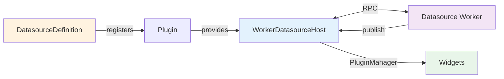

# Datasource API Reference

This reference covers the worker-based datasource API introduced in V1. Datasources run in Web Workers for non-blocking I/O and zero-copy data transfers.

## Architecture



## DatasourceDefinition Interface

```typescript
interface DatasourceDefinition<T = DatasourceProviderSettings> {
  id: string; // Unique identifier
  name: string; // Display name
  description: string; // Human-readable description
  titleProp?: string; // Property for instance title
  schema: JsonSchema; // Configuration schema
  uischema?: UISchemaElement; // UI Schema for forms
  data: T; // Default settings
  Provider: FC<{
    // React Provider component
    children: ReactNode;
    props: T;
  }>;
}
```

### Example Definition

```typescript
import type { DatasourceDefinition } from '@workspace/ormi-core/datasources';
import { MyWorkerHost } from './host';
import type { MySettings } from './types';

export const MyDatasourceDefinition: DatasourceDefinition<MySettings> = {
  id: 'my-datasource',
  name: 'My Data Source',
  description: 'WebSocket datasource with zero-copy transfers',
  titleProp: 'title',

  schema: {
    type: 'object',
    properties: {
      title: { type: 'string', title: 'Title' },
      enable: { type: 'boolean', title: 'Enable', default: true },
      url: { type: 'string', title: 'WebSocket URL', format: 'uri' }
    },
    required: ['title', 'url']
  },

  data: {
    id: '',
    title: 'My Datasource',
    enable: true,
    url: 'ws://localhost:9090'
  },

  Provider: ({ children, props }) => (
    <MyWorkerHost datasourceId={props.id} settings={props}>
      {children}
    </MyWorkerHost>
  )
};
```

## Worker Implementation

### DatasourceWorkerImplementation Interface

```typescript
interface DatasourceWorkerImplementation<
  Settings = DatasourceProviderSettings,
> {
  // Initialize connection
  init(settings: Settings): void | Promise<void>;

  // List available topics
  listTopics(): DatasourceTopic[] | Promise<DatasourceTopic[]>;

  // Start streaming topic
  subscribe(topic: SelectedTopic): void | Promise<void>;

  // Stop streaming topic
  unsubscribe(
    topic: SelectedTopic,
    ignoreCount?: boolean,
  ): void | Promise<void>;

  // Execute remote call (optional)
  executeRemoteCall(
    definition: RemoteCallDefinition,
    request: unknown,
    options?: RemoteCallOptions,
  ): Promise<RemoteCallHandleWire> | RemoteCallHandleWire;

  // Cancel remote call (optional)
  cancelRemoteCall(callId: string): Promise<boolean> | boolean;

  // Clean up resources
  shutdown(): void | Promise<void>;
}
```

### Creating a Worker

```typescript
// my-datasource.worker.ts
import { createDatasourceWorker } from "@workspace/ormi-core/datasources/worker";
import type { MySettings } from "./types";

createDatasourceWorker<MySettings>((ctx) => {
  let ws: WebSocket | null = null;
  const subscriptions = new Map<string, number>();

  return {
    async init(settings) {
      console.log("[Worker] Initializing with", settings);

      ws = new WebSocket(settings.url);

      ws.onmessage = (event) => {
        const { topic, data, timestamp } = JSON.parse(event.data);

        // Publish to main thread
        ctx.publish(topic, data, timestamp || Date.now());
      };

      // Wait for connection
      await new Promise<void>((resolve, reject) => {
        ws!.onopen = () => resolve();
        ws!.onerror = (e) => reject(new Error("Connection failed"));
      });
    },

    async listTopics() {
      // Return available topics
      return [
        {
          topic: "/sensor/data",
          datasource_id: "", // Set by host
          source: {} as any,
          type: "SensorData",
          rawType: "sensor_msgs/SensorData",
          bufferSize: 50,
        },
      ];
    },

    async subscribe(topic) {
      const count = subscriptions.get(topic.topic) || 0;
      subscriptions.set(topic.topic, count + 1);

      if (count === 0) {
        // First subscriber
        ws?.send(
          JSON.stringify({
            op: "subscribe",
            topic: topic.topic,
          }),
        );
      }
    },

    async unsubscribe(topic, ignoreCount = false) {
      if (ignoreCount) {
        subscriptions.delete(topic.topic);
        ws?.send(
          JSON.stringify({
            op: "unsubscribe",
            topic: topic.topic,
          }),
        );
        return;
      }

      const count = subscriptions.get(topic.topic) || 0;
      if (count <= 1) {
        subscriptions.delete(topic.topic);
        ws?.send(
          JSON.stringify({
            op: "unsubscribe",
            topic: topic.topic,
          }),
        );
      } else {
        subscriptions.set(topic.topic, count - 1);
      }
    },

    async executeRemoteCall(definition, request, options) {
      // Handle service calls if needed
      return { callId: "" };
    },

    async cancelRemoteCall(callId) {
      return true;
    },

    async shutdown() {
      console.log("[Worker] Shutting down");
      ws?.close();
      subscriptions.clear();
    },
  };
});
```

### Worker Context API

```typescript
interface DatasourceWorkerContext {
  // Publish data to main thread
  publish(
    topic: string,
    data: unknown,
    time?: number,
    referenceFrameId?: string,
    transfer?: Transferable[],
  ): void;

  // Register remote call definitions
  setRemoteCalls(calls: RemoteCallDefinition[]): void;

  // Emit remote call status
  emitRemoteCallStatus(callId: string, status: RemoteCallStatus): void;

  // Emit remote call feedback
  emitRemoteCallFeedback(callId: string, feedback: unknown): void;

  // Emit remote call result
  emitRemoteCallResult(callId: string, result: RemoteCallResult): void;
}
```

#### ctx.publish()

Publish data to the main thread:

```typescript
// Simple publish
ctx.publish("/sensor/temperature", { value: 25.5 }, Date.now(), "sensor_frame");

// With Transferable for zero-copy
const points = new Float32Array(100000);
// ... fill points

ctx.publish(
  "/scan/points",
  { points },
  Date.now(),
  "lidar_frame",
  [points.buffer], // Transferred, not copied
);
```

**Parameters:**

- `topic` (string) - Topic name
- `data` (unknown) - Message data
- `time` (number, optional) - Timestamp in milliseconds (defaults to Date.now())
- `referenceFrameId` (string, optional) - Coordinate frame
- `transfer` (Transferable[], optional) - Objects to transfer (zero-copy)

## WorkerDatasourceHost

The host manages the worker lifecycle and RPC communication. You typically don't create this directly - it's created by your Provider component.

### Basic Provider Implementation

```typescript
// host.tsx
import React, { useEffect, useRef, useState } from 'react';
import { usePluginsManager } from '@workspace/ormi-plugins';
import { WorkerDatasourceHost } from '@workspace/ormi-core/datasources/worker';
import type { MySettings } from './types';

export function MyWorkerHost({
  children,
  datasourceId,
  settings
}: {
  children: React.ReactNode;
  datasourceId: string;
  settings: MySettings;
}) {
  const pluginsManager = usePluginsManager();
  const hostRef = useRef<WorkerDatasourceHost<MySettings>>();
  const [initialized, setInitialized] = useState(false);

  useEffect(() => {
    if (!settings.enable) {
      setInitialized(false);
      return;
    }

    // Create worker
    const worker = new Worker(
      new URL('./my-datasource.worker.js', import.meta.url),
      {
        type: 'module',
        name: `datasource:${datasourceId}`
      }
    );

    // Create host
    const host = new WorkerDatasourceHost({
      worker,
      datasourceId,
      settings,
      pluginsManager
    });

    hostRef.current = host;

    // Register PluginManager hooks
    host.registerHooks();

    // Initialize worker
    host.init()
      .then(() => setInitialized(true))
      .catch((error) => {
        console.error('Worker initialization failed:', error);
        setInitialized(false);
      });

    return () => {
      // Cleanup
      host.shutdown()
        .then(() => worker.terminate())
        .catch(() => worker.terminate());
    };
  }, [datasourceId, settings.enable, settings.url]);

  return <>{initialized && children}</>;
}
```

### WorkerDatasourceHost API

```typescript
class WorkerDatasourceHost<Settings> {
  constructor(options: {
    worker: Worker;
    datasourceId: string;
    settings: Settings;
    pluginsManager: PluginsManager;
  });

  // Initialize worker
  init(): Promise<void>;

  // Register PluginManager hooks
  registerHooks(): void;

  // Shutdown worker gracefully
  shutdown(): Promise<void>;

  // RPC client for calling worker methods
  readonly rpc: RpcClient<DatasourceWorkerMethods, DatasourceWorkerEvents>;
}
```

### Automatic Hook Registration

`WorkerDatasourceHost.registerHooks()` automatically registers:

1. **`{datasource_id}-available-topics`** - Lists topics via `listTopics()`
2. **`{datasource_id}-subscribe`** - Forwards to worker's `subscribe()`
3. **`{datasource_id}-unsubscribe`** - Forwards to worker's `unsubscribe()`
4. **`{datasource_id}-definition`** - Returns datasource settings
5. **`{datasource_id}-{topic}-published`** - Published when worker emits data

## Zero-Copy Transfers

### Using Transferable Objects

```typescript
// Worker: Create large array
const points = new Float32Array(300000);
// ... populate points

// Transfer ownership to main thread (zero-copy)
ctx.publish(
  "/scan/points",
  { points },
  Date.now(),
  "lidar_frame",
  [points.buffer], // Transferable
);

// After transfer:
// - points.buffer is "neutered" in worker (can't access)
// - Main thread owns the buffer
// - No memory copy occurred
```

### Supported Transferables

- `ArrayBuffer`
- `MessagePort`
- `ImageBitmap`
- `OffscreenCanvas`

### Performance Benefits

- **~2-3x faster** for 100k+ points
- **Zero memory duplication**
- **Reduced GC pressure**
- **Instant transfer**

## RPC Protocol

### Type-Safe Communication

The RPC protocol provides type-safe method calls and event handling:

```typescript
// Main thread (in WorkerHost)
const rpc = createRpcClient<Methods, Events>(worker);

// Call worker method
await rpc.call("subscribe", topic);
const topics = await rpc.call("listTopics");
await rpc.call("shutdown");

// Listen to worker events
rpc.on("topic-published", (event) => {
  // Handle published data
});

// Worker thread
createDatasourceWorker((ctx) => ({
  async subscribe(topic) {
    // Implementation
  },
}));
```

### RPC Methods Interface

```typescript
interface DatasourceWorkerMethods<Settings> {
  init(settings: Settings): void | Promise<void>;
  listTopics(): DatasourceTopic[] | Promise<DatasourceTopic[]>;
  subscribe(topic: SelectedTopic): void | Promise<void>;
  unsubscribe(
    topic: SelectedTopic,
    ignoreCount?: boolean,
  ): void | Promise<void>;
  executeRemoteCall(def, request, options): Promise<RemoteCallHandleWire>;
  cancelRemoteCall(callId: string): Promise<boolean>;
  shutdown(): void | Promise<void>;
}
```

### RPC Events Interface

```typescript
interface DatasourceWorkerEvents {
  "topic-published": {
    topic: string;
    data: unknown;
    time: number;
    referenceFrameId?: string;
  };
  "remote-calls": {
    calls: RemoteCallDefinition[];
  };
  "remote-call-status": {
    callId: string;
    status: RemoteCallStatus;
  };
  "remote-call-feedback": {
    callId: string;
    feedback: unknown;
  };
  "remote-call-result": {
    callId: string;
    result: RemoteCallResult;
  };
}
```

## Error Handling

### Worker Errors

```typescript
createDatasourceWorker((ctx) => {
  // Global error handlers
  self.addEventListener("error", (e) => {
    console.error("[Worker Error]", e.error);
  });

  self.addEventListener("unhandledrejection", (e) => {
    console.error("[Worker Unhandled Rejection]", e.reason);
  });

  return {
    async subscribe(topic) {
      try {
        // Operation that might fail
      } catch (error) {
        console.error(`Subscribe failed:`, error);
        throw error; // Propagates to main thread
      }
    },
  };
});
```

### Host Error Handling

```typescript
// In provider component
host
  .init()
  .then(() => setInitialized(true))
  .catch((error) => {
    console.error("Initialization failed:", error);
    toast.error(`Failed to initialize: ${error.message}`);
  });

// Worker crash detection
worker.addEventListener("error", (e) => {
  console.error("Worker crashed:", e);
  // Restart if needed
  restartWorker();
});
```

## Lifecycle Management

### Initialization

```typescript
// Worker
async init(settings) {
  // Connect to external source
  ws = new WebSocket(settings.url);

  // Wait for ready
  await new Promise((resolve, reject) => {
    ws.onopen = resolve;
    ws.onerror = reject;
  });
}

// Host
await host.init(); // Calls worker's init()
setInitialized(true);
```

### Subscription Management

```typescript
// Worker tracks subscribers per topic
const subscriptions = new Map<string, number>();

async subscribe(topic) {
  const count = (subscriptions.get(topic.topic) || 0) + 1;
  subscriptions.set(topic.topic, count);

  if (count === 1) {
    // First subscriber - start streaming
    startStreaming(topic.topic);
  }
}

async unsubscribe(topic, ignoreCount = false) {
  if (ignoreCount) {
    subscriptions.delete(topic.topic);
    stopStreaming(topic.topic);
    return;
  }

  const count = subscriptions.get(topic.topic) || 0;
  if (count <= 1) {
    subscriptions.delete(topic.topic);
    stopStreaming(topic.topic);
  } else {
    subscriptions.set(topic.topic, count - 1);
  }
}
```

### Graceful Shutdown

```typescript
// Worker cleanup
async shutdown() {
  console.log('[Worker] Shutting down');

  // Close connections
  ws?.close();

  // Clear timers
  intervals.forEach(clearInterval);
  intervals.clear();

  // Clear subscriptions
  subscriptions.clear();

  console.log('[Worker] Shutdown complete');
}

// Host triggers shutdown with timeout
await host.shutdown(); // 5-second timeout
worker.terminate(); // Force if timeout
```

## Best Practices

### 1. Always Use Workers for I/O

```typescript
// ✅ Good: I/O in worker
createDatasourceWorker((ctx) => ({
  async init(settings) {
    ws = new WebSocket(settings.url); // Non-blocking
  },
}));

// ❌ Bad: I/O in main thread
// Would block rendering
```

### 2. Transfer Large Data

```typescript
// ✅ Good: Zero-copy transfer
const buffer = new Float32Array(largeData);
ctx.publish(topic, { buffer }, time, frame, [buffer.buffer]);

// ❌ Bad: Structured clone (copies)
ctx.publish(topic, { buffer }, time, frame);
```

### 3. Reference Count Subscriptions

```typescript
// ✅ Good: Track subscriber count
const subs = new Map<string, number>();
const count = (subs.get(topic) || 0) + 1;
subs.set(topic, count);
if (count === 1) startStreaming();

// ❌ Bad: Always start streaming
startStreaming(); // Wastes resources
```

### 4. Clean Up Resources

```typescript
// ✅ Good: Proper cleanup
async shutdown() {
  ws?.close();
  intervals.forEach(clearInterval);
  subscriptions.clear();
}

// ❌ Bad: Memory leaks
async shutdown() {
  // Forgot to clean up
}
```

### 5. Handle Reconnection

```typescript
// ✅ Good: Reconnection logic
let attempts = 0;
const connect = () => {
  ws = new WebSocket(url);
  ws.onerror = () => {
    if (attempts < 10) {
      setTimeout(connect, 1000 * ++attempts);
    }
  };
};
```

## Type Conversion

Workers should convert raw data to internal types:

```typescript
import { unifiedConverter } from "./converter";

ws.onmessage = (event) => {
  const { topic, data, type } = JSON.parse(event.data);

  // Convert to internal type
  const converted = unifiedConverter.convert(
    data,
    type, // rawType: 'sensor_msgs/Imu'
    "IMU", // internal type
  );

  ctx.publish(topic, converted, Date.now());
};
```

See [Type System API](type-system-api) for details on type conversions.

## Complete Example

See [Creating a Plugin](../guides/creating-plugin) for a complete step-by-step example of creating a worker-based datasource.

## Summary

Worker-based datasources provide:

- **Non-blocking I/O** - Network operations in dedicated workers
- **Zero-copy transfers** - Transferable objects for performance
- **Type-safe RPC** - Structured communication protocol
- **Automatic management** - WorkerDatasourceHost handles complexity
- **Error isolation** - Worker crashes don't affect main thread
- **Graceful shutdown** - Clean resource cleanup
