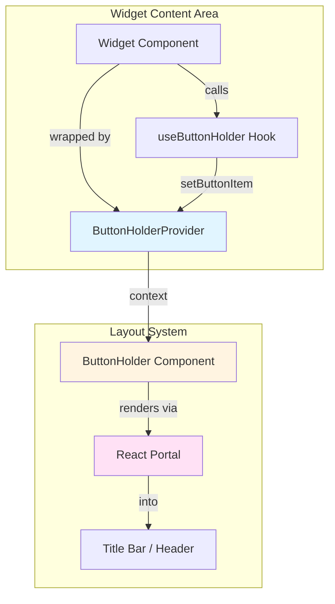

# ButtonHolder System

The ButtonHolder system provides a mechanism for widgets to dynamically register interactive controls (buttons, dropdowns, etc.) that are rendered in the widget's title bar or header area. This system works seamlessly across all three dashboard layout engines (React-Grid-Layout, RC-Dock, FlexLayout) using React Context and Portals.

## Overview

### Purpose

Widgets often need to expose controls (zoom, refresh, visibility toggles, etc.) that should be accessible in the widget's header rather than taking up space in the widget's content area. The ButtonHolder system solves this by:

1. **Decoupling Controls from Layout**: Widgets register controls without knowing which layout system is being used
2. **Preserving Context**: Buttons maintain access to widget state and functions through React Context
3. **Portal-Based Rendering**: Controls are rendered in the title bar while staying connected to their origin component
4. **Priority-Based Ordering**: Multiple controls can be registered with customizable display order

### Architecture



## Core Components

### ButtonHolderProvider

Located in `/packages/ui/src/combined/ButtonHolder/button-holder-provider.tsx`

The provider component that manages button registration state using React Context.

```tsx
interface ButtonItem {
    component: JSX.Element;
    priority: number;
}

interface ButtonHolderContextType {
    items: Map<string, ButtonItem>;
    setButtonItem: (
        key: string,
        component: JSX.Element,
        priority?: number
    ) => void;
    removeButtonItem: (key: string) => void;
}

export const ButtonHolderProvider: React.FC<{ children: React.ReactNode }> = ({
    children,
}) => {
    const [items, setItems] = useState<Map<string, ButtonItem>>(new Map());

    const setButtonItem = useCallback(
        (key: string, component: JSX.Element, priority = 5) => {
            setItems((prev) => {
                const newMap = new Map(prev);
                newMap.set(key, { component, priority });
                return newMap;
            });
        },
        []
    );

    const removeButtonItem = useCallback((key: string) => {
        setItems((prev) => {
            const newMap = new Map(prev);
            newMap.delete(key);
            return newMap;
        });
    }, []);

    return (
        <ButtonHolderContext.Provider
            value={{ items, setButtonItem, removeButtonItem }}
        >
            {children}
        </ButtonHolderContext.Provider>
    );
};
```

**Key Features:**

- Manages buttons as a `Map<string, ButtonItem>` for efficient lookup and ordering
- Provides memoized callbacks to prevent unnecessary re-renders
- Simple priority system (lower numbers render first)

### useButtonHolder Hook

```tsx
export const useButtonHolder = () => {
    const context = useContext(ButtonHolderContext);
    if (!context) {
        throw new Error(
            "useButtonHolder must be used within a ButtonHolderProvider"
        );
    }
    return context;
};
```

Hook that widgets use to register/unregister buttons. Must be called within a `ButtonHolderProvider`.

### ButtonHolder Component

Located in `/packages/ui/src/combined/ButtonHolder/button-holder.tsx`

The component that renders registered buttons, sorted by priority.

```tsx
export function ButtonHolder() {
    const { items } = useButtonHolder();

    return (
        <div className="flex flex-row space-x-2">
            {Array.from(items.values())
                .sort((a, b) => a.priority - b.priority)
                .map((item, index) => (
                    <div key={index}>{item.component}</div>
                ))}
        </div>
    );
}
```

**Rendering Logic:**

1. Reads all registered buttons from context
2. Sorts by priority (ascending)
3. Renders each button in a flex container

## Layout-Specific Integration

Each dashboard layout system integrates ButtonHolder differently to accommodate its unique structure.

### React-Grid-Layout Integration

**Location:** `/packages/ormi-core/src/dashboard/components/react-grid-layout/dashboard.tsx`

**Approach:** Direct rendering in widget header

```tsx
const widgets_elements = useMemo(() => {
    return Array.from(widgets).map(([key, widget]: [string, Widget]) => {
        return (
            <div
                key={key}
                className="flex flex-col overflow-hidden border rounded bg-background"
            >
                <ButtonHolderProvider>
                    {/* Widget header with title and buttons */}
                    <div
                        className="flex flex-row content-between gap-1"
                        style={{ padding: "0.25rem" }}
                    >
                        <div className="p-2 text-center text-sm cursor-move w-full drag-handle">
                            {widget.title}
                        </div>

                        {/* ButtonHolder renders directly here */}
                        <ButtonHolder />

                        {/* System buttons (config, delete) */}
                        {!locked && (
                            <>
                                <WidgetCard fromLoaded={true} /* ... */ />
                                <Button
                                    variant="destructive"
                                    onClick={/* ... */}
                                >
                                    <XIcon />
                                </Button>
                            </>
                        )}
                    </div>

                    {/* Widget content */}
                    <div className="flex-grow overflow-hidden">
                        {getComponents(widget.box_id)}
                    </div>
                </ButtonHolderProvider>
            </div>
        );
    });
}, [widgets, locked]);
```

**Key Points:**

- Each widget is wrapped in its own `ButtonHolderProvider`
- `ButtonHolder` renders directly in the header alongside system buttons
- No portals needed since structure is fully controlled
- Simple and straightforward implementation

### RC-Dock Integration

**Location:** `/packages/ormi-core/src/dashboard/components/rc-dock/panel-dashboard.tsx`

**Approach:** React Portal from content to title

RC-Dock controls tab titles, so portals are used to render buttons from the content area into the title.

```tsx
const PanelDashboard = () => {
    // Store DOM containers for each widget title
    const titlePortalContainers = useRef<Map<string, HTMLDivElement>>(
        new Map()
    );

    // Component that creates a portal container in the tab title
    const TitlePortalContainer = ({ widgetId }: { widgetId: string }) => {
        const containerRef = useRef<HTMLDivElement>(null);

        useEffect(() => {
            if (containerRef.current) {
                titlePortalContainers.current.set(
                    widgetId,
                    containerRef.current
                );
            }
            return () => {
                titlePortalContainers.current.delete(widgetId);
            };
        }, [widgetId]);

        return <div ref={containerRef} className="flex flex-row space-x-2" />;
    };

    // Component that portals ButtonHolder into the title DOM
    const ButtonHolderPortal = ({ widgetId }: { widgetId: string }) => {
        const portalContainer = titlePortalContainers.current.get(widgetId);

        if (!portalContainer) {
            return null;
        }

        // Portal preserves React context and event handlers
        return ReactDOM.createPortal(<ButtonHolder />, portalContainer);
    };

    // Create custom title for RC-Dock tabs
    const createCustomTitle = useCallback(
        (widget: any) => {
            const widgetDefinition = getDefinition(widget.widget_id);

            return (
                <div className="flex items-center justify-between w-full min-w-0 pr-2">
                    {/* Widget title text */}
                    <span className="text-sm font-medium truncate mr-2">
                        {widget.title}
                    </span>

                    {/* Button container */}
                    <div className="flex items-center gap-1 shrink-0">
                        {/* Portal target for widget-provided buttons */}
                        <TitlePortalContainer widgetId={widget.box_id} />

                        {/* System buttons */}
                        {!locked && (
                            <>
                                <WidgetCard /* ... */ />
                            </>
                        )}
                    </div>
                </div>
            );
        },
        [getDefinition, locked, widgets, dispatch]
    );

    // Load tab content (where ButtonHolder is portaled from)
    const loadTab = useCallback(
        (tabData: TabData) => {
            const widget = widgets.get(tabData.id);
            const widgetDefinition = getDefinition(widget.widget_id);

            return (
                <ButtonHolderProvider>
                    {/* Portal ButtonHolder to title */}
                    <ButtonHolderPortal widgetId={widget.box_id} />

                    {/* Widget content */}
                    <div className="h-full w-full overflow-hidden">
                        {widgetDefinition.Component(widget.settings)}
                    </div>
                </ButtonHolderProvider>
            );
        },
        [widgets, getDefinition]
    );

    return (
        <DockLayout
            ref={dockLayoutRef}
            defaultLayout={defaultLayout}
            loadTab={loadTab}
            /* ... */
        />
    );
};
```

**Key Points:**

- **Two-Phase Setup**:
    1. `TitlePortalContainer` creates DOM element in title
    2. `ButtonHolderPortal` renders ButtonHolder into that element via portal
- **Context Preservation**: Portal maintains React context chain from content to title
- **Lifecycle Management**: useEffect handles container registration/cleanup
- **System Button Integration**: Portal container is placed alongside RC-Dock system buttons

### FlexLayout Integration

**Location:** `/packages/ormi-core/src/dashboard/components/flex-layout/`

**Approach:** Portal with dedicated Context Provider

FlexLayout has the most complex integration due to its tab rendering system. It uses a dedicated context provider to manage portal containers across the component tree.

#### FlexLayoutPortalContext

**File:** `flex-layout/components/FlexLayoutPortalContext.tsx`

```tsx
interface FlexLayoutPortalContextType {
    registerPortal: (widgetId: string, container: HTMLElement) => void;
    unregisterPortal: (widgetId: string) => void;
    getPortalContainer: (widgetId: string) => HTMLElement | null;
    openDialog: (
        widgetId: string,
        widget: any,
        definition: any,
        onUpdateWidget: any
    ) => void;
    closeDialog: () => void;
    dialogState: DialogState | null;
}

export const FlexLayoutPortalProvider: React.FC<{ children: ReactNode }> = ({
    children,
}) => {
    const portalContainers = useRef<Map<string, HTMLElement>>(new Map());
    const [dialogState, setDialogState] = useState<DialogState | null>(null);

    const registerPortal = (widgetId: string, container: HTMLElement) => {
        portalContainers.current.set(widgetId, container);
    };

    const unregisterPortal = (widgetId: string) => {
        portalContainers.current.delete(widgetId);
    };

    const getPortalContainer = (widgetId: string): HTMLElement | null => {
        return portalContainers.current.get(widgetId) || null;
    };

    // ... dialog management functions ...

    return (
        <FlexLayoutPortalContext.Provider
            value={{
                registerPortal,
                unregisterPortal,
                getPortalContainer,
                openDialog,
                closeDialog,
                dialogState,
            }}
        >
            {children}
            {/* Dialog rendering outside FlexLayout structure */}
        </FlexLayoutPortalContext.Provider>
    );
};

export const useFlexLayoutPortal = (): FlexLayoutPortalContextType => {
    const context = useContext(FlexLayoutPortalContext);
    if (!context) {
        throw new Error(
            "useFlexLayoutPortal must be used within a FlexLayoutPortalProvider"
        );
    }
    return context;
};
```

**Purpose:**

- Centralized registry of portal containers across all tabs
- Manages configuration dialogs outside FlexLayout DOM structure
- Provides access to portal containers from any component in the tree

#### TabRenderer

**File:** `flex-layout/components/TabRenderer.tsx`

Creates portal containers in tab titles:

```tsx
const PortalContainer: React.FC<{ widgetId: string }> = ({ widgetId }) => {
    const containerRef = useRef<HTMLDivElement>(null);
    const { registerPortal, unregisterPortal } = useFlexLayoutPortal();

    useEffect(() => {
        if (containerRef.current) {
            registerPortal(widgetId, containerRef.current);
        }
        return () => {
            unregisterPortal(widgetId);
        };
    }, [widgetId, registerPortal, unregisterPortal]);

    return <div ref={containerRef} className="flex flex-row space-x-2" />;
};

export const renderTab = (props: TabRendererProps) => {
    const {
        node,
        renderValues,
        widgets,
        getDefinition,
        locked,
        onUpdateWidget,
    } = props;
    const widget = widgets.get(node.getId());
    const widgetDefinition = getDefinition(widget?.widget_id);

    // Customize tab title content
    renderValues.content = (
        <div className="flex items-center justify-between w-full">
            <span className="text-sm font-medium truncate mr-2">
                {widget.title}
            </span>
            <div className="flex items-center gap-1 shrink-0">
                {/* Portal target for widget buttons */}
                <PortalContainer widgetId={widget.box_id} />

                {/* System buttons */}
                {!locked && <Button /* ... */ />}
            </div>
        </div>
    );
};
```

#### WidgetRenderer

**File:** `flex-layout/components/WidgetRenderer.tsx`

Renders widget content with ButtonHolder portal:

```tsx
const ButtonHolderPortal: React.FC<{ widgetId: string }> = ({ widgetId }) => {
    const { getPortalContainer } = useFlexLayoutPortal();
    const portalContainer = getPortalContainer(widgetId);

    if (!portalContainer) {
        return null;
    }

    // Portal ButtonHolder into tab title container
    return ReactDOM.createPortal(<ButtonHolder />, portalContainer);
};

export const WidgetRenderer: React.FC<WidgetRendererProps> = ({
    widgetId,
    widget,
    definition,
}) => {
    return (
        <ButtonHolderProvider>
            <div className="w-full h-full overflow-hidden">
                {/* Portal ButtonHolder to tab title */}
                <ButtonHolderPortal widgetId={widgetId} />

                {/* Widget content */}
                {definition.Component(widget.settings)}
            </div>
        </ButtonHolderProvider>
    );
};
```

**Key Points:**

- **Three-Layer Architecture**:
    1. `FlexLayoutPortalProvider` wraps entire dashboard
    2. `TabRenderer` creates portal containers in titles
    3. `WidgetRenderer` portals ButtonHolder into containers
- **Centralized Registry**: Portal containers stored in context provider
- **Flexible Access**: Any component can access portal containers via `useFlexLayoutPortal`
- **Dialog Management**: Same context manages widget configuration dialogs

## Widget Usage

Widgets register buttons using the `useButtonHolder` hook within a `ButtonHolderProvider` context.

### Basic Example

```tsx
import { useButtonHolder } from "@workspace/ui/combined/ButtonHolder";
import { Button } from "@workspace/ui/components/button";
import { RefreshCcwIcon } from "lucide-react";

function MyWidget(settings: any) {
    const { setButtonItem, removeButtonItem } = useButtonHolder();
    const [data, setData] = useState(null);

    const handleRefresh = () => {
        // Refresh widget data
        fetchData();
    };

    useEffect(() => {
        // Register refresh button
        setButtonItem(
            "my-widget-refresh", // Unique key
            <Button variant="ghost" onClick={handleRefresh}>
                <RefreshCcwIcon />
            </Button>,
            1 // Priority (optional, default: 5)
        );

        // Cleanup on unmount
        return () => {
            removeButtonItem("my-widget-refresh");
        };
    }, [handleRefresh]);

    return <div>{/* Widget content */}</div>;
}
```

### Multiple Buttons with Priority

```tsx
function MapWidget(settings: any) {
    const { setButtonItem, removeButtonItem } = useButtonHolder();
    const [showGrid, setShowGrid] = useState(false);
    const mapRef = useRef<MapRef>(null);

    useEffect(() => {
        // Zoom In (priority 1 - renders first)
        setButtonItem(
            "map-zoom-in",
            <Button
                variant="ghost"
                onClick={() => {
                    if (mapRef.current) {
                        mapRef.current.setZoom(mapRef.current.getZoom() + 1);
                    }
                }}
            >
                <PlusIcon />
            </Button>,
            1
        );

        // Zoom Out (priority 2)
        setButtonItem(
            "map-zoom-out",
            <Button
                variant="ghost"
                onClick={() => {
                    if (mapRef.current) {
                        mapRef.current.setZoom(mapRef.current.getZoom() - 1);
                    }
                }}
            >
                <MinusIcon />
            </Button>,
            2
        );

        // Grid Toggle (priority 3)
        setButtonItem(
            "map-grid-toggle",
            <Button
                variant={showGrid ? "default" : "ghost"}
                onClick={() => setShowGrid(!showGrid)}
            >
                <GridIcon />
            </Button>,
            3
        );

        // Refresh (priority 4)
        setButtonItem(
            "map-refresh",
            <Button variant="ghost" onClick={handleRefresh}>
                <RefreshCcwIcon />
            </Button>,
            4
        );

        // Cleanup all buttons
        return () => {
            removeButtonItem("map-zoom-in");
            removeButtonItem("map-zoom-out");
            removeButtonItem("map-grid-toggle");
            removeButtonItem("map-refresh");
        };
    }, [mapRef, showGrid]);

    return <MapComponent ref={mapRef} showGrid={showGrid} />;
}
```

### Dynamic Buttons Based on Data

```tsx
function PathMarkerWidget(props: { topic: SelectedTopic }) {
    const { setButtonItem, removeButtonItem } = useButtonHolder();
    const { getSource, getSourceId } = useLocalDataSource();
    const [show, setShow] = useState(true);

    useEffect(() => {
        const data = getSource(props.topic);
        if (!data) {
            return;
        }

        // Register visibility toggle button (updates when data changes)
        setButtonItem(
            getSourceId(props.topic), // Unique key per topic
            <Button variant="ghost" onClick={() => setShow(!show)}>
                {show ? <EyeIcon /> : <EyeClosedIcon />}
            </Button>,
            1
        );

        return () => {
            removeButtonItem(getSourceId(props.topic));
        };
    }, [getSource, props.topic, show]);

    return (
        <div style={{ display: show ? "block" : "none" }}>
            {/* Marker rendering */}
        </div>
    );
}
```

### Extracting Toolbar Logic into Component

For complex widgets with many buttons, extract toolbar logic into a separate component:

```tsx
// MapToolbar.tsx
interface MapToolbarProps {
    mapRef: React.RefObject<MapRef | null>;
    showGrid: boolean;
    onToggleGrid: () => void;
    onRefresh: () => void;
}

export function MapToolbar({
    mapRef,
    showGrid,
    onToggleGrid,
    onRefresh,
}: MapToolbarProps) {
    const { setButtonItem, removeButtonItem } = useButtonHolder();

    useEffect(() => {
        setButtonItem("zoom-in", <Button /* ... */ />, 1);
        setButtonItem("zoom-out", <Button /* ... */ />, 2);
        setButtonItem("grid-toggle", <Button /* ... */ />, 3);
        setButtonItem("refresh", <Button /* ... */ />, 4);

        return () => {
            removeButtonItem("zoom-in");
            removeButtonItem("zoom-out");
            removeButtonItem("grid-toggle");
            removeButtonItem("refresh");
        };
    }, [mapRef, showGrid, onToggleGrid, onRefresh]);

    // Component doesn't render anything, just manages toolbar
    return null;
}

// MapWidget.tsx
function MapWidget(settings: any) {
    const [showGrid, setShowGrid] = useState(false);
    const mapRef = useRef<MapRef>(null);

    return (
        <>
            <MapToolbar
                mapRef={mapRef}
                showGrid={showGrid}
                onToggleGrid={() => setShowGrid(!showGrid)}
                onRefresh={handleRefresh}
            />
            <MapComponent ref={mapRef} showGrid={showGrid} />
        </>
    );
}
```

**Benefits:**

- Separates toolbar logic from widget rendering
- Easier to test and maintain
- Reusable across similar widgets

## Best Practices

### 1. Always Use Unique Keys

Button keys must be unique within each widget instance:

```tsx
// ❌ BAD: Hardcoded key (conflicts if multiple instances)
setButtonItem("refresh-button", <Button /* ... */ />);

// ✅ GOOD: Include widget ID or unique identifier
setButtonItem(`${widgetId}-refresh`, <Button /* ... */ />);

// ✅ GOOD: Use source ID for datasource-related buttons
setButtonItem(getSourceId(topic), <Button /* ... */ />);
```

### 2. Always Clean Up

Remove buttons in the useEffect cleanup function:

```tsx
// ❌ BAD: No cleanup
useEffect(() => {
    setButtonItem("my-button", <Button /* ... */ />);
}, []);

// ✅ GOOD: Cleanup on unmount
useEffect(() => {
    setButtonItem("my-button", <Button /* ... */ />);
    return () => {
        removeButtonItem("my-button");
    };
}, []);
```

### 3. Manage Dependencies Carefully

Include all dependencies that affect button rendering:

```tsx
// ❌ BAD: Missing dependencies
useEffect(() => {
    setButtonItem("toggle", <Button onClick={() => setValue(!value)} />);
}, []); // value is not in deps - stale closure!

// ✅ GOOD: Include all used variables
useEffect(() => {
    setButtonItem("toggle", <Button onClick={() => setValue(!value)} />);
    return () => removeButtonItem("toggle");
}, [value, setValue]); // Button re-registers when value changes
```

### 4. Use Memoization for Complex Handlers

Prevent unnecessary button re-registration:

```tsx
const handleRefresh = useCallback(() => {
    fetchData();
}, [fetchData]);

useEffect(() => {
    setButtonItem("refresh", <Button onClick={handleRefresh} />);
    return () => removeButtonItem("refresh");
}, [handleRefresh]); // Only re-registers if handler changes
```

### 5. Set Appropriate Priorities

Use priority to control button order:

```tsx
// Navigation buttons (priority 1-2)
setButtonItem("prev", <Button /* ... */ />, 1);
setButtonItem("next", <Button /* ... */ />, 2);

// View controls (priority 3-5)
setButtonItem("zoom", <Button /* ... */ />, 3);
setButtonItem("grid", <Button /* ... */ />, 4);

// Actions (priority 6-10)
setButtonItem("refresh", <Button /* ... */ />, 6);
setButtonItem("export", <Button /* ... */ />, 7);
```

**Priority Guidelines:**

- **1-2**: Navigation/movement controls
- **3-5**: View/visibility toggles
- **6-10**: Actions (refresh, export, etc.)
- **Default (5)**: General purpose buttons

### 6. Use Appropriate Button Variants

Match button styling to function:

```tsx
// Toggle button - show active state
<Button variant={isActive ? "default" : "ghost"}>

// Destructive action
<Button variant="destructive">

// Standard action
<Button variant="ghost">
```

### 7. Provide Visual Feedback

Use icons and tooltips for clarity:

```tsx
import { RefreshCcwIcon } from "lucide-react";

<Button
    variant="ghost"
    onClick={handleRefresh}
    title="Refresh data" // Native tooltip
>
    <RefreshCcwIcon />
</Button>;
```

## Troubleshooting

### Buttons Not Appearing

**Symptom:** Buttons registered with `setButtonItem` don't show up in the widget title

**Possible Causes:**

1. **Missing ButtonHolderProvider**: Widget must be wrapped in `ButtonHolderProvider`

    ```tsx
    // ❌ BAD
    <div>{definition.Component(widget.settings)}</div>

    // ✅ GOOD
    <ButtonHolderProvider>
        <div>{definition.Component(widget.settings)}</div>
    </ButtonHolderProvider>
    ```

2. **Portal Container Not Created**: For RC-Dock and FlexLayout, ensure portal containers are registered

    ```tsx
    // Check in browser DevTools that portal target element exists in title
    // For RC-Dock: <TitlePortalContainer widgetId={widget.box_id} />
    // For FlexLayout: <PortalContainer widgetId={widget.box_id} />
    ```

3. **Widget ID Mismatch**: Portal uses wrong widget ID
    ```tsx
    // Ensure widgetId matches between portal container and ButtonHolderPortal
    <ButtonHolderPortal widgetId={widget.box_id} />
    ```

### Buttons Render in Wrong Order

**Symptom:** Buttons appear in unexpected order

**Solution:** Check priority values (lower = first):

```tsx
setButtonItem("first", <Button />, 1); // Renders first
setButtonItem("second", <Button />, 2); // Renders second
setButtonItem("third", <Button />, 3); // Renders third
```

### Stale Closures

**Symptom:** Button onClick handlers use old state values

**Cause:** Missing dependencies in useEffect

```tsx
// ❌ BAD: count is stale
const [count, setCount] = useState(0);
useEffect(() => {
    setButtonItem("btn", <Button onClick={() => setCount(count + 1)} />);
}, []); // Missing count dependency

// ✅ GOOD: Button re-registers with new closure
useEffect(() => {
    setButtonItem("btn", <Button onClick={() => setCount(count + 1)} />);
    return () => removeButtonItem("btn");
}, [count]); // Include count

// ✅ BETTER: Use functional update (no dependency needed)
useEffect(() => {
    setButtonItem("btn", <Button onClick={() => setCount((c) => c + 1)} />);
    return () => removeButtonItem("btn");
}, []); // No dependencies needed with functional update
```

### Memory Leaks

**Symptom:** Performance degrades over time, especially when adding/removing widgets

**Cause:** Buttons not cleaned up on unmount

```tsx
// ❌ BAD: Button persists after unmount
useEffect(() => {
    setButtonItem("btn", <Button />);
}, []);

// ✅ GOOD: Cleanup function removes button
useEffect(() => {
    setButtonItem("btn", <Button />);
    return () => removeButtonItem("btn");
}, []);
```

### Buttons Not Updating

**Symptom:** Button appearance doesn't change when state changes

**Solution:** Include state in useEffect dependencies:

```tsx
const [isActive, setIsActive] = useState(false);

useEffect(() => {
    setButtonItem(
        "toggle",
        <Button variant={isActive ? "default" : "ghost"}>Toggle</Button>
    );
    return () => removeButtonItem("toggle");
}, [isActive]); // Button re-renders when isActive changes
```

## Advanced Patterns

### Conditional Button Registration

Register buttons only when conditions are met:

```tsx
useEffect(() => {
    if (!dataLoaded) {
        return; // No buttons until data loads
    }

    setButtonItem("action", <Button /* ... */ />);
    return () => removeButtonItem("action");
}, [dataLoaded]);
```

### Button Groups

Create visual button groups with separators:

```tsx
useEffect(() => {
    // Group 1: Navigation (priority 1-2)
    setButtonItem(
        "prev",
        <Button>
            <ChevronLeft />
        </Button>,
        1
    );
    setButtonItem(
        "next",
        <Button>
            <ChevronRight />
        </Button>,
        2
    );

    // Separator (priority 2.5)
    setButtonItem("sep1", <div className="h-6 w-px bg-border mx-1" />, 2.5);

    // Group 2: View controls (priority 3-4)
    setButtonItem(
        "zoom",
        <Button>
            <ZoomIn />
        </Button>,
        3
    );
    setButtonItem(
        "grid",
        <Button>
            <Grid />
        </Button>,
        4
    );

    return () => {
        removeButtonItem("prev");
        removeButtonItem("next");
        removeButtonItem("sep1");
        removeButtonItem("zoom");
        removeButtonItem("grid");
    };
}, []);
```

### Loading State Buttons

Show loading state in buttons:

```tsx
const [isLoading, setIsLoading] = useState(false);

const handleRefresh = async () => {
    setIsLoading(true);
    await fetchData();
    setIsLoading(false);
};

useEffect(() => {
    setButtonItem(
        "refresh",
        <Button variant="ghost" onClick={handleRefresh} disabled={isLoading}>
            <RefreshCcwIcon className={isLoading ? "animate-spin" : ""} />
        </Button>
    );
    return () => removeButtonItem("refresh");
}, [isLoading, handleRefresh]);
```

## Comparison to Other Systems

### vs. Navbar System

The ButtonHolder system is similar to the Navbar system but serves a different purpose:

| Feature          | ButtonHolder                              | Navbar                                |
| ---------------- | ----------------------------------------- | ------------------------------------- |
| **Scope**        | Per-widget buttons                        | Global dashboard buttons              |
| **Location**     | Widget title bar                          | Top navbar (left/center/right zones)  |
| **Provider**     | `ButtonHolderProvider`                    | `NavbarProvider`                      |
| **Hook**         | `useButtonHolder()`                       | `useNavbar()`                         |
| **Registration** | `setButtonItem(key, component, priority)` | `setNavbarItem(zone, key, component)` |
| **Use Case**     | Widget-specific controls                  | Dashboard-level actions               |

**Example Usage:**

```tsx
// Navbar: Dashboard-level lock button
const { setNavbarItem } = useNavbar();
setNavbarItem("center", "lock", <Button onClick={lockDashboard}>Lock</Button>);

// ButtonHolder: Widget-level refresh button
const { setButtonItem } = useButtonHolder();
setButtonItem("refresh", <Button onClick={refreshWidget}>Refresh</Button>);
```

## Performance Considerations

### Re-render Optimization

ButtonHolder uses several techniques to minimize re-renders:

1. **Memoized Callbacks**: `setButtonItem` and `removeButtonItem` are wrapped in `useCallback`
2. **Map-Based Storage**: Efficient updates without full array copies
3. **Stable Context**: Provider value is stable unless items change

### Portal Performance

React Portals are efficient because they:

- Don't create additional DOM nodes beyond the target
- Maintain React's reconciliation benefits
- Preserve event bubbling through the React tree

### Best Practices for Performance

```tsx
// ✅ GOOD: Memoize expensive button components
const RefreshButton = useMemo(() => (
    <Button onClick={handleRefresh}>
        <RefreshCcwIcon />
    </Button>
), [handleRefresh]);

useEffect(() => {
    setButtonItem("refresh", RefreshButton);
    return () => removeButtonItem("refresh");
}, [RefreshButton]);

// ✅ GOOD: Use functional updates when possible
<Button onClick={() => setCount(c => c + 1)}>
```

## Summary

The ButtonHolder system provides a flexible, layout-agnostic way for widgets to register interactive controls:

- **Simple API**: `setButtonItem` and `removeButtonItem` with priority support
- **Layout Agnostic**: Works seamlessly across all three dashboard layouts
- **Context Preservation**: Portal-based rendering maintains React context chains
- **Lifecycle Management**: Automatic cleanup via useEffect return functions
- **Priority-Based Ordering**: Control button display order with numeric priorities

The system uses different integration strategies per layout:

- **React-Grid-Layout**: Direct rendering (no portals)
- **RC-Dock**: Local portal container management
- **FlexLayout**: Centralized portal registry via dedicated context provider

Widgets simply call `useButtonHolder()` and register buttons - the dashboard handles the rest.
