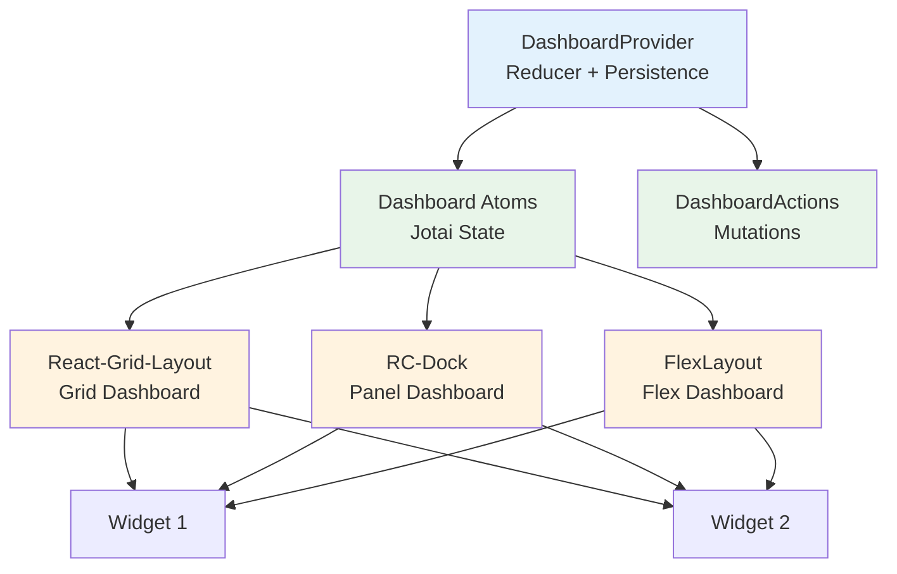

# Dashboard System

The ORMI-CORE dashboard system provides a flexible architecture for displaying and managing widgets in different layout styles. It supports multiple layout engines while maintaining a consistent data model.

## Architecture Overview



## DashboardProvider

The `DashboardProvider` is the central state management component for all dashboard layouts. It manages:

- **Widgets**: Map of widget instances and their settings
- **Datasources**: Map of datasource connections
- **Layouts**: Layout configurations for each dashboard type
- **Lock state**: Whether the dashboard is editable
- **Change tracking**: Whether unsaved changes exist

### Interface

```typescript
interface DashboardInterface {
    layouts: Record<string, any>; // Generic layout storage
    widgets: Map<string, Widget>;
    datasources: Map<string, Datasource>;
    locked: boolean;
}
```

### Context API

```typescript
const {
    // State (legacy, full context)
    widgets,
    datasources,
    layouts,
    locked,
    hasChanged,

    // Widget operations
    addWidget,
    removeWidget,
    updateWidget,
    getComponents,
    getDefinition,

    // Layout operations
    updateLayouts,
    lockUnLockDashboard,

    // Datasource operations
    addDatasource,
    removeDatasource,
    updateDatasource,

    // Persistence
    savesDashboard,

    // Advanced
    dispatch,
} = useDashboardManager();
```

### Actions API (preferred for mutations)

Use `useDashboardActions()` for stable mutation callbacks without subscribing to full state.

```typescript
const {
    getDefinition,
    addWidget,
    removeWidget,
    updateWidget,
    updateLayouts,
    lockUnLockDashboard,
    savesDashboard,
    addDatasource,
    removeDatasource,
    updateDatasource,
    dispatch,
} = useDashboardActions();
```

### State Atoms (preferred for rendering)

Use Jotai atoms to subscribe only to the state you need. This prevents layout changes from re-rendering widgets.

```typescript
import { useAtomValue } from "jotai";
import {
    widgetsAtom,
    layoutsAtom,
    lockedAtom,
    hasChangedAtom,
    forceReloadAtom,
    datasourcesAtom,
    widgetAtomFamily,
} from "@workspace/ormi-core/dashboard/atoms";

const widgets = useAtomValue(widgetsAtom);
const layouts = useAtomValue(layoutsAtom);
const locked = useAtomValue(lockedAtom);
const hasChanged = useAtomValue(hasChangedAtom);
const datasources = useAtomValue(datasourcesAtom);

// Per-widget subscription (only re-renders when this widget changes)
const widget = useAtomValue(widgetAtomFamily(boxId));
```

### State Management

The DashboardProvider uses `useReducer` for state management and mirrors state into atoms:

```typescript
function dashboardReducer(state, action) {
    switch (action.type) {
        case "SET_LAYOUTS":
            return { ...state, layouts: action.payload };
        case "SET_WIDGETS":
            return { ...state, widgets: action.payload };
        case "SET_LOCKED":
            return { ...state, locked: action.payload };
        case "SET_DATASOURCES":
            return { ...state, datasources: action.payload };
        case "SET_FORCERELOAD":
            return { ...state, forceReload: action.payload };
        default:
            return state;
    }
}
```

### Change Tracking

The dashboard automatically tracks changes using hash comparison:

```typescript
// On initialization
const initialHash = hashDashboardState(layouts, widgets, datasources, locked);

// On every state change
const currentHash = hashDashboardState(layouts, widgets, datasources, locked);
setHasChanged(currentHash !== initialHash);
```

This enables the "unsaved changes" indicator in the navbar.

---

## Layout Systems

ORMI-CORE supports three layout engines, each with unique characteristics:

### 1. Grid Layout (React-Grid-Layout)

**Best for:** Classic dashboard grid with free-form widget placement

**Features:**

- Responsive grid system (breakpoints: lg, md, sm, xs, xxs)
- Drag-and-drop repositioning
- Resizable widgets
- Configurable columns per breakpoint
- Collision detection
- Auto-compact (vertical/horizontal)

**Component:** `Dashboard` from `react-grid-layout/dashboard.tsx`

**Layout Structure:**

```typescript
type GridLayouts = {
    lg: Layout[]; // 12 columns
    md: Layout[]; // 10 columns
    sm: Layout[]; // 6 columns
    xs: Layout[]; // 4 columns
    xxs: Layout[]; // 2 columns
};

interface Layout {
    i: string; // Widget box_id
    x: number; // Column position
    y: number; // Row position
    w: number; // Width in columns
    h: number; // Height in rows
    minW?: number; // Minimum width
    minH?: number; // Minimum height
    maxW?: number; // Maximum width
    maxH?: number; // Maximum height
}
```

**Usage:**

```tsx
import { Dashboard } from "@workspace/ormi-core/dashboard";

<DashboardProvider {...props}>
    <GlobalDataSourcesProvider>
        <Dashboard />
    </GlobalDataSourcesProvider>
</DashboardProvider>;
```

**Layout Operations:**

The Grid dashboard provides several auto-layout options:

```typescript
// Horizontal layout
exploseLayout("horizontal"); // Arrange widgets left-to-right

// Vertical layout
exploseLayout("vertical"); // Arrange widgets top-to-bottom

// Grid layout
exploseLayout("rows"); // Arrange in optimal grid

// Masonry layout
exploseLayout("masonry"); // Staggered, compact layout

// Single column
exploseLayout("single"); // All widgets in one column
```

### 2. Panel Layout (RC-Dock)

**Best for:** IDEs and applications with dockable panels

**Features:**

- Multi-panel docking
- Floating windows
- Tab groups
- Drag-and-drop between panels
- Maximizable panels
- Custom tab rendering

**Component:** `PanelDashboard` from `rc-dock/panel-dashboard.tsx`

### 3. Flex Layout (FlexLayout)

**Best for:** Complex, IDE-like dashboards with advanced docking and tab control

**Component:** `FlexLayoutDashboard` from `flex-layout/flex-layout-dashboard.tsx`

**State strategy:** FlexLayout reads layout state from atoms and widget content subscribes via `widgetAtomFamily`, so layout operations do not force widget re-renders.

**Layout Structure:**

```typescript
interface LayoutBase {
    dockbox: BoxData;
    floatbox?: BoxData;
    windowbox?: WindowBox;
    maxbox?: MaxBox;
}

interface BoxData {
    mode: "horizontal" | "vertical";
    children: (PanelData | BoxData)[];
    size?: number;
}

interface PanelData {
    tabs: TabData[];
    size?: number;
    activeId?: string;
    minWidth?: number;
    minHeight?: number;
}

interface TabData {
    id: string; // Widget box_id
    title?: string; // Widget title
    content?: ReactNode; // Widget component
    closable?: boolean; // Can be closed
}
```

**Usage:**

```tsx
import { PanelDashboard } from "@workspace/ormi-core/dashboard";

<DashboardProvider {...props}>
    <GlobalDataSourcesProvider>
        <PanelDashboard />
    </GlobalDataSourcesProvider>
</DashboardProvider>;
```

**Layout Serialization:**

RC-Dock layouts are serialized for persistence:

```typescript
// Serialize for storage
const serialized = serializeRCDockLayout(layout);
// { dockbox: { mode: "horizontal", children: [...] } }

// Deserialize from storage
const layout = deserializeRCDockLayout(serialized);
```

### 3. Flex Layout (FlexLayout-React)

**Best for:** Modern, flexible layouts with advanced features

**Features:**

- Flexbox-based layout
- Tab sets and borders
- Drag-and-drop between tab sets
- Maximizable tabs
- Splitters for resizing
- Edge docking

**Component:** `FlexLayoutDashboard` from `flex-layout/flex-layout-dashboard.tsx`

**Layout Structure:**

```typescript
interface IJsonModel {
    global: {
        tabEnableClose: boolean;
        tabEnableDrag: boolean;
        tabSetEnableDrop: boolean;
        tabSetEnableMaximize: boolean;
        // ... more configuration
    };
    borders: IBorderSet[];
    layout: ILayoutNode;
}

interface ILayoutNode {
    type: "row" | "tabset";
    weight?: number;
    children?: ILayoutNode[];
    id?: string;
}
```

**Usage:**

```tsx
import { FlexLayoutDashboard } from "@workspace/ormi-core/dashboard";

<DashboardProvider {...props}>
    <GlobalDataSourcesProvider>
        <FlexLayoutDashboard />
    </GlobalDataSourcesProvider>
</DashboardProvider>;
```

**Model Management:**

FlexLayout uses a custom hook for model management:

```typescript
const { model, onModelChange, onAction } = useFlexLayoutModel({
    widgets,
    layouts,
    locked,
    getDefinition,
    dispatch,
    removeWidget,
    updateLayouts,
});
```

---

## Layout Integration Pattern

All dashboard layouts follow the same integration pattern:

### 1. Read Widgets from Provider

```typescript
const { widgets, getComponents, getDefinition } = useDashboardManager();
```

### 2. Manage Layout State

```typescript
// Initialize layout from stored data
const [currentLayout, setCurrentLayout] = useState();

useEffect(() => {
    const storedLayout = layouts["layout-type"];
    if (storedLayout) {
        setCurrentLayout(deserialize(storedLayout));
    } else {
        // Create default layout with current widgets
        setCurrentLayout(createDefault(Array.from(widgets.keys())));
    }
}, [widgets, layouts]);
```

### 3. Handle Layout Changes

```typescript
const handleLayoutChange = (newLayout) => {
    if (!locked) {
        setCurrentLayout(newLayout);

        // Serialize and persist
        const serialized = serialize(newLayout);
        const newLayouts = { ...layouts, "layout-type": serialized };
        dispatch({ type: "SET_LAYOUTS", payload: newLayouts });
    }
};
```

### 4. Render Widgets

```typescript
// Grid Layout
<div key={widget.box_id}>
  {getComponents(widget.box_id)}
</div>

// RC-Dock
loadTab = (tabId) => ({
  id: tabId,
  title: widget.title,
  content: getComponents(tabId),
});

// FlexLayout
factory = (node) => {
  const widgetId = node.getId();
  return getComponents(widgetId);
};
```

---

## Navbar Integration

All dashboard layouts integrate with the global navbar to provide controls:

```typescript
const { setNavbarItem, removeNavbarItem } = useNavbar();

useEffect(() => {
  // Widget selector
  setNavbarItem("center", "widgets_combo",
    <WidgetsCombo onValidate={handleAddWidget} />
  );

  // Lock/unlock button
  setNavbarItem("center", "lock_unlock",
    <Button onClick={lockUnLockDashboard}>
      {locked ? <LockOpenIcon /> : <LockIcon />}
    </Button>
  );

  // Save button
  setNavbarItem("center", "save",
    <Button onClick={savesDashboard} className={hasChanged ? "animate-pulse" : ""}>
      {hasChanged ? <Save /> : <Check />}
    </Button>
  );

  // Template drawer
  setNavbarItem("right", "template_drawer",
    <WidgetTemplateDrawer templates={templates} />
  );

  return () => {
    removeNavbarItem("center", "widgets_combo");
    removeNavbarItem("center", "lock_unlock");
    removeNavbarItem("center", "save");
    removeNavbarItem("right", "template_drawer");
  };
}, [locked, hasChanged]);
```

---

## Dashboard Registry

Available dashboard types are registered in `dashboard/registry.ts`:

```typescript
export const dashboardRegistry = {
    GRID: ReactGridLayoutDashboard,
    PANEL: PanelDashboard,
    FLEX: FlexLayoutDashboard,
};

export const DASHBOARD_TYPES = [
    {
        id: "GRID",
        name: "Grid Layout",
        description: "Traditional grid-based dashboard",
        icon: LayoutGrid,
        badge: "Classic",
    },
    {
        id: "FLEX",
        name: "Flex Layout",
        description: "Modern flexible layout",
        icon: Layers,
        badge: "Recommended",
    },
];
```

**Selecting a Dashboard Type:**

```tsx
import { dashboardRegistry } from '@workspace/ormi-core/dashboard';

const DashboardComponent = dashboardRegistry[dashboardType];

<DashboardProvider dashboardType={dashboardType} {...}>
  <GlobalDataSourcesProvider>
    <DashboardComponent />
  </GlobalDataSourcesProvider>
</DashboardProvider>
```

---

## Adding a New Layout System

To add a new layout engine:

### 1. Create Dashboard Component

```tsx
// packages/ormi-core/src/dashboard/components/my-layout/my-dashboard.tsx

export const MyDashboard = () => {
    const { widgets, layouts, locked, dispatch } = useDashboardManager();

    // Your layout logic here

    return (
        <MyLayoutEngine
            widgets={widgets}
            onLayoutChange={handleLayoutChange}
            locked={locked}
        />
    );
};
```

### 2. Register in Registry

```typescript
// packages/ormi-core/src/dashboard/registry.ts

import { MyDashboard } from "./components/my-layout/my-dashboard";

export const dashboardRegistry = {
    // ... existing
    MY_LAYOUT: MyDashboard,
};

export const DASHBOARD_TYPES = [
    // ... existing
    {
        id: "MY_LAYOUT",
        name: "My Layout",
        description: "Description of your layout",
        icon: MyIcon,
        badge: "New",
    },
];
```

### 3. Implement Serialization

```typescript
// packages/ormi-core/src/dashboard/components/my-layout/layout-serializer.ts

export function serializeMyLayout(layout: MyLayoutType) {
  // Convert to JSON-serializable format
  return { ... };
}

export function deserializeMyLayout(data: any): MyLayoutType {
  // Reconstruct from JSON
  return { ... };
}
```

---

## Best Practices

### Layout Management

✅ **DO:**

- Always serialize layouts before storing
- Use the `dispatch` function to update layouts
- Handle both initial layout creation and updates
- Respect the `locked` state

❌ **DON'T:**

- Directly mutate the `layouts` object
- Forget to deserialize stored layouts
- Allow layout changes when `locked === true`
- Store React components in layout data

### Widget Integration

✅ **DO:**

- Use `getComponents(box_id)` to render widgets
- Use `getDefinition(widget_id)` to get widget metadata
- Handle missing widgets gracefully

❌ **DON'T:**

- Directly access `widget.Component`
- Assume widgets exist without checking
- Cache widget components (they may update)

### Performance

✅ **DO:**

- Use `useMemo` for expensive layout calculations
- Use `useCallback` for event handlers
- Batch layout updates when possible

❌ **DON'T:**

- Create new functions in render methods
- Update layout on every render
- Forget to clean up navbar items

---

## Troubleshooting

### Widgets Not Appearing

**Problem:** Widgets added but not visible

**Solutions:**

1. Check if layout includes the widget box_id
2. Verify `getComponents()` is called correctly
3. Check if layout deserialization worked
4. Look for console errors in layout rendering

### Layout Not Persisting

**Problem:** Layout resets on refresh

**Solutions:**

1. Verify `dispatch({ type: "SET_LAYOUTS" })` is called
2. Check if `savesDashboard()` is being called
3. Verify serialization/deserialization functions
4. Check `OnSave` callback in DashboardProvider

### Layout Updates Not Working

**Problem:** Layout changes don't take effect

**Solutions:**

1. Check if dashboard is locked
2. Verify `handleLayoutChange` is connected
3. Check if layout serialization is correct
4. Look for errors in layout library

---

## Related Documentation

- [Widget API](../api/widget-api) - Creating widgets for dashboards
- [ButtonHolder System](./button-holder) - Adding controls to widgets
- [Templates](../guides/templates) - Creating reusable widget configurations
