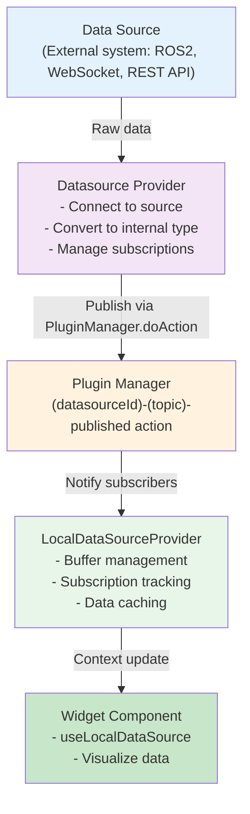
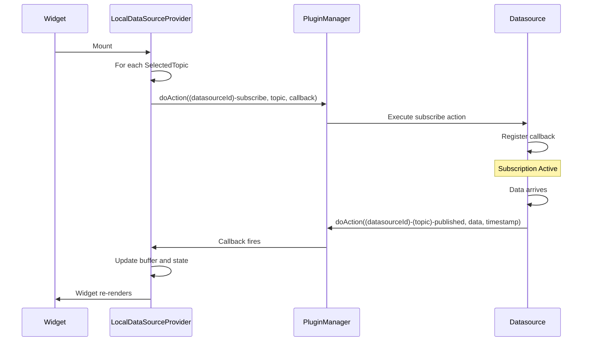
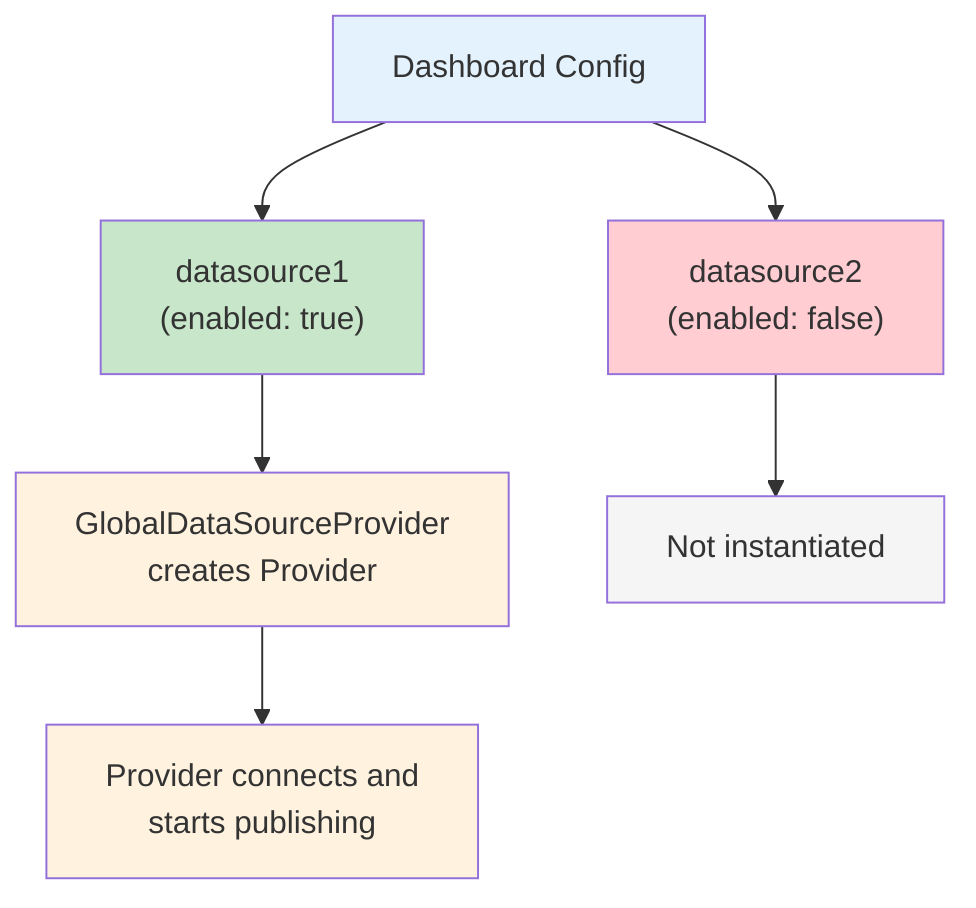

# Data Flow

Understanding how data moves through ORMI-CORE is essential for building effective widgets and datasources. This guide explains the complete data flow from data sources to widget visualization.

## Overview

Data in ORMI-CORE follows a **publish-subscribe pattern** facilitated by the Plugin Manager:



## Data Flow Layers

### Layer 1: Datasource Provider

The **Datasource Provider** is a React Provider component that:

1. Connects to external data sources
2. Converts raw data to internal types
3. Manages topic registration
4. Publishes data via the Plugin Manager

**Example from Random Datasource:**

```typescript
const RandomDataSourceProvider = (children, props: RandomDataSourceSettings) => {
  const pluginManager = usePluginsManager();
  const datasource_id = props.id;

  useEffect(() => {
    // Set up interval to generate data
    const interval = setInterval(() => {
      const data = generateRandomData();

      // Publish data via Plugin Manager
      pluginManager.doAction(
        `${datasource_id}-${topicName}-published`,
        data,
        Date.now()
      );
    }, 1000 / frequency);

    return () => clearInterval(interval);
  }, []);

  return <>{children}</>;
};
```

### Layer 2: Plugin Manager (Pub/Sub Hub)

The **Plugin Manager** acts as a central message broker:

- Receives published data from datasources
- Maintains subscriber lists
- Dispatches data to all subscribers
- No data transformation or storage

**Execution flow:**

```typescript
// Datasource publishes
pluginManager.doAction("foxglove-/robot/pose-published", poseData, timestamp);

// Plugin Manager finds all registered actions for this hook
// Calls each action's callback in priority order
action1.action(poseData, timestamp);
action2.action(poseData, timestamp);
// ...
```

### Layer 3: LocalDataSourceProvider

The **LocalDataSourceProvider** wraps widgets and:

1. Subscribes to specified topics
2. Maintains data buffers
3. Provides React context to child widgets
4. Manages subscription lifecycle

**Key features:**

- **Buffer management**: Keep last N messages per topic
- **Automatic subscription**: Subscribe on mount, unsubscribe on unmount
- **Efficient updates**: Only re-render when data changes

**Usage:**

```typescript
<LocalDataSourcesProvider
  SelectedTopics={[topicSelection]}
  buffersSize={10}
>
  <MyWidget />
</LocalDataSourcesProvider>
```

### Layer 4: Widget Component

The **Widget** consumes data via React hooks:

```typescript
function MyWidget() {
  const { sources } = useLocalDataSource();

  // sources is a Map<string, any[]>
  // Key: topic name
  // Value: array of buffered messages

  const data = sources.get('/robot/pose');

  return <div>{/* visualize data */}</div>;
}
```

## Subscription Mechanism

### Widget-Initiated Subscription

When a widget wants data:



### Subscription Lifecycle

```typescript
useEffect(() => {
    // Subscribe action
    const callback = (data: any, timestamp: number) => {
        // Add to buffer
        updateBuffer(topic, data, timestamp);
    };

    pluginManager.doAction(
        `${datasourceId}-subscribe`,
        selectedTopic,
        callback
    );

    // Cleanup: unsubscribe
    return () => {
        pluginManager.doAction(`${datasourceId}-unsubscribe`, selectedTopic);
    };
}, [datasourceId, topic]);
```

## Type System

ORMI-CORE uses a dual type system with standardized internal types and raw external types. See the **[Type System](type-system)** guide for complete details on type conversion and available types.

## Data Buffering

### Buffer Configuration

Buffers store the last N messages for each topic:

```typescript
<LocalDataSourcesProvider
  SelectedTopics={[topic1, topic2]}
  buffersSize={10}  // Keep last 10 messages
>
```

### Buffer Structure

```typescript
// Internal buffer structure
const buffers = new Map<
    string,
    Array<{
        data: any;
        timestamp: number;
    }>
>();

// Accessing buffered data
const { sources } = useLocalDataSource();
const messages = sources.get("/robot/pose");
// messages = [data1, data2, ..., data10] (most recent last)
```

### Use Cases

**Single value (buffer = 1):**

- Current robot position
- Latest sensor reading
- Status indicators

**Time series (buffer > 1):**

- Plotting charts
- Path visualization
- Historical analysis

**Example:**

```typescript
function TimeSeriesChart({ topic }: { topic: SelectedTopic }) {
  return (
    <LocalDataSourcesProvider
      SelectedTopics={[topic]}
      buffersSize={100}  // Keep last 100 points
    >
      <ChartComponent />
    </LocalDataSourcesProvider>
  );
}

function ChartComponent() {
  const { sources } = useLocalDataSource();
  const dataPoints = sources.get(topic.topic) || [];

  // Plot all 100 points
  return <LineChart data={dataPoints} />;
}
```

## Topic Filtering

Widgets can specify which types of topics they accept:

### DataRequirements

```typescript
interface DataRequirements {
    accepts: string[]; // Array of internal types
}
```

### TopicSelectElement

Use in widget UISchema to filter available topics:

```typescript
{
  type: "TopicSelect",
  scope: "#/properties/topic",
  options: {
    dataRequirements: {
      accepts: ["Vector3", "Movement"]
    }
  }
} as TopicSelectElement
```

### DatasourceTopicFilter

Programmatically filter topics:

```typescript
import { DatasourceTopicFilter } from "@workspace/ormi-core/datasources";

// Filter by type
const filter = new DatasourceTopicFilter({
    type: /Vector3|Movement/, // RegExp
    strict: false,
});

// Get filtered topics
const topics = pluginManager.applyFilter<DatasourceTopic[]>(
    PluginsHooks.AVAILABLE_TOPICS,
    [],
    filter
);

// Filter by name pattern
const robotTopics = new DatasourceTopicFilter({
    name: /^\/robot\//,
});

// Filter by datasource
const foxgloveTopics = new DatasourceTopicFilter({
    source_id: /foxglove/,
});
```

## Publishing Data

### From Datasources

Datasources publish data when it arrives:

```typescript
// In your datasource provider
useEffect(() => {
    const ws = new WebSocket(url);

    ws.onmessage = (event) => {
        const message = JSON.parse(event.data);
        const topic = message.topic;
        const data = convertToInternalType(message.data);

        // Publish to subscribers
        pluginManager.doAction(
            `${datasource_id}-${topic}-published`,
            data,
            Date.now()
        );
    };

    return () => ws.close();
}, []);
```

### From Widgets (Control Widgets)

Widgets can also publish data (e.g., joystick control):

```typescript
function JoystickWidget({ publishTopic }: { publishTopic: SelectedTopic }) {
  const pluginManager = usePluginsManager();

  const handleJoystickMove = (x: number, y: number) => {
    const movement: Movement = {
      linear: { x, y, z: 0 },
      angular: { x: 0, y: 0, z: 0 }
    };

    // Publish control command
    pluginManager.doAction(
      `${publishTopic.datasource_id}-${publishTopic.topic}-published`,
      movement,
      Date.now()
    );
  };

  return <Joystick onChange={handleJoystickMove} />;
}
```

## GlobalDataSourceProvider

The **GlobalDataSourceProvider** manages datasource instances:

```typescript
<GlobalDataSourceProvider datasources={[datasource1, datasource2]}>
  <Dashboard />
</GlobalDataSourceProvider>
```

**Responsibilities:**

- Instantiate datasource providers based on dashboard configuration
- Pass settings to each datasource
- Enable/disable datasources
- Coordinate datasource lifecycle

**Data flow:**



## Performance Considerations

### 1. Minimize Re-renders

Use buffer size wisely:

```typescript
// ❌ Bad: Large buffer causes frequent re-renders
<LocalDataSourcesProvider buffersSize={1000}>

// ✅ Good: Only keep what you need
<LocalDataSourcesProvider buffersSize={10}>
```

### 2. Selective Subscriptions

Only subscribe to topics you need:

```typescript
// ❌ Bad: Subscribe to all topics
<LocalDataSourcesProvider SelectedTopics={allTopics}>

// ✅ Good: Only topics used by this widget
<LocalDataSourcesProvider SelectedTopics={[velocityTopic]}>
```

### 3. Throttle High-Frequency Data

In your datasource, throttle updates:

```typescript
let lastPublishTime = 0;
const THROTTLE_MS = 100; // Max 10 Hz

ws.onmessage = (event) => {
    const now = Date.now();
    if (now - lastPublishTime < THROTTLE_MS) {
        return; // Skip this message
    }

    lastPublishTime = now;
    pluginManager.doAction(/* ... */);
};
```

## Debugging Data Flow

### 1. Check Plugin Manager

Enable logging to see all hook executions:

```typescript
// In browser console
localStorage.setItem("DEBUG", "plugins:*");
```

### 2. Inspect Topics

Use the Topics List widget to see all available topics:

```typescript
// Built into ormi-std-widgets
<TopicsListWidget />
```

### 3. Monitor Subscriptions

Track subscription counts in your datasource:

```typescript
const subscribersCountRef = useRef(new Map<string, number>());

// On subscribe
subscribersCountRef.current.set(topic, count + 1);
console.log(`Topic ${topic} now has ${count + 1} subscribers`);
```

## Common Patterns

### Pattern 1: Multi-Topic Widget

Subscribe to multiple related topics:

```typescript
function RobotDashboard() {
  const topics = [
    { topic: '/robot/pose', ...},
    { topic: '/robot/velocity', ...},
    { topic: '/robot/battery', ...}
  ];

  return (
    <LocalDataSourcesProvider SelectedTopics={topics} buffersSize={1}>
      <RobotVisualization />
    </LocalDataSourcesProvider>
  );
}
```

### Pattern 2: Property Selection

Subscribe to a sub-property of a complex message:

```typescript
const selectedTopic: SelectedTopic = {
    topic: "/robot/imu",
    datasource_id: "foxglove-1",
    type: "Vector3",
    rawType: "sensor_msgs/Imu",
    property: "linear_acceleration.x", // Select sub-property
    source: {
        /* ... */
    },
};
```

### Pattern 3: Bidirectional Communication

Widget both subscribes and publishes:

```typescript
function ControlWidget() {
  return (
    <>
      {/* Subscribe to feedback */}
      <LocalDataSourcesProvider
        SelectedTopics={[feedbackTopic]}
        buffersSize={1}
      >
        <FeedbackDisplay />
      </LocalDataSourcesProvider>

      {/* Publish commands */}
      <ControlInterface publishTopic={commandTopic} />
    </>
  );
}
```

## Next Steps

- **[Type System](type-system)** - Deep dive into types and conversions
- **[Widget API](../api/widget-api)** - Building widgets that consume data
- **[Datasource API](../api/datasource-api)** - Creating datasources that publish data
