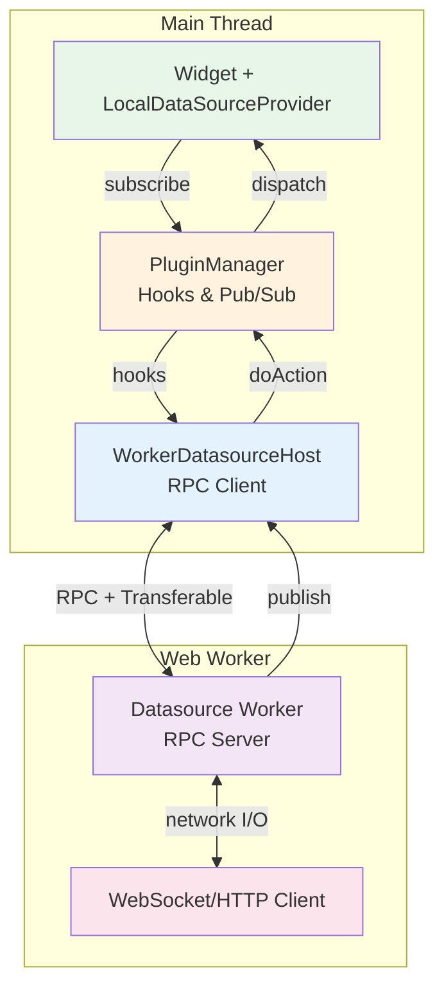
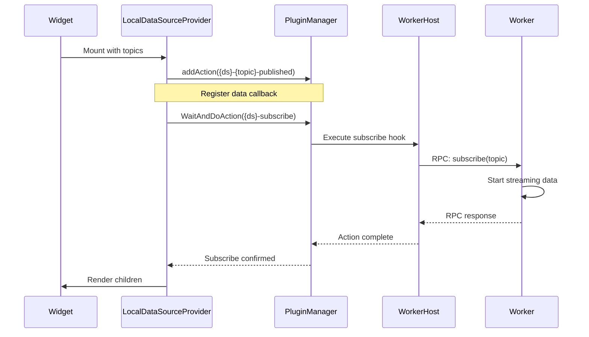
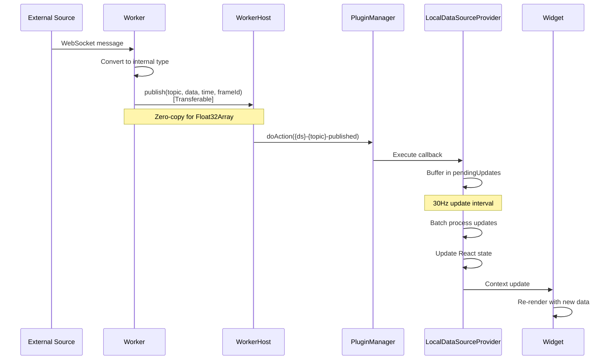
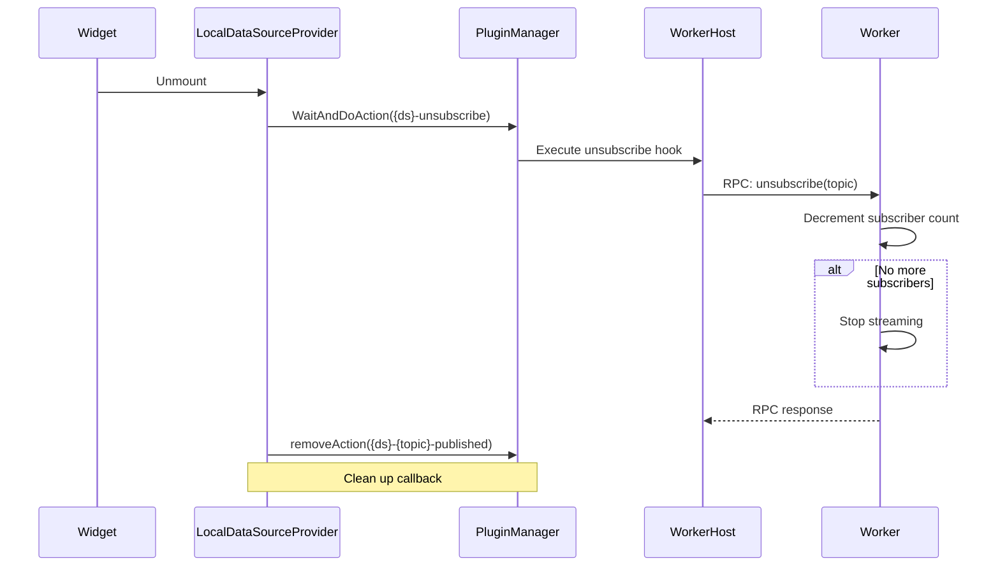
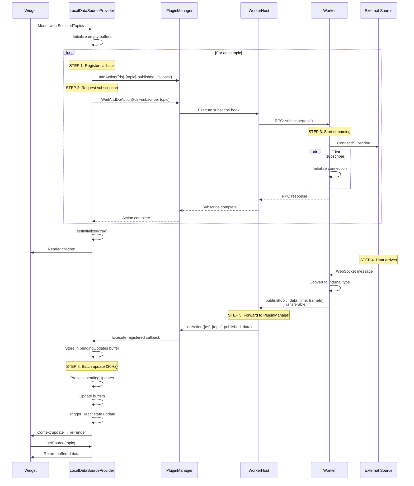
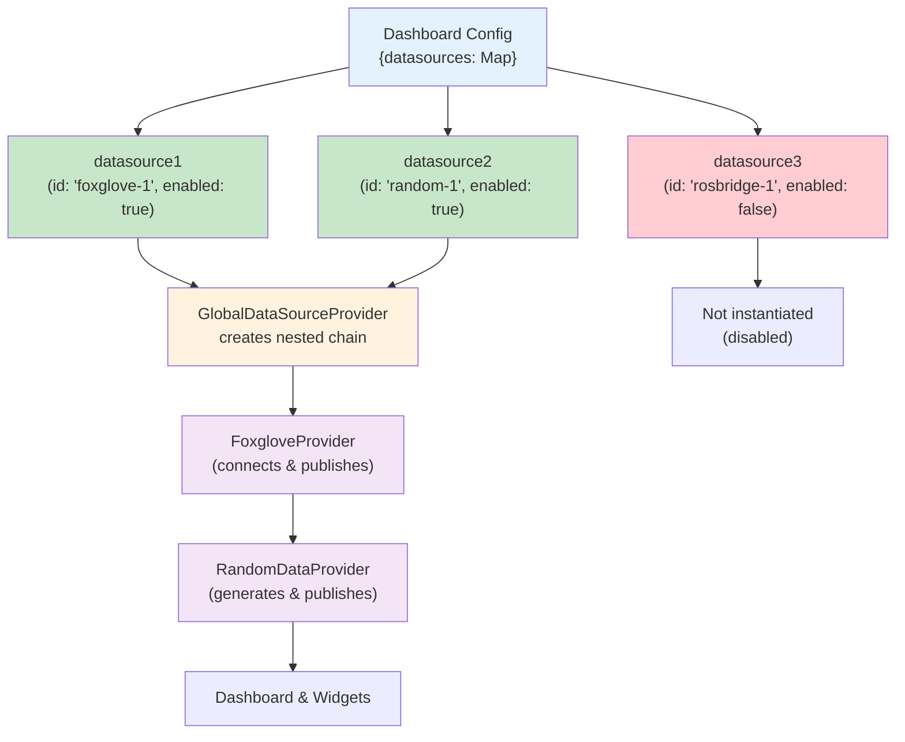

# Data Flow

ORMI-CORE uses a **worker-based architecture** where datasources run in Web Workers, communicating with the main thread via RPC protocol. This ensures non-blocking I/O and responsive UI.

## Architecture Overview



## Data Flow Steps

### Step 1: Widget Subscription



**Main thread actions:**

1. LocalDataSourceProvider registers callback for published data
2. Requests subscription via PluginManager hook
3. WorkerHost receives hook and forwards to worker via RPC
4. Worker starts data generation/connection

### Step 2: Data Publishing (Runtime)



**Runtime flow:**

1. Data arrives in worker (WebSocket, HTTP, etc.)
2. Worker converts to internal type
3. Worker publishes via `ctx.publish()` with Transferable objects
4. WorkerHost receives and forwards to PluginManager
5. LocalDataSourceProvider callback buffers data
6. Batched state update triggers widget re-render (30Hz)

### Step 3: Unsubscription



**Cleanup flow:**

1. Widget unmounts, LocalDataSourceProvider cleanup
2. Unsubscribe request sent via PluginManager
3. WorkerHost forwards to worker via RPC
4. Worker stops data generation if last subscriber
5. Callbacks removed from PluginManager

## Data Flow Layers

### Layer 1: Datasource Worker

The **Datasource Worker** runs in a separate Web Worker thread:

**Key Responsibilities:**

- Connect to external data sources (WebSocket, HTTP, hardware)
- Convert raw data to internal types
- Listen for subscription requests via RPC
- Track subscriber counts (start/stop data flow)
- Publish data with Transferable objects for zero-copy transfers
- Handle graceful shutdown and cleanup

**RPC Methods:**

```typescript
interface DatasourceWorkerImplementation {
    init(settings): Promise<void>; // Initialize connection
    listTopics(): Promise<DatasourceTopic[]>; // List available topics
    subscribe(topic): Promise<void>; // Start streaming
    unsubscribe(topic): Promise<void>; // Stop streaming
    shutdown(): Promise<void>; // Clean up resources
}
```

**Publishing Data:**

```typescript
// In worker
createDatasourceWorker((ctx) => ({
    async subscribe(topic) {
        // Start streaming
        setInterval(() => {
            const data = getSensorData();

            // Zero-copy transfer for Float32Array
            const buffer = data.points; // Float32Array
            ctx.publish(
                topic.topic,
                { points: buffer },
                Date.now(),
                "sensor_frame",
                [buffer.buffer], // Transferable
            );
        }, 100);
    },
}));
```

**Benefits:**

- **Non-blocking I/O**: WebSocket operations don't freeze UI
- **CPU Isolation**: Heavy processing doesn't impact rendering
- **Zero-copy**: Transferable objects for large data (point clouds)
- **Error Isolation**: Worker crash doesn't affect main thread

### Layer 2: WorkerDatasourceHost

The **WorkerDatasourceHost** lives in the main thread and manages worker communication:

**Responsibilities:**

- Spawn and manage Web Worker lifecycle
- Provide RPC client for type-safe communication
- Register hooks with PluginManager
- Forward subscription requests to worker
- Receive published data and forward to PluginManager
- Handle worker errors and reconnection

**Hook Registration:**

```typescript
class WorkerDatasourceHost {
    registerHooks() {
        // Available topics
        pluginManager.addFilter("available-topics", async (topics) => {
            const workerTopics = await this.rpc.call("listTopics");
            return [...topics, ...workerTopics];
        });

        // Subscribe requests
        pluginManager.addAction("{ds}-subscribe", async (topic) => {
            await this.rpc.call("subscribe", topic);
        });

        // Unsubscribe requests
        pluginManager.addAction("{ds}-unsubscribe", async (topic) => {
            await this.rpc.call("unsubscribe", topic);
        });
    }

    // Receive published data from worker
    private handlePublish(event) {
        pluginManager.doAction(
            "{ds}-{topic}-published",
            event.data,
            event.time,
            event.referenceFrameId,
        );
    }
}
```

### Layer 3: Plugin Manager (Pub/Sub Hub)

The **Plugin Manager** acts as a central message broker in the main thread:

- Maintains hook/action registry
- Dispatches subscription requests to WorkerHosts
- Broadcasts published data to subscribers
- Manages filter chains for topic lists
- No data transformation or storage

**Execution flow:**

```typescript
// WorkerHost publishes
pluginManager.doAction("foxglove-/robot/pose-published", poseData, timestamp);

// Plugin Manager finds all registered actions for this hook
// Calls each action's callback in priority order
action1.action(poseData, timestamp);
action2.action(poseData, timestamp);
// ...
```

### Layer 4: LocalDataSourceProvider

The **LocalDataSourceProvider** wraps individual widgets:

**Responsibilities:**

1. **Request subscription** via `pluginsManager.WaitAndDoAction('{datasource_id}-subscribe', topic)`
2. **Register action callbacks** on PluginManager for data updates
3. **Buffer data** in memory with circular buffer
4. **Throttle updates** at configured frequency (default 30Hz)
5. **Provide React context** to child widgets
6. **Manage lifecycle** (subscribe on mount, unsubscribe on unmount)

**Usage:**

```typescript
<LocalDataSourcesProvider
  SelectedTopics={[topicSelection]}
  buffersSize={10}
  updateFrequency={30}  // Hz, default 30
>
  <MyWidget />
</LocalDataSourcesProvider>
```

**Key features:**

- **Active subscription**: Explicitly requests data from datasources
- **Callback registration**: Separate from subscription request
- **Batched updates**: Collects data in 33ms intervals (30Hz default)
- **Buffer management**: Keeps last N messages per topic
- **Automatic lifecycle**: Subscribe/unsubscribe on mount/unmount

### Layer 5: Widget Component

The **Widget** consumes data via React hooks:

```typescript
function MyWidget({ topic }: { topic: SelectedTopic }) {
  const { getSource, getSourceId } = useLocalDataSource();

  // Get the buffered data for this topic
  const sourceId = getSourceId(topic);
  const source = getSource(topic);

  if (!source) return <div>No data</div>;

  // source.data: array of buffered messages (most recent last)
  // source.times: corresponding timestamps
  // source.referenceFrameId: coordinate frame reference

  const latestValue = source.data[source.data.length - 1];

  return <div>Latest: {JSON.stringify(latestValue)}</div>;
}
```

**LocalDataSource Context API:**

```typescript
interface LocalDataSources {
    getSource: (topic: SelectedTopic) => Source | undefined;
    getSourceId: (topic: SelectedTopic) => string;
}

interface Source {
    data: unknown[];
    times: number[];
    referenceFrameId: string;
}
```

## Subscription Mechanism

### How Subscription Works

**Two-step process:**

1. **Register data callback** (main thread):

    ```typescript
    pluginsManager.addAction(`${datasource_id}-${topic}-published`, {
        id: `unique-callback-id`,
        priority: 10,
        action: (data, timestamp, frameId) => {
            // Handle incoming data
        },
    });
    ```

2. **Request subscription** (RPC to worker):
    ```typescript
    await pluginsManager.WaitAndDoAction(
        `${datasource_id}-subscribe`,
        1, // timeout in seconds
        topic,
    );
    // WorkerHost forwards to worker via RPC
    // Worker starts data generation/streaming
    ```

**Why this pattern?**

- Workers only generate/stream data when needed (performance)
- Multiple widgets can subscribe to same topic (reference counting)
- Clean lifecycle management (subscribe on mount, unsubscribe on unmount)
- Main thread doesn't block on I/O operations

### Complete Subscription Flow



### Important Notes

- **LocalDataSourceProvider actively requests subscription** via `WaitAndDoAction()`
- Worker doesn't push data until subscription is requested
- Multiple widgets can subscribe to same topic (worker ref-counts)
- Unsubscribe happens automatically when widget unmounts
- Data transfers use Transferable objects for zero-copy (Float32Array)

### Subscription Lifecycle

**On Mount:**

1. For each topic, register callback to receive published data (main thread)
2. Request subscription from datasource via PluginManager hook
3. WorkerHost forwards subscription request to worker via RPC
4. Worker starts streaming data if this is the first subscriber

**During Operation:**

1. Worker receives data from external source (WebSocket, HTTP, etc.)
2. Worker converts to internal type and publishes via `ctx.publish()`
3. WorkerHost receives and forwards to PluginManager
4. LocalDataSourceProvider callback receives and buffers data
5. Updates batched and applied at configured frequency (30Hz)
6. Widget context updates trigger re-renders

**On Unmount:**

1. Send unsubscribe request via PluginManager hook
2. WorkerHost forwards to worker via RPC
3. Worker decrements ref count, stops streaming if last subscriber
4. Remove action callback from Plugin Manager

## Worker Architecture

### RPC Protocol

Type-safe bidirectional communication between main thread and worker:

```typescript
// Main thread (WorkerHost)
const rpc = createRpcClient<Methods, Events>(worker);

// Call worker method
await rpc.call("subscribe", topic);
const topics = await rpc.call("listTopics");

// Listen to worker events
rpc.on("topic-published", (event) => {
    // Forward to PluginManager
});

// Worker thread
createDatasourceWorker((ctx) => ({
    async subscribe(topic) {
        // Implementation
    },

    async listTopics() {
        return topics;
    },
}));

// Publish from worker
ctx.publish(topic, data, time, frameId, [transferables]);
```

### Transferable Objects

Zero-copy data transfer for performance:

```typescript
// Worker: Create transferable data
const points = new Float32Array(300000); // 300k points
// ... fill points array

// Transfer ownership to main thread (zero-copy)
ctx.publish(
    "/scan/points",
    { points },
    Date.now(),
    "lidar_frame",
    [points.buffer], // Transferable - no copy!
);

// Main thread: Receives transferred buffer
// points.buffer is now owned by main thread
// Worker's original buffer is neutered (can't be accessed)
```

**Benefits:**

- **Zero-copy**: No memory duplication for large arrays
- **Performance**: ~2-3x faster for 100k+ point clouds
- **Memory**: Reduced memory usage and GC pressure

**Supported Transferables:**

- `ArrayBuffer`
- `MessagePort`
- `ImageBitmap`
- `OffscreenCanvas`

### Error Handling

Workers isolate errors from main thread:

```typescript
// Worker error handler
createDatasourceWorker((ctx) => {
    // Global error handler
    self.addEventListener("error", (e) => {
        console.error("Worker error:", e);
        // Worker crash doesn't affect main thread
    });

    return {
        async subscribe(topic) {
            try {
                // Connection logic
            } catch (error) {
                // Log and handle gracefully
                errorHandler.handle(error);
            }
        },
    };
});

// Main thread handles worker termination
workerHost.worker.addEventListener("error", (e) => {
    console.error("Worker crashed:", e);
    // Can restart worker if needed
});
```

### Graceful Shutdown

Workers clean up resources on termination:

```typescript
// Worker shutdown
createDatasourceWorker((ctx) => ({
    async shutdown() {
        // Close connections
        websocket?.close();

        // Clear timers
        clearInterval(publishTimer);

        // Clean up resources
        subscriptions.clear();

        // Worker will terminate after this
    },
}));

// Main thread triggers shutdown
await workerHost.shutdown(); // 5-second timeout
worker.terminate(); // Force terminate if needed
```

## Type System

ORMI-CORE uses a dual type system with standardized internal types and raw external types. See the **[Type System](type-system)** guide for complete details on type conversion and available types.

## Data Buffering

### Buffer Configuration

Buffers store the last N messages for each topic:

```typescript
<LocalDataSourcesProvider
  SelectedTopics={[topic1, topic2]}
  buffersSize={10}  // Keep last 10 messages
>
```

### Buffer Structure

```typescript
// LocalDataSource context provides
interface LocalDataSources {
    getSource: (topic: SelectedTopic) => Source | undefined;
    getSourceId: (topic: SelectedTopic) => string;
}

interface Source {
    data: unknown[]; // Array of buffered messages
    times: number[]; // Corresponding timestamps (milliseconds)
    referenceFrameId: string; // Coordinate frame reference
}

// Usage in widget
const { getSource, getSourceId } = useLocalDataSource();
const source = getSource(myTopic);

if (source) {
    console.log(source.data); // [msg1, msg2, ..., msgN]
    console.log(source.times); // [time1, time2, ..., timeN]
    // Most recent message is at the end of the arrays
    const latest = source.data[source.data.length - 1];
    const latestTime = source.times[source.times.length - 1];
}
```

### Use Cases

**Single value (buffer = 1):**

- Current robot position
- Latest sensor reading
- Status indicators

**Time series (buffer > 1):**

- Plotting charts
- Path visualization
- Historical analysis

**Example:**

```typescript
function TimeSeriesChart({ topic }: { topic: SelectedTopic }) {
  return (
    <LocalDataSourcesProvider
      SelectedTopics={[topic]}
      buffersSize={100}  // Keep last 100 points
      updateFrequency={30}  // Update at 30Hz
    >
      <ChartComponent topic={topic} />
    </LocalDataSourcesProvider>
  );
}

function ChartComponent({ topic }: { topic: SelectedTopic }) {
  const { getSource } = useLocalDataSource();
  const source = getSource(topic);

  if (!source) return <div>Loading...</div>;

  // Plot all buffered points (up to 100)
  const dataPoints = source.data.map((value, index) => ({
    x: source.times[index],
    y: value as number
  }));

  return <LineChart data={dataPoints} />;
}
```

## Topic Filtering

Widgets can specify which types of topics they accept:

### DataRequirements

```typescript
interface DataRequirements {
    accepts: string[]; // Array of internal types
}
```

### TopicSelectElement

Use in widget UISchema to filter available topics:

```typescript
{
  type: "TopicSelect",
  scope: "#/properties/topic",
  options: {
    dataRequirements: {
      accepts: ["Vector3", "Movement"]
    }
  }
} as TopicSelectElement
```

### DatasourceTopicFilter

Programmatically filter topics:

```typescript
import { DatasourceTopicFilter } from "@workspace/ormi-core/datasources";

// Filter by type
const filter = new DatasourceTopicFilter({
    type: /Vector3|Movement/, // RegExp
    strict: false,
});

// Get filtered topics
const topics = pluginManager.applyFilter<DatasourceTopic[]>(
    PluginsHooks.AVAILABLE_TOPICS,
    [],
    filter,
);

// Filter by name pattern
const robotTopics = new DatasourceTopicFilter({
    name: /^\/robot\//,
});

// Filter by datasource
const foxgloveTopics = new DatasourceTopicFilter({
    source_id: /foxglove/,
});
```

## Publishing Data

### From Datasource Workers

Workers publish data using the context API:

```typescript
createDatasourceWorker((ctx) => ({
    async subscribe(topic) {
        const interval = setInterval(() => {
            const data = getSensorData();

            // Simple publish
            ctx.publish(topic.topic, data, Date.now(), "sensor_frame");

            // With Transferable for large data
            const pointCloud = new Float32Array(100000);
            ctx.publish(
                "/scan/points",
                { points: pointCloud },
                Date.now(),
                "lidar_frame",
                [pointCloud.buffer], // Zero-copy transfer
            );
        }, 100);
    },
}));
```

**Publishing signature:**

```typescript
ctx.publish(
  topic: string,
  data: unknown,                    // Converted to internal type
  time: number,                     // Timestamp in milliseconds
  referenceFrameId?: string,        // Coordinate frame
  transfer?: Transferable[]         // Optional zero-copy transfer
);
```

### From Widgets (Control Widgets)

Widgets can publish commands:

```typescript
function JoystickWidget({ publishTopic }: { publishTopic: SelectedTopic }) {
  const pluginManager = usePluginsManager();

  const handleJoystickMove = (x: number, y: number) => {
    const movement: Movement = {
      linear: { x, y, z: 0 },
      angular: { x: 0, y: 0, z: 0 }
    };

    // Publish control command
    pluginManager.doAction(
      `${publishTopic.datasource_id}-${publishTopic.topic}-published`,
      movement,
      Date.now()
    );
  };

  return <Joystick onChange={handleJoystickMove} />;
}
```

## GlobalDataSourceProvider

The **GlobalDataSourceProvider** manages datasource lifecycle and creates a nested provider chain.

**Responsibilities:**

- Load available datasource definitions via plugins
- Build nested chain of datasource providers
- Pass configuration settings to each datasource provider
- Coordinate datasource lifecycle (enable/disable)
- Provide UI for datasource management

**Nested Provider Pattern:**

Datasources are nested using `reduceRight()`, creating a chain where each provider wraps the next:

```
<FoxgloveProvider>
  <ROSBridgeProvider>
    <RandomDataProvider>
      <Dashboard />
    </RandomDataProvider>
  </ROSBridgeProvider>
</FoxgloveProvider>
```

Only enabled datasources are included in the chain.

**Data flow:**



## Performance Considerations

### 1. Worker Benefits

Workers provide automatic performance improvements:

```typescript
// ✅ Good: Heavy I/O in worker
// WebSocket operations don't block UI
// No explicit optimization needed
```

### 2. Transferable Objects

Use typed arrays for large data:

```typescript
// ❌ Bad: Structured clone (copies data)
ctx.publish(topic, { points: regularArray });

// ✅ Good: Transferable (zero-copy)
const buffer = new Float32Array(points);
ctx.publish(topic, { points: buffer }, time, frame, [buffer.buffer]);
```

### 3. Buffer Size

Use appropriate buffer size for your use case:

```typescript
// ❌ Bad: Large buffer causes frequent re-renders
<LocalDataSourcesProvider buffersSize={1000}>

// ✅ Good: Only keep what you need
<LocalDataSourcesProvider buffersSize={10}>
```

### 4. Selective Subscriptions

Only subscribe to topics you need:

```typescript
// ✅ Good: Only topics used by this widget
<LocalDataSourcesProvider SelectedTopics={[velocityTopic]}>
```

### 5. Update Frequency

Throttle high-frequency data:

```typescript
// For high-frequency data (100+ Hz), throttle UI updates
<LocalDataSourcesProvider
  SelectedTopics={[lidarTopic]}
  updateFrequency={10}  // Only 10 UI updates per second
/>
```

### 6. Worker Pooling

For multiple datasources, workers automatically isolate:

```typescript
// Each datasource runs in separate worker
// No manual pooling needed
const foxglove = new WorkerHost({ worker: new Worker("./foxglove.worker.js") });
const random = new WorkerHost({ worker: new Worker("./random.worker.js") });
```

## Debugging Data Flow

### 1. Check Worker Status

Monitor worker health:

```typescript
// In WorkerHost
workerHost.worker.addEventListener("message", (e) => {
    console.log("Worker message:", e.data);
});

workerHost.worker.addEventListener("error", (e) => {
    console.error("Worker error:", e);
});
```

### 2. Enable Plugin Manager Logging

```typescript
// In browser console
localStorage.setItem("DEBUG", "plugins:*");
// Shows all hook executions and data flow
```

### 3. Inspect Topics

Use the Topics List widget:

```typescript
// Built into ormi-std-widgets
<TopicsListWidget />
```

### 4. RPC Call Tracing

Add logging to RPC calls:

```typescript
// In worker
console.log("[Worker] RPC call:", method, args);

// In main thread
console.log("[Host] RPC response:", result);
```

### 5. Performance Profiling

Use Chrome DevTools:

- **Performance tab**: Record worker activity
- **Memory tab**: Check for leaks in workers
- **Network tab**: Monitor WebSocket traffic (worker context)

## Common Patterns

### Pattern 1: Multi-Topic Widget

Subscribe to multiple related topics:

```typescript
function RobotDashboard() {
  const topics = [
    { topic: '/robot/pose', ...},
    { topic: '/robot/velocity', ...},
    { topic: '/robot/battery', ...}
  ];

  return (
    <LocalDataSourcesProvider SelectedTopics={topics} buffersSize={1}>
      <RobotVisualization />
    </LocalDataSourcesProvider>
  );
}
```

### Pattern 2: Property Selection

Subscribe to a sub-property of a complex message:

```typescript
const selectedTopic: SelectedTopic = {
    topic: "/robot/imu",
    datasource_id: "foxglove-1",
    type: "Vector3",
    rawType: "sensor_msgs/Imu",
    property: "linear_acceleration.x", // Select sub-property
    source: {
        /* ... */
    },
};
```

### Pattern 3: Bidirectional Communication

Widget both subscribes and publishes:

```typescript
function ControlWidget() {
  return (
    <>
      {/* Subscribe to feedback */}
      <LocalDataSourcesProvider
        SelectedTopics={[feedbackTopic]}
        buffersSize={1}
      >
        <FeedbackDisplay />
      </LocalDataSourcesProvider>

      {/* Publish commands */}
      <ControlInterface publishTopic={commandTopic} />
    </>
  );
}
```

## Next Steps

- **[Type System](type-system)** - Deep dive into types and conversions
- **[Widget API](../api/widget-api)** - Building widgets that consume data
- **[Datasource API](../api/datasource-api)** - Creating datasources that publish data
