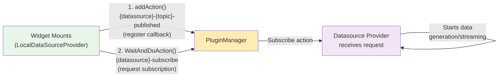
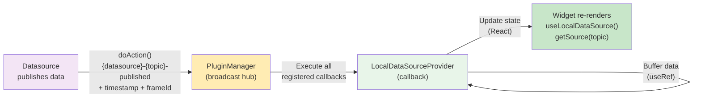
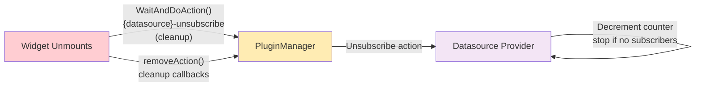
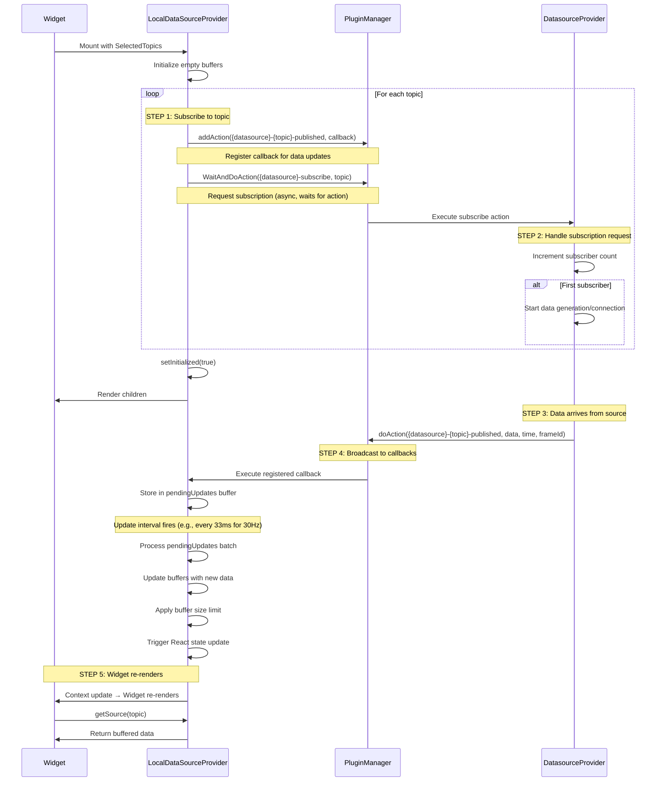
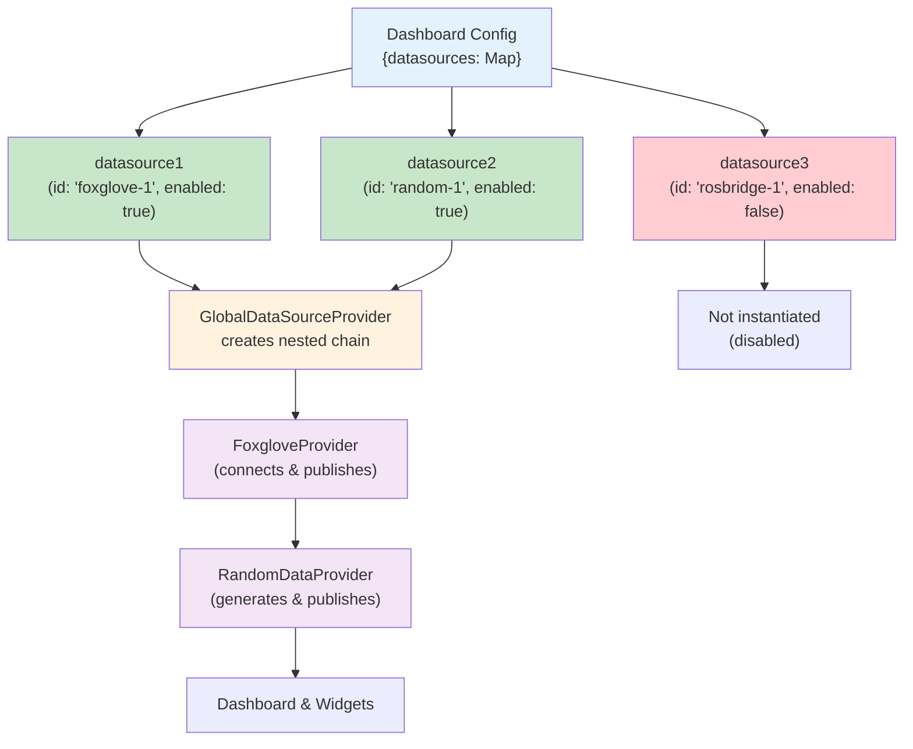

# Data Flow

Understanding how data moves through ORMI-CORE is essential for building effective widgets and datasources. This guide explains the complete data flow from data sources to widget visualization.

## Overview

Data in ORMI-CORE follows a **publish-subscribe pattern** facilitated by the PluginManager.

### Step 1: Subscription Request (Widget Mount)



**What happens:**

- Widget wraps component in `LocalDataSourceProvider`
- LocalDS registers a callback for receiving data
- LocalDS requests subscription from datasource
- Datasource starts generating/streaming data for that topic

### Step 2: Data Flow (Runtime)



**What happens:**

- Datasource publishes data via `doAction()`
- PluginManager calls all registered callbacks
- LocalDS callback buffers data
- State update triggers widget re-render
- Widget retrieves buffered data with `getSource()`

### Step 3: Unsubscription (Widget Unmount)



**What happens:**

- Widget unmounts, LocalDS cleanup runs
- Unsubscribe request sent to datasource
- Datasource stops if no other subscribers
- Callbacks are removed from PluginManager

## Data Flow Layers

### Layer 1: Datasource Provider

The **Datasource Provider** is a React Provider component that:

1. Connects to external data sources
2. Converts raw data to internal types
3. **Listens for subscription requests** via `{datasource_id}-subscribe` action
4. Manages subscriber counts (start/stop data flow)
5. Publishes data via the Plugin Manager when active

**Important:** Datasources wait for subscription requests before starting data generation!

**Key Responsibilities:**

- Listen for subscription requests via action hooks
- Track subscriber counts (reference counting)
- Start/stop data generation based on demand
- Publish data through Plugin Manager using action hooks
- Convert external formats to internal types

**Subscription Workflow:**

1. Receives `{datasource_id}-subscribe` action with topic
2. Tracks number of subscribers per topic
3. On first subscriber: starts data generation/streaming
4. On additional subscribers: reuses existing stream
5. On last unsubscribe: stops data generation to save resources

### Layer 2: Plugin Manager (Pub/Sub Hub)

The **Plugin Manager** acts as a central message broker:

- Receives published data from datasources
- Maintains subscriber lists
- Dispatches data to all subscribers
- No data transformation or storage

**Execution flow:**

```typescript
// Datasource publishes
pluginManager.doAction("foxglove-/robot/pose-published", poseData, timestamp);

// Plugin Manager finds all registered actions for this hook
// Calls each action's callback in priority order
action1.action(poseData, timestamp);
action2.action(poseData, timestamp);
// ...
```

### Layer 3: LocalDataSourceProvider

The **LocalDataSourceProvider** wraps individual widgets and:

1. **Requests subscription** via `pluginsManager.WaitAndDoAction('{datasource_id}-subscribe', topic)`
2. **Registers action callbacks** on the PluginManager for data updates
3. Maintains data buffers in memory
4. Provides React context to child widgets
5. Manages subscription lifecycle (subscribe on mount, unsubscribe on unmount)

**Key features:**

- **Active subscription request**: LocalDS explicitly asks datasources for data
- **Callback registration**: Separate from subscription request
- **Buffer management**: Keep last N messages per topic
- **Subscription coordination**: Uses PluginManager actions to communicate with datasources
- **Throttled updates**: Batches state updates at specified frequency (default 30Hz)
- **Automatic lifecycle**: Subscribe on mount, unsubscribe on unmount

- **Buffer management**: Keep last N messages per topic
- **Subscription coordination**: Uses PluginManager actions to communicate with datasources
- **Throttled updates**: Batches state updates at specified frequency (default 30Hz)
- **Automatic lifecycle**: Subscribe on mount, unsubscribe on unmount

**Usage:**

```typescript
<LocalDataSourcesProvider
  SelectedTopics={[topicSelection]}
  buffersSize={10}
  updateFrequency={30}  // Optional: Hz, default 30
>
  <MyWidget />
</LocalDataSourcesProvider>
```

**Responsibilities:**

1. **Subscribe on mount**: Registers for topic data and requests datasource subscription
2. **Buffer data**: Maintains circular buffer of recent messages per topic
3. **Throttle updates**: Batches React state updates at configured frequency (default 30Hz)
4. **Provide context**: Exposes data through React context to child widgets
5. **Cleanup on unmount**: Unsubscribes and removes registered callbacks

### Layer 4: Widget Component

The **Widget** consumes data via React hooks:

```typescript
function MyWidget({ topic }: { topic: SelectedTopic }) {
  const { getSource, getSourceId } = useLocalDataSource();

  // Get the buffered data for this topic
  const sourceId = getSourceId(topic);
  const source = getSource(topic);

  if (!source) return <div>No data</div>;

  // source.data: array of buffered messages (most recent last)
  // source.times: corresponding timestamps
  // source.referenceFrameId: coordinate frame reference

  const latestValue = source.data[source.data.length - 1];

  return <div>Latest: {JSON.stringify(latestValue)}</div>;
}
```

**LocalDataSource Context API:**

```typescript
interface LocalDataSources {
    getSource: (topic: SelectedTopic) => Source | undefined;
    getSourceId: (topic: SelectedTopic) => string;
}

interface Source {
    data: unknown[];
    times: number[];
    referenceFrameId: string;
}
```

## Subscription Mechanism

### How LocalDataSourceProvider Requests Subscription

**Key Concept:** LocalDataSourceProvider **actively requests** subscription from datasources. Data doesn't flow until subscription is requested.

**Two-step process:**

1. **Register data callback:**

    ```typescript
    pluginsManager.addAction(`${datasource_id}-${topic}-published`, {
        id: `unique-callback-id`,
        priority: 10,
        action: (data, timestamp, frameId) => {
            // Handle incoming data
        },
    });
    ```

2. **Request subscription:**
    ```typescript
    await pluginsManager.WaitAndDoAction(
        `${datasource_id}-subscribe`,
        1, // timeout in seconds
        topic
    );
    ```

**Why this pattern?**

- Datasources only generate/stream data when needed (performance)
- Multiple widgets can subscribe to same topic (reference counting)
- Clean lifecycle management (subscribe on mount, unsubscribe on unmount)

### Widget-Initiated Subscription

When a widget needs data:



**Important Notes:**

- **LocalDataSourceProvider actively requests subscription** via `WaitAndDoAction()`
- The datasource doesn't push data until a subscription is requested
- Multiple widgets can subscribe to the same topic (subscriber count tracking)
- Unsubscribe happens automatically when widget unmounts

### Subscription Lifecycle

**On Mount:**

1. For each topic, register a callback to receive published data
2. Request subscription from datasource using action hook
3. Datasource starts streaming data if this is the first subscriber

**During Operation:**

1. Datasource publishes new data via action hook
2. LocalDataSourceProvider callback receives and buffers the data
3. Updates are batched and applied at configured frequency
4. Widget context updates trigger re-renders

**On Unmount:**

1. Send unsubscribe request to datasource
2. Remove action callback from Plugin Manager
3. Datasource stops streaming if this was the last subscriber

## Type System

ORMI-CORE uses a dual type system with standardized internal types and raw external types. See the **[Type System](type-system)** guide for complete details on type conversion and available types.

## Data Buffering

### Buffer Configuration

Buffers store the last N messages for each topic:

```typescript
<LocalDataSourcesProvider
  SelectedTopics={[topic1, topic2]}
  buffersSize={10}  // Keep last 10 messages
>
```

### Buffer Structure

```typescript
// LocalDataSource context provides
interface LocalDataSources {
    getSource: (topic: SelectedTopic) => Source | undefined;
    getSourceId: (topic: SelectedTopic) => string;
}

interface Source {
    data: unknown[]; // Array of buffered messages
    times: number[]; // Corresponding timestamps (milliseconds)
    referenceFrameId: string; // Coordinate frame reference
}

// Usage in widget
const { getSource, getSourceId } = useLocalDataSource();
const source = getSource(myTopic);

if (source) {
    console.log(source.data); // [msg1, msg2, ..., msgN]
    console.log(source.times); // [time1, time2, ..., timeN]
    // Most recent message is at the end of the arrays
    const latest = source.data[source.data.length - 1];
    const latestTime = source.times[source.times.length - 1];
}
```

### Use Cases

**Single value (buffer = 1):**

- Current robot position
- Latest sensor reading
- Status indicators

**Time series (buffer > 1):**

- Plotting charts
- Path visualization
- Historical analysis

**Example:**

```typescript
function TimeSeriesChart({ topic }: { topic: SelectedTopic }) {
  return (
    <LocalDataSourcesProvider
      SelectedTopics={[topic]}
      buffersSize={100}  // Keep last 100 points
      updateFrequency={30}  // Update at 30Hz
    >
      <ChartComponent topic={topic} />
    </LocalDataSourcesProvider>
  );
}

function ChartComponent({ topic }: { topic: SelectedTopic }) {
  const { getSource } = useLocalDataSource();
  const source = getSource(topic);

  if (!source) return <div>Loading...</div>;

  // Plot all buffered points (up to 100)
  const dataPoints = source.data.map((value, index) => ({
    x: source.times[index],
    y: value as number
  }));

  return <LineChart data={dataPoints} />;
}
```

## Topic Filtering

Widgets can specify which types of topics they accept:

### DataRequirements

```typescript
interface DataRequirements {
    accepts: string[]; // Array of internal types
}
```

### TopicSelectElement

Use in widget UISchema to filter available topics:

```typescript
{
  type: "TopicSelect",
  scope: "#/properties/topic",
  options: {
    dataRequirements: {
      accepts: ["Vector3", "Movement"]
    }
  }
} as TopicSelectElement
```

### DatasourceTopicFilter

Programmatically filter topics:

```typescript
import { DatasourceTopicFilter } from "@workspace/ormi-core/datasources";

// Filter by type
const filter = new DatasourceTopicFilter({
    type: /Vector3|Movement/, // RegExp
    strict: false,
});

// Get filtered topics
const topics = pluginManager.applyFilter<DatasourceTopic[]>(
    PluginsHooks.AVAILABLE_TOPICS,
    [],
    filter
);

// Filter by name pattern
const robotTopics = new DatasourceTopicFilter({
    name: /^\/robot\//,
});

// Filter by datasource
const foxgloveTopics = new DatasourceTopicFilter({
    source_id: /foxglove/,
});
```

## Publishing Data

### From Datasources

Datasources publish data when it arrives by broadcasting through the Plugin Manager:

```typescript
// Publish to all subscribers
pluginManager.doAction(
    `${datasource_id}-${topic}-published`,
    data, // Converted to internal type
    Date.now(), // Timestamp
    "sensor_frame" // Reference frame
);
```

All LocalDataSourceProviders subscribed to this topic will receive the data.

### From Widgets (Control Widgets)

Widgets can also publish data (e.g., joystick control):

```typescript
function JoystickWidget({ publishTopic }: { publishTopic: SelectedTopic }) {
  const pluginManager = usePluginsManager();

  const handleJoystickMove = (x: number, y: number) => {
    const movement: Movement = {
      linear: { x, y, z: 0 },
      angular: { x: 0, y: 0, z: 0 }
    };

    // Publish control command
    pluginManager.doAction(
      `${publishTopic.datasource_id}-${publishTopic.topic}-published`,
      movement,
      Date.now()
    );
  };

  return <Joystick onChange={handleJoystickMove} />;
}
```

## GlobalDataSourceProvider

The **GlobalDataSourceProvider** manages datasource lifecycle and creates a nested provider chain.

**Responsibilities:**

- Load available datasource definitions via plugins
- Build nested chain of datasource providers
- Pass configuration settings to each datasource provider
- Coordinate datasource lifecycle (enable/disable)
- Provide UI for datasource management

**Nested Provider Pattern:**

Datasources are nested using `reduceRight()`, creating a chain where each provider wraps the next:

```
<FoxgloveProvider>
  <ROSBridgeProvider>
    <RandomDataProvider>
      <Dashboard />
    </RandomDataProvider>
  </ROSBridgeProvider>
</FoxgloveProvider>
```

Only enabled datasources are included in the chain.

**Data flow:**



## Performance Considerations

### 1. Minimize Re-renders

Use buffer size wisely:

```typescript
// ❌ Bad: Large buffer causes frequent re-renders
<LocalDataSourcesProvider buffersSize={1000}>

// ✅ Good: Only keep what you need
<LocalDataSourcesProvider buffersSize={10}>
```

### 2. Selective Subscriptions

Only subscribe to topics you need:

```typescript
// ✅ Good: Only topics used by this widget
<LocalDataSourcesProvider SelectedTopics={[velocityTopic]}>
```

### 3. Throttle High-Frequency Data

Configure appropriate update frequency:

```typescript
// For high-frequency data (100+ Hz), throttle updates
<LocalDataSourcesProvider
  SelectedTopics={[lidarTopic]}
  updateFrequency={10}  // Only 10 UI updates per second
/>
```

## Debugging Data Flow

### 1. Check Plugin Manager

Enable logging to see all hook executions:

```typescript
// In browser console
localStorage.setItem("DEBUG", "plugins:*");
```

### 2. Inspect Topics

Use the Topics List widget to see all available topics:

```typescript
// Built into ormi-std-widgets
<TopicsListWidget />
```

### 3. Monitor Subscriptions

Check subscription status in the Plugin Manager or use debugging widgets to track active subscriptions.

## Common Patterns

### Pattern 1: Multi-Topic Widget

Subscribe to multiple related topics:

```typescript
function RobotDashboard() {
  const topics = [
    { topic: '/robot/pose', ...},
    { topic: '/robot/velocity', ...},
    { topic: '/robot/battery', ...}
  ];

  return (
    <LocalDataSourcesProvider SelectedTopics={topics} buffersSize={1}>
      <RobotVisualization />
    </LocalDataSourcesProvider>
  );
}
```

### Pattern 2: Property Selection

Subscribe to a sub-property of a complex message:

```typescript
const selectedTopic: SelectedTopic = {
    topic: "/robot/imu",
    datasource_id: "foxglove-1",
    type: "Vector3",
    rawType: "sensor_msgs/Imu",
    property: "linear_acceleration.x", // Select sub-property
    source: {
        /* ... */
    },
};
```

### Pattern 3: Bidirectional Communication

Widget both subscribes and publishes:

```typescript
function ControlWidget() {
  return (
    <>
      {/* Subscribe to feedback */}
      <LocalDataSourcesProvider
        SelectedTopics={[feedbackTopic]}
        buffersSize={1}
      >
        <FeedbackDisplay />
      </LocalDataSourcesProvider>

      {/* Publish commands */}
      <ControlInterface publishTopic={commandTopic} />
    </>
  );
}
```

## Next Steps

- **[Type System](type-system)** - Deep dive into types and conversions
- **[Widget API](../api/widget-api)** - Building widgets that consume data
- **[Datasource API](../api/datasource-api)** - Creating datasources that publish data
