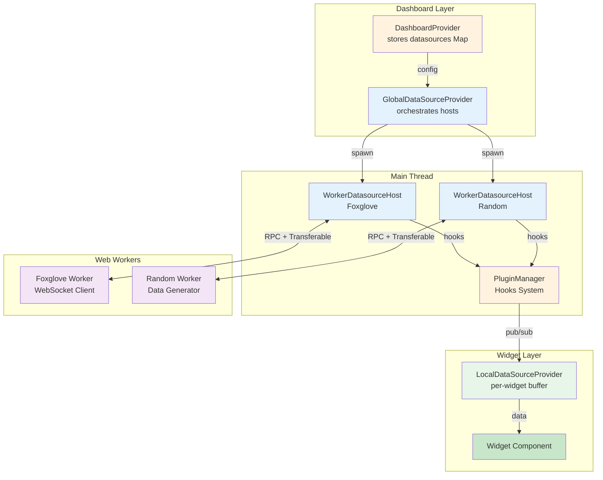

# Datasources System

ORMI-CORE V1 uses a **worker-based datasources architecture** where heavy I/O operations run in Web Workers, keeping the main thread responsive and enabling zero-copy data transfers.

## Overview

### Core Architecture



### Key Concepts

1. **DatasourceDefinition** - Plugin-registered datasource types
2. **Worker Implementation** - Logic runs in dedicated Web Worker
3. **WorkerDatasourceHost** - Main thread coordinator with RPC client
4. **RPC Protocol** - Type-safe bidirectional communication
5. **Transferable Objects** - Zero-copy data transfers

## Worker Implementation

### Creating a Datasource Worker

```typescript
// my-datasource.worker.ts
import { createDatasourceWorker } from "@workspace/ormi-core/datasources/worker";
import type { MyDatasourceSettings } from "./types";

createDatasourceWorker<MyDatasourceSettings>((ctx) => {
	let connection: WebSocket | null = null;
	const subscriptions = new Map<string, number>(); // ref counting

	return {
		async init(settings) {
			// Initialize connection
			connection = new WebSocket(settings.url);

			connection.onmessage = (event) => {
				const { topic, data } = JSON.parse(event.data);

				// Publish to main thread with zero-copy
				if (data.points instanceof Float32Array) {
					ctx.publish(
						topic,
						{ points: data.points },
						Date.now(),
						"sensor_frame",
						[data.points.buffer], // Transferable!
					);
				} else {
					ctx.publish(topic, data, Date.now());
				}
			};

			await new Promise((resolve, reject) => {
				connection.onopen = resolve;
				connection.onerror = reject;
			});
		},

		async listTopics() {
			// Return available topics
			return [
				{
					topic: "/sensor/data",
					datasource_id: "", // Set by host
					source: {}, // Set by host
					type: "SensorData",
					rawType: "sensor_msgs/SensorData",
				},
			];
		},

		async subscribe(topic) {
			const count = subscriptions.get(topic.topic) || 0;
			subscriptions.set(topic.topic, count + 1);

			if (count === 0) {
				// First subscriber - start streaming
				connection?.send(
					JSON.stringify({
						op: "subscribe",
						topic: topic.topic,
					}),
				);
			}
		},

		async unsubscribe(topic, ignoreCount = false) {
			if (ignoreCount) {
				subscriptions.delete(topic.topic);
				return;
			}

			const count = subscriptions.get(topic.topic) || 0;
			if (count <= 1) {
				subscriptions.delete(topic.topic);
				// Last subscriber - stop streaming
				connection?.send(
					JSON.stringify({
						op: "unsubscribe",
						topic: topic.topic,
					}),
				);
			} else {
				subscriptions.set(topic.topic, count - 1);
			}
		},

		async executeRemoteCall(definition, request, options) {
			// Handle service calls
			return { callId: "" };
		},

		async cancelRemoteCall(callId) {
			return true;
		},

		async shutdown() {
			// Clean up
			connection?.close();
			subscriptions.clear();
		},
	};
});
```

### Worker Context API

```typescript
interface DatasourceWorkerContext {
	// Publish data to main thread
	publish(
		topic: string,
		data: unknown,
		time?: number,
		referenceFrameId?: string,
		transfer?: Transferable[],
	): void;

	// Register remote call definitions
	setRemoteCalls(calls: RemoteCallDefinition[]): void;

	// Emit remote call events
	emitRemoteCallStatus(callId: string, status: RemoteCallStatus): void;
	emitRemoteCallFeedback(callId: string, feedback: unknown): void;
	emitRemoteCallResult(callId: string, result: RemoteCallResult): void;
}
```

## WorkerDatasourceHost

### Creating a Host

```typescript
// my-datasource-host.tsx
import React from 'react';
import { WorkerDatasourceHost } from '@workspace/ormi-core/datasources/worker';
import type { MyDatasourceSettings } from './types';

export function MyDatasourceProvider({ children, props }: {
  children: React.ReactNode;
  props: MyDatasourceSettings;
}) {
  const pluginsManager = usePluginsManager();
  const hostRef = useRef<WorkerDatasourceHost<MyDatasourceSettings>>();
  const [initialized, setInitialized] = useState(false);

  useEffect(() => {
    const worker = new Worker(
      new URL('./my-datasource.worker.js', import.meta.url),
      { type: 'module', name: `datasource:${props.id}` }
    );

    const host = new WorkerDatasourceHost({
      worker,
      datasourceId: props.id,
      settings: props,
      pluginsManager
    });

    hostRef.current = host;
    host.registerHooks();

    host.init()
      .then(() => setInitialized(true))
      .catch(console.error);

    return () => {
      host.shutdown().then(() => worker.terminate());
    };
  }, [props.id, props.enable]);

  return <>{initialized && children}</>;
}
```

### Host Responsibilities

**WorkerDatasourceHost automatically:**

1. **Registers PluginManager hooks:**
    - `{datasource_id}-available-topics` - Lists topics
    - `{datasource_id}-subscribe` - Forwards to worker
    - `{datasource_id}-unsubscribe` - Forwards to worker
    - `{datasource_id}-definition` - Returns settings

2. **Manages RPC communication:**
    - Type-safe method calls to worker
    - Event handling from worker
    - Error propagation

3. **Forwards published data:**
    - Receives from worker
    - Publishes via PluginManager
    - Handles Transferable objects

4. **Lifecycle management:**
    - Worker initialization
    - Graceful shutdown (5s timeout)
    - Error recovery

## DatasourceDefinition

### Complete Example

```typescript
// index.ts
import type { DatasourceDefinition } from '@workspace/ormi-core/datasources';
import { MyDatasourceProvider } from './my-datasource-host';
import type { MyDatasourceSettings } from './types';

export const MyDatasourceDefinition: DatasourceDefinition<MyDatasourceSettings> = {
  id: 'my-datasource',
  name: 'My Data Source',
  description: 'Custom WebSocket datasource',
  titleProp: 'title',

  schema: {
    type: 'object',
    properties: {
      title: {
        type: 'string',
        title: 'Title',
        default: 'My Datasource'
      },
      enable: {
        type: 'boolean',
        title: 'Enable',
        default: true
      },
      url: {
        type: 'string',
        title: 'WebSocket URL',
        format: 'uri',
        default: 'ws://localhost:9090'
      }
    },
    required: ['title', 'url']
  },

  data: {
    id: '',
    title: 'My Datasource',
    enable: true,
    url: 'ws://localhost:9090'
  },

  Provider: ({ children, props }) => (
    <MyDatasourceProvider props={props}>
      {children}
    </MyDatasourceProvider>
  )
};
```

### Registering via Plugin

```typescript
class MyPlugin extends Plugin {
	constructor() {
		super();
		this.name = "My Plugin";

		this.addFilter(PluginsHooks.AVAILABLE_DATASOURCES, {
			id: "my-datasource-registration",
			filter: (datasources) => {
				datasources.push(MyDatasourceDefinition);
				return datasources;
			},
		});
	}
}
```

## Zero-Copy Transfers

### Using Transferable Objects

```typescript
// Worker: Create large data
const points = new Float32Array(300000); // 300k points
// ... fill array

// Transfer ownership (zero-copy)
ctx.publish(
	"/scan/points",
	{ points },
	Date.now(),
	"lidar_frame",
	[points.buffer], // Transferable array
);

// After transfer, points.buffer is neutered in worker
// Main thread now owns the memory
```

### Performance Benefits

- **~2-3x faster** for 100k+ point clouds
- **No memory duplication** - instant transfer
- **Reduced GC pressure** - less garbage to collect
- **Main thread stays responsive** - no copying overhead

### Supported Types

- `ArrayBuffer`
- `MessagePort`
- `ImageBitmap`
- `OffscreenCanvas`

## RPC Protocol

### Type-Safe Methods

```typescript
interface DatasourceWorkerMethods {
	init(settings): Promise<void>;
	listTopics(): Promise<DatasourceTopic[]>;
	subscribe(topic): Promise<void>;
	unsubscribe(topic, ignoreCount?): Promise<void>;
	executeRemoteCall(def, request, options): Promise<RemoteCallHandleWire>;
	cancelRemoteCall(callId): Promise<boolean>;
	shutdown(): Promise<void>;
}
```

### Calling from Host

```typescript
// In WorkerDatasourceHost
const topics = await this.rpc.call("listTopics");
await this.rpc.call("subscribe", topic);
await this.rpc.call("unsubscribe", topic);
await this.rpc.call("shutdown");
```

### Event Handling

```typescript
// Worker emits events
ctx.publish(topic, data, time, frameId, transfer);

// Host receives events
this.rpc.on("topic-published", (event) => {
	pluginManager.doAction(
		`${datasourceId}-${event.topic}-published`,
		event.data,
		event.time,
		event.referenceFrameId,
	);
});
```

## Error Handling

### Worker Errors

```typescript
// Worker global error handler
createDatasourceWorker((ctx) => {
	self.addEventListener("error", (e) => {
		console.error("[Worker Error]", e.error);
	});

	self.addEventListener("unhandledrejection", (e) => {
		console.error("[Worker Unhandled Rejection]", e.reason);
	});

	return {
		async subscribe(topic) {
			try {
				// Operation that might fail
			} catch (error) {
				console.error(`Subscribe failed for ${topic.topic}:`, error);
				throw error; // Propagates to host
			}
		},
	};
});
```

### Host Error Handling

```typescript
// In provider component
host.init()
	.then(() => setInitialized(true))
	.catch((error) => {
		console.error("Worker initialization failed:", error);
		toast.error(`Failed to initialize datasource: ${error.message}`);
	});

// Worker crash detection
worker.addEventListener("error", (e) => {
	console.error("Worker crashed:", e);
	// Can restart worker if needed
	restartWorker();
});
```

## Graceful Shutdown

### Worker Cleanup

```typescript
createDatasourceWorker((ctx) => ({
	async shutdown() {
		console.log("[Worker] Shutting down...");

		// Close connections
		websocket?.close();

		// Clear timers
		if (publishTimer) {
			clearInterval(publishTimer);
		}

		// Clear subscriptions
		subscriptions.clear();

		console.log("[Worker] Shutdown complete");
	},
}));
```

### Host Shutdown

```typescript
// In provider cleanup
return () => {
	if (hostRef.current) {
		// Graceful shutdown with 5s timeout
		hostRef.current
			.shutdown()
			.then(() => {
				console.log("Datasource shutdown gracefully");
				worker.terminate();
			})
			.catch(() => {
				console.warn("Shutdown timeout, forcing termination");
				worker.terminate();
			});
	}
};
```

## Best Practices

### 1. Use Workers for I/O

```typescript
// ✅ Good: Network I/O in worker
createDatasourceWorker((ctx) => ({
	async init(settings) {
		const ws = new WebSocket(settings.url);
		// WebSocket runs in worker - doesn't block UI
	},
}));

// ❌ Bad: Network I/O in main thread
// Blocks rendering and user interactions
```

### 2. Transfer Large Data

```typescript
// ✅ Good: Zero-copy transfer
const buffer = new Float32Array(largeData);
ctx.publish(topic, { buffer }, time, frame, [buffer.buffer]);

// ❌ Bad: Structured clone (copies data)
ctx.publish(topic, { buffer }, time, frame);
```

### 3. Reference Count Subscriptions

```typescript
// ✅ Good: Track subscriber count
const subscriptions = new Map<string, number>();

async subscribe(topic) {
  const count = (subscriptions.get(topic.topic) || 0) + 1;
  subscriptions.set(topic.topic, count);

  if (count === 1) {
    // First subscriber - start streaming
  }
}

// ❌ Bad: Always start streaming
async subscribe(topic) {
  startStreaming(topic); // Wastes resources
}
```

### 4. Clean Up Resources

```typescript
// ✅ Good: Proper cleanup
async shutdown() {
  ws?.close();
  intervals.forEach(clearInterval);
  subscriptions.clear();
}

// ❌ Bad: Memory leaks
async shutdown() {
  // Forgot to clean up
}
```

### 5. Handle Connection Failures

```typescript
// ✅ Good: Reconnection logic
createDatasourceWorker((ctx) => ({
	async init(settings) {
		let attempts = 0;
		const connect = () => {
			const ws = new WebSocket(settings.url);

			ws.onerror = () => {
				if (settings.reconnect && attempts < 10) {
					attempts++;
					setTimeout(connect, 1000 * attempts);
				}
			};
		};
		connect();
	},
}));
```

## Common Patterns

### Pattern 1: WebSocket Datasource

```typescript
createDatasourceWorker<WebSocketSettings>((ctx) => {
	let ws: WebSocket | null = null;
	const subscriptions = new Map<string, number>();

	return {
		async init(settings) {
			ws = new WebSocket(settings.url);

			ws.onmessage = (event) => {
				const msg = JSON.parse(event.data);
				ctx.publish(msg.topic, msg.data, msg.timestamp);
			};

			await new Promise((resolve, reject) => {
				ws.onopen = resolve;
				ws.onerror = reject;
			});
		},

		async listTopics() {
			// Fetch from server
			return [];
		},

		async subscribe(topic) {
			const count = (subscriptions.get(topic.topic) || 0) + 1;
			subscriptions.set(topic.topic, count);

			if (count === 1) {
				ws?.send(
					JSON.stringify({
						op: "subscribe",
						topic: topic.topic,
					}),
				);
			}
		},

		async unsubscribe(topic) {
			const count = subscriptions.get(topic.topic) || 0;
			if (count <= 1) {
				subscriptions.delete(topic.topic);
				ws?.send(
					JSON.stringify({
						op: "unsubscribe",
						topic: topic.topic,
					}),
				);
			} else {
				subscriptions.set(topic.topic, count - 1);
			}
		},

		async shutdown() {
			ws?.close();
			subscriptions.clear();
		},
	};
});
```

### Pattern 2: REST API Polling

```typescript
createDatasourceWorker<RestApiSettings>((ctx) => {
	const intervals = new Map<string, ReturnType<typeof setInterval>>();

	return {
		async init(settings) {
			// No initialization needed
		},

		async listTopics() {
			const response = await fetch(`${settings.apiUrl}/topics`);
			return response.json();
		},

		async subscribe(topic) {
			if (!intervals.has(topic.topic)) {
				const interval = setInterval(async () => {
					try {
						const response = await fetch(
							`${settings.apiUrl}${topic.topic}`,
						);
						const data = await response.json();
						ctx.publish(topic.topic, data, Date.now());
					} catch (error) {
						console.error(`Poll failed for ${topic.topic}:`, error);
					}
				}, 1000 / settings.pollRate);

				intervals.set(topic.topic, interval);
			}
		},

		async unsubscribe(topic) {
			const interval = intervals.get(topic.topic);
			if (interval) {
				clearInterval(interval);
				intervals.delete(topic.topic);
			}
		},

		async shutdown() {
			intervals.forEach(clearInterval);
			intervals.clear();
		},
	};
});
```

### Pattern 3: Data Generator

```typescript
createDatasourceWorker<GeneratorSettings>((ctx) => {
	const intervals = new Map<string, ReturnType<typeof setInterval>>();

	return {
		async init(settings) {
			// Seed RNG if needed
		},

		async listTopics() {
			return [
				{ topic: "/random/number", type: "Number", rawType: "float64" },
				{
					topic: "/random/vector",
					type: "Vector3",
					rawType: "Vector3",
				},
			];
		},

		async subscribe(topic) {
			if (!intervals.has(topic.topic)) {
				const interval = setInterval(() => {
					let data;
					if (topic.topic === "/random/number") {
						data = Math.random();
					} else if (topic.topic === "/random/vector") {
						data = {
							x: Math.random(),
							y: Math.random(),
							z: Math.random(),
						};
					}
					ctx.publish(topic.topic, data, Date.now());
				}, 100);

				intervals.set(topic.topic, interval);
			}
		},

		async unsubscribe(topic) {
			const interval = intervals.get(topic.topic);
			if (interval) {
				clearInterval(interval);
				intervals.delete(topic.topic);
			}
		},

		async shutdown() {
			intervals.forEach(clearInterval);
			intervals.clear();
		},
	};
});
```

## Summary

The V1 worker-based datasources system provides:

- **Non-blocking I/O** - Network operations in dedicated workers
- **Zero-copy transfers** - Transferable objects for performance
- **Type-safe RPC** - Structured communication protocol
- **Automatic management** - WorkerDatasourceHost handles complexity
- **Error isolation** - Worker crashes don't affect main thread
- **Graceful shutdown** - Clean resource cleanup
- **Flexible architecture** - Any data source can be integrated
