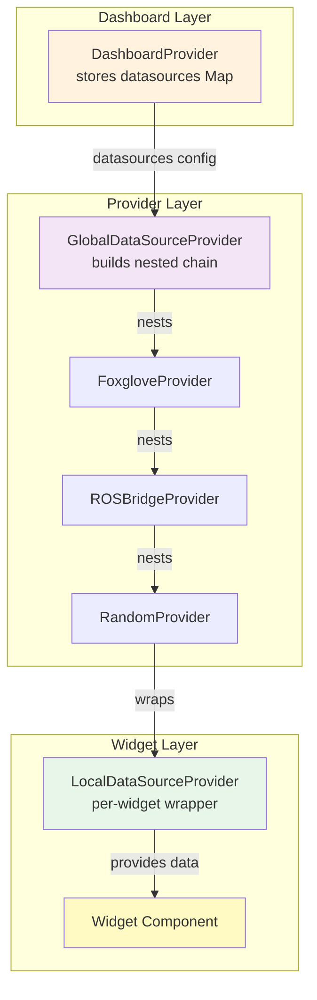
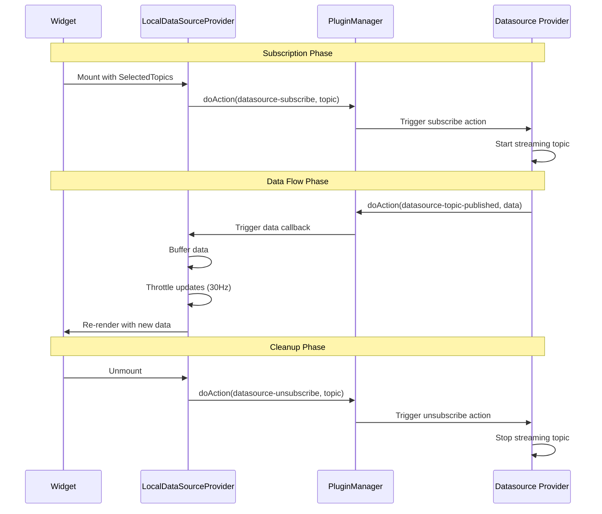

# Datasources System

The datasources system in ORMI-CORE V1 provides a flexible architecture for connecting to various data sources (ROS2, WebSocket, REST APIs, etc.) and distributing data to widgets through a provider-based pattern.

## Overview

### Core Concepts

The datasources system consists of three main layers:

1. **DatasourceDefinition** - Plugin-registered definitions of available datasource types
2. **Datasource Providers** - React components that manage connections and data streaming
3. **Subscription System** - Hook-based mechanism for widgets to subscribe to specific topics



## Core Interfaces

### DatasourceDefinition

Defines a datasource type that can be registered via plugins.

```typescript
interface DatasourceDefinition<T = DatasourceProviderSettings> {
    id: string; // Unique identifier (e.g., 'rosbridge-suite')
    name: string; // Display name
    description: string; // Human-readable description

    titleProp?: string; // Property to use for instance title

    schema: JsonSchema; // JSON Schema for configuration
    uischema?: UISchemaElement; // UI Schema for form rendering
    data: T; // Default settings

    Provider: FC<{
        // React Provider component
        children: ReactNode;
        props: T;
    }>;
}
```

**Example Definition:**

```typescript
export const RosBridgeDefinition: DatasourceDefinition<RosBridgeSettings> = {
    id: "rosbridge-suite",
    name: "ROSBridge Suite",
    description: "ROS2 connection using ROSBridge suite",
    titleProp: "title",

    schema: {
        type: "object",
        properties: {
            title: { type: "string", title: "Title" },
            enable: { type: "boolean", title: "Enable", default: true },
            url: { type: "string", title: "WebSocket URL" },
            reconnect: { type: "boolean", title: "Auto Reconnect" },
        },
        required: ["url"],
    },

    data: {
        id: "",
        title: "ROS2 Connection",
        enable: true,
        url: "ws://localhost:9090",
        reconnect: true,
    },

    Provider: RosBridgeProvider,
};
```

### Datasource

Runtime instance of a datasource with user-configured settings.

```typescript
interface Datasource {
    datasource_id: string; // References DatasourceDefinition.id
    title: string; // User-assigned title
    settings: DatasourceProviderSettings; // Configuration for this instance
}
```

### DatasourceProviderSettings

Base settings interface that all datasource configurations must extend.

```typescript
interface DatasourceProviderSettings {
    id: string; // Unique instance ID
    title: string; // Instance title
    enable: boolean; // Whether datasource is active
}
```

**Custom Settings Example:**

```typescript
interface WebSocketDatasourceSettings extends DatasourceProviderSettings {
    url: string;
    reconnect: boolean;
    topics: Array<{
        topic: string;
        type: string;
    }>;
}
```

### DatasourceTopic

Describes an available topic from a datasource.

```typescript
interface DatasourceTopic {
    topic: string; // Topic name (e.g., '/imu/data')
    datasource_id: string; // Owning datasource instance ID
    source: DatasourceProviderSettings; // Source configuration
    type: string; // Data type in webapp (e.g., 'IMU')
    rawType: string; // Data type in datasource (e.g., 'sensor_msgs/Imu')
    bufferSize?: number; // Optional buffer size hint
}
```

### SelectedTopic

Extends DatasourceTopic with property extraction support.

```typescript
interface SelectedTopic extends DatasourceTopic {
    property: string; // Dot-notation path (e.g., 'linear.x')
}
```

**Property Extraction Example:**

```typescript
const imuTopic: SelectedTopic = {
    topic: "/imu/data",
    datasource_id: "ros-1",
    source: rosDatasource,
    type: "IMU",
    rawType: "sensor_msgs/Imu",
    property: "linear_acceleration.x", // Extract only X acceleration
};

// Widget receives only the extracted value
const { data } = useLocalDataSource();
const xAccel = data; // Already extracted value, not full IMU message
```

## GlobalDataSourceProvider

The `GlobalDataSourceProvider` orchestrates all datasource providers by building a nested provider chain.

### Responsibilities

1. **Load Datasource Definitions** - Queries plugins for available datasource types
2. **Build Provider Chain** - Nests datasource providers using `reduceRight()`
3. **Manage UI** - Provides navbar button for datasource configuration
4. **Filter Widgets** - Shows only widgets compatible with active datasources

### Provider Nesting

The provider chain is built from inside-out using `reduceRight()`:

```typescript
const providerChain = Array.from(datasources.values()).reduceRight(
    (children_stack, datasource) => {
        const Provider = getProvider(datasource.datasource_id);
        return (
            <Provider key={datasource.settings.id} props={datasource.settings}>
                {children_stack}
            </Provider>
        );
    },
    children // Dashboard and widgets
);

// Result:
// <FoxgloveProvider>
//   <ROSBridgeProvider>
//     <RandomProvider>
//       <Dashboard>
//         <Widgets />
//       </Dashboard>
//     </RandomProvider>
//   </ROSBridgeProvider>
// </FoxgloveProvider>
```

**Why nested?** Each provider can intercept and modify the plugin hooks, creating a chain of responsibility pattern.

### Usage

```typescript
import { GlobalDataSourcesProvider } from '@workspace/ormi-core/datasources';

function DashboardPage() {
    return (
        <DashboardProvider /* ... */>
            <GlobalDataSourcesProvider>
                <Dashboard />
            </GlobalDataSourcesProvider>
        </DashboardProvider>
    );
}
```

### Datasource Management UI

GlobalDataSourceProvider automatically adds a "Datasources" button to the navbar:

```typescript
// In GlobalDataSourceProvider
setNavbarItem("center", "datasources_combo",
    <Dialog>
        <DialogTrigger>
            <Button>Datasources <CloudCogIcon /></Button>
        </DialogTrigger>
        <DialogContent>
            {/* List of configured datasources */}
            {/* Add new datasource button */}
        </DialogContent>
    </Dialog>
);
```

**Features:**

- Add new datasource instances
- Configure datasource settings
- Enable/disable datasources
- Remove datasources
- Save datasource as template

### Widget Filtering

Automatically filters the widget list to show only widgets compatible with active datasources:

```typescript
pluginsManager.addFilter(PluginsHooks.WIDGETS_LIST, {
    id: "filter_widgets_list_based_on_datasources",
    priority: Number.MAX_SAFE_INTEGER, // Runs last
    filter: (widgets: WidgetDefinition[]) => {
        const datasourceArray = pluginsManager.applyFilter(
            PluginsHooks.AVAILABLE_DATASOURCES,
            []
        );

        // No datasources = no widgets
        if (datasourceArray.length === 0) {
            return [];
        }

        return pluginsManager.applyFilter(
            PluginsHooks.WIDGET_LIST_WITH_DATASOURCE,
            widgets,
            datasourceArray
        );
    },
});
```

## Datasource Provider Implementation

Datasource providers are React components that implement the connection logic and expose data through plugin hooks.

### Provider Structure

```typescript
function MyDatasourceProvider(
    children: ReactNode,
    props: MyDatasourceSettings
) {
    const pluginManager = usePluginsManager();
    const datasource_id = props.id;

    // Hook names
    const available_topics_hook = `${datasource_id}-available-topics`;
    const subscribe_hook = `${datasource_id}-subscribe`;
    const unsubscribe_hook = `${datasource_id}-unsubscribe`;
    const definition_hook = `${datasource_id}-definition`;

    // State
    const [initialized, setInitialized] = useState(false);
    const subscribersRef = useRef(new Map<string, Set<Function>>());

    // 1. Register available topics
    useEffect(() => {
        pluginManager.addFilter(available_topics_hook, {
            id: datasource_id,
            priority: 10,
            filter: (topics: DatasourceTopic[]) => {
                // Add your topics
                topics.push({
                    topic: '/sensor/data',
                    datasource_id,
                    source: props,
                    type: 'SensorData',
                    rawType: 'custom.SensorData',
                    bufferSize: 100
                });
                return topics;
            }
        });

        return () => pluginManager.removeFilter(available_topics_hook);
    }, [props.topics]);

    // 2. Handle subscription requests
    useEffect(() => {
        pluginManager.addAction(subscribe_hook, {
            id: datasource_id,
            priority: 10,
            action: (topic: SelectedTopic) => {
                const topicKey = topic.topic;

                // Track subscribers
                if (!subscribersRef.current.has(topicKey)) {
                    subscribersRef.current.set(topicKey, new Set());
                }

                const subscribers = subscribersRef.current.get(topicKey)!;

                // First subscriber - start streaming
                if (subscribers.size === 0) {
                    startStreaming(topicKey);
                }

                subscribers.add(topic);
                return true;
            }
        });

        return () => pluginManager.removeAction(subscribe_hook);
    }, []);

    // 3. Handle unsubscription requests
    useEffect(() => {
        pluginManager.addAction(unsubscribe_hook, {
            id: datasource_id,
            priority: 10,
            action: (topic: SelectedTopic) => {
                const topicKey = topic.topic;
                const subscribers = subscribersRef.current.get(topicKey);

                if (subscribers) {
                    subscribers.delete(topic);

                    // Last subscriber - stop streaming
                    if (subscribers.size === 0) {
                        stopStreaming(topicKey);
                        subscribersRef.current.delete(topicKey);
                    }
                }
            }
        });

        return () => pluginManager.removeAction(unsubscribe_hook);
    }, []);

    // 4. Expose settings via definition hook
    useEffect(() => {
        pluginManager.addFilter(definition_hook, {
            id: datasource_id,
            priority: 10,
            filter: () => props
        });

        return () => pluginManager.removeFilter(definition_hook);
    }, [props]);

    // Connection logic
    useEffect(() => {
        if (!props.enable) {
            setInitialized(false);
            return;
        }

        // Connect to data source
        const connection = connectToDatasource(props);

        connection.on('data', (topic, data, timestamp) => {
            // Publish to subscribers via plugin hook
            pluginManager.doAction(
                `${datasource_id}-${topic}-published`,
                data,
                timestamp,
                'base_link' // referenceFrameId
            );
        });

        setInitialized(true);

        return () => connection.disconnect();
    }, [props.enable, props.url]);

    return <>{initialized && children}</>;
}
```

### Required Hooks

Every datasource provider must implement these four hooks:

#### 1. Available Topics Hook

**Pattern:** `${datasource_id}-available-topics`

**Purpose:** Register topics this datasource provides

```typescript
pluginManager.addFilter(available_topics_hook, {
    id: datasource_id,
    priority: 10,
    filter: (topics: DatasourceTopic[]) => {
        props.topics.forEach((topicDef) => {
            topics.push({
                topic: topicDef.topic,
                datasource_id,
                source: props,
                type: topicDef.type,
                rawType: topicDef.rawType,
                bufferSize: 50,
            });
        });
        return topics;
    },
});
```

#### 2. Subscribe Hook

**Pattern:** `${datasource_id}-subscribe`

**Purpose:** Handle subscription requests from widgets

```typescript
pluginManager.addAction(subscribe_hook, {
    id: datasource_id,
    priority: 10,
    action: (topic: SelectedTopic) => {
        const subscribers =
            subscribersRef.current.get(topic.topic) || new Set();

        if (subscribers.size === 0) {
            // First subscriber - start data flow
            startStreamingTopic(topic.topic);
        }

        subscribers.add(topic);
        subscribersRef.current.set(topic.topic, subscribers);

        return true; // Subscription successful
    },
});
```

#### 3. Unsubscribe Hook

**Pattern:** `${datasource_id}-unsubscribe`

**Purpose:** Handle unsubscription requests

```typescript
pluginManager.addAction(unsubscribe_hook, {
    id: datasource_id,
    priority: 10,
    action: (topic: SelectedTopic) => {
        const subscribers = subscribersRef.current.get(topic.topic);

        if (subscribers) {
            subscribers.delete(topic);

            if (subscribers.size === 0) {
                // Last subscriber - stop data flow
                stopStreamingTopic(topic.topic);
                subscribersRef.current.delete(topic.topic);
            }
        }
    },
});
```

#### 4. Definition Hook

**Pattern:** `${datasource_id}-definition`

**Purpose:** Return current settings (used for persistence)

```typescript
pluginManager.addFilter(definition_hook, {
    id: datasource_id,
    priority: 10,
    filter: () => props,
});
```

### Publishing Data

When data arrives, publish it using the topic-specific hook:

```typescript
// Data arrives from source
connection.on("message", (topic, data, timestamp) => {
    // Publish to all subscribers
    pluginManager.doAction(
        `${datasource_id}-${topic}-published`,
        data,
        timestamp,
        referenceFrameId
    );
});
```

**Hook Pattern:** `${datasource_id}-${topic}-published`

**Parameters:**

1. `data: any` - The message data
2. `timestamp: number` - Unix timestamp in milliseconds
3. `referenceFrameId: string` - Reference frame (e.g., 'base_link', 'map')

## LocalDataSourceProvider

The `LocalDataSourceProvider` wraps individual widgets to provide them with subscribed topic data.

### Purpose

- Subscribe to specific topics on behalf of a widget
- Buffer incoming data
- Throttle updates to a configurable frequency
- Extract nested properties from messages
- Provide clean API via `useLocalDataSource()` hook

### Architecture



### Usage

```typescript
import { LocalDataSourcesProvider, useLocalDataSource } from '@workspace/ormi-core/datasources';

function MyWidget({ settings }) {
    const topics: SelectedTopic[] = [
        {
            topic: '/imu/data',
            datasource_id: settings.datasource,
            source: datasourceSettings,
            type: 'IMU',
            rawType: 'sensor_msgs/Imu',
            property: 'linear_acceleration.x'
        }
    ];

    return (
        <LocalDataSourcesProvider
            SelectedTopics={topics}
            buffersSize={100}
            updateFrequency={30}
        >
            <MyWidgetContent />
        </LocalDataSourcesProvider>
    );
}

function MyWidgetContent() {
    const { getSource, getSourceId } = useLocalDataSource();

    const topic = /* ... */;
    const source = getSource(topic);

    if (!source) return <div>No data</div>;

    const latestValue = source.data[source.data.length - 1];

    return <div>X Acceleration: {latestValue}</div>;
}
```

### Props

```typescript
interface LocalDataSourcesProviderProps {
    children: ReactNode;
    SelectedTopics: SelectedTopic[]; // Topics to subscribe to
    buffersSize: number; // Buffer size per topic
    updateFrequency?: number; // Update rate in Hz (default: 30)
}
```

### Context API

```typescript
interface LocalDataSources {
    sources: Map<string, Source>; // Topic data map
    version: number; // Increment triggers re-renders
    getSource: (topic: SelectedTopic) => Source | undefined;
    getSourceId: (topic: SelectedTopic) => string;
}

interface Source {
    data: unknown[]; // Buffer of data values
    times: number[]; // Corresponding timestamps
    referenceFrameId: string; // Reference frame
}
```

### Performance Optimizations

#### 1. useRef for Data Storage

Data is stored in `useRef` to avoid triggering re-renders on every update:

```typescript
const sourcesRef = useRef<Map<string, Source>>(new Map());

// Updates don't trigger re-renders
sourcesRef.current.set(topicKey, newData);
```

#### 2. Throttled Batch Updates

Updates are batched and throttled to a configurable frequency (default 30Hz):

```typescript
const pendingUpdatesRef = useRef(new Map());

// Data arrives - store in pending
pendingUpdatesRef.current.set(topicKey, { value, time, frameId });

// Interval processes pending updates
setInterval(() => {
    if (pendingUpdates.size === 0) return;

    // Apply all pending updates
    pendingUpdates.forEach((update, topicKey) => {
        applyUpdate(topicKey, update);
    });

    pendingUpdates.clear();

    // Trigger re-render
    setVersion((v) => v + 1);
}, 1000 / updateFrequency);
```

**Benefits:**

- Widget re-renders at most `updateFrequency` times per second
- Multiple topic updates batched into single re-render
- Reduces render overhead for high-frequency data (e.g., IMU at 100Hz)

#### 3. Stable Functions

`getSource` and `getSourceId` are wrapped in `useCallback` with no dependencies:

```typescript
const getSource = useCallback((topic: SelectedTopic) => {
    return sourcesRef.current.get(createTopicKey(topic));
}, []); // Stable - no dependencies
```

**Benefits:**

- Widget memoization works correctly
- No unnecessary re-renders from function reference changes

### Property Extraction

LocalDataSourceProvider supports extracting nested properties using dot notation:

```typescript
const topic: SelectedTopic = {
    topic: "/imu/data",
    // ...
    property: "linear_acceleration.x",
};

// Original data:
// { linear_acceleration: { x: 1.2, y: 0.5, z: 9.8 }, ... }

// Widget receives:
// 1.2
```

**Implementation:**

```typescript
const propertiesGetter = (data: any, property: string) => {
    if (!property || property === "") {
        return data;
    }

    const properties = property.split(".");
    let value = data;

    for (const prop of properties) {
        value = value[prop];
    }

    return value;
};

// Applied when data arrives
const processedValue = topic.property
    ? propertiesGetter(value, topic.property)
    : value;
```

### Subscription Lifecycle

```typescript
useEffect(() => {
    Topics.forEach(async (topic) => {
        const sourceId = createTopicKey(topic);

        // 1. Subscribe to topic
        const result = await pluginManager.WaitAndDoAction(
            `${topic.source.id}-subscribe`,
            1,
            topic
        );

        if (result === false) {
            // Subscription failed
            return;
        }

        // 2. Listen for published data
        pluginManager.addAction(`${topic.source.id}-${topic.topic}-published`, {
            id: `${local_id}-${topic.source.id}-${topic.topic}_${topic.property}-published`,
            priority: 10,
            action: (value, time, referenceFrameId) => {
                // Extract property if specified
                const processedValue = topic.property
                    ? propertiesGetter(value, topic.property)
                    : value;

                // Store in pending updates
                pendingUpdates.set(sourceId, {
                    value: processedValue,
                    time,
                    referenceFrameId,
                });
            },
        });
    });

    return () => {
        Topics.forEach(async (topic) => {
            // 3. Unsubscribe on unmount
            await pluginManager.WaitAndDoAction(
                `${topic.source.id}-unsubscribe`,
                1,
                topic
            );

            // Remove data listener
            pluginManager.removeAction(
                `${local_id}-${topic.source.id}-${topic.topic}_${topic.property}-published`
            );
        });
    };
}, [SelectedTopics, buffersSize, updateFrequency]);
```

## Topic Filtering

The `DatasourceTopicFilter` class provides regex-based filtering of topics:

```typescript
class DatasourceTopicFilter {
    name?: RegExp; // Filter by topic name
    type?: RegExp; // Filter by type
    source_id?: RegExp; // Filter by datasource ID
    rawType?: RegExp; // Filter by raw type
    strict?: boolean; // Require all filters to match

    constructor(props: DatasourceTopicFilterProps) {
        this.name = props.name;
        this.type = props.type;
        this.source_id = props.source_id;
        this.rawType = props.rawType;
        this.strict = props.strict || false;
    }

    filter(topic: DatasourceTopic): boolean {
        const matches = [];

        if (this.name && !this.name.test(topic.topic)) {
            matches.push(false);
        }

        if (this.type && !this.type.test(topic.type)) {
            matches.push(false);
        }

        if (this.source_id && !this.source_id.test(topic.datasource_id)) {
            matches.push(false);
        }

        if (this.rawType && !this.rawType.test(topic.rawType)) {
            matches.push(false);
        }

        if (this.strict && matches.length > 0) {
            return false; // All filters must match
        }

        return true; // At least one filter matched (or no filters)
    }
}
```

**Usage Example:**

```typescript
// Filter for IMU topics from any ROS datasource
const filter = new DatasourceTopicFilter({
    name: /imu/i,
    source_id: /ros/i,
    strict: true,
});

const availableTopics = pluginManager.applyFilter(
    PluginsHooks.AVAILABLE_TOPICS,
    []
);

const imuTopics = availableTopics.filter((topic) => filter.filter(topic));
```

## Best Practices

### 1. Use Unique Hook IDs

Always use datasource_id in hook names to avoid conflicts:

```typescript
// ✅ GOOD
const subscribe_hook = `${datasource_id}-subscribe`;

// ❌ BAD
const subscribe_hook = "subscribe";
```

### 2. Track Subscriber Counts

Only stream data when there are active subscribers:

```typescript
const subscribersRef = useRef(new Map<string, Set<any>>());

// Subscribe
const subscribers = subscribersRef.current.get(topic) || new Set();
if (subscribers.size === 0) {
    startStreaming(topic); // First subscriber
}
subscribers.add(widgetId);

// Unsubscribe
subscribers.delete(widgetId);
if (subscribers.size === 0) {
    stopStreaming(topic); // Last subscriber
}
```

### 3. Handle Connection Lifecycle

Properly manage connections based on enable flag:

```typescript
useEffect(() => {
    if (!props.enable) {
        setInitialized(false);
        return; // Don't connect if disabled
    }

    const connection = connect(props.url);
    setInitialized(true);

    return () => connection.disconnect();
}, [props.enable, props.url]);
```

### 4. Validate Subscription Results

Check if subscription succeeded:

```typescript
const result = await pluginManager.WaitAndDoAction(
    `${datasource_id}-subscribe`,
    1,
    topic
);

if (result === false) {
    toast.error(`Failed to subscribe to ${topic.topic}`);
    return;
}
```

### 5. Use Appropriate Buffer Sizes

Choose buffer sizes based on data characteristics:

```typescript
// High-frequency, small messages (e.g., IMU at 100Hz)
bufferSize: 100;

// Low-frequency, large messages (e.g., images at 10Hz)
bufferSize: 10;

// Time-series data for charts
bufferSize: 1000;
```

### 6. Optimize Update Frequency

Match update frequency to widget needs:

```typescript
// Real-time display (e.g., IMU visualization)
updateFrequency: 30; // 30Hz

// Charts and graphs
updateFrequency: 10; // 10Hz

// Status displays
updateFrequency: 1; // 1Hz
```

## Common Patterns

### Pattern 1: ROS2 Topic Discovery

```typescript
// Fetch available topics from ROS
useEffect(() => {
    if (!connected) return;

    rosClient.getTopics((topics) => {
        // Update available topics filter
        pluginManager.addFilter(available_topics_hook, {
            id: datasource_id,
            priority: 10,
            filter: (existingTopics) => {
                topics.forEach((topic) => {
                    existingTopics.push({
                        topic: topic.name,
                        datasource_id,
                        source: props,
                        type: mapRosTypeToWebType(topic.type),
                        rawType: topic.type,
                        bufferSize: 50,
                    });
                });
                return existingTopics;
            },
        });
    });
}, [connected]);
```

### Pattern 2: WebSocket with Reconnection

```typescript
const wsRef = useRef<WebSocket | null>(null);
const [reconnectAttempt, setReconnectAttempt] = useState(0);

useEffect(() => {
    if (!props.enable) return;

    const connect = () => {
        wsRef.current = new WebSocket(props.url);

        wsRef.current.onopen = () => {
            setReconnectAttempt(0);
            setInitialized(true);
        };

        wsRef.current.onmessage = (event) => {
            const { topic, data, timestamp } = JSON.parse(event.data);
            pluginManager.doAction(
                `${datasource_id}-${topic}-published`,
                data,
                timestamp,
                "world"
            );
        };

        wsRef.current.onclose = () => {
            if (props.reconnect) {
                setTimeout(
                    () => {
                        setReconnectAttempt((prev) => prev + 1);
                        connect();
                    },
                    1000 * Math.min(reconnectAttempt, 10)
                );
            }
        };
    };

    connect();

    return () => {
        wsRef.current?.close();
        wsRef.current = null;
    };
}, [props.enable, props.url, props.reconnect, reconnectAttempt]);
```

### Pattern 3: REST API Polling

```typescript
useEffect(() => {
    if (!props.enable) return;

    const pollTopic = (topic: string) => {
        const interval = setInterval(async () => {
            try {
                const response = await fetch(`${props.apiUrl}${topic}`);
                const data = await response.json();

                pluginManager.doAction(
                    `${datasource_id}-${topic}-published`,
                    data,
                    Date.now(),
                    "sensor"
                );
            } catch (error) {
                console.error(`Failed to poll ${topic}:`, error);
            }
        }, 1000 / props.pollRate); // Convert Hz to ms

        return interval;
    };

    const intervals = props.topics.map((topic) => pollTopic(topic));

    return () => {
        intervals.forEach((interval) => clearInterval(interval));
    };
}, [props.enable, props.topics, props.apiUrl, props.pollRate]);
```

## Troubleshooting

### Data Not Appearing in Widget

**Check:**

1. Is datasource enabled? (`enable: true`)
2. Did subscription succeed? (Check console for errors)
3. Is provider publishing data? (Add console.log in data callback)
4. Is LocalDataSourceProvider configured correctly?
5. Is topic name exact match?

```typescript
// Debug subscription
const result = await pluginManager.WaitAndDoAction(
    `${datasource_id}-subscribe`,
    1,
    topic
);
console.log("Subscription result:", result);

// Debug data flow
pluginManager.addAction(`${datasource_id}-${topic}-published`, {
    id: "debug-listener",
    priority: 1,
    action: (data) => {
        console.log("Data received:", data);
    },
});
```

### High CPU Usage

**Causes:**

- Update frequency too high
- Buffer size too large
- Too many subscribed topics

**Solutions:**

```typescript
// Reduce update frequency
<LocalDataSourcesProvider updateFrequency={10}> {/* was 60 */}

// Reduce buffer size
<LocalDataSourcesProvider buffersSize={50}> {/* was 500 */}

// Subscribe only to needed properties
property: 'pose.position.x' // Instead of full pose
```

### Memory Leaks

**Symptoms:** Memory usage grows over time

**Causes:**

- Forgot to unsubscribe
- Intervals not cleared
- WebSocket not closed

**Solution:**

```typescript
useEffect(() => {
    // Setup
    const interval = setInterval(/* ... */, 1000);
    const ws = new WebSocket(url);

    // ALWAYS return cleanup
    return () => {
        clearInterval(interval);
        ws.close();
        pluginManager.removeAction(hookId);
    };
}, [deps]);
```

### Stale Data in Widget

**Cause:** Widget not re-rendering on data updates

**Solution:** Use `version` from context:

```typescript
const { getSource, version } = useLocalDataSource();

useEffect(() => {
    const source = getSource(topic);
    // Do something with source
}, [topic, version]); // Include version in deps
```

## Summary

The V1 datasources system provides:

- **Flexible Provider Architecture** - Any data source can be integrated
- **Plugin-Based Registration** - Datasources registered via plugins
- **Subscription Management** - Automatic start/stop based on widget needs
- **Performance Optimizations** - Throttling, batching, ref-based storage
- **Property Extraction** - Access nested data without parsing
- **Type Safety** - Full TypeScript interfaces

**Key Components:**

- `DatasourceDefinition` - Type definition
- `Datasource` - Instance configuration
- `GlobalDataSourceProvider` - Provider orchestration
- `LocalDataSourceProvider` - Widget-level subscriptions
- Plugin Hooks - Data flow coordination

This architecture enables the circular dependency issue (GlobalDataSourceProvider ↔ DashboardProvider) but provides rich functionality for V1. V2 will address the architectural limitations while maintaining feature parity.
