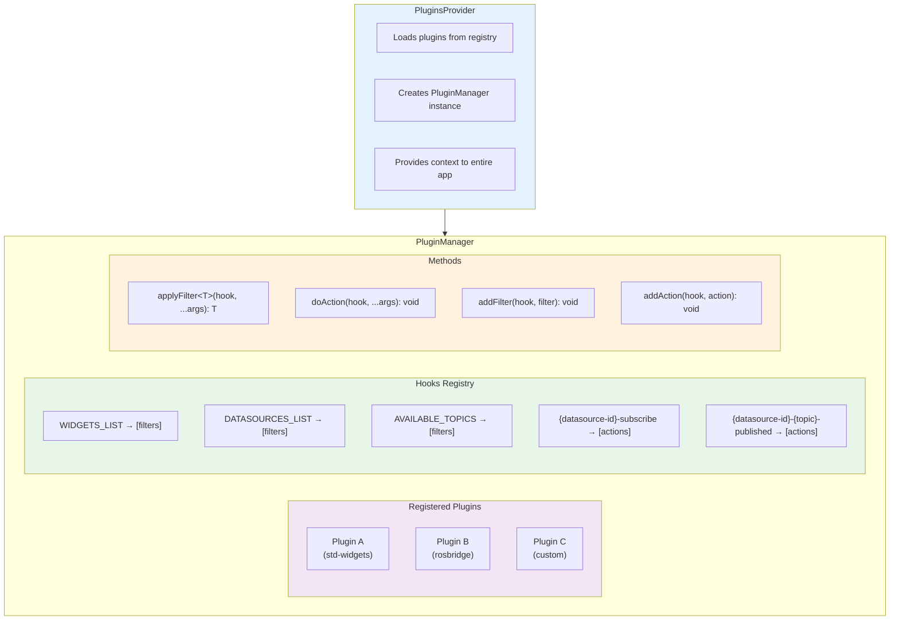
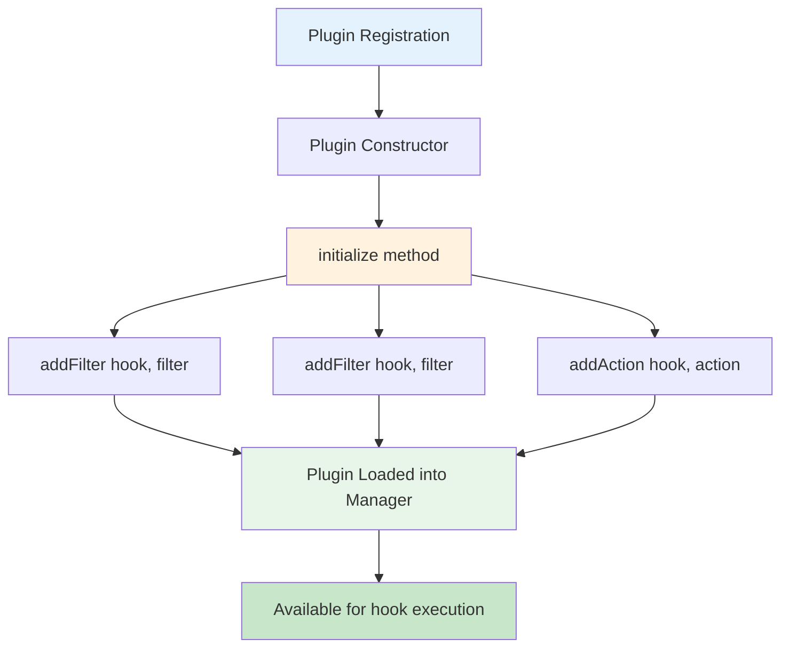

# Plugin System

The Plugin System is the **core extensibility mechanism** in ORMI-CORE. It provides a hooks-and-filters architecture inspired by WordPress, allowing plugins to inject functionality at specific points in the application lifecycle.

## Overview

The plugin system consists of three main components:

1. **Plugin Class** - Base class for creating plugins
2. **PluginManager** - Central hub that manages plugins and executes hooks
3. **PluginsHooks** - Predefined extension points throughout the application

## Architecture

## Architecture



## Core Concepts

### 1. Hooks

Hooks are **named extension points** where plugins can inject functionality. There are two types:

#### Filters

Transform or accumulate data passed through them. Always return a value.

```typescript
// Filter signature
(currentValue: T, ...additionalArgs: any[]) => T;
```

**Example:** Adding widgets to the system

```typescript
this.addFilter(PluginsHooks.WIDGETS_LIST, {
    id: "my-widgets",
    priority: 10,
    filter: (widgets: WidgetDefinition[]) => {
        widgets.push(MyWidgetDefinition());
        return widgets; // Always return the modified value
    },
});
```

#### Actions

Execute side effects without returning values. Used for events and notifications.

```typescript
// Action signature
(...args: any[]) => void
```

**Example:** Subscribing to a topic

```typescript
pluginManager.doAction(`${datasourceId}-subscribe`, selectedTopic, callback);
```

### 2. Priority System

Both filters and actions have a **priority** property that determines execution order:

- **Lower numbers** execute first
- **Higher numbers** execute later
- Default priority is typically **10**

```typescript
// Executes first (priority 5)
this.addFilter(PluginsHooks.WIDGETS_LIST, {
    id: "core-widgets",
    priority: 5,
    filter: (widgets) => {
        /* ... */
    },
});

// Executes second (priority 10)
this.addFilter(PluginsHooks.WIDGETS_LIST, {
    id: "user-widgets",
    priority: 10,
    filter: (widgets) => {
        /* ... */
    },
});
```

### 3. Plugin Lifecycle



## Predefined Hooks

### Widget Hooks

#### `WIDGETS_LIST`

Register widget definitions available in the system.

```typescript
PluginsHooks.WIDGETS_LIST;
```

**Signature:**

```typescript
(widgets: WidgetDefinition[]) => WidgetDefinition[]
```

**Example:**

```typescript
this.addFilter(PluginsHooks.WIDGETS_LIST, {
    id: "my-plugin-widgets",
    priority: 10,
    filter: (widgets) => {
        widgets.push(MyChartWidget());
        widgets.push(MyMapWidget());
        return widgets;
    },
});
```

#### `WIDGET_LIST_WITH_DATASOURCE`

Filter widgets based on available datasources (advanced use case).

```typescript
PluginsHooks.WIDGET_LIST_WITH_DATASOURCE;
```

**Signature:**

```typescript
(
  widgets: WidgetDefinition[],
  datasources: Datasource[]
) => WidgetDefinition[]
```

### Datasource Hooks

#### `DATASOURCES_LIST`

Register datasource definitions.

```typescript
PluginsHooks.DATASOURCES_LIST;
```

**Signature:**

```typescript
(datasources: DatasourceDefinition[]) => DatasourceDefinition[]
```

**Example:**

```typescript
this.addFilter(PluginsHooks.DATASOURCES_LIST, {
    id: "my-datasource",
    priority: 10,
    filter: (datasources) => {
        datasources.push(MyDatasourceDefinition);
        return datasources;
    },
});
```

#### `AVAILABLE_DATASOURCES`

Get list of enabled datasource instances in the current workspace.

```typescript
PluginsHooks.AVAILABLE_DATASOURCES;
```

**Signature:**

```typescript
(datasources: Datasource[]) => Datasource[]
```

#### `AVAILABLE_TOPICS`

Get all available topics from all datasources.

```typescript
PluginsHooks.AVAILABLE_TOPICS;
```

**Signature:**

```typescript
(
  topics: DatasourceTopic[],
  filter?: DatasourceTopicFilter
) => DatasourceTopic[]
```

**Example:**

```typescript
const topics = pluginManager.applyFilter<DatasourceTopic[]>(
    PluginsHooks.AVAILABLE_TOPICS,
    [],
    new DatasourceTopicFilter({
        type: /Vector3|Movement/,
    })
);
```

### Renderer Hooks

#### `JSON_FORMS_RENDERER`

Register custom JSON Forms renderers for widget/datasource configuration.

```typescript
PluginsHooks.JSON_FORMS_RENDERER;
```

**Signature:**

```typescript
(
  renderers: JsonFormsRendererRegistryEntry[]
) => JsonFormsRendererRegistryEntry[]
```

**Example:**

```typescript
this.addFilter(PluginsHooks.JSON_FORMS_RENDERER, {
    id: "my-renderers",
    priority: 10,
    filter: (renderers) => {
        renderers.push({
            tester: myCustomTester,
            renderer: MyCustomRenderer,
        });
        return renderers;
    },
});
```

### Transform Hooks

#### `TRANSFORM_TREE`

Provide coordinate transformation trees (TF trees for robotics).

```typescript
PluginsHooks.TRANSFORM_TREE;
```

**Signature:**

```typescript
(trees: Map<string, TransformTree>) => Map<string, TransformTree>;
```

### Visualization Hooks

#### `MAP_LOCAL_VISUALIZERS`

Register local coordinate visualizers for map widgets.

```typescript
PluginsHooks.MAP_LOCAL_VISUALIZERS;
```

**Signature:**

```typescript
(visualizers: Map<string, LocalTopicVisualizer>) =>
    Map<string, LocalTopicVisualizer>;
```

**Example:**

```typescript
this.addFilter(PluginsHooks.MAP_LOCAL_VISUALIZERS, {
    id: "my-visualizers",
    priority: 100,
    filter: (visualizers) => {
        visualizers.set("path", {
            component: PathVisualizer,
            accepts: ["Path"],
            name: "Path Visualization",
            description: "Displays nav_msgs/Path",
        });
        return visualizers;
    },
});
```

### Provider Hooks

#### `PLUGIN_PROVIDER_BEFORE_CHILDREN`

Inject React components before PluginsProvider children.

```typescript
PluginsHooks.PLUGIN_PROVIDER_BEFORE_CHILDREN;
```

#### `PLUGIN_PROVIDER_AFTER_CHILDREN`

Inject React components after PluginsProvider children.

```typescript
PluginsHooks.PLUGIN_PROVIDER_AFTER_CHILDREN;
```

## Dynamic Hooks

Beyond predefined hooks, the plugin system supports **dynamic hooks** created at runtime. These are commonly used for datasource pub/sub:

### Datasource-Specific Hooks

When a datasource is instantiated, it creates dynamic hooks:

#### Subscribe Hook

```typescript
`${datasourceId}-subscribe`;
```

**Purpose:** Handle subscription requests from LocalDataSourceProvider

**Action Signature:**

```typescript
(topic: SelectedTopic) => void
```

**Important:** LocalDataSourceProvider does NOT pass a callback to subscribe. Instead, it registers its own action callback separately for data updates.

**Example (in datasource provider):**

```typescript
pluginManager.addAction(`${datasourceId}-subscribe`, {
    id: `${datasourceId}-subscribe`,
    priority: 10,
    action: (topic: SelectedTopic) => {
        // Track subscriber count
        const count = subscribersCount.get(topic.topic) || 0;
        subscribersCount.set(topic.topic, count + 1);

        // Start data flow on first subscriber
        if (count === 0) {
            startTopicDataGeneration(topic.topic);
        }
    },
});
```

**How LocalDataSourceProvider subscribes:**

```typescript
// 1. Register callback for data updates
pluginManager.addAction(`${datasourceId}-${topicName}-published`, {
    id: `local-${uuid}-callback`,
    priority: 10,
    action: (data, timestamp, frameId) => {
        // Handle incoming data
    },
});

// 2. Subscribe to topic
await pluginManager.WaitAndDoAction(`${datasourceId}-subscribe`, 1, topic);
```

#### Unsubscribe Hook

```typescript
`${datasourceId}-unsubscribe`;
```

**Purpose:** Handle unsubscription requests

**Action Signature:**

```typescript
(topic: SelectedTopic, ignoreCount?: boolean) => void
```

**Parameters:**

- `topic`: The topic to unsubscribe from
- `ignoreCount`: Optional flag to force cleanup regardless of subscriber count

**Example (in datasource provider):**

```typescript
pluginManager.addAction(`${datasourceId}-unsubscribe`, {
    id: `${datasourceId}-unsubscribe`,
    priority: 10,
    action: (topic: SelectedTopic, ignoreCount = false) => {
        if (ignoreCount) {
            stopTopicDataGeneration(topic.topic);
            subscribersCount.delete(topic.topic);
            return;
        }

        // Decrement subscriber count
        const count = subscribersCount.get(topic.topic) || 0;
        const newCount = Math.max(0, count - 1);
        subscribersCount.set(topic.topic, newCount);

        // Stop data flow when no subscribers
        if (newCount === 0) {
            stopTopicDataGeneration(topic.topic);
        }
    },
});
```

#### Topic Published Hook

```typescript
`${datasourceId}-${topicName}-published`;
```

**Purpose:** Broadcast data to all registered listeners (including LocalDataSourceProvider instances)

**Action Signature:**

```typescript
(data: any, timestamp: number, referenceFrameId?: string) => void
```

**Example (from datasource):**

```typescript
// When data arrives from your source
const handleData = (topicName: string, rawData: any) => {
    // Convert to internal type if needed
    const data = convertToInternalType(rawData);

    // Publish to all registered callbacks via PluginManager
    pluginManager.doAction(
        `${datasourceId}-${topicName}-published`,
        data, // The data
        Date.now(), // Timestamp in milliseconds
        "base_link" // Optional: coordinate frame reference
    );
};
```

**Who receives this?**

- All LocalDataSourceProvider instances that subscribed to this topic
- Transform managers monitoring coordinate frames
- Any other plugins listening to this topic

#### Definition Hook

```typescript
`${datasourceId}-definition`;
```

**Purpose:** Request datasource to return its settings/definition

**Filter Signature:**

```typescript
(definition: DatasourceProviderSettings) => DatasourceProviderSettings;
```

## Using the Plugin Manager

### In React Components

Access the PluginManager via the context hook:

```typescript
import { usePluginsManager } from '@workspace/ormi-plugins';

function MyComponent() {
  const pluginManager = usePluginsManager();

  // Apply a filter
  const widgets = pluginManager.applyFilter<WidgetDefinition[]>(
    PluginsHooks.WIDGETS_LIST,
    []
  );

  // Execute an action
  pluginManager.doAction('my-custom-action', arg1, arg2);

  // Add a runtime filter
  pluginManager.addFilter('my-hook', {
    id: 'my-filter',
    priority: 10,
    filter: (value) => value
  });

  return <div>{/* ... */}</div>;
}
```

### Async Filters

For asynchronous operations:

```typescript
const result = await pluginManager.applyFilterAsync<TransformTree>(
    PluginsHooks.TRANSFORM_TREE,
    new Map()
);
```

### Waiting for Actions

Wait for an action to be registered before executing:

```typescript
const success = await pluginManager.WaitAndDoAction(
    "my-action",
    5, // timeout in seconds
    arg1,
    arg2
);
```

## Best Practices

### 1. Use Unique IDs

Always provide unique IDs for filters and actions:

```typescript
this.addFilter(PluginsHooks.WIDGETS_LIST, {
    id: `${this.name}-widgets`, // Use plugin name as prefix
    priority: 10,
    filter: (widgets) => {
        /* ... */
    },
});
```

### 2. Set Appropriate Priorities

- Core functionality: **5-10**
- Standard plugins: **10-50**
- User customizations: **50-100**
- Overrides: **100+**

### 3. Always Return from Filters

Filters must return the modified value:

```typescript
// ✅ Correct
filter: (items) => {
    items.push(newItem);
    return items; // Always return
};

// ❌ Wrong
filter: (items) => {
    items.push(newItem);
    // Missing return
};
```

### 4. Clean Up Runtime Hooks

Remove dynamically added hooks when unmounting:

```typescript
useEffect(() => {
    const filterId = "my-dynamic-filter";

    pluginManager.addFilter("my-hook", {
        id: filterId,
        priority: 10,
        filter: (value) => value,
    });

    return () => {
        pluginManager.removeFilter(filterId);
    };
}, []);
```

### 5. Handle Missing Hooks Gracefully

The system logs warnings for missing hooks, but ensure your code handles empty results:

```typescript
const topics = pluginManager.applyFilter<DatasourceTopic[]>(
    PluginsHooks.AVAILABLE_TOPICS,
    [] // Provide sensible default
);

if (topics.length === 0) {
    console.warn("No topics available");
}
```

## Advanced Topics

### Creating Custom Hooks

You can create custom hooks for your plugin ecosystem:

```typescript
// Define in your plugin
const MY_CUSTOM_HOOK = "my-plugin-custom-hook";

// Add filters in other plugins
pluginManager.addFilter(MY_CUSTOM_HOOK, {
    id: "handler",
    priority: 10,
    filter: (value) => value,
});

// Execute in your code
const result = pluginManager.applyFilter(MY_CUSTOM_HOOK, initialValue);
```

### Plugin Dependencies

Plugins can declare dependencies (though enforcement is not automatic):

```typescript
class MyPlugin extends Plugin {
    constructor() {
        super({
            name: "My Plugin",
            dependencies: ["ormi-rosbridge-suite", "ormi-std-widgets"],
        });
    }
}
```

## Next Steps

- **[Plugin API Reference](../api/plugin-api)** - Complete API documentation
- **[Creating a Plugin](../guides/creating-plugin)** - Step-by-step guide
- **[Data Flow](data-flow)** - Understand how data moves through plugins
