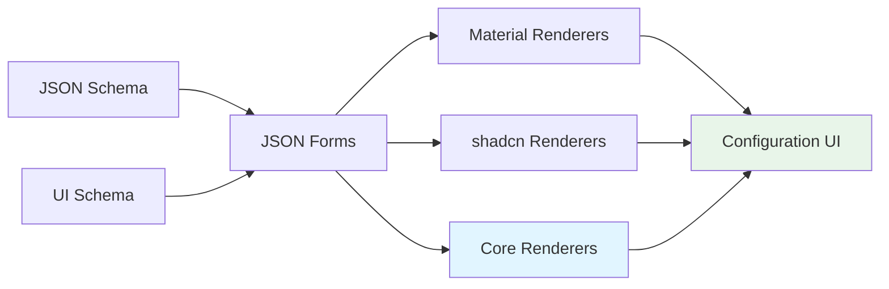

# JSON Forms Renderers

The renderers system in ORMI-CORE V1 extends JSON Forms with custom UI components for widget and datasource configuration.

## Overview

V1 uses three renderer sets:

1. **Material Renderers** - Default Material-UI components from `@jsonforms/material-renderers`
2. **shadcn Renderers** - Custom shadcn/ui components from `@workspace/ormi-jsonforms`
3. **Core Renderers** - ORMI-specific renderers from `@workspace/ormi-core`



## Core Renderers

Located in `/packages/ormi-core/src/renderers/`, these provide ORMI-specific functionality.

### coreRenderer Export

```typescript
import { JsonFormsRendererRegistryEntry } from "@jsonforms/core";
import TopicSelectRenderer, {
	topicSelectTester,
} from "./topic-select-renderer";

export const coreRenderer: JsonFormsRendererRegistryEntry[] = [
	{ tester: topicSelectTester, renderer: TopicSelectRenderer },
];
```

### TopicSelectRenderer

The primary custom renderer for selecting datasource topics.

**Purpose:** Provides UI for selecting topics from connected datasources with optional property extraction.

**UI Schema Element:**

```typescript
{
    type: 'TopicSelect',
    scope: '#/properties/datasource',
    options: {
        dataRequirements?: {
            accepts: ['number', 'Vector3', 'IMU']  // Filter compatible topics
        }
    }
}
```

**Features:**

- Topic browser with datasource grouping
- Type filtering via `dataRequirements`
- Property extraction (dot notation)
- Buffer size configuration
- Type display (webapp type + raw type)
- Validation

**Result:**

Returns a `SelectedTopic` object:

```typescript
{
    topic: '/motor/temp',
    datasource_id: 'ros-1',
    source: 'ros',
    type: 'number',          // Webapp type
    rawType: 'std_msgs/Float64',
    property: 'data',        // Optional extraction
    bufferSize: 100          // Optional buffer override
}
```

**Example in Widget Schema:**

```typescript
const widgetSchema = {
	type: "object",
	properties: {
		datasource: {
			type: "object",
			title: "Data Source",
		},
	},
};

const widgetUISchema = {
	type: "VerticalLayout",
	elements: [
		{
			type: "TopicSelect",
			scope: "#/properties/datasource",
			options: {
				dataRequirements: {
					accepts: ["number", "float", "int"],
				},
			},
		},
	],
};
```

## shadcn Renderers

Located in `/packages/ormi-jsonforms/src/`, these provide shadcn/ui-styled controls and layouts.

### Available Controls

**Simple Inputs:**

- `ShadcnTextControl` - Text input
- `ShadcnNumberControl` - Number input
- `ShadcnIntegerControl` - Integer input
- `ShadcnBooleanControl` - Checkbox
- `ShadcnBooleanToggleControl` - Toggle switch
- `ShadcnSliderControl` - Slider
- `ShadcnDateControl` - Date picker
- `ShadcnTimeControl` - Time picker
- `ShadcnDateTimeControl` - DateTime picker
- `ShadcnColorControl` - Color picker

**Selection:**

- `ShadcnEnumControl` - Dropdown select
- `ShadcnRadioGroupControl` - Radio buttons
- `ShadcnOneOfEnumControl` - OneOf dropdown
- `ShadcnOneOfRadioGroupControl` - OneOf radio

**Complex:**

- `ShadcnArrayControlRenderer` - Table-based array editor
- `AsyncSelectControl` - Async-loaded dropdown
- `KeySelectorControl` - Keyboard key selector
- `axisSelectorControl` - Gamepad axis selector

### Layouts

**Basic:**

- `ShadcnVerticalLayoutRenderer` - Vertical stacking
- `ShadcnHorizontalLayoutRenderer` - Horizontal arrangement
- `ShadcnGroupLayoutRenderer` - Grouped section
- `ShadcnArrayLayoutRenderer` - Array items layout

**Advanced:**

- `ShadcnCategorizationLayout` - Tabbed categories
- `ShadcnCategorizationStepperLayout` - Wizard stepper
- `ShadcnOneOfLayoutRenderer` - OneOf switcher

### Cells (Table Rendering)

Used inside `ShadcnArrayControlRenderer` for table cells:

- `ShadcnTextCell`
- `ShadcnNumberCell`
- `ShadcnIntegerCell`
- `ShadcnBooleanCell`
- `ShadcnDateCell`
- `ShadcnEnumCell`
- `ShadcnColorCell`

## Using Renderers

### In Widget Configuration

```typescript
import { JsonForms } from '@jsonforms/react';
import { materialRenderers, materialCells } from '@jsonforms/material-renderers';
import { shadcnRenderer, shadcnCells } from '@workspace/ormi-jsonforms';
import { coreRenderer } from '@workspace/ormi-core/renderers';

function WidgetConfigurationDialog() {
    const renderers = [
        ...materialRenderers,
        ...shadcnRenderer,
        ...coreRenderer
    ];

    const cells = [
        ...materialCells,
        ...shadcnCells
    ];

    return (
        <JsonForms
            schema={widgetSchema}
            uischema={widgetUISchema}
            data={settings}
            renderers={renderers}
            cells={cells}
            onChange={({ data, errors }) => {
                setSettings(data);
                setErrors(errors);
            }}
        />
    );
}
```

**Renderer Priority:**

JSON Forms uses a "tester" system with priority rankings:

1. **Core Renderers** (priority 10) - Highest, matches first
2. **shadcn Renderers** (various priorities)
3. **Material Renderers** (default fallback)

If no custom renderer matches, Material-UI renderer is used.

### Common UI Schema Patterns

**Simple Form:**

```typescript
{
    type: 'VerticalLayout',
    elements: [
        {
            type: 'Control',
            scope: '#/properties/title'
        },
        {
            type: 'Control',
            scope: '#/properties/value'
        }
    ]
}
```

**Grouped Sections:**

```typescript
{
    type: 'VerticalLayout',
    elements: [
        {
            type: 'Group',
            label: 'Basic Settings',
            elements: [
                { type: 'Control', scope: '#/properties/title' }
            ]
        },
        {
            type: 'Group',
            label: 'Advanced Settings',
            elements: [
                { type: 'Control', scope: '#/properties/threshold' }
            ]
        }
    ]
}
```

**Tabbed Categories:**

```typescript
{
    type: 'Categorization',
    elements: [
        {
            type: 'Category',
            label: 'General',
            elements: [
                { type: 'Control', scope: '#/properties/title' }
            ]
        },
        {
            type: 'Category',
            label: 'Display',
            elements: [
                { type: 'Control', scope: '#/properties/color' }
            ]
        }
    ]
}
```

**Conditional Display:**

```typescript
{
    type: 'Control',
    scope: '#/properties/advancedOption',
    rule: {
        effect: 'SHOW',
        condition: {
            scope: '#/properties/mode',
            schema: { const: 'advanced' }
        }
    }
}
```

## Custom Renderer Development

### Creating a Custom Renderer

```typescript
import { withJsonFormsControlProps } from '@jsonforms/react';
import { ControlProps, rankWith, isControl, and, schemaTypeIs } from '@jsonforms/core';

const MyCustomRenderer = (props: ControlProps) => {
    const { data, handleChange, path, label } = props;

    return (
        <div>
            <label>{label}</label>
            <input
                value={data || ''}
                onChange={(e) => handleChange(path, e.target.value)}
            />
        </div>
    );
};

export default withJsonFormsControlProps(MyCustomRenderer);

// Tester defines when this renderer should be used
export const myCustomTester = rankWith(
    5, // Priority (higher = preferred)
    and(
        isControl,
        schemaTypeIs('string')
    )
);
```

### Registering Custom Renderer

```typescript
const customRenderers: JsonFormsRendererRegistryEntry[] = [
    { tester: myCustomTester, renderer: MyCustomRenderer }
];

<JsonForms
    renderers={[
        ...customRenderers,
        ...materialRenderers,
        ...shadcnRenderer,
        ...coreRenderer
    ]}
    // ...
/>
```

## Best Practices

### 1. Use Appropriate Layouts

Match layout to content structure:

```typescript
// ✅ GOOD - Clear hierarchy
{
    type: 'VerticalLayout',
    elements: [
        {
            type: 'Group',
            label: 'Connection',
            elements: [/* connection fields */]
        },
        {
            type: 'Group',
            label: 'Display',
            elements: [/* display fields */]
        }
    ]
}

// ❌ BAD - Flat structure
{
    type: 'VerticalLayout',
    elements: [
        { type: 'Control', scope: '#/properties/url' },
        { type: 'Control', scope: '#/properties/color' },
        { type: 'Control', scope: '#/properties/port' }
    ]
}
```

### 2. Include Core Renderers

Always include `coreRenderer` for TopicSelect:

```typescript
const renderers = [
	...materialRenderers,
	...shadcnRenderer,
	...coreRenderer, // Required for TopicSelect
];
```

### 3. Specify dataRequirements

Filter topics to compatible types:

```typescript
{
    type: 'TopicSelect',
    scope: '#/properties/datasource',
    options: {
        dataRequirements: {
            accepts: ['number', 'float']  // Only numeric topics
        }
    }
}
```

### 4. Use Proper Labels

Provide clear, descriptive labels:

```typescript
// ✅ GOOD
schema: {
    properties: {
        reconnectInterval: {
            type: 'number',
            title: 'Reconnection Interval (seconds)'
        }
    }
}

// ❌ BAD
schema: {
    properties: {
        reconnectInterval: {
            type: 'number',
            title: 'Interval'
        }
    }
}
```

## Troubleshooting

### Renderer Not Applied

**Cause:** Tester not matching or priority too low

**Solution:**

```typescript
// Check tester
console.log("Schema type:", schema.type);
console.log("UI type:", uischema.type);

// Increase priority
const myTester = rankWith(
	15, // Higher than default (10)
	and(isControl, schemaTypeIs("string")),
);
```

### TopicSelect Not Showing

**Cause:** `coreRenderer` not included

**Solution:**

```typescript
import { coreRenderer } from "@workspace/ormi-core/renderers";

const renderers = [
	...coreRenderer, // Add this
	...shadcnRenderer,
	...materialRenderers,
];
```

### Styling Issues

**Cause:** Missing shadcn/ui CSS or theme

**Solution:**

```typescript
// Ensure theme provider wraps JsonForms
import { ThemeProvider } from '@workspace/ui/components/theme-provider';

<ThemeProvider>
    <JsonForms renderers={renderers} {...props} />
</ThemeProvider>
```

## Summary

The V1 renderers system provides:

- **TopicSelectRenderer** - Core renderer for datasource topic selection
- **shadcn Renderers** - Comprehensive shadcn/ui-styled controls and layouts
- **Material Renderers** - Fallback default renderers
- **Extensibility** - Easy to add custom renderers
- **Priority System** - Control which renderer is used via testers

**Key Components:**

- `coreRenderer` - TopicSelectRenderer export
- `shadcnRenderer` - shadcn/ui controls and layouts
- `shadcnCells` - Table cell renderers
- `materialRenderers` - Fallback renderers

This system enables rich, type-safe configuration UIs for widgets and datasources while maintaining flexibility for custom needs.
