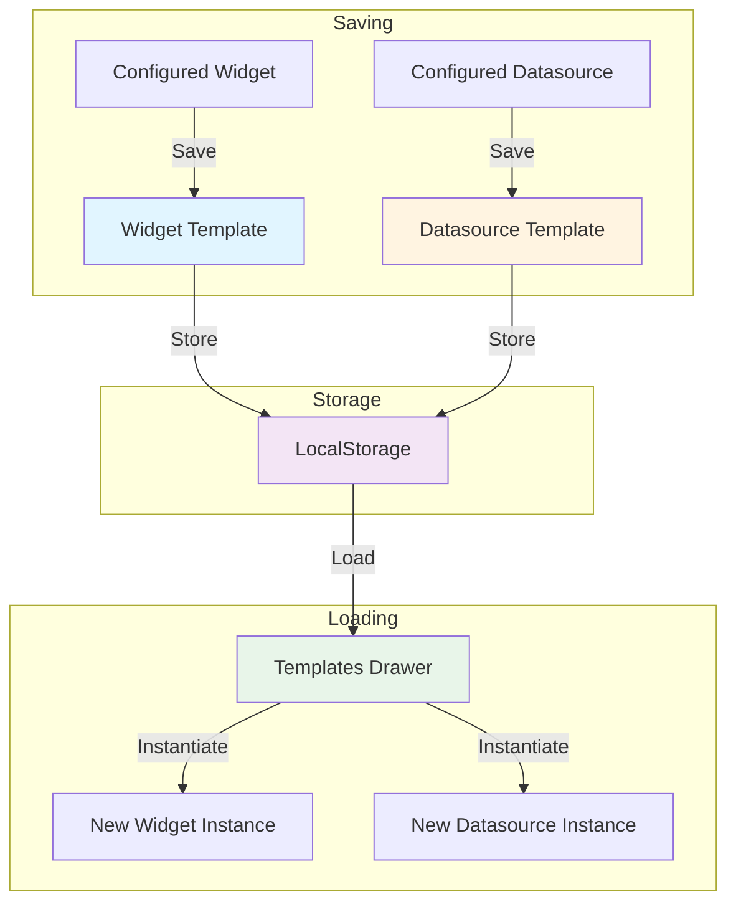

# Templates System

The templates system in ORMI-CORE V1 provides a way to save, organize, and reuse configured widgets and datasources. Templates enable users to build a library of pre-configured components that can be quickly instantiated.

## Overview

### Core Concepts

Templates are saved configurations that capture:

1. **Widget Templates** - Widget definition + user settings
2. **Datasource Templates** - Datasource definition + connection settings
3. **Metadata** - Name, tags, public/private visibility, ownership



### Key Features

- **Reusability** - Configure once, reuse many times
- **Organization** - Tag and categorize templates
- **Sharing** - Mark templates as public (future: server sync)
- **Search & Filter** - Find templates by name or tags
- **Persistence** - Saved to localStorage (future: database)

## Core Interfaces

### TemplateType

Discriminator for template types:

```typescript
type TemplateType = "widget" | "datasource";
```

### BaseTemplate

Common properties for all templates:

```typescript
interface BaseTemplate {
    name: string; // User-assigned name
    public: boolean; // Visibility (future: sharing)
    tags: string[]; // Organization/search tags
    yours: boolean; // Ownership flag
    type: TemplateType; // Discriminator
}
```

### WidgetTemplate

Saves a configured widget:

```typescript
interface WidgetTemplate extends BaseTemplate {
    type: "widget";
    widget: Widget; // Complete widget instance
}
```

**Example:**

```typescript
const widgetTemplate: WidgetTemplate = {
    name: "Motor Temperature Gauge",
    type: "widget",
    public: false,
    tags: ["motor", "temperature", "monitoring"],
    yours: true,
    widget: {
        widget_id: "gauge-widget",
        box_id: "", // Empty for templates
        title: "Motor Temperature",
        settings: {
            title: "Motor Temperature",
            datasource: {
                topic: "/motor/temp",
                datasource_id: "ros-1",
                type: "number",
                property: "temperature",
            },
            min: 0,
            max: 150,
            unit: "°C",
        },
    },
};
```

### DatasourceTemplate

Saves a configured datasource:

```typescript
interface DatasourceTemplate extends BaseTemplate {
    type: "datasource";
    datasource: Datasource; // Complete datasource instance
}
```

**Example:**

```typescript
const datasourceTemplate: DatasourceTemplate = {
    name: "Local ROS2 Bridge",
    type: "datasource",
    public: false,
    tags: ["ros2", "local", "development"],
    yours: true,
    datasource: {
        datasource_id: "rosbridge-suite",
        title: "Local ROS2",
        settings: {
            id: "local-ros2",
            title: "Local ROS2",
            enable: true,
            url: "ws://localhost:9090",
        },
    },
};
```

### Template Union

Type-safe union of all template types:

```typescript
type Template = WidgetTemplate | DatasourceTemplate;
```

## TemplatesProvider

React context provider that manages template lifecycle.

### Provider Props

```typescript
interface TemplatesProviderProps {
    children: React.ReactNode;

    // Persistence callbacks
    addTemplate: (template: Template) => Promise<string>;
    removeTemplate: (template_id: string) => Promise<boolean>;
    updateTemplate: (
        template_id: string,
        updatedTemplate: Template
    ) => Promise<boolean>;
    onLoad: () => Promise<Map<string, Template>>;
}
```

### Context Interface

```typescript
interface TemplatesProviderContextInterface {
    templates: Map<string, Template>;

    // Template management
    addTemplate: (template: Template, key?: string) => void;
    removeTemplate: (id: string) => void;
    updateTemplate: (id: string, updatedTemplate: Template) => void;

    // Filtering utilities
    getTemplatesByType: (type: TemplateType) => Map<string, Template>;
    getWidgetTemplates: () => Map<string, WidgetTemplate>;
    getDatasourceTemplates: () => Map<string, DatasourceTemplate>;
}
```

### Provider Setup

```typescript
import { TemplatesProvider } from '@workspace/ormi-core/templates';

function App() {
    const handleAddTemplate = async (template: Template): Promise<string> => {
        const template_id = `template_${Date.now()}`;
        // Save to database/localStorage
        return template_id;
    };

    const handleRemoveTemplate = async (template_id: string): Promise<boolean> => {
        // Remove from database/localStorage
        return true;
    };

    const handleUpdateTemplate = async (
        template_id: string,
        updatedTemplate: Template
    ): Promise<boolean> => {
        // Update in database/localStorage
        return true;
    };

    const handleLoad = async (): Promise<Map<string, Template>> => {
        // Load from database/localStorage
        return new Map<string, Template>();
    };

    return (
        <TemplatesProvider
            addTemplate={handleAddTemplate}
            removeTemplate={handleRemoveTemplate}
            updateTemplate={handleUpdateTemplate}
            onLoad={handleLoad}
        >
            {/* App content */}
        </TemplatesProvider>
    );
}
```

### useTemplates Hook

Access templates context:

```typescript
import { useTemplates } from "@workspace/ormi-core/templates";

function MyComponent() {
    const {
        templates,
        addTemplate,
        removeTemplate,
        updateTemplate,
        getWidgetTemplates,
        getDatasourceTemplates,
    } = useTemplates();

    // Use templates...
}
```

## Persistence

### LocalStorage Implementation

Default persistence uses browser localStorage:

```typescript
// templates-localstorage.tsx
export const temphandleLoad = (): Map<string, Template> => {
    const templates = localStorage.getItem("ormi_templates");

    if (!templates) {
        return new Map<string, Template>();
    }

    // Parse JSON object and convert to Map
    return new Map(Object.entries(JSON.parse(templates)));
};

export const temphandleSave = (templates: Map<string, Template>) => {
    // Convert Map to object for JSON serialization
    const obj = Object.fromEntries(templates);
    localStorage.setItem("ormi_templates", JSON.stringify(obj));
};
```

**Usage:**

```typescript
import { temphandleLoad, temphandleSave } from '@workspace/ormi-core/templates';

<TemplatesProvider
    onLoad={async () => temphandleLoad()}
    addTemplate={async (template) => {
        const templates = temphandleLoad();
        const template_id = `template_${Date.now()}`;
        templates.set(template_id, template);
        temphandleSave(templates);
        return template_id;
    }}
    removeTemplate={async (template_id) => {
        const templates = temphandleLoad();
        templates.delete(template_id);
        temphandleSave(templates);
        return true;
    }}
    updateTemplate={async (template_id, updatedTemplate) => {
        const templates = temphandleLoad();
        templates.set(template_id, updatedTemplate);
        temphandleSave(templates);
        return true;
    }}
>
    {children}
</TemplatesProvider>
```

### Database Implementation (Future)

For server persistence, implement the same interface:

```typescript
const handleAddTemplate = async (template: Template): Promise<string> => {
    const response = await fetch("/api/templates", {
        method: "POST",
        body: JSON.stringify(template),
    });
    const { id } = await response.json();
    return id;
};

const handleRemoveTemplate = async (template_id: string): Promise<boolean> => {
    const response = await fetch(`/api/templates/${template_id}`, {
        method: "DELETE",
    });
    return response.ok;
};

const handleUpdateTemplate = async (
    template_id: string,
    updatedTemplate: Template
): Promise<boolean> => {
    const response = await fetch(`/api/templates/${template_id}`, {
        method: "PUT",
        body: JSON.stringify(updatedTemplate),
    });
    return response.ok;
};

const handleLoad = async (): Promise<Map<string, Template>> => {
    const response = await fetch("/api/templates");
    const templates = await response.json();
    return new Map(Object.entries(templates));
};
```

## Saving Templates

### Save Widget Template

Widgets can be saved from the configuration dialog:

```typescript
// In WidgetCard component
import { AddToTemplatesBtn } from '@workspace/ormi-core/templates';

<AddToTemplatesBtn
    widget={widgetDef}
    data={settings}
/>
```

**AddToTemplatesBtn Component:**

```typescript
export function AddToTemplatesBtn(props: {
    widget: WidgetDefinition,
    data: any
}) {
    const { addTemplate } = useTemplates();

    const handleSaveTemplate = () => {
        const widget: Widget = {
            widget_id: props.widget.id,
            box_id: '',  // Empty for templates
            title: props.widget.name,
            settings: props.data,
        };

        const template: WidgetTemplate = {
            name: props.widget.name,
            type: 'widget',
            widget: widget,
            public: false,
            tags: [],
            yours: true
        };

        addTemplate(template);
    };

    return (
        <Dialog>
            <DialogTrigger asChild>
                <Button variant="ghost">
                    Save to templates <BookTemplateIcon />
                </Button>
            </DialogTrigger>
            <DialogContent>
                <DialogHeader>
                    <DialogTitle>Save to Templates</DialogTitle>
                    <DialogDescription>
                        Are you sure you want to save this to your templates?
                    </DialogDescription>
                </DialogHeader>
                <DialogFooter>
                    <Button onClick={handleSaveTemplate}>
                        Save
                    </Button>
                </DialogFooter>
            </DialogContent>
        </Dialog>
    );
}
```

### Save Datasource Template

Similar pattern for datasources:

```typescript
import { AddDatasourceToTemplatesBtn } from '@workspace/ormi-core/templates';

<AddDatasourceToTemplatesBtn
    datasource={datasourceDef}
    settings={datasourceSettings}
/>
```

**Implementation:**

```typescript
export function AddDatasourceToTemplatesBtn(props: {
    datasource: DatasourceDefinition;
    settings: DatasourceProviderSettings;
}) {
    const { addTemplate } = useTemplates();

    const handleSave = () => {
        const datasource: Datasource = {
            datasource_id: props.datasource.id,
            title: props.settings.title,
            settings: props.settings,
        };

        const template: DatasourceTemplate = {
            name: props.settings.title,
            type: "datasource",
            datasource: datasource,
            public: false,
            tags: [],
            yours: true,
        };

        addTemplate(template);
    };

    // Similar UI to AddToTemplatesBtn
}
```

## Templates Drawer

Main UI for browsing and managing templates.

### Component Props

```typescript
interface WidgetTemplateDrawerProps {
    templates: Map<string, Template>;
    removeTemplate: (id: string) => void;
    addWidget: (widget: WidgetDefinition, settings: object) => void;
    addDatasource?: (
        datasource_id: string,
        settings: DatasourceProviderSettings
    ) => void;
    updateTemplate?: (id: string, updatedTemplate: Template) => void;
}
```

### Features

1. **Search** - Filter templates by name
2. **Tag Filtering** - Filter by tags (multiple selection)
3. **Categorization** - Separate "Your" and "Public" templates
4. **Tabs** - Switch between widgets and datasources
5. **Accordion** - Collapsible sections
6. **Actions** - Add, remove, edit templates

### Usage

```typescript
import { WidgetTemplateDrawer } from '@workspace/ormi-core/templates';
import { useTemplates } from '@workspace/ormi-core/templates';
import { useDashboardManager } from '@workspace/ormi-core/dashboard';

function Dashboard() {
    const { templates, removeTemplate, updateTemplate } = useTemplates();
    const { addWidget, addDatasource } = useDashboardManager();

    return (
        <div>
            <WidgetTemplateDrawer
                templates={templates}
                removeTemplate={removeTemplate}
                updateTemplate={updateTemplate}
                addWidget={addWidget}
                addDatasource={addDatasource}
            />
        </div>
    );
}
```

### Search and Filtering

```typescript
const [searchQuery, setSearchQuery] = useState("");
const [selectedTags, setSelectedTags] = useState<string[]>([]);

// Get all unique tags
const allTags = useMemo(() => {
    const tags = new Set<string>();
    Array.from(templates.values()).forEach((template) => {
        template.tags?.forEach((tag) => tags.add(tag));
    });
    return Array.from(tags).sort();
}, [templates]);

// Filter templates
const filteredTemplates = useMemo(() => {
    return Array.from(templates.entries()).filter(([key, template]) => {
        // Search filter
        const matchesSearch =
            searchQuery === "" ||
            template.name.toLowerCase().includes(searchQuery.toLowerCase());

        // Tag filter
        const matchesTags =
            selectedTags.length === 0 ||
            selectedTags.every((tag) => template.tags?.includes(tag));

        return matchesSearch && matchesTags;
    });
}, [templates, searchQuery, selectedTags]);
```

### Categorization

Templates are separated by type and ownership:

```typescript
// Your widget templates
const yourWidgetTemplates = filteredTemplates
    .filter(([key, template]) => template.type === "widget" && template.yours)
    .reduce((acc, [key, template]) => {
        acc.set(key, template as WidgetTemplate);
        return acc;
    }, new Map<string, WidgetTemplate>());

// Public widget templates
const publicWidgetTemplates = filteredTemplates
    .filter(([key, template]) => template.type === "widget" && !template.yours)
    .reduce((acc, [key, template]) => {
        acc.set(key, template as WidgetTemplate);
        return acc;
    }, new Map<string, WidgetTemplate>());

// Similar for datasources...
```

### UI Structure

```tsx
<Sheet>
    <SheetTrigger asChild>
        <Button variant="ghost">Templates</Button>
    </SheetTrigger>
    <SheetContent className="w-[50%] min-w-[300px]">
        <SheetHeader>
            <SheetTitle>Saved widgets</SheetTitle>
        </SheetHeader>

        {/* Search Box */}
        <Input
            placeholder="Search templates..."
            value={searchQuery}
            onChange={(e) => setSearchQuery(e.target.value)}
        />

        {/* Tag Filter */}
        <div className="flex flex-wrap gap-2">
            {allTags.map((tag) => (
                <Badge
                    variant={selectedTags.includes(tag) ? "default" : "outline"}
                    onClick={() => handleTagToggle(tag)}
                >
                    {tag}
                </Badge>
            ))}
        </div>

        {/* Tabs */}
        <Tabs defaultValue="widgets">
            <TabsList>
                <TabsTrigger value="widgets">Widgets</TabsTrigger>
                <TabsTrigger value="datasources">Datasources</TabsTrigger>
            </TabsList>

            <TabsContent value="widgets">
                <Accordion type="single" defaultValue="user-widgets">
                    <AccordionItem value="user-widgets">
                        <AccordionTrigger>
                            Your widget templates ({yourWidgetTemplates.size})
                        </AccordionTrigger>
                        <AccordionContent>
                            {Array.from(yourWidgetTemplates.entries()).map(
                                ([key, template]) => (
                                    <TemplateComponent
                                        key={key}
                                        templateId={key}
                                        template={template}
                                        {...actions}
                                    />
                                )
                            )}
                        </AccordionContent>
                    </AccordionItem>

                    <AccordionItem value="public-widgets">
                        <AccordionTrigger>
                            Public widget templates (
                            {publicWidgetTemplates.size})
                        </AccordionTrigger>
                        <AccordionContent>
                            {/* Public templates */}
                        </AccordionContent>
                    </AccordionItem>
                </Accordion>
            </TabsContent>

            <TabsContent value="datasources">
                {/* Similar structure for datasources */}
            </TabsContent>
        </Tabs>
    </SheetContent>
</Sheet>
```

## Template Components

### TemplateComponent (Widget)

Displays a widget template with actions:

```typescript
interface TemplateProps {
    template: WidgetTemplate;
    templateId: string;
    removeTemplate: (id: string) => void;
    addWidget: (widget: WidgetDefinition, settings: object) => void;
    availableWidgets: WidgetDefinition[];
    updateTemplate?: (id: string, updatedTemplate: WidgetTemplate) => void;
}

export const TemplateComponent = (props: TemplateProps) => {
    const { template, templateId, availableWidgets } = props;
    const [optionsOpen, setOptionsOpen] = useState(false);
    const [editedTemplate, setEditedTemplate] = useState<WidgetTemplate>({
        ...template
    });

    const handleAdd = () => {
        // Find widget definition
        const definition = availableWidgets.find(
            w => w.id === template.widget.widget_id
        );

        if (!definition) {
            toast("Widget unavailable: " + template.widget.widget_id);
            return;
        }

        // Add widget to dashboard
        props.addWidget(definition, template.widget.settings);
    };

    return (
        <div className="flex items-center justify-between p-2 border-b">
            <div className="flex gap-2">
                {template.name}
                {template.public && <Badge variant="secondary">Public</Badge>}
            </div>
            <div className="flex gap-2">
                {/* Settings button (only for your templates) */}
                {template.yours && (
                    <Dialog open={optionsOpen} onOpenChange={setOptionsOpen}>
                        <DialogTrigger asChild>
                            <Button variant="ghost" size="sm">
                                <SettingsIcon />
                            </Button>
                        </DialogTrigger>
                        <DialogContent>
                            {/* Edit name, public, tags */}
                        </DialogContent>
                    </Dialog>
                )}

                {/* Delete button (only for your templates) */}
                {template.yours && (
                    <ActionDialog
                        title="Remove template"
                        message="Are you certain?"
                        actions={[
                            { title: <XIcon />, action: () => {} },
                            {
                                title: <CheckIcon />,
                                action: () => props.removeTemplate(templateId)
                            }
                        ]}
                        trigger={<Button variant="destructive"><TrashIcon /></Button>}
                    />
                )}

                {/* Add button (all templates) */}
                <Button variant="outline" onClick={handleAdd}>
                    <PlusIcon />
                </Button>
            </div>
        </div>
    );
};
```

### DatasourceTemplateComponent

Similar to TemplateComponent but for datasources:

```typescript
interface DatasourceTemplateProps {
    template: DatasourceTemplate;
    templateId: string;
    removeTemplate: (id: string) => void;
    addDatasource: (
        datasource_id: string,
        settings: DatasourceProviderSettings
    ) => void;
    availableDatasources: DatasourceDefinition[];
    updateTemplate?: (id: string, updatedTemplate: DatasourceTemplate) => void;
}

export const DatasourceTemplateComponent = (props: DatasourceTemplateProps) => {
    // Similar structure to TemplateComponent

    const handleAdd = () => {
        const definition = availableDatasources.find(
            (d) => d.id === template.datasource.datasource_id
        );

        if (!definition) {
            toast(
                "Datasource unavailable: " + template.datasource.datasource_id
            );
            return;
        }

        props.addDatasource(definition.id, template.datasource.settings);
    };

    // Similar UI...
};
```

## Template Management

### Editing Template Metadata

Users can edit template properties:

```typescript
const [editedTemplate, setEditedTemplate] = useState<WidgetTemplate>({
    ...template,
});
const [newTag, setNewTag] = useState("");

const handleSaveOptions = () => {
    if (props.updateTemplate) {
        props.updateTemplate(templateId, editedTemplate);
        toast("Template updated successfully");
    }
    setOptionsOpen(false);
};

const addTag = () => {
    if (newTag.trim() && !editedTemplate.tags.includes(newTag.trim())) {
        setEditedTemplate((prev) => ({
            ...prev,
            tags: [...prev.tags, newTag.trim()],
        }));
        setNewTag("");
    }
};

const removeTag = (tagToRemove: string) => {
    setEditedTemplate((prev) => ({
        ...prev,
        tags: prev.tags.filter((tag) => tag !== tagToRemove),
    }));
};
```

**Edit Dialog:**

```tsx
<DialogContent className="max-w-md">
    <DialogHeader>
        <DialogTitle>Template Options</DialogTitle>
    </DialogHeader>

    <div className="space-y-4">
        {/* Name */}
        <div>
            <Label htmlFor="template-name">Template Name</Label>
            <Input
                id="template-name"
                value={editedTemplate.name}
                onChange={(e) =>
                    setEditedTemplate((prev) => ({
                        ...prev,
                        name: e.target.value,
                    }))
                }
            />
        </div>

        {/* Public Toggle */}
        <div className="flex items-center space-x-2">
            <Switch
                id="public-toggle"
                checked={editedTemplate.public}
                onCheckedChange={(checked) =>
                    setEditedTemplate((prev) => ({
                        ...prev,
                        public: checked,
                    }))
                }
            />
            <Label htmlFor="public-toggle">Make template public</Label>
        </div>

        {/* Tags */}
        <div>
            <Label>Tags</Label>
            <div className="flex gap-2 mb-2 flex-wrap">
                {editedTemplate.tags.map((tag) => (
                    <Badge
                        key={tag}
                        variant="outline"
                        className="cursor-pointer"
                        onClick={() => removeTag(tag)}
                    >
                        {tag} <XIcon className="h-3 w-3 ml-1" />
                    </Badge>
                ))}
            </div>
            <div className="flex gap-2">
                <Input
                    placeholder="Add tag"
                    value={newTag}
                    onChange={(e) => setNewTag(e.target.value)}
                    onKeyPress={(e) => e.key === "Enter" && addTag()}
                />
                <Button type="button" variant="outline" onClick={addTag}>
                    Add
                </Button>
            </div>
        </div>
    </div>

    <DialogFooter>
        <Button variant="outline" onClick={() => setOptionsOpen(false)}>
            Cancel
        </Button>
        <Button onClick={handleSaveOptions}>Save Changes</Button>
    </DialogFooter>
</DialogContent>
```

### Validation

Check for missing widget/datasource definitions:

```typescript
if (!template.widget || !template.widget.settings) {
    return (
        <div>
            <p className="text-red-500">Invalid template data</p>
            <Button
                variant="destructive"
                onClick={() => props.removeTemplate(templateId)}
            >
                Remove Template
            </Button>
            <p className="text-sm text-gray-500">
                This template is missing widget settings or widget definition.
            </p>
        </div>
    );
}
```

### Pre-fetching Definitions

Avoid hooks in event handlers by pre-fetching:

```typescript
// At component level (not in event handler)
const pluginsManager = usePluginsManager();
const availableWidgets = pluginsManager.applyFilter<WidgetDefinition[]>(
    PluginsHooks.WIDGETS_LIST,
    []
);

// In event handler
const handleAdd = () => {
    const definition = availableWidgets.find(
        (w) => w.id === template.widget.widget_id
    );
    // Use definition...
};
```

## Common Patterns

### Pattern 1: Template with Tags

```typescript
const template: WidgetTemplate = {
    name: "IMU Visualization",
    type: "widget",
    public: false,
    tags: ["imu", "sensors", "visualization", "3d"],
    yours: true,
    widget: {
        widget_id: "imu-visualizer",
        box_id: "",
        title: "IMU Data",
        settings: {
            /* ... */
        },
    },
};
```

**Benefits:**

- Easy to search: "imu" or "sensors"
- Easy to filter by category
- Easy to organize collections

### Pattern 2: Public Template (Future)

```typescript
const template: WidgetTemplate = {
    name: "Standard Temperature Gauge",
    type: "widget",
    public: true, // Shareable
    tags: ["community", "standard", "temperature"],
    yours: false, // From another user
    widget: {
        /* ... */
    },
};
```

**Use Cases:**

- Community-shared templates
- Organization-wide standards
- Plugin-provided templates

### Pattern 3: Template Collection

```typescript
const motorTemplates: WidgetTemplate[] = [
    {
        name: "Motor Speed",
        tags: ["motor", "speed", "rpm"],
        // ...
    },
    {
        name: "Motor Temperature",
        tags: ["motor", "temperature", "monitoring"],
        // ...
    },
    {
        name: "Motor Current",
        tags: ["motor", "current", "power"],
        // ...
    },
];

motorTemplates.forEach((template) => addTemplate(template));
```

### Pattern 4: Template from Existing Widget

```typescript
function Dashboard() {
    const { widgets } = useDashboardManager();
    const { addTemplate } = useTemplates();

    const saveWidgetAsTemplate = (box_id: string, name: string) => {
        const widget = widgets.get(box_id);
        if (!widget) return;

        const template: WidgetTemplate = {
            name: name,
            type: "widget",
            public: false,
            tags: [],
            yours: true,
            widget: {
                ...widget,
                box_id: "", // Clear box_id for templates
            },
        };

        addTemplate(template);
    };

    // Usage in dashboard UI
}
```

### Pattern 5: Bulk Import/Export

```typescript
// Export all templates
const exportTemplates = () => {
    const templates = useTemplates().templates;
    const json = JSON.stringify(Object.fromEntries(templates));

    // Download as file
    const blob = new Blob([json], { type: "application/json" });
    const url = URL.createObjectURL(blob);
    const a = document.createElement("a");
    a.href = url;
    a.download = "ormi-templates.json";
    a.click();
};

// Import templates
const importTemplates = async (file: File) => {
    const text = await file.text();
    const imported = JSON.parse(text);

    const { addTemplate } = useTemplates();

    for (const [key, template] of Object.entries(imported)) {
        await addTemplate(template as Template);
    }
};
```

## Integration with Dashboard

### Navbar Integration

Add templates button to navbar:

```typescript
import { useNavbar } from '@workspace/ui/combined/navbar';
import { WidgetTemplateDrawer } from '@workspace/ormi-core/templates';

function Dashboard() {
    const { setNavbarItem } = useNavbar();
    const { templates, removeTemplate, updateTemplate } = useTemplates();
    const { addWidget, addDatasource } = useDashboardManager();

    useEffect(() => {
        setNavbarItem(
            "center",
            "templates",
            <WidgetTemplateDrawer
                templates={templates}
                removeTemplate={removeTemplate}
                updateTemplate={updateTemplate}
                addWidget={addWidget}
                addDatasource={addDatasource}
            />
        );

        return () => removeNavbarItem("center", "templates");
    }, [templates]);
}
```

### Auto-save on Widget Configuration

Save templates automatically when widgets are configured:

```typescript
function WidgetCard(props: WidgetCardProps) {
    const { addTemplate } = useTemplates();
    const [autoSave, setAutoSave] = useState(false);

    const handleValidate = () => {
        // Validate and add widget
        props.onValidate(props.definition, data);

        // Auto-save if enabled
        if (autoSave) {
            const template: WidgetTemplate = {
                name: data.title || props.definition.name,
                type: 'widget',
                public: false,
                tags: [],
                yours: true,
                widget: {
                    widget_id: props.definition.id,
                    box_id: '',
                    title: data.title,
                    settings: data
                }
            };

            addTemplate(template);
        }
    };

    return (
        <Dialog>
            {/* Configuration form */}

            <div className="flex items-center gap-2">
                <Checkbox
                    checked={autoSave}
                    onCheckedChange={setAutoSave}
                />
                <Label>Save as template</Label>
            </div>

            <Button onClick={handleValidate}>Add Widget</Button>
        </Dialog>
    );
}
```

## Best Practices

### 1. Use Descriptive Names

Make templates easy to identify:

```typescript
// ✅ GOOD
name: "Motor Temperature Gauge (0-150°C)";
name: "Local ROS2 Bridge (9090)";
name: "3D Pose Visualization (IMU + GPS)";

// ❌ BAD
name: "Widget 1";
name: "Datasource";
name: "Temp";
```

### 2. Add Relevant Tags

Enable effective filtering:

```typescript
// ✅ GOOD
tags: ["motor", "temperature", "monitoring", "critical"];
tags: ["ros2", "local", "development", "websocket"];

// ❌ BAD
tags: [];
tags: ["misc", "other"];
```

### 3. Validate Before Saving

Check for completeness:

```typescript
const saveTemplate = (widget: Widget) => {
    // Validate widget has required fields
    if (!widget.widget_id || !widget.settings) {
        toast("Cannot save incomplete widget");
        return;
    }

    // Check if datasource topic is selected
    if (widget.settings.datasource && !widget.settings.datasource.topic) {
        toast("Widget has no data source selected");
        return;
    }

    // Save template
    addTemplate(/* ... */);
};
```

### 4. Clear box_id for Templates

Templates shouldn't have instance-specific IDs:

```typescript
const template: WidgetTemplate = {
    // ...
    widget: {
        ...widget,
        box_id: "", // Clear for templates
    },
};
```

### 5. Handle Missing Definitions

Gracefully handle deleted plugins:

```typescript
const handleAdd = () => {
    const definition = availableWidgets.find(
        (w) => w.id === template.widget.widget_id
    );

    if (!definition) {
        toast("Widget type unavailable. The plugin may have been removed.", {
            action: {
                label: "Remove Template",
                onClick: () => removeTemplate(templateId),
            },
        });
        return;
    }

    addWidget(definition, template.widget.settings);
};
```

### 6. Separate Personal and Public

Keep ownership clear:

```typescript
// Saving your own template
const template: WidgetTemplate = {
    name: "My Custom Gauge",
    public: false,
    yours: true, // Your template
    // ...
};

// Loading from server (future)
const loadPublicTemplates = async () => {
    const response = await fetch("/api/templates/public");
    const templates = await response.json();

    templates.forEach((t) => {
        t.yours = false; // Not your template
        addTemplate(t);
    });
};
```

### 7. Use Template Collections

Group related templates:

```typescript
const robotTemplates = {
    widgets: [
        { name: "Robot Position", tags: ["robot", "position"] },
        { name: "Robot Battery", tags: ["robot", "battery"] },
        { name: "Robot Camera", tags: ["robot", "camera"] },
    ],
    datasources: [{ name: "Robot ROS2", tags: ["robot", "ros2"] }],
};
```

## Troubleshooting

### Template Not Appearing

**Causes:**

- Not saved to persistence layer
- Filtered by search/tags
- Wrong template type tab

**Solution:**

```typescript
// Check if template is in storage
const templates = useTemplates().templates;
console.log("Total templates:", templates.size);
console.log("Template IDs:", Array.from(templates.keys()));

// Check filters
console.log("Search query:", searchQuery);
console.log("Selected tags:", selectedTags);

// Check type
const widgetTemplates = getWidgetTemplates();
const datasourceTemplates = getDatasourceTemplates();
console.log("Widget templates:", widgetTemplates.size);
console.log("Datasource templates:", datasourceTemplates.size);
```

### Cannot Add Widget from Template

**Causes:**

- Widget plugin not loaded
- Widget definition not registered
- Invalid widget settings

**Solution:**

```typescript
// Check available widgets
const availableWidgets = pluginsManager.applyFilter(
    PluginsHooks.WIDGETS_LIST,
    []
);
console.log(
    "Available widgets:",
    availableWidgets.map((w) => w.id)
);

// Check if widget exists
const widgetExists = availableWidgets.some(
    (w) => w.id === template.widget.widget_id
);
console.log("Widget available:", widgetExists);

// Validate settings
try {
    const definition = availableWidgets.find(
        (w) => w.id === template.widget.widget_id
    );
    if (definition) {
        // Test if settings match schema
        const valid = validate(definition.schema, template.widget.settings);
        console.log("Settings valid:", valid);
    }
} catch (error) {
    console.error("Validation error:", error);
}
```

### Template Loses Changes

**Causes:**

- updateTemplate not called
- Persistence callback returns false
- LocalStorage quota exceeded

**Solution:**

```typescript
// Check if update is called
const updateTemplate = async (id: string, updated: Template) => {
    console.log("Updating template:", id, updated);

    try {
        const success = await props.updateTemplate(id, updated);
        if (!success) {
            console.error("Update failed");
            toast("Failed to save template changes");
        }
        return success;
    } catch (error) {
        console.error("Update error:", error);
        toast("Error saving template: " + error.message);
        return false;
    }
};

// Check localStorage quota
try {
    const templates = localStorage.getItem("ormi_templates");
    console.log("Storage size:", templates?.length || 0, "bytes");

    // Test write
    localStorage.setItem("ormi_test", "test");
    localStorage.removeItem("ormi_test");
} catch (error) {
    console.error("Storage error:", error);
    if (error.name === "QuotaExceededError") {
        toast("Storage quota exceeded. Clear old templates.");
    }
}
```

## Summary

The V1 templates system provides:

- **Persistence** - Save configured widgets and datasources
- **Organization** - Tags, names, public/private visibility
- **Reusability** - Quickly instantiate pre-configured components
- **Management** - Search, filter, edit, remove templates
- **Flexibility** - LocalStorage or database persistence
- **Integration** - Seamless dashboard and widget integration

**Key Components:**

- `TemplatesProvider` - Context provider for template management
- `useTemplates` - Hook to access templates
- `WidgetTemplateDrawer` - Main UI for browsing templates
- `TemplateComponent` - Widget template display
- `DatasourceTemplateComponent` - Datasource template display
- `AddToTemplatesBtn` - Save widget as template
- `temphandleLoad/Save` - LocalStorage persistence helpers

**Key Patterns:**

- Save from configuration dialog
- Filter by tags and search
- Separate personal and public templates
- Validate before saving
- Handle missing definitions gracefully

This system enables users to build reusable component libraries, improving productivity and consistency across dashboards.
