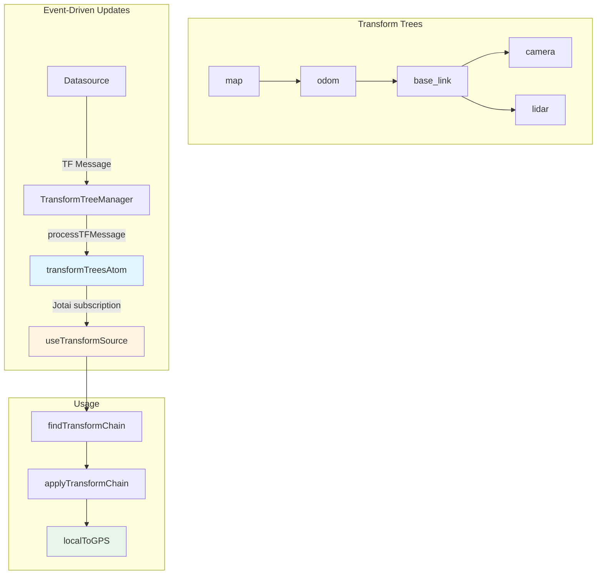

# Transforms System

The transforms system in ORMI-CORE provides coordinate frame transformation capabilities similar to ROS TF, enabling conversion between different coordinate reference frames in robotics and spatial data visualization.

## Overview

### Core Concepts

The transforms system manages spatial relationships between coordinate frames:

1. **TransformTree** - Hierarchical tree structure of coordinate frames
2. **Transform** - 3D transformation (position + rotation quaternion)
3. **Frame IDs** - Unique identifiers for coordinate frames (e.g., `"map"`, `"base_link"`, `"camera"`)
4. **Transform Chains** - Computed paths between frames



### Architecture

The transforms system uses **Jotai atoms** for event-driven updates:

- **No polling** - Transforms update instantly when received from datasources
- **No provider wrapper** - Widgets use `useTransformSource()` directly
- **Automatic subscriptions** - Jotai handles React re-renders efficiently

### Use Cases

- **Robot Visualization** - Transform sensor data to common frame
- **GPS Mapping** - Convert local coordinates to GPS
- **Multi-Sensor Fusion** - Align data from different sensors
- **3D Rendering** - Position objects in scene graph

## Core Types

### Transform

A 3D transformation with position and rotation:

```typescript
interface Vector3 {
    x: number;
    y: number;
    z: number;
}

interface Vector4 extends Vector3 {
    w: number;
}

interface Quaternion {
    x: number;
    y: number;
    z: number;
    w: number;
}

interface Transform {
    position: Vector4; // Translation (x, y, z, w=0)
    rotation: Quaternion; // Orientation as quaternion
    convention: CoordinateConvention; // 'ROS' | 'THREE' | 'UNITY' etc.
}
```

**Example:**

```typescript
const transform: Transform = {
    position: { x: 1.0, y: 2.0, z: 0.5, w: 0 },
    rotation: { x: 0, y: 0, z: 0, w: 1 }, // Identity rotation
    convention: "ROS",
};
```

### TransformTree

Hierarchical tree node representing a coordinate frame:

```typescript
interface TransformTree {
    id: string; // Frame identifier (e.g., "base_link")
    parentId: string; // Parent frame ID (empty string for root)
    transform: Transform; // Transform from parent to this frame
    children: Map<string, TransformTree>; // Child frames
    convention?: CoordinateConvention; // Coordinate convention
}
```

**Example Tree:**

```typescript
const mapFrame: TransformTree = {
    id: "map",
    parentId: "", // Root frame
    transform: identityTransform,
    children: new Map([
        [
            "odom",
            {
                id: "odom",
                parentId: "map",
                transform: {
                    position: { x: 0, y: 0, z: 0, w: 0 },
                    rotation: { x: 0, y: 0, z: 0, w: 1 },
                    convention: "ROS",
                },
                children: new Map([
                    [
                        "base_link",
                        {
                            id: "base_link",
                            parentId: "odom",
                            transform: {
                                position: { x: 2.5, y: 1.0, z: 0, w: 0 },
                                rotation: { x: 0, y: 0, z: 0.707, w: 0.707 }, // 90° yaw
                                convention: "ROS",
                            },
                            children: new Map(),
                        },
                    ],
                ]),
            },
        ],
    ]),
};
```

## Jotai Atoms

The transforms system uses Jotai atoms for reactive state management.

### transformTreesAtom

Main atom holding all transform trees from all datasources:

```typescript
import { atom } from "jotai";
import { TransformTree } from "@workspace/ormi-core/types";

// Key is the root frame_id (e.g., "world", "map", "odom")
export const transformTreesAtom = atom<Map<string, TransformTree>>(
    new Map<string, TransformTree>(),
);
```

### transformSourcesAtom

Tracks which datasources have contributed transforms:

```typescript
export const transformSourcesAtom = atom<Set<string>>(new Set<string>());
```

### transformFrameCountAtom

Derived atom for the total number of frames:

```typescript
export const transformFrameCountAtom = atom((get) => {
    const trees = get(transformTreesAtom);
    let count = 0;

    const countFrames = (tree: TransformTree): number => {
        let c = 1;
        for (const [, child] of tree.children) {
            c += countFrames(child);
        }
        return c;
    };

    for (const [, tree] of trees) {
        count += countFrames(tree);
    }

    return count;
});
```

## useTransformSource Hook

Access transform trees directly from the Jotai atom - **no provider wrapper needed**:

```typescript
import { useTransformSource } from "@workspace/ormi-core/transforms";

function MyComponent() {
    const { transformsTrees } = useTransformSource();

    // transformsTrees: Map<string, TransformTree>
    console.log("Available root frames:", Array.from(transformsTrees.keys()));
}
```

**Returns:**

- `transformsTrees` - Map of root frame IDs to TransformTree structures

### useTransformFrameCount

Get the total number of frames across all trees:

```typescript
import { useTransformFrameCount } from "@workspace/ormi-core/transforms";

function FrameStatus() {
    const frameCount = useTransformFrameCount();
    return <div>Total frames: {frameCount}</div>;
}
```

## Pushing Transforms (Datasource Side)

Datasources push transforms using the `processTFMessage` function:

```typescript
import {
    processTFMessage,
    clearTransformsFromDatasource,
} from "@workspace/ormi-core/transforms";

// When TF message is received
function handleTFMessage(message: TFMessage) {
    processTFMessage(datasourceId, message);
}

// When datasource disconnects
function cleanup() {
    clearTransformsFromDatasource(datasourceId);
}
```

### TFMessage Format

```typescript
interface TFTransform {
    header: {
        frame_id: string;
        stamp?: { sec: number; nsec: number };
    };
    child_frame_id: string;
    transform: {
        translation: { x: number; y: number; z: number };
        rotation: { x: number; y: number; z: number; w: number };
    };
}

interface TFMessage {
    transforms: TFTransform[];
}
```

### Example: TransformTreeManager

```typescript
import { processTFMessage, clearTransformsFromDatasource } from '@workspace/ormi-core/transforms';

const TransformTreeManager: React.FC<Props> = ({ children, settings }) => {
    const pluginsManager = usePluginsManager();
    const datasource_id = settings.id;

    useEffect(() => {
        // Register handler for TF messages
        const actionId = `${datasource_id}-transform-/tf`;

        pluginsManager.addAction(`${datasource_id}-/tf-published`, {
            id: actionId,
            action: (message: any) => {
                // Push transforms directly to atom
                processTFMessage(datasource_id, message);
            },
            priority: 100,
        });

        return () => {
            pluginsManager.removeAction(actionId);
            clearTransformsFromDatasource(datasource_id);
        };
    }, [settings.enable, datasource_id]);

    return <>{children}</>;
};
```

## Transform Chain Computation

### findTransformChain

Finds the sequence of transforms needed to convert from one frame to another.

```typescript
function findTransformChain(
    treeMap: Map<string, TransformTree>,
    sourceFrameId: string,
    targetFrameId: string,
): Transform[] | null;
```

**Algorithm:**

1. Find source and target nodes in tree
2. Build path from source to root
3. Build path from target to root
4. Check if frames are in same tree (same root)
5. Find common ancestor
6. Build transform chain: source → ancestor → target

**Returns:**

- `Transform[]` - Array of transforms to apply in order
- `[]` - Empty array if source === target (identity)
- `null` - No path exists (disconnected frames or frames in different trees)

**Example:**

```typescript
import {
    findTransformChain,
    useTransformSource,
} from "@workspace/ormi-core/transforms";

function MyWidget() {
    const { transformsTrees } = useTransformSource();

    // Find transform from camera to map
    const chain = findTransformChain(transformsTrees, "camera", "map");

    if (chain === null) {
        console.log("No transform chain found");
    } else if (chain.length === 0) {
        console.log("Frames are identical");
    } else {
        console.log(`Found chain with ${chain.length} transforms`);
    }
}
```

### applyTransformChain

Apply a sequence of transforms to a point:

```typescript
function applyTransformChain(point: Vector3, transforms: Transform[]): Vector3;
```

**Example:**

```typescript
import {
    applyTransformChain,
    findTransformChain,
    useTransformSource,
} from "@workspace/ormi-core/transforms";

function TransformPoint() {
    const { transformsTrees } = useTransformSource();

    // Point in camera frame
    const pointInCamera = { x: 0, y: 0, z: 1 };

    // Get transform chain
    const chain = findTransformChain(transformsTrees, "camera", "map");

    if (chain) {
        // Transform to map frame
        const pointInMap = applyTransformChain(pointInCamera, chain);
        console.log("Point in map frame:", pointInMap);
    }
}
```

### applyTransform

Apply a single transform to a 3D point:

```typescript
function applyTransform(point: Vector3, transform: Transform): Vector3;
```

**Steps:**

1. Rotate point by quaternion
2. Add translation

**Example:**

```typescript
import { applyTransform } from "@workspace/ormi-core/transforms";

const point = { x: 1, y: 0, z: 0 };
const transform = {
    position: { x: 5, y: 0, z: 0, w: 0 },
    rotation: { x: 0, y: 0, z: 0, w: 1 }, // No rotation
    convention: "ROS",
};

const transformed = applyTransform(point, transform);
// Result: { x: 6, y: 0, z: 0 }
```

## GPS Coordinate Conversion

### localToGPS

Convert local ENU (East-North-Up) coordinates to GPS:

```typescript
interface GPSCoords {
    latitude: number;
    longitude: number;
    altitude?: number;
}

function localToGPS(localPoint: Vector3, originGPS: GPSCoords): GPSCoords;
```

**Parameters:**

- `localPoint` - Point in local frame (meters)
- `originGPS` - GPS coordinates of local frame origin

**Example:**

```typescript
import { localToGPS } from "@workspace/ormi-core/transforms";

const origin: GPSCoords = {
    latitude: 37.7749,
    longitude: -122.4194,
    altitude: 10,
};

const localPoint = { x: 100, y: 50, z: 5 }; // 100m east, 50m north, 5m up

const gps = localToGPS(localPoint, origin);
console.log(`GPS: ${gps.latitude}, ${gps.longitude}, ${gps.altitude}m`);
```

### gpsToLocal

Convert GPS coordinates to local ENU frame:

```typescript
function gpsToLocal(gps: GPSCoords, originGPS: GPSCoords): Vector3;
```

**Example:**

```typescript
import { gpsToLocal } from "@workspace/ormi-core/transforms";

const origin: GPSCoords = {
    latitude: 37.7749,
    longitude: -122.4194,
    altitude: 10,
};

const target: GPSCoords = {
    latitude: 37.775,
    longitude: -122.4193,
    altitude: 15,
};

const local = gpsToLocal(target, origin);
console.log(`Local: ${local.x}m east, ${local.y}m north, ${local.z}m up`);
```

## useTransformToGPS Hook

Convenience hook for transforming data to GPS coordinates:

```typescript
function useTransformToGPS(
    sourceFrameId: string,
    gpsFrameId: string,
    gpsOriginData: GeolocationPosition | null,
): {
    transformPointToGPS: (localPoint: Vector3) => GPSCoords | null;
    transformPointsToGPS: (localPoints: Vector3[]) => (GPSCoords | null)[];
    hasTransform: boolean;
    transformError: string | null;
    hasGPSOrigin: boolean;
    gpsOrigin: GPSCoords | null;
};
```

**Example:**

```typescript
import { useTransformToGPS, useGPSOrigin } from '@workspace/ormi-core/transforms';
import { useLocalDataSource } from '@workspace/ormi-core/datasources';

function MapWidget(settings: {
    robotPositionTopic: SelectedTopic,
    gpsOriginTopic: SelectedTopic,
    robotFrameId: string,
    gpsFrameId: string
}) {
    const { getSource } = useLocalDataSource();

    // Get GPS origin data
    const gpsOriginData = useGPSOrigin(settings.gpsOriginTopic, getSource);

    // Set up transform
    const {
        transformPointToGPS,
        hasTransform,
        transformError,
        hasGPSOrigin
    } = useTransformToGPS(
        settings.robotFrameId,
        settings.gpsFrameId,
        gpsOriginData
    );

    // Get robot position in robot frame
    const robotSource = getSource(settings.robotPositionTopic);
    const robotPosition = robotSource?.data[robotSource.data.length - 1];

    // Transform to GPS
    const robotGPS = robotPosition ? transformPointToGPS(robotPosition) : null;

    if (!hasGPSOrigin) {
        return <div>Waiting for GPS origin...</div>;
    }

    if (!hasTransform) {
        return <div>Transform error: {transformError}</div>;
    }

    return (
        <div>
            Robot GPS: {robotGPS?.latitude}, {robotGPS?.longitude}
        </div>
    );
}
```

## Utility Functions

### getTransformTreeFromTreeId

Find a specific frame node in a tree:

```typescript
function getTransformTreeFromTreeId(
    tree: TransformTree,
    id: string,
): TransformTree | null;
```

### getTransformTreeFromTreeIdInMaps

Find a frame node across multiple trees:

```typescript
function getTransformTreeFromTreeIdInMaps(
    treeMap: Map<string, TransformTree>,
    id: string,
): TransformTree | null;
```

### invertTransform

Compute inverse transform (for going up the tree):

```typescript
function invertTransform(transform: Transform): Transform;
```

**Usage:**

```typescript
// Transform from parent to child
const parentToChild = {
    /* ... */
};

// Transform from child to parent
const childToParent = invertTransform(parentToChild);
```

### rotateVectorByQuaternion

Rotate a vector by a quaternion:

```typescript
function rotateVectorByQuaternion(v: Vector3, q: Quaternion): Vector3;
```

## Coordinate System Conventions

The transform system supports multiple coordinate conventions:

```typescript
type CoordinateConvention = "ROS" | "THREE" | "UNITY" | "UNREAL" | "CUSTOM";
```

### createPositionConverter

Create a converter between coordinate systems:

```typescript
function createPositionConverter(
    sourceConvention: CoordinateConvention,
    targetConvention: CoordinateConvention,
): (position: Vector3) => Vector3;
```

**Example:**

```typescript
import { createPositionConverter } from "@workspace/ormi-core/transforms";

// ROS: X forward, Y left, Z up
// THREE: X right, Y up, Z out (towards viewer)

const rosToThree = createPositionConverter("ROS", "THREE");

const rosPoint = { x: 1, y: 2, z: 3 }; // 1m forward, 2m left, 3m up
const threePoint = rosToThree(rosPoint); // Converted to THREE.js coordinates
```

## Complete Widget Example

```typescript
import React, { useMemo } from 'react';
import { useTransformSource, findTransformChain, applyTransformChain } from '@workspace/ormi-core/transforms';
import { useLocalDataSource } from '@workspace/ormi-core/datasources';

function PointCloudWidget({ topics, targetFrame }) {
    const { transformsTrees } = useTransformSource();
    const { sources } = useLocalDataSource();

    const transformedPoints = useMemo(() => {
        const allPoints = [];

        for (const [sourceId, source] of sources) {
            const refFrame = source.referenceFrameId;

            // Skip if same frame or no target
            if (!targetFrame || refFrame === targetFrame) {
                allPoints.push(...source.data);
                continue;
            }

            // Find transform chain
            const chain = findTransformChain(transformsTrees, refFrame, targetFrame);

            if (!chain) {
                console.warn(`No transform from ${refFrame} to ${targetFrame}`);
                continue;
            }

            // Transform each point
            for (const point of source.data) {
                const transformed = applyTransformChain(point, chain);
                allPoints.push(transformed);
            }
        }

        return allPoints;
    }, [sources, transformsTrees, targetFrame]);

    return <PointCloudRenderer points={transformedPoints} />;
}
```

## Troubleshooting

### Transform Chain Not Found

**Cause:** Frames not connected in tree or not yet received

**Solution:**

```typescript
const { transformsTrees } = useTransformSource();

// Debug: List all available frames
const listFrames = (tree: TransformTree, depth = 0) => {
    console.log("  ".repeat(depth) + tree.id);
    for (const [, child] of tree.children) {
        listFrames(child, depth + 1);
    }
};

transformsTrees.forEach((tree, rootId) => {
    console.log(`Tree rooted at: ${rootId}`);
    listFrames(tree);
});
```

### Transforms Not Updating

**Cause:** Datasource not pushing to atom

**Solution:** Verify datasource is calling `processTFMessage`:

```typescript
import { processTFMessage } from "@workspace/ormi-core/transforms";

// In your TF message handler
function onTFMessage(message) {
    console.log(
        "Processing TF message:",
        message.transforms.length,
        "transforms",
    );
    processTFMessage(datasourceId, message);
}
```

### Using Outside React Components

For non-React code, use the store directly:

```typescript
import {
    getTransformTrees,
    subscribeToTransforms,
} from "@workspace/ormi-core/transforms";

// Get current trees
const trees = getTransformTrees();

// Subscribe to changes
const unsubscribe = subscribeToTransforms(() => {
    const updatedTrees = getTransformTrees();
    console.log("Transforms updated:", updatedTrees.size);
});

// Later: cleanup
unsubscribe();
```

## Summary

The transforms system provides:

- **Event-driven updates** - Jotai atoms for instant propagation
- **No provider needed** - Use `useTransformSource()` anywhere
- **TF-like functionality** - Hierarchical coordinate frame transforms
- **Transform chains** - Automatic path finding between frames
- **GPS conversion** - Local to GPS coordinate conversion
- **Multiple trees** - Support for disconnected transform trees
- **Coordinate conventions** - ROS, THREE.js, Unity support

**Key Components:**

- `transformTreesAtom` - Main Jotai atom holding all transforms
- `useTransformSource` - Access transform trees in React
- `processTFMessage` - Push transforms from datasources
- `findTransformChain` - Compute transform sequence
- `applyTransformChain` - Apply transforms to points
- `localToGPS` / `gpsToLocal` - GPS coordinate conversion
- `useTransformToGPS` - Convenience hook for GPS transforms

This system enables sophisticated spatial data visualization and multi-sensor fusion in robotics applications.
