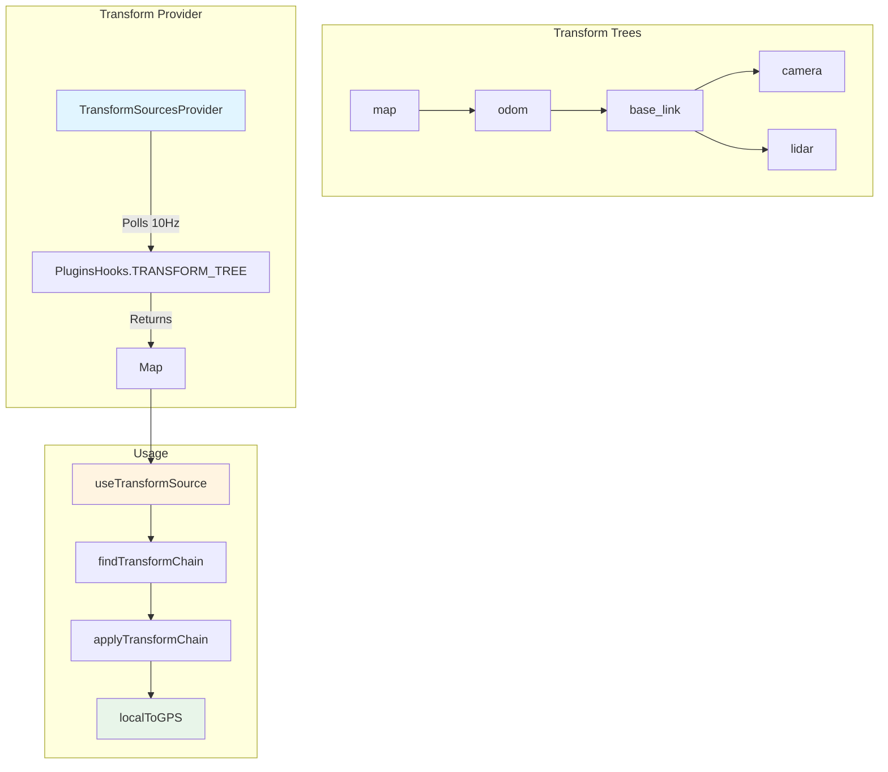

# Transforms System

The transforms system in ORMI-CORE V1 provides coordinate frame transformation capabilities similar to ROS TF, enabling conversion between different coordinate reference frames in robotics and spatial data visualization.

## Overview

### Core Concepts

The transforms system manages spatial relationships between coordinate frames:

1. **TransformTree** - Hierarchical tree structure of coordinate frames
2. **Transform** - 3D transformation (position + rotation quaternion)
3. **Frame IDs** - Unique identifiers for coordinate frames (e.g., `"map"`, `"base_link"`, `"camera"`)
4. **Transform Chains** - Computed paths between frames



### Use Cases

- **Robot Visualization** - Transform sensor data to common frame
- **GPS Mapping** - Convert local coordinates to GPS
- **Multi-Sensor Fusion** - Align data from different sensors
- **3D Rendering** - Position objects in scene graph

## Core Types

### Transform

A 3D transformation with position and rotation:

```typescript
interface Vector3 {
    x: number;
    y: number;
    z: number;
}

interface Vector4 extends Vector3 {
    w: number;
}

interface Quaternion {
    x: number;
    y: number;
    z: number;
    w: number;
}

interface Transform {
    position: Vector4; // Translation (x, y, z, w=0)
    rotation: Quaternion; // Orientation as quaternion
}
```

**Example:**

```typescript
const transform: Transform = {
    position: { x: 1.0, y: 2.0, z: 0.5, w: 0 },
    rotation: { x: 0, y: 0, z: 0, w: 1 }, // Identity rotation
};
```

### TransformTree

Hierarchical tree node representing a coordinate frame:

```typescript
interface TransformTree {
    id: string; // Frame identifier (e.g., "base_link")
    parentId: string; // Parent frame ID (empty string for root)
    transform: Transform; // Transform from parent to this frame
    children: TransformTree[]; // Child frames
}
```

**Example Tree:**

```typescript
const mapFrame: TransformTree = {
    id: "map",
    parentId: "", // Root frame
    transform: identityTransform,
    children: [
        {
            id: "odom",
            parentId: "map",
            transform: {
                position: { x: 0, y: 0, z: 0, w: 0 },
                rotation: { x: 0, y: 0, z: 0, w: 1 },
            },
            children: [
                {
                    id: "base_link",
                    parentId: "odom",
                    transform: {
                        position: { x: 2.5, y: 1.0, z: 0, w: 0 },
                        rotation: { x: 0, y: 0, z: 0.707, w: 0.707 }, // 90° yaw
                    },
                    children: [
                        {
                            id: "camera",
                            parentId: "base_link",
                            transform: {
                                position: { x: 0.1, y: 0, z: 0.5, w: 0 },
                                rotation: { x: 0, y: 0, z: 0, w: 1 },
                            },
                            children: [],
                        },
                    ],
                },
            ],
        },
    ],
};
```

## TransformSourcesProvider

React context provider that polls for transform trees from plugins.

### Provider Props

```typescript
interface TransformSourcesProviderProps {
    children: ReactNode;
    updateRate: number; // Polling rate in Hz (e.g., 10)
}
```

### Context Interface

```typescript
interface TransformSources {
    transformsTrees: Map<string, TransformTree>; // Map of root frame ID -> tree
}
```

### Provider Setup

```typescript
import { TransformSourcesProvider } from '@workspace/ormi-core/transforms';

function App() {
    return (
        <TransformSourcesProvider updateRate={10}>
            {/* App content */}
        </TransformSourcesProvider>
    );
}
```

**Behavior:**

- Polls `PluginsHooks.TRANSFORM_TREE` at specified rate
- Compares new trees with current trees (deep equality)
- Only updates state if trees have changed
- Returns `Map<string, TransformTree>` where keys are root frame IDs

### How It Works

```typescript
// Inside provider
useEffect(() => {
    const intervalId = setInterval(async () => {
        const newTrees = await pluginsManager.applyFilterAsync<
            Map<string, TransformTree>
        >(PluginsHooks.TRANSFORM_TREE, new Map<string, TransformTree>());

        if (
            newTrees &&
            areTransformTreesDifferent(newTrees, currentTreesRef.current)
        ) {
            setTransformsTrees(newTrees);
            currentTreesRef.current = newTrees;
        }
    }, 1000 / updateRate);

    // Cleanup on unmount
    return () => clearInterval(intervalId);
}, []);
```

**Performance:**

- Uses `useRef` to avoid triggering re-renders on every poll
- Only updates state when trees actually change
- Deep comparison using JSON.stringify (could be optimized)

## useTransformSource Hook

Access transform trees from context:

```typescript
import { useTransformSource } from "@workspace/ormi-core/transforms";

function MyComponent() {
    const { transformsTrees } = useTransformSource();

    // transformsTrees: Map<string, TransformTree>
    console.log("Available root frames:", Array.from(transformsTrees.keys()));
}
```

**Returns:**

- `transformsTrees` - Map of root frame IDs to TransformTree structures

## Transform Chain Computation

### findTransformChain

Finds the sequence of transforms needed to convert from one frame to another.

```typescript
function findTransformChain(
    treeMap: Map<string, TransformTree>,
    sourceFrameId: string,
    targetFrameId: string
): Transform[] | null;
```

**Algorithm:**

1. Find source and target nodes in tree
2. Build path from source to root
3. Build path from target to root
4. Check if frames are in same tree (same root)
5. Find common ancestor
6. Build transform chain: source → ancestor → target

**Returns:**

- `Transform[]` - Array of transforms to apply in order
- `[]` - Empty array if source === target (identity)
- `null` - No path exists (disconnected frames or frames in different trees)

**Example:**

```typescript
import { findTransformChain } from "@workspace/ormi-core/transforms";

const { transformsTrees } = useTransformSource();

// Find transform from camera to map
const chain = findTransformChain(transformsTrees, "camera", "map");

if (chain === null) {
    console.log("No transform chain found");
} else if (chain.length === 0) {
    console.log("Frames are identical");
} else {
    console.log(`Found chain with ${chain.length} transforms`);
}
```

**Chain Structure:**

For `camera → map` (assuming tree: map → odom → base_link → camera):

```typescript
[
    invertTransform(camera_to_base_link), // Up to base_link
    invertTransform(base_link_to_odom), // Up to odom
    invertTransform(odom_to_map), // Up to map
];
```

### applyTransform

Apply a single transform to a 3D point:

```typescript
function applyTransform(point: Vector3, transform: Transform): Vector3;
```

**Steps:**

1. Rotate point by quaternion
2. Add translation

**Example:**

```typescript
import { applyTransform } from "@workspace/ormi-core/transforms";

const point = { x: 1, y: 0, z: 0 };
const transform = {
    position: { x: 5, y: 0, z: 0, w: 0 },
    rotation: { x: 0, y: 0, z: 0, w: 1 }, // No rotation
};

const transformed = applyTransform(point, transform);
// Result: { x: 6, y: 0, z: 0 }
```

### applyTransformChain

Apply a sequence of transforms to a point:

```typescript
function applyTransformChain(point: Vector3, transforms: Transform[]): Vector3;
```

**Example:**

```typescript
import {
    applyTransformChain,
    findTransformChain,
} from "@workspace/ormi-core/transforms";

const { transformsTrees } = useTransformSource();

// Point in camera frame
const pointInCamera = { x: 0, y: 0, z: 1 };

// Get transform chain
const chain = findTransformChain(transformsTrees, "camera", "map");

if (chain) {
    // Transform to map frame
    const pointInMap = applyTransformChain(pointInCamera, chain);
    console.log("Point in map frame:", pointInMap);
}
```

## GPS Coordinate Conversion

### localToGPS

Convert local ENU (East-North-Up) coordinates to GPS:

```typescript
interface GPSCoords {
    latitude: number;
    longitude: number;
    altitude?: number;
}

function localToGPS(localPoint: Vector3, originGPS: GPSCoords): GPSCoords;
```

**Parameters:**

- `localPoint` - Point in local frame (meters)
- `originGPS` - GPS coordinates of local frame origin

**Algorithm:**

- Uses Earth radius (6,371,000 meters)
- Converts meters to degrees
- Accounts for latitude when converting East/West

**Example:**

```typescript
import { localToGPS } from "@workspace/ormi-core/transforms";

const origin: GPSCoords = {
    latitude: 37.7749,
    longitude: -122.4194,
    altitude: 10,
};

const localPoint = { x: 100, y: 50, z: 5 }; // 100m east, 50m north, 5m up

const gps = localToGPS(localPoint, origin);
console.log(`GPS: ${gps.latitude}, ${gps.longitude}, ${gps.altitude}m`);
```

### gpsToLocal

Convert GPS coordinates to local ENU frame:

```typescript
function gpsToLocal(gps: GPSCoords, originGPS: GPSCoords): Vector3;
```

**Example:**

```typescript
import { gpsToLocal } from "@workspace/ormi-core/transforms";

const origin: GPSCoords = {
    latitude: 37.7749,
    longitude: -122.4194,
    altitude: 10,
};

const target: GPSCoords = {
    latitude: 37.775,
    longitude: -122.4193,
    altitude: 15,
};

const local = gpsToLocal(target, origin);
console.log(`Local: ${local.x}m east, ${local.y}m north, ${local.z}m up`);
```

## useTransformToGPS Hook

Convenience hook for transforming data to GPS coordinates:

```typescript
function useTransformToGPS(
    sourceFrameId: string,
    gpsFrameId: string,
    gpsOriginData: GeolocationPosition | null
): {
    transformPointToGPS: (localPoint: Vector3) => GPSCoords | null;
    transformPointsToGPS: (localPoints: Vector3[]) => (GPSCoords | null)[];
    hasTransform: boolean;
    transformError: string | null;
    hasGPSOrigin: boolean;
    gpsOrigin: GPSCoords | null;
};
```

**Example:**

```typescript
import { useTransformToGPS, useGPSOrigin } from '@workspace/ormi-core/transforms';
import { useLocalDataSource } from '@workspace/ormi-core/datasources';

function MapWidget(settings: {
    robotPositionTopic: SelectedTopic,
    gpsOriginTopic: SelectedTopic,
    robotFrameId: string,
    gpsFrameId: string
}) {
    const { getSource } = useLocalDataSource();

    // Get GPS origin data
    const gpsOriginData = useGPSOrigin(settings.gpsOriginTopic, getSource);

    // Set up transform
    const {
        transformPointToGPS,
        hasTransform,
        transformError,
        hasGPSOrigin
    } = useTransformToGPS(
        settings.robotFrameId,
        settings.gpsFrameId,
        gpsOriginData
    );

    // Get robot position in robot frame
    const robotSource = getSource(settings.robotPositionTopic);
    const robotPosition = robotSource?.data[robotSource.data.length - 1];

    // Transform to GPS
    const robotGPS = robotPosition ? transformPointToGPS(robotPosition) : null;

    if (!hasGPSOrigin) {
        return <div>Waiting for GPS origin...</div>;
    }

    if (!hasTransform) {
        return <div>Transform error: {transformError}</div>;
    }

    if (!robotGPS) {
        return <div>No robot position</div>;
    }

    return (
        <div>
            Robot GPS: {robotGPS.latitude}, {robotGPS.longitude}
        </div>
    );
}
```

## useGPSOrigin Hook

Helper to get GPS origin from a topic:

```typescript
function useGPSOrigin(
    gpsTopic: SelectedTopic | null,
    getSource: (topic: SelectedTopic) => any
): GeolocationPosition | null;
```

**Example:**

```typescript
const { getSource } = useLocalDataSource();
const gpsOriginData = useGPSOrigin(settings.gpsOriginTopic, getSource);

if (gpsOriginData) {
    console.log(
        "GPS Origin:",
        gpsOriginData.coords.latitude,
        gpsOriginData.coords.longitude
    );
}
```

## Utility Functions

### getTransformTreeFromTreeId

Find a specific frame node in a tree:

```typescript
function getTransformTreeFromTreeId(
    tree: TransformTree,
    id: string
): TransformTree | null;
```

### getTransfromTreeFromTreeIdInMaps

Find a frame node across multiple trees:

```typescript
function getTransfromTreeFromTreeIdInMaps(
    treeMap: Map<string, TransformTree>,
    id: string
): TransformTree | null;
```

### invertTransform

Compute inverse transform (for going up the tree):

```typescript
function invertTransform(transform: Transform): Transform;
```

**Usage:**

```typescript
// Transform from parent to child
const parentToChild = {
    /* ... */
};

// Transform from child to parent
const childToParent = invertTransform(parentToChild);
```

## Plugin Integration

Plugins provide transform trees via `PluginsHooks.TRANSFORM_TREE`:

```typescript
import { Plugin, PluginsHooks } from "@workspace/ormi-plugins";
import { TransformTree } from "@workspace/ormi-core";

class ROS2TFPlugin extends Plugin {
    private transformTrees: Map<string, TransformTree> = new Map();

    constructor() {
        super({ name: "ROS2 TF", version: "1.0.0" });

        // Register filter to provide transforms
        this.addFilter(PluginsHooks.TRANSFORM_TREE, {
            id: "ros2-tf",
            priority: 10,
            filter: (trees: Map<string, TransformTree>) => {
                // Merge our trees with existing
                this.transformTrees.forEach((tree, rootId) => {
                    trees.set(rootId, tree);
                });
                return trees;
            },
        });

        // Subscribe to /tf topic and build trees
        this.subscribeTF();
    }

    private subscribeTF() {
        // Subscribe to ROS2 /tf topic
        // Build TransformTree from TF messages
        // Update this.transformTrees
    }
}
```

## Common Patterns

### Pattern 1: Robot Position to GPS

```typescript
function RobotGPSTracker(settings: {
    robotFrame: string,
    gpsFrame: string,
    gpsOriginTopic: SelectedTopic
}) {
    const { transformsTrees } = useTransformSource();
    const { getSource } = useLocalDataSource();

    // Get GPS origin
    const gpsOriginData = useGPSOrigin(settings.gpsOriginTopic, getSource);
    const gpsOrigin: GPSCoords | null = gpsOriginData ? {
        latitude: gpsOriginData.coords.latitude,
        longitude: gpsOriginData.coords.longitude,
        altitude: gpsOriginData.coords.altitude || 0
    } : null;

    // Robot position in robot frame (always at origin)
    const robotLocalPos = { x: 0, y: 0, z: 0 };

    // Get transform chain
    const chain = findTransformChain(
        transformsTrees,
        settings.robotFrame,
        settings.gpsFrame
    );

    if (!chain || !gpsOrigin) {
        return <div>Waiting for transform or GPS origin...</div>;
    }

    // Transform to GPS frame
    const posInGPSFrame = applyTransformChain(robotLocalPos, chain);

    // Convert to GPS coordinates
    const robotGPS = localToGPS(posInGPSFrame, gpsOrigin);

    return (
        <div>
            Robot GPS: {robotGPS.latitude.toFixed(6)}, {robotGPS.longitude.toFixed(6)}
        </div>
    );
}
```

### Pattern 2: Sensor Data Alignment

```typescript
function MultiSensorVisualization(settings: {
    lidarTopic: SelectedTopic,
    cameraTopic: SelectedTopic,
    targetFrame: string
}) {
    const { transformsTrees } = useTransformSource();
    const { getSource } = useLocalDataSource();

    // Get sensor data
    const lidarSource = getSource(settings.lidarTopic);
    const cameraSource = getSource(settings.cameraTopic);

    // Get frame IDs from topic metadata
    const lidarFrameId = lidarSource?.frame_id || 'lidar';
    const cameraFrameId = cameraSource?.frame_id || 'camera';

    // Get transform chains
    const lidarChain = findTransformChain(transformsTrees, lidarFrameId, settings.targetFrame);
    const cameraChain = findTransformChain(transformsTrees, cameraFrameId, settings.targetFrame);

    if (!lidarChain || !cameraChain) {
        return <div>Waiting for transforms...</div>;
    }

    // Transform lidar points
    const lidarPoints: Vector3[] = lidarSource?.data[lidarSource.data.length - 1] || [];
    const lidarInTarget = lidarPoints.map(p => applyTransformChain(p, lidarChain));

    // Transform camera points
    const cameraPoints: Vector3[] = cameraSource?.data[cameraSource.data.length - 1] || [];
    const cameraInTarget = cameraPoints.map(p => applyTransformChain(p, cameraChain));

    return (
        <Canvas>
            <RenderPoints points={lidarInTarget} color="blue" />
            <RenderPoints points={cameraInTarget} color="red" />
        </Canvas>
    );
}
```

### Pattern 3: Path Visualization

```typescript
function PathVisualization(settings: {
    pathTopic: SelectedTopic,
    pathFrameId: string,
    displayFrame: string
}) {
    const { transformsTrees } = useTransformSource();
    const { getSource } = useLocalDataSource();

    // Get path data
    const pathSource = getSource(settings.pathTopic);
    const pathPoints: Vector3[] = pathSource?.data || [];

    // Get transform chain
    const chain = findTransformChain(
        transformsTrees,
        settings.pathFrameId,
        settings.displayFrame
    );

    if (!chain) {
        return <div>No transform available</div>;
    }

    // Transform all path points
    const transformedPath = pathPoints.map(point =>
        applyTransformChain(point, chain)
    );

    return (
        <Canvas>
            <Line points={transformedPath} color="green" />
        </Canvas>
    );
}
```

## Best Practices

### 1. Check for Transform Availability

Always handle null returns:

```typescript
const chain = findTransformChain(transformsTrees, source, target);

if (chain === null) {
    return <div>No transform available from {source} to {target}</div>;
}

if (chain.length === 0) {
    // Identity transform, no computation needed
    return point;
}

// Apply chain
const transformed = applyTransformChain(point, chain);
```

### 2. Use Appropriate Update Rate

Match transform polling rate to data rate:

```typescript
// For fast-moving robots
<TransformSourcesProvider updateRate={30}>  // 30 Hz

// For slow-moving systems
<TransformSourcesProvider updateRate={5}>   // 5 Hz
```

### 3. Cache Transform Chains

Avoid recomputing chains every render:

```typescript
const chain = useMemo(() => {
    return findTransformChain(transformsTrees, sourceFrame, targetFrame);
}, [transformsTrees, sourceFrame, targetFrame]);
```

### 4. Handle Multiple Trees

Check if frames are in the same tree:

```typescript
const chain = findTransformChain(transformsTrees, "camera", "gps");

if (chain === null) {
    // Frames might be in different disconnected trees
    console.log("Frames not connected");
}
```

### 5. Validate GPS Conversion

Check for valid GPS origin before converting:

```typescript
if (!gpsOrigin) {
    return <div>Waiting for GPS origin...</div>;
}

if (!gpsOrigin.altitude) {
    console.warn('GPS origin missing altitude, defaulting to 0');
}

const gps = localToGPS(point, gpsOrigin);
```

## Troubleshooting

### No Transform Chain Found

**Cause:** Frames in different trees or not connected

**Solution:**

```typescript
// Check if frames exist
const sourceNode = getTransfromTreeFromTreeIdInMaps(
    transformsTrees,
    sourceFrameId
);
const targetNode = getTransfromTreeFromTreeIdInMaps(
    transformsTrees,
    targetFrameId
);

if (!sourceNode) {
    console.error(`Source frame "${sourceFrameId}" not found`);
}

if (!targetNode) {
    console.error(`Target frame "${targetFrameId}" not found`);
}

// Check available frames
const allFrames: string[] = [];
transformsTrees.forEach((tree) => {
    const collectFrames = (node: TransformTree) => {
        allFrames.push(node.id);
        node.children.forEach(collectFrames);
    };
    collectFrames(tree);
});

console.log("Available frames:", allFrames);
```

### Incorrect GPS Coordinates

**Cause:** Wrong origin, wrong frame, or wrong coordinate system

**Solution:**

```typescript
// Verify GPS origin
console.log("GPS Origin:", gpsOrigin);

// Verify local point before conversion
console.log("Local point:", localPoint);

// Verify transform chain is correct
console.log("Transform chain length:", chain?.length);

// Test with known point
const testPoint = { x: 0, y: 0, z: 0 }; // Origin
const testGPS = localToGPS(testPoint, gpsOrigin);
console.log("Origin should match:", testGPS, gpsOrigin);
```

### Transforms Not Updating

**Cause:** Plugin not publishing, polling too slow, or deep equality issue

**Solution:**

```typescript
// Check if transform trees are being updated
const { transformsTrees } = useTransformSource();

useEffect(() => {
    console.log('Transform trees updated:', transformsTrees.size);
    transformsTrees.forEach((tree, rootId) => {
        console.log(`Root: ${rootId}`, tree);
    });
}, [transformsTrees]);

// Increase polling rate
<TransformSourcesProvider updateRate={30}>  // Higher rate
```

## Summary

The V1 transforms system provides:

- **TF-like functionality** - Hierarchical coordinate frame transforms
- **Transform chains** - Automatic path finding between frames
- **GPS conversion** - Local to GPS coordinate conversion
- **Multiple trees** - Support for disconnected transform trees
- **Plugin integration** - Plugins provide transforms via hooks
- **React hooks** - Easy integration with components

**Key Components:**

- `TransformSourcesProvider` - Context provider with polling
- `useTransformSource` - Access transform trees
- `findTransformChain` - Compute transform sequence
- `applyTransformChain` - Apply transforms to points
- `localToGPS` / `gpsToLocal` - GPS coordinate conversion
- `useTransformToGPS` - Convenience hook for GPS transforms

This system enables sophisticated spatial data visualization and multi-sensor fusion in robotics applications.
