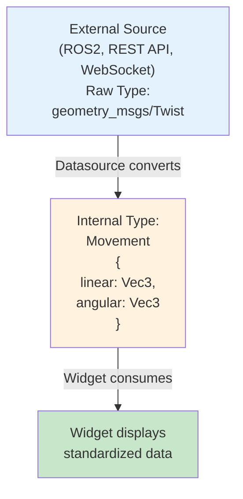

# Type System

ORMI-CORE uses a dual type system to standardize data across different sources while preserving original type information.

## Overview



## Internal Types

Standardized types used within ORMI-CORE:

### Primitive Types

#### `number`

Single numeric value.

```typescript
type number = number;

// Examples
42;
3.14159 - 0.5;
```

#### `boolean`

True/false value.

```typescript
type boolean = boolean;

// Examples
true;
false;
```

#### `string`

Text value.

```typescript
type string = string;

// Examples
("Hello");
("status: ok");
```

### Geometric Types

#### `Vector3`

3D vector/point in space.

```typescript
interface Vector3 {
  x: number;
  y: number;
  z: number;
}

// Example
{
  x: 1.5,
  y: -2.3,
  z: 0.0
}
```

**Use cases:**

- Position
- Velocity
- Acceleration
- Force

#### `Quaternion`

4D rotation representation.

```typescript
interface Quaternion {
  x: number;
  y: number;
  z: number;
  w: number;
}

// Example (identity rotation)
{
  x: 0,
  y: 0,
  z: 0,
  w: 1
}
```

### Motion Types

#### `Movement`

Linear and angular velocity.

```typescript
interface Movement {
  linear: Vector3;
  angular: Vector3;
}

// Example
{
  linear: { x: 1.0, y: 0.0, z: 0.0 },  // 1 m/s forward
  angular: { x: 0.0, y: 0.0, z: 0.5 }  // 0.5 rad/s turn
}
```

**Use cases:**

- Robot velocity commands
- Movement visualization
- Joystick control

### Sensor Types

#### `IMU`

Inertial Measurement Unit data.

```typescript
interface IMU {
  linear_acceleration: Vector3;
  angular_velocity: Vector3;
  orientation: Quaternion;
}

// Example
{
  linear_acceleration: { x: 0.0, y: 0.0, z: 9.81 },
  angular_velocity: { x: 0.0, y: 0.0, z: 0.0 },
  orientation: { x: 0, y: 0, z: 0, w: 1 }
}
```

#### `GeolocationPosition`

GPS coordinates.

```typescript
interface GeolocationPosition {
  coords: {
    latitude: number;
    longitude: number;
    altitude: number;
    accuracy: number;
    altitudeAccuracy: number | null;
    heading: number | null;
    speed: number | null;
  };
}

// Example
{
  coords: {
    latitude: 50.8503,
    longitude: 4.3517,
    altitude: 100,
    accuracy: 5,
    altitudeAccuracy: 5,
    heading: 180,
    speed: 1.5
  }
}
```

### Path Types

#### `Path`

Sequence of positions forming a path.

```typescript
interface PathPoint {
    position: Vector3;
    orientation?: Quaternion;
}

type Path = PathPoint[];

// Example
[
    { position: { x: 0, y: 0, z: 0 } },
    { position: { x: 1, y: 0, z: 0 } },
    { position: { x: 2, y: 1, z: 0 } },
];
```

### Point Cloud Types

#### `PointsCloud`

3D point cloud data.

```typescript
interface PointsCloud {
    points: Array<{
        x: number;
        y: number;
        z: number;
        rgb?: number; // Optional color
    }>;
}

// Example
{
    points: [
        { x: 1, y: 2, z: 3, rgb: 0xff0000 }, // Red point
        { x: 1.1, y: 2.1, z: 3.1, rgb: 0x00ff00 }, // Green point
    ];
}
```

### Media Types

#### `Image`

Image data.

```typescript
interface Image {
  data: string;     // Base64 encoded image
  format: string;   // "jpeg", "png", etc.
  width: number;
  height: number;
}

// Example
{
  data: "data:image/png;base64,iVBORw0KGgoAAAANSUhEUg...",
  format: "png",
  width: 640,
  height: 480
}
```

## Raw Types

Original type names from external sources.

### ROS2 Types

Common ROS2 message types:

```typescript
// Geometry
"geometry_msgs/Vector3";
"geometry_msgs/Quaternion";
"geometry_msgs/Twist";
"geometry_msgs/Pose";
"geometry_msgs/PoseStamped";

// Sensors
"sensor_msgs/Imu";
"sensor_msgs/Image";
"sensor_msgs/PointCloud2";
"sensor_msgs/NavSatFix";

// Navigation
"nav_msgs/Path";
"nav_msgs/Odometry";

// Standard
"std_msgs/Float64";
"std_msgs/Bool";
"std_msgs/String";
```

### Custom Raw Types

Datasources can define their own raw types:

```typescript
"my_datasource/CustomMessage";
"api/SensorReading";
"websocket/TelemetryData";
```

## Type Mapping

### DatasourceTopic Interface

Links internal and raw types:

```typescript
interface DatasourceTopic {
    topic: string; // "/robot/velocity"
    datasource_id: string; // "foxglove-1"
    type: string; // Internal: "Movement"
    rawType: string; // Raw: "geometry_msgs/Twist"
    source: DatasourceProviderSettings;
    bufferSize?: number;
}
```

### Conversion Examples

#### ROS2 Twist → Movement

```typescript
// Raw ROS2 message
const rosMessage = {
    linear: { x: 1.0, y: 0.0, z: 0.0 },
    angular: { x: 0.0, y: 0.0, z: 0.5 },
};

// Convert to internal type
const movement: Movement = {
    linear: rosMessage.linear as Vector3,
    angular: rosMessage.angular as Vector3,
};

// Publish with both type annotations
const topic: DatasourceTopic = {
    topic: "/cmd_vel",
    datasource_id: "rosbridge-1",
    type: "Movement",
    rawType: "geometry_msgs/Twist",
    source: datasourceSettings,
};
```

#### REST API → Number

```typescript
// Raw API response
const apiResponse = {
    temperature: 23.5,
    unit: "celsius",
};

// Extract and convert
const temperature: number = apiResponse.temperature;

const topic: DatasourceTopic = {
    topic: "/temperature",
    datasource_id: "rest-api-1",
    type: "number",
    rawType: "api/TemperatureReading",
    source: datasourceSettings,
};
```

#### GPS → GeolocationPosition

```typescript
// Raw GPS data
const gpsData = {
    lat: 50.8503,
    lon: 4.3517,
    alt: 100,
};

// Convert to standard
const position: GeolocationPosition = {
    coords: {
        latitude: gpsData.lat,
        longitude: gpsData.lon,
        altitude: gpsData.alt,
        accuracy: 5,
        altitudeAccuracy: null,
        heading: null,
        speed: null,
    },
};

const topic: DatasourceTopic = {
    topic: "/gps/position",
    datasource_id: "gps-1",
    type: "GeolocationPosition",
    rawType: "gps/Coordinates",
    source: datasourceSettings,
};
```

## Type Filtering

Widgets specify acceptable types:

### DataRequirements

```typescript
interface DataRequirements {
    accepts: string[]; // Array of internal type names
}
```

### Widget Type Filter

```typescript
{
  type: "TopicSelect",
  scope: "#/properties/topic",
  options: {
    dataRequirements: {
      accepts: ["Vector3", "Movement"]  // Only show these types
    }
  }
} as TopicSelectElement
```

### Programmatic Filtering

```typescript
import { DatasourceTopicFilter } from "@workspace/ormi-core/datasources";

// Filter by internal type
const filter = new DatasourceTopicFilter({
    type: /Vector3|Movement/,
});

const topics = pluginManager.applyFilter<DatasourceTopic[]>(
    PluginsHooks.AVAILABLE_TOPICS,
    [],
    filter
);
```

## Type Compatibility

### Compatible Types

Widgets may accept multiple related types:

```typescript
// Position widget accepts various position types
accepts: ["Vector3", "GeolocationPosition", "Path"];

// Velocity widget accepts motion types
accepts: ["Movement", "Vector3"];

// Numeric display accepts numbers
accepts: ["number"];
```

### Type Conversion in Widgets

Widgets can handle type variations:

```typescript
function VelocityWidget() {
  const { sources } = useLocalDataSource();
  const data = sources.get(topic?.topic)?.[0];

  let speed: number;

  if (topic.type === "Movement") {
    // Extract from Movement type
    speed = Math.sqrt(
      data.linear.x ** 2 +
      data.linear.y ** 2
    );
  } else if (topic.type === "Vector3") {
    // Calculate from Vector3
    speed = Math.sqrt(
      data.x ** 2 +
      data.y ** 2
    );
  } else {
    speed = 0;
  }

  return <div>Speed: {speed} m/s</div>;
}
```

## Defining Custom Types

### In Datasource

```typescript
interface CustomSensorData {
    temperature: number;
    humidity: number;
    pressure: number;
}

// Register as internal type
const topic: DatasourceTopic = {
    topic: "/weather",
    datasource_id: "weather-station-1",
    type: "CustomSensorData", // New internal type
    rawType: "WeatherStation/Reading",
    source: props,
};
```

### In Widget

```typescript
{
  type: "TopicSelect",
  scope: "#/properties/weatherTopic",
  options: {
    dataRequirements: {
      accepts: ["CustomSensorData"]  // Accept custom type
    }
  }
}
```

## Best Practices

### 1. Use Standard Types When Possible

```typescript
// ✅ Good: Use standard types
type: "Movement";
rawType: "geometry_msgs/Twist";

// ❌ Avoid: Custom when standard exists
type: "MyCustomMovement";
```

### 2. Preserve Raw Type Information

```typescript
// ✅ Good: Keep original type
{
  type: "Vector3",
  rawType: "geometry_msgs/Point"
}

// ❌ Wrong: Lose information
{
  type: "Vector3",
  rawType: "Vector3"  // Not helpful
}
```

### 3. Document Custom Types

```typescript
/**
 * Custom weather sensor data
 *
 * Internal type: WeatherData
 * Raw type: ws://weather-station/reading
 *
 * Properties:
 * - temperature: Celsius
 * - humidity: Percentage
 * - pressure: hPa
 */
interface WeatherData {
    temperature: number;
    humidity: number;
    pressure: number;
}
```

### 4. Handle Type Mismatches

```typescript
const data = sources.get(topic?.topic)?.[0];

if (!data) {
  return <div>No data</div>;
}

// Validate expected structure
if (typeof data !== 'object' || !('linear' in data)) {
  return <div>Invalid data type</div>;
}
```

## TypeScript Definitions

All internal types are defined in `packages/ormi-core/src/types/`:

```typescript
// Import types
import { Vector3, Movement, IMU, Path } from "@workspace/ormi-core/types";

// Use in components
function MyWidget(props: { data: Movement }) {
    // ...
}
```

## Next Steps

- **[Data Flow](data-flow)** - How typed data moves through the system
- **[Widget API](../api/widget-api)** - Using types in widgets
- **[Datasource API](../api/datasource-api)** - Converting to internal types
