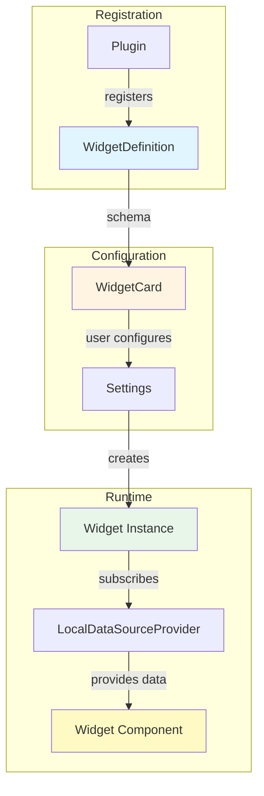

# Widgets System

The widgets system in ORMI-CORE V1 provides a plugin-based architecture for creating reusable, configurable dashboard components that can subscribe to datasource topics and display data.

## Overview

### Core Concepts

Widgets are React components with associated metadata that define:

1. **Configuration Schema** - JSON Schema for widget settings
2. **UI Schema** - JSON Forms UI description for settings form
3. **Component** - React component that renders the widget content
4. **Data Requirements** - Topic types the widget can consume



## Core Interfaces

### WidgetDefinition

Defines a widget type that can be registered via plugins.

```typescript
interface WidgetDefinition {
    id: string; // Unique identifier (e.g., 'imu-visualizer')
    name: string; // Display name in widget list
    description: string; // Description shown in UI
    icon?: JSX.Element; // Icon for widget (lucide-react)

    titleProp?: string; // Property to use for instance title

    schema: JsonSchema; // JSON Schema for configuration
    uischema: UISchemaElement; // JSON Forms UI Schema
    data: any; // Default settings

    Component: (data: any) => JSX.Element; // Render function
}
```

**Example Definition:**

```typescript
import { Gauge } from 'lucide-react';

export const GaugeWidgetDefinition: WidgetDefinition = {
    id: 'gauge-widget',
    name: 'Gauge',
    description: 'Display numeric values in a gauge visualization',
    icon: <Gauge />,
    titleProp: 'title',

    schema: {
        type: 'object',
        properties: {
            title: {
                type: 'string',
                title: 'Title',
                default: 'Gauge'
            },
            datasource: {
                type: 'object',
                title: 'Data Source'
            },
            min: {
                type: 'number',
                title: 'Minimum Value',
                default: 0
            },
            max: {
                type: 'number',
                title: 'Maximum Value',
                default: 100
            },
            unit: {
                type: 'string',
                title: 'Unit',
                default: ''
            }
        },
        required: ['title', 'datasource']
    },

    uischema: {
        type: 'VerticalLayout',
        elements: [
            {
                type: 'Control',
                scope: '#/properties/title'
            },
            {
                type: 'TopicSelect',
                scope: '#/properties/datasource',
                options: {
                    dataRequirements: {
                        accepts: ['number', 'float', 'int']
                    }
                }
            },
            {
                type: 'HorizontalLayout',
                elements: [
                    {
                        type: 'Control',
                        scope: '#/properties/min'
                    },
                    {
                        type: 'Control',
                        scope: '#/properties/max'
                    }
                ]
            },
            {
                type: 'Control',
                scope: '#/properties/unit'
            }
        ]
    },

    data: {
        title: 'Gauge',
        datasource: null,
        min: 0,
        max: 100,
        unit: ''
    },

    Component: GaugeWidget
};
```

## Runtime Rendering

Widgets are rendered via a memoized host and subscribe to their own settings through per-widget atoms. Layout changes do not trigger widget re-renders unless the widget settings change.

**Key points:**

- Widget instances are isolated by `box_id`
- Updates are immutable (new settings object per update)
- Use `widgetAtomFamily(boxId)` to subscribe to a single widget

```typescript
import { useAtomValue } from "jotai";
import { widgetAtomFamily } from "@workspace/ormi-core/dashboard/atoms";

const widget = useAtomValue(widgetAtomFamily(boxId));
```

### Widget

Runtime instance of a widget with user-configured settings.

```typescript
interface Widget {
    widget_id: string; // References WidgetDefinition.id
    box_id: string; // Unique instance ID (e.g., 'widget_0_1234567890')
    title: string; // User-assigned title
    settings: any; // Configuration data
}
```

**Example Instance:**

```typescript
const widgetInstance: Widget = {
    widget_id: "gauge-widget",
    box_id: "widget_0_1703001234",
    title: "Motor Temperature",
    settings: {
        title: "Motor Temperature",
        datasource: {
            topic: "/motor/temp",
            datasource_id: "ros-1",
            type: "number",
            property: "temperature",
        },
        min: 0,
        max: 150,
        unit: "°C",
    },
};
```

### DataRequirements

Specifies what data types a widget can accept.

```typescript
interface DataRequirements {
    accepts: string[]; // Webapp types: ['number', 'Vector3', 'IMU', etc.]
}
```

**Usage in UI Schema:**

```typescript
{
    type: 'TopicSelect',
    scope: '#/properties/datasource',
    options: {
        dataRequirements: {
            accepts: ['Vector3', 'Twist'] // Only show compatible topics
        }
    }
}
```

### TopicSelectElement

Custom UI Schema element for topic selection.

```typescript
interface TopicSelectElement extends Omit<ControlElement, "type"> {
    type: "TopicSelect";
    options?: {
        dataRequirements?: DataRequirements;
    };
}
```

This renders a topic picker that:

- Lists available topics from all datasources
- Filters by `dataRequirements.accepts`
- Allows property extraction (dot notation)
- Stores `SelectedTopic` object

## Widget Registration

Widgets are registered via the plugin system using the `WIDGETS_LIST` hook.

### Registration via Plugin

```typescript
import { Plugin, PluginsHooks } from "@workspace/ormi-plugins";
import { GaugeWidgetDefinition } from "./widgets/gauge";
import { ChartWidgetDefinition } from "./widgets/chart";

class MyWidgetsPlugin extends Plugin {
    constructor() {
        super({
            name: "My Widgets",
            version: "1.0.0",
        });

        this.addFilter(PluginsHooks.WIDGETS_LIST, {
            id: "my-widgets-registration",
            priority: 10,
            filter: (widgets) => {
                widgets.push(GaugeWidgetDefinition);
                widgets.push(ChartWidgetDefinition);
                return widgets;
            },
        });
    }
}

export default MyWidgetsPlugin;
```

### Registration in Plugin Export

```typescript
// src/widget-export.tsx
export const widgetExport = (widgets: WidgetDefinition[]) => {
    widgets.push(GaugeWidgetDefinition);
    widgets.push(ChartWidgetDefinition);
    widgets.push(MapWidgetDefinition);

    return widgets;
};
```

**Note:** Widgets are only shown if compatible datasources are connected. See [Datasource Filtering](#datasource-filtering).

## Widget Configuration

### WidgetCard Component

`WidgetCard` provides a configuration dialog for widgets using JSON Forms.

**Props:**

```typescript
interface WidgetCardProps {
    displayType?: "card" | "list" | "gear"; // Visual style
    definition: WidgetDefinition; // Widget definition
    data?: any; // Initial settings
    onValidate: (widget: WidgetDefinition, settings: object) => void;
    fromLoaded?: boolean; // Show "Save as Template" button
    isDialogOpen?: boolean; // Controlled dialog state
    onDialogClose?: () => void; // Dialog close callback
}
```

**Display Types:**

1. **Card** - Large card with icon and description (used in WidgetsDialog)
2. **List** - Compact list item with icon and name (used in WidgetsCombo)
3. **Gear** - Just a gear icon button (used in dashboard for settings)

**Usage Examples:**

```typescript
// Card display in widget gallery
<WidgetCard
    definition={widgetDef}
    onValidate={(widget, settings) => addWidget(widget, settings)}
/>

// Gear icon for existing widget configuration
<WidgetCard
    definition={widgetDef}
    data={existingSettings}
    fromLoaded={true}
    displayType="gear"
    onValidate={(widget, settings) => updateWidget(widget.box_id, settings)}
/>

// Controlled dialog (FlexLayout)
<WidgetCard
    definition={widgetDef}
    data={existingSettings}
    displayType="gear"
    isDialogOpen={isOpen}
    onDialogClose={closeDialog}
    onValidate={(widget, settings) => updateWidget(widget.box_id, settings)}
/>
```

### JSON Forms Integration

WidgetCard uses JSON Forms with custom renderers:

```typescript
import { JsonForms } from '@jsonforms/react';
import { materialRenderers, materialCells } from '@jsonforms/material-renderers';
import { shadcnRenderer, shadcnCells } from '@workspace/ormi-jsonforms';
import { coreRenderer } from '../../../renderers';

const renderers = [
    ...materialRenderers,  // Material-UI renderers
    ...shadcnRenderer,     // shadcn/ui renderers
    ...coreRenderer        // Custom ORMI renderers (TopicSelect, etc.)
];

const cellsRenderers = [
    ...materialCells,
    ...shadcnCells
];

<JsonForms
    schema={widgetDef.schema}
    uischema={widgetDef.uischema}
    data={data}
    renderers={renderers}
    cells={cellsRenderers}
    onChange={({ data, errors }) => {
        setData(data);
        setErrors(errors);
    }}
/>
```

**Features:**

- Automatic form generation from JSON Schema
- Custom UI rendering via UI Schema
- Built-in validation
- Error messages via toast notifications
- "Save as Template" button for existing widgets

### Validation

WidgetCard validates settings before calling `onValidate`:

```typescript
const handleAdd = () => {
    if (errors && errors.length > 0) {
        for (const error of errors) {
            toast("Error: " + error.message);
        }
        return;
    }

    props.onValidate(props.definition, data);
};
```

**Validation Sources:**

- JSON Schema `required` fields
- JSON Schema type constraints
- Custom validators in schema
- Pattern matching (regex)

## Widget Dialogs and Pickers

### WidgetsDialog

Floating action button that opens a modal gallery of available widgets.

**Features:**

- Displays widgets as cards with icons and descriptions
- Filters widgets based on connected datasources
- Opens WidgetCard for configuration
- Adds widget to dashboard on validation
- Only visible when dashboard is unlocked

**Usage:**

```typescript
import { WidgetsDialog } from '@workspace/ormi-core/widgets';

function Dashboard() {
    return (
        <div>
            {/* Dashboard content */}
            <WidgetsDialog />
        </div>
    );
}
```

**Implementation:**

```typescript
export function WidgetsDialog() {
    const [isOpen, setIsOpen] = useState(false);
    const pluginsManager = usePluginsManager();
    const { addWidget, locked } = useDashboardManager();

    // Get filtered widgets
    const widgets = pluginsManager.applyFilter<WidgetDefinition[]>(
        PluginsHooks.WIDGETS_LIST,
        []
    );

    const handleValidate = (widget: WidgetDefinition, settings: object) => {
        addWidget(widget, settings);
        setIsOpen(false);
    };

    return (
        !locked && (
            <Dialog open={isOpen} onOpenChange={setIsOpen}>
                <DialogTrigger asChild>
                    <Button className={style.floatingButton}>
                        <Plus size={32} />
                    </Button>
                </DialogTrigger>
                <DialogContent size="large">
                    {/* Widget cards */}
                    {widgets.map(widget => (
                        <WidgetCard
                            key={widget.id}
                            definition={widget}
                            onValidate={handleValidate}
                        />
                    ))}
                </DialogContent>
            </Dialog>
        )
    );
}
```

### WidgetsCombo

Searchable dropdown for quickly adding widgets (used in navbar).

**Features:**

- Compact dropdown with search
- Hover cards show descriptions
- Faster than opening full dialog
- Same filtering as WidgetsDialog

**Usage:**

```typescript
import { WidgetsCombo } from '@workspace/ormi-core/widgets';

// In navbar integration
setNavbarItem("center", "widgets_combo",
    <WidgetsCombo onValidate={(widget, settings) => addWidget(widget, settings)} />
);
```

**Implementation:**

```typescript
export function WidgetsCombo(props: {
    onValidate: (widget: WidgetDefinition, settings: object) => void
}) {
    const [open, setOpen] = useState(false);
    const pluginsManager = usePluginsManager();
    const widgets = pluginsManager.applyFilter<WidgetDefinition[]>(
        PluginsHooks.WIDGETS_LIST,
        []
    );

    return (
        <Popover open={open} onOpenChange={setOpen}>
            <PopoverTrigger asChild>
                <Button variant="outline">
                    Select a widget <Search />
                </Button>
            </PopoverTrigger>
            <PopoverContent>
                <Command>
                    <CommandInput placeholder="Search widgets..." />
                    <CommandList>
                        {widgets.map(widget => (
                            <CommandItem key={widget.id}>
                                <HoverCard>
                                    <HoverCardTrigger>
                                        <WidgetCard
                                            definition={widget}
                                            displayType="list"
                                            onValidate={props.onValidate}
                                        />
                                    </HoverCardTrigger>
                                    <HoverCardContent>
                                        {widget.description}
                                    </HoverCardContent>
                                </HoverCard>
                            </CommandItem>
                        ))}
                    </CommandList>
                </Command>
            </PopoverContent>
        </Popover>
    );
}
```

## Widget Lifecycle

### 1. Definition Phase

Widget is defined in a plugin:

```typescript
const MyWidgetDefinition: WidgetDefinition = {
    id: "my-widget",
    name: "My Widget",
    // ... configuration
    Component: MyWidget,
};
```

### 2. Registration Phase

Plugin registers widget via `WIDGETS_LIST` hook:

```typescript
pluginsManager.addFilter(PluginsHooks.WIDGETS_LIST, {
    id: "my-widget-registration",
    filter: (widgets) => {
        widgets.push(MyWidgetDefinition);
        return widgets;
    },
});
```

### 3. Filtering Phase

GlobalDataSourceProvider filters widgets based on connected datasources:

```typescript
pluginsManager.addFilter(PluginsHooks.WIDGETS_LIST, {
    id: "filter_widgets_list_based_on_datasources",
    priority: Number.MAX_SAFE_INTEGER, // Runs last
    filter: (widgets) => {
        const datasources = pluginsManager.applyFilter(
            PluginsHooks.AVAILABLE_DATASOURCES,
            [],
        );

        if (datasources.length === 0) {
            return []; // No datasources = no widgets
        }

        return pluginsManager.applyFilter(
            PluginsHooks.WIDGET_LIST_WITH_DATASOURCE,
            widgets,
            datasources,
        );
    },
});
```

### 4. Configuration Phase

User selects widget and configures it via WidgetCard:

```typescript
// User opens widget picker
<WidgetsDialog />

// User selects widget and configures
<WidgetCard definition={widgetDef} onValidate={handleValidate} />

// onValidate called with settings
handleValidate(widgetDef, settings);
```

### 5. Creation Phase

Dashboard creates widget instance:

```typescript
const addWidget = (widget: WidgetDefinition, settings: any) => {
    const newWidgets = new Map(widgets);
    const box_id = `widget_${newWidgets.size}_${Date.now()}`;

    const widgetInstance = {
        widget_id: widget.id,
        box_id: box_id,
        title: settings[widget.titleProp] || widget.name,
        settings: settings,
    };

    newWidgets.set(box_id, widgetInstance);
    dispatch({ type: "SET_WIDGETS", payload: newWidgets });
};
```

### 6. Render Phase

Dashboard renders widget using `getComponents`:

```typescript
const getComponents = (boxId: string) => {
    const widget = widgets.get(boxId);
    if (!widget) return widgetNotFound(boxId);

    const widgetDef = availableWidgets.find(w => w.id === widget.widget_id);
    if (!widgetDef) return widgetNotFound(boxId);

    return widgetDef.Component(widget.settings);
};

// In layout rendering
<div key={widget.box_id}>
    {getComponents(widget.box_id)}
</div>
```

### 7. Subscription Phase

Widget wraps content in LocalDataSourceProvider:

```typescript
function MyWidget(settings: any) {
    const topics: SelectedTopic[] = [settings.datasource];

    return (
        <LocalDataSourcesProvider
            SelectedTopics={topics}
            buffersSize={100}
            updateFrequency={30}
        >
            <MyWidgetContent settings={settings} />
        </LocalDataSourcesProvider>
    );
}
```

### 8. Data Flow Phase

Widget receives data via `useLocalDataSource`:

```typescript
function MyWidgetContent({ settings }) {
    const { getSource } = useLocalDataSource();
    const source = getSource(settings.datasource);

    const latestValue = source?.data[source.data.length - 1];

    return <div>{latestValue}</div>;
}
```

### 9. Update Phase

User can reconfigure widget via settings gear:

```typescript
<WidgetCard
    definition={widgetDef}
    data={widget.settings}
    fromLoaded={true}
    displayType="gear"
    onValidate={(widgetDef, newSettings) => {
        updateWidget(widget.box_id, newSettings);
    }}
/>
```

### 10. Removal Phase

Widget is removed from dashboard:

```typescript
const removeWidget = (box_id: string) => {
    const newWidgets = new Map(widgets);
    newWidgets.delete(box_id);
    dispatch({ type: "SET_WIDGETS", payload: newWidgets });
};

// LocalDataSourceProvider unmounts
// Unsubscribes from topics
// Datasource stops streaming if no other subscribers
```

## Datasource Filtering

Widgets are automatically filtered based on connected datasources to prevent confusion.

### Why Filter?

- Prevents showing widgets that can't receive data
- Improves user experience
- Encourages proper datasource setup

### How It Works

```typescript
// In GlobalDataSourceProvider
pluginsManager.addFilter(PluginsHooks.WIDGETS_LIST, {
    id: "filter_widgets_list_based_on_datasources",
    priority: Number.MAX_SAFE_INTEGER, // Last filter
    filter: (widgets: WidgetDefinition[]) => {
        const datasources = pluginsManager.applyFilter<Datasource[]>(
            PluginsHooks.AVAILABLE_DATASOURCES,
            [],
        );

        // No datasources = no widgets
        if (datasources.length === 0) {
            return [];
        }

        // Apply secondary filter
        return pluginsManager.applyFilter<WidgetDefinition[]>(
            PluginsHooks.WIDGET_LIST_WITH_DATASOURCE,
            widgets,
            datasources,
        );
    },
});
```

### Custom Filtering

Plugins can implement custom filtering logic:

```typescript
// In widget plugin
pluginsManager.addFilter(PluginsHooks.WIDGET_LIST_WITH_DATASOURCE, {
    id: "my-widget-datasource-filter",
    priority: 10,
    filter: (widgets, datasources) => {
        // Only show ROS-specific widgets if ROS datasource connected
        const hasROS = datasources.some((ds) =>
            ds.datasource_id.includes("ros"),
        );

        if (!hasROS) {
            // Filter out ROS-specific widgets
            return widgets.filter((w) => !w.id.startsWith("ros-"));
        }

        return widgets;
    },
});
```

## Widget Component Patterns

### Basic Widget

```typescript
function SimpleWidget(settings: { title: string, value: number }) {
    return (
        <div>
            <h3>{settings.title}</h3>
            <p>Value: {settings.value}</p>
        </div>
    );
}
```

### Widget with Data Subscription

```typescript
function DataWidget(settings: {
    title: string,
    datasource: SelectedTopic
}) {
    const topics = [settings.datasource];

    return (
        <LocalDataSourcesProvider
            SelectedTopics={topics}
            buffersSize={100}
            updateFrequency={30}
        >
            <DataWidgetContent settings={settings} />
        </LocalDataSourcesProvider>
    );
}

function DataWidgetContent({ settings }) {
    const { getSource } = useLocalDataSource();
    const source = getSource(settings.datasource);

    if (!source || source.data.length === 0) {
        return <div>No data</div>;
    }

    const latestValue = source.data[source.data.length - 1];

    return (
        <div>
            <h3>{settings.title}</h3>
            <p>Value: {latestValue}</p>
        </div>
    );
}
```

### Widget with Multiple Topics

```typescript
function MultiTopicWidget(settings: {
    title: string,
    position: SelectedTopic,
    velocity: SelectedTopic
}) {
    const topics = [settings.position, settings.velocity];

    return (
        <LocalDataSourcesProvider
            SelectedTopics={topics}
            buffersSize={50}
        >
            <MultiTopicContent settings={settings} />
        </LocalDataSourcesProvider>
    );
}

function MultiTopicContent({ settings }) {
    const { getSource } = useLocalDataSource();

    const positionSource = getSource(settings.position);
    const velocitySource = getSource(settings.velocity);

    const position = positionSource?.data[positionSource.data.length - 1];
    const velocity = velocitySource?.data[velocitySource.data.length - 1];

    return (
        <div>
            <h3>{settings.title}</h3>
            <div>Position: {position}</div>
            <div>Velocity: {velocity}</div>
        </div>
    );
}
```

### Widget with ButtonHolder

```typescript
import { useButtonHolder } from '@workspace/ui/combined/ButtonHolder';

function InteractiveWidget(settings: any) {
    return (
        <LocalDataSourcesProvider SelectedTopics={[settings.datasource]}>
            <InteractiveContent settings={settings} />
        </LocalDataSourcesProvider>
    );
}

function InteractiveContent({ settings }) {
    const { setButtonItem, removeButtonItem } = useButtonHolder();
    const [paused, setPaused] = useState(false);

    useEffect(() => {
        setButtonItem(
            'pause-button',
            <Button onClick={() => setPaused(!paused)}>
                {paused ? <Play /> : <Pause />}
            </Button>,
            1
        );

        return () => removeButtonItem('pause-button');
    }, [paused]);

    // Widget rendering...
}
```

### Widget with Charts

```typescript
import { LineChart } from 'recharts';

function ChartWidget(settings: {
    title: string,
    datasource: SelectedTopic,
    historySize: number
}) {
    const topics = [settings.datasource];

    return (
        <LocalDataSourcesProvider
            SelectedTopics={topics}
            buffersSize={settings.historySize}
            updateFrequency={10} // 10Hz for charts
        >
            <ChartContent settings={settings} />
        </LocalDataSourcesProvider>
    );
}

function ChartContent({ settings }) {
    const { getSource } = useLocalDataSource();
    const source = getSource(settings.datasource);

    if (!source) return <div>No data</div>;

    const chartData = source.data.map((value, index) => ({
        time: source.times[index],
        value: value
    }));

    return (
        <div>
            <h3>{settings.title}</h3>
            <LineChart data={chartData}>
                {/* Chart configuration */}
            </LineChart>
        </div>
    );
}
```

## Best Practices

### 1. Use titleProp

Specify which property contains the widget title:

```typescript
const widgetDef: WidgetDefinition = {
    // ...
    titleProp: "title", // or 'name', 'label', etc.
    schema: {
        properties: {
            title: { type: "string", default: "My Widget" },
        },
    },
};
```

### 2. Provide Good Defaults

Make widgets immediately usable:

```typescript
data: {
    title: 'Temperature Gauge',
    min: 0,
    max: 100,
    unit: '°C',
    showHistory: false
}
```

### 3. Use DataRequirements

Filter topics to compatible types:

```typescript
{
    type: 'TopicSelect',
    scope: '#/properties/datasource',
    options: {
        dataRequirements: {
            accepts: ['number', 'float', 'int']
        }
    }
}
```

### 4. Validate Required Fields

Mark essential fields as required:

```typescript
schema: {
    type: 'object',
    properties: {
        title: { type: 'string' },
        datasource: { type: 'object' }
    },
    required: ['title', 'datasource']
}
```

### 5. Handle Missing Data

Gracefully handle missing or loading data:

```typescript
const source = getSource(settings.datasource);

if (!source) {
    return <div>Connecting...</div>;
}

if (source.data.length === 0) {
    return <div>Waiting for data...</div>;
}

// Render with data
```

### 6. Choose Appropriate Update Frequency

Match frequency to widget needs:

```typescript
// Real-time visualization
updateFrequency: 30; // 30Hz

// Charts
updateFrequency: 10; // 10Hz

// Status display
updateFrequency: 1; // 1Hz
```

### 7. Use Appropriate Buffer Sizes

Balance memory vs. history:

```typescript
// Live data only
buffersSize: 1;

// Short history for charts
buffersSize: 100;

// Long history for analysis
buffersSize: 1000;
```

### 8. Provide Clear Icons and Descriptions

Help users find the right widget:

```typescript
import { Gauge } from 'lucide-react';

const widgetDef: WidgetDefinition = {
    name: 'Gauge',
    description: 'Display numeric values in a circular gauge with min/max ranges',
    icon: <Gauge />,
    // ...
};
```

### 9. Use Semantic Property Names

Make configuration intuitive:

```typescript
// ✅ GOOD
properties: {
    title: { ... },
    datasource: { ... },
    refreshRate: { ... }
}

// ❌ BAD
properties: {
    t: { ... },
    ds: { ... },
    rr: { ... }
}
```

### 10. Group Related Settings

Use layouts to organize settings:

```typescript
uischema: {
    type: 'VerticalLayout',
    elements: [
        {
            type: 'Group',
            label: 'Data Source',
            elements: [/* datasource settings */]
        },
        {
            type: 'Group',
            label: 'Display Options',
            elements: [/* display settings */]
        },
        {
            type: 'Group',
            label: 'Thresholds',
            elements: [/* threshold settings */]
        }
    ]
}
```

## Common Patterns

### Pattern 1: Configuration with Conditional Fields

```typescript
schema: {
    properties: {
        mode: {
            type: 'string',
            enum: ['simple', 'advanced'],
            default: 'simple'
        },
        // Only shown in advanced mode
        advancedOption: {
            type: 'number'
        }
    }
},
uischema: {
    type: 'VerticalLayout',
    elements: [
        { type: 'Control', scope: '#/properties/mode' },
        {
            type: 'Control',
            scope: '#/properties/advancedOption',
            rule: {
                effect: 'SHOW',
                condition: {
                    scope: '#/properties/mode',
                    schema: { const: 'advanced' }
                }
            }
        }
    ]
}
```

### Pattern 2: Array of Topics

```typescript
schema: {
    properties: {
        topics: {
            type: 'array',
            items: {
                type: 'object',
                properties: {
                    label: { type: 'string' },
                    datasource: { type: 'object' }
                }
            }
        }
    }
},
uischema: {
    type: 'VerticalLayout',
    elements: [
        {
            type: 'Control',
            scope: '#/properties/topics',
            options: {
                elementLabelProp: 'label'
            }
        }
    ]
}
```

### Pattern 3: Color Picker

```typescript
schema: {
    properties: {
        color: {
            type: 'string',
            format: 'color',
            default: '#3b82f6'
        }
    }
},
uischema: {
    type: 'Control',
    scope: '#/properties/color'
}
```

## Troubleshooting

### Widget Not Appearing in List

**Causes:**

- Not registered via plugin
- Datasource filtering (no compatible datasources)
- Plugin not loaded

**Solution:**

```typescript
// Check if widget is registered
const widgets = pluginsManager.applyFilter(PluginsHooks.WIDGETS_LIST, []);
console.log(
    "Available widgets:",
    widgets.map((w) => w.id),
);

// Check if datasources are connected
const datasources = pluginsManager.applyFilter(
    PluginsHooks.AVAILABLE_DATASOURCES,
    [],
);
console.log("Connected datasources:", datasources);
```

### Widget Not Receiving Data

**Causes:**

- Topic not subscribed
- Datasource not publishing
- Property extraction incorrect

**Solution:** See [Datasources Documentation - Troubleshooting](/docs/v1/core/datasources#troubleshooting)

### Configuration Form Not Showing

**Causes:**

- Invalid JSON Schema
- Invalid UI Schema
- Missing renderer for custom element

**Solution:**

```typescript
// Validate schema
try {
    JSON.parse(JSON.stringify(widgetDef.schema));
    console.log('Schema valid');
} catch (error) {
    console.error('Invalid schema:', error);
}

// Check for custom renderers
if (uischema has TopicSelect) {
    // Ensure coreRenderer is included
    renderers: [...coreRenderer]
}
```

### Widget Title Not Updating

**Cause:** `titleProp` not set or incorrect

**Solution:**

```typescript
const widgetDef: WidgetDefinition = {
    titleProp: "title", // Property name in settings
    schema: {
        properties: {
            title: { type: "string", default: "My Widget" },
        },
    },
};
```

## Summary

The V1 widgets system provides:

- **Plugin-Based Registration** - Widgets registered via `WIDGETS_LIST` hook
- **JSON Schema Configuration** - Automatic form generation
- **JSON Forms Integration** - Rich UI customization
- **DataRequirements Filtering** - Show only compatible topics
- **Multiple UI Components** - WidgetsDialog, WidgetsCombo, WidgetCard
- **Datasource Integration** - Automatic filtering based on connections
- **Lifecycle Management** - From registration to removal

**Key Components:**

- `WidgetDefinition` - Widget type definition
- `Widget` - Runtime instance
- `WidgetCard` - Configuration dialog
- `WidgetsDialog` - Widget gallery
- `WidgetsCombo` - Quick picker
- `DataRequirements` - Type filtering

This architecture enables rich, configurable widgets while maintaining clean separation between widget logic and dashboard management.
