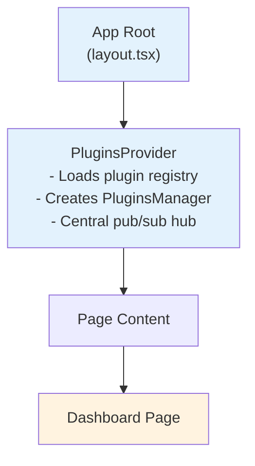
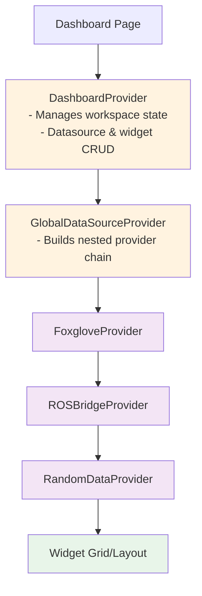
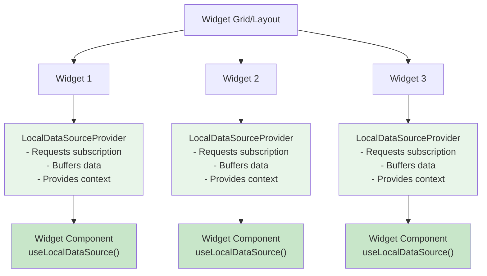

# ORMI-CORE Developer Documentation

Welcome to the ORMI-CORE developer documentation. This guide covers everything you need to extend the webapp through plugins, widgets, datasources, and custom renderers.

## What is ORMI-CORE?

ORMI-CORE is a **modular, plugin-based framework** for building real-time data visualization dashboards. It provides a flexible architecture where developers can:

- Create **custom widgets** for data visualization
- Implement **datasources** to connect to various data streams (ROS2, WebSocket, REST APIs)
- Build **plugins** that extend functionality through a powerful hooks system
- Add **custom JSON Forms renderers** for specialized UI components
- Define **templates** for reusable configurations
- Implement **data transforms** for coordinate system conversions

## Architecture Overview

### 1. Application Hierarchy



**Key:** PluginsProvider wraps the entire application and provides the PluginManager instance.

### 2. Dashboard Provider Chain



**Key:** GlobalDataSourceProvider nests all datasource providers using `reduceRight()`, so data flows through all datasources before reaching widgets.

### 3. Widget Data Sources



**Key:** Each widget is wrapped in its own LocalDataSourceProvider for independent data subscription and buffering.

### 4. Data Flow (Pub/Sub Pattern)

```mermaid
graph TB
    subgraph Init["Initialization (Widget Mount)"]
        direction LR
        W1["Widget Mounts"]
        W1 -->|"1. addAction({datasource}-{topic}-published)"| PM1["PluginManager"]
        W1 -->|"2. WaitAndDoAction({datasource}-subscribe)"| PM1
        PM1 -->|"Request received"| DS1["Datasource<br/>starts streaming"]
    end

    subgraph Runtime["Runtime (Data Arrives)"]
        direction LR
        DS2["Datasource<br/>publishes"]
        DS2 -->|"3. doAction({datasource}-{topic}-published)"| PM2["PluginManager<br/>broadcasts"]
        PM2 -->|"4. Execute callback"| L1["LocalDataSourceProvider<br/>buffers data"]
        L1 -->|"5. Update state"| W2["Widget re-renders"]
    end

    style W1 fill:#c8e6c9
    style PM1 fill:#ffecb3
    style DS1 fill:#f3e5f5
    style DS2 fill:#f3e5f5
    style PM2 fill:#ffecb3
    style L1 fill:#e8f5e9
    style W2 fill:#c8e6c9
```



**Key:**

- **Initialization:** LocalDataSourceProvider requests subscription when widget mounts
- **Runtime:** Datasource publishes data, PluginManager routes to all callbacks, widget re-renders

## Extension Points

ORMI-CORE provides multiple extension mechanisms:

### 1. **Plugins**

The foundation of extensibility. Plugins use a **hooks and filters** system to inject functionality.

**Use plugins to:**

- Register widgets and datasources
- Add custom JSON Forms renderers
- Extend transform systems
- Provide map visualizers
- Add any cross-cutting functionality

### 2. **Widgets**

React components that visualize or interact with data.

**Create widgets for:**

- Data visualization (charts, maps, 3D views)
- Control interfaces (joystick, keyboard)
- Status indicators
- Custom UI components

### 3. **Datasources**

React Providers that connect to data sources and publish to topics.

**Build datasources for:**

- WebSocket connections (ROS2, Foxglove)
- REST APIs
- Hardware interfaces
- Data generators
- File playback systems

### 4. **Custom Renderers**

JSON Forms renderers for specialized input controls.

**Add renderers for:**

- Topic selection
- Complex configuration UIs
- Custom data type editors

### 5. **Transforms**

Coordinate system transformations for robotics applications.

**Implement transforms for:**

- TF tree management
- Coordinate frame conversions
- Sensor fusion

## Quick Start

### For Widget Developers

```typescript
// Create a custom widget
export function MyWidgetDefinition(): WidgetDefinition {
  return {
    id: 'my-widget',
    name: 'My Custom Widget',
    description: 'Does something cool',
    schema: { /* JSON Schema */ },
    uischema: { /* UI Schema */ },
    data: { /* default data */ },
    Component: (data) => <MyWidget {...data} />
  }
}
```

### For Datasource Developers

```typescript
// Create a custom datasource
export const MyDatasourceDefinition: DatasourceDefinition = {
  id: 'my-datasource',
  name: 'My Data Source',
  schema: { /* config schema */ },
  data: { /* default config */ },
  Provider: ({ children, props }) => (
    <MyDatasourceProvider {...props}>
      {children}
    </MyDatasourceProvider>
  )
}
```

### For Plugin Developers

```typescript
// Create a plugin that registers extensions
class MyPlugin extends Plugin {
    constructor() {
        super();
        this.name = "My Plugin";

        // Register widgets
        this.addFilter(PluginsHooks.WIDGETS_LIST, {
            id: "my-widgets",
            priority: 10,
            filter: (widgets) => {
                widgets.push(MyWidgetDefinition());
                return widgets;
            },
        });

        // Register datasources
        this.addFilter(PluginsHooks.DATASOURCES_LIST, {
            id: "my-datasources",
            priority: 10,
            filter: (datasources) => {
                datasources.push(MyDatasourceDefinition);
                return datasources;
            },
        });
    }
}
```

## Documentation Structure

### Core Concepts

- **[Plugin System](core/plugin-system)** - Hooks, filters, and the plugin architecture
- **[Data Flow](core/data-flow)** - How data moves from datasources to widgets
- **[Type System](core/type-system)** - Internal types and raw type conversions

### API Reference

- **[Plugin API](api/plugin-api)** - Plugin class and PluginManager reference
- **[Widget API](api/widget-api)** - Complete widget interface documentation
- **[Datasource API](api/datasource-api)** - Datasource implementation guide

### Guides

- **[Creating a Plugin](guides/creating-plugin)** - Step-by-step plugin development
- **[Development Setup](guides/development-setup)** - Environment configuration
- **[Quick Reference](guides/quick-reference)** - Common patterns and code snippets

## Getting Started

1. **Understand the architecture** - Read [Plugin System](core/plugin-system) and [Data Flow](core/data-flow)
2. **Choose your extension point** - Widget, Datasource, or Plugin?
3. **Follow the guide** - Step-by-step instructions in [Creating a Plugin](guides/creating-plugin)
4. **Reference the API** - Detailed interfaces in the API Reference section

## Development Environment

ORMI-CORE is a monorepo using:

- **Turborepo** for build orchestration
- **TypeScript** for type safety
- **React** for UI components
- **JSON Forms** for configuration UIs
- **Bun** for package management

See [Development Setup](guides/development-setup) for complete environment configuration.
