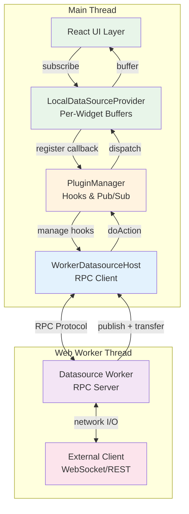

# ORMI-CORE Developer Documentation

Welcome to the ORMI-CORE developer documentation. This guide covers everything you need to extend the webapp through plugins, widgets, datasources, and custom renderers.

## What is ORMI-CORE?

ORMI-CORE is a **modular, plugin-based framework** for building real-time data visualization dashboards. It provides a flexible architecture where developers can:

- Create **custom widgets** for data visualization
- Implement **datasources** to connect to various data streams (ROS2, WebSocket, REST APIs)
- Build **plugins** that extend functionality through a powerful hooks system
- Add **custom JSON Forms renderers** for specialized UI components
- Define **templates** for reusable configurations
- Implement **data transforms** for coordinate system conversions

## Architecture Overview



**V1 Architecture:**

1. **Worker-Based Datasources**: Heavy I/O operations run in Web Workers via RPC protocol
2. **PluginManager Hub**: Type-safe hooks system for datasource registration and pub/sub
3. **LocalDataSourceProvider**: Per-widget subscription management with buffering (30Hz updates)
4. **Zero-Copy Transfers**: Transferable objects for large data (Float32Array for point clouds)
5. **Transform System**: Jotai atoms for coordinate system transformations

## Extension Points

ORMI-CORE provides multiple extension mechanisms:

### 1. **Plugins**

The foundation of extensibility. Plugins use a **hooks and filters** system to inject functionality.

**Use plugins to:**

- Register widgets and datasources
- Add custom JSON Forms renderers
- Extend transform systems
- Provide map visualizers
- Add any cross-cutting functionality

### 2. **Widgets**

React components that visualize or interact with data.

**Create widgets for:**

- Data visualization (charts, maps, 3D views)
- Control interfaces (joystick, keyboard)
- Status indicators
- Custom UI components

### 3. **Datasources**

Web Worker implementations that connect to data sources via RPC protocol.

**Build datasources for:**

- WebSocket connections (ROS2, Foxglove) - runs in dedicated worker
- REST APIs - non-blocking network I/O
- Hardware interfaces - isolated from main thread
- Data generators - CPU-intensive operations offloaded
- File playback systems - streaming without blocking UI

### 4. **Custom Renderers**

JSON Forms renderers for specialized input controls.

**Add renderers for:**

- Topic selection
- Complex configuration UIs
- Custom data type editors

### 5. **Transforms**

Coordinate system transformations using Jotai atoms.

**Implement transforms for:**

- TF tree management (event-driven via atoms)
- Coordinate frame conversions
- GPS coordinate mapping
- Multi-sensor fusion

## Performance Features

### Worker Architecture

Datasources run in dedicated Web Workers:

- **Non-blocking I/O**: Network operations don't freeze the UI
- **Transferable Objects**: Zero-copy transfers for large data (Float32Array)
- **CPU Isolation**: Heavy processing doesn't impact rendering
- **Better Responsiveness**: Main thread remains available for user interactions

### Optimized Data Flow

- **Buffered Updates**: LocalDataSourceProvider batches at 30Hz (configurable)
- **Typed RPC**: Type-safe communication between main thread and workers
- **Graceful Shutdown**: Workers clean up resources with 5s timeout
- **Error Isolation**: Worker crashes don't bring down the main app

## Quick Start

### Widget Example

```typescript
export function MyWidgetDefinition(): WidgetDefinition {
  return {
    id: 'my-widget',
    name: 'My Custom Widget',
    schema: { /* JSON Schema */ },
    uischema: { /* UI Schema */ },
    Component: (data) => <MyWidget {...data} />
  }
}
```

### Worker-Based Datasource Example

```typescript
// worker.ts
import { createDatasourceWorker } from '@workspace/ormi-core/datasources/worker';

createDatasourceWorker<MySettings>((ctx) => ({
  async init(settings) {
    // Initialize connection
  },

  async listTopics() {
    return [{ topic: '/data', type: 'MyType', ... }];
  },

  async subscribe(topic) {
    // Start streaming, use ctx.publish() to emit data
    ctx.publish(topic.topic, data, Date.now(), frameId, [arrayBuffer]);
  },

  async unsubscribe(topic) {
    // Stop streaming
  },

  async shutdown() {
    // Clean up resources
  }
}));

// provider.tsx
const MyDatasourceDefinition: DatasourceDefinition = {
  id: 'my-datasource',
  name: 'My Data Source',
  schema: { /* config schema */ },
  Provider: ({ children, props }) => (
    <MyWorkerHost datasourceId={props.id} settings={props}>
      {children}
    </MyWorkerHost>
  )
}
```

### Plugin Example

```typescript
class MyPlugin extends Plugin {
  constructor() {
    super();
    this.name = "My Plugin";

    this.addFilter(PluginsHooks.WIDGETS_LIST, {
      id: "my-widgets",
      filter: (widgets) => {
        widgets.push(MyWidgetDefinition());
        return widgets;
      },
    });
  }
}
```

For complete examples with implementation details, see the **[Guides](guides/creating-plugin)** section.

## Documentation Structure

### Core Concepts

- **[Plugin System](core/plugin-system)** - Hooks, filters, and the plugin architecture
- **[Data Flow](core/data-flow)** - How data moves from datasources to widgets
- **[Type System](core/type-system)** - Internal types and raw type conversions

### API Reference

- **[Plugin API](api/plugin-api)** - Plugin class and PluginManager reference
- **[Widget API](api/widget-api)** - Complete widget interface documentation
- **[Datasource API](api/datasource-api)** - Datasource implementation guide
- **[ButtonHolder API](api/button-holder-api)** - Adding controls to widget title bars
- **[Templates API](api/templates-api)** - Saving and loading dashboard configurations
- **[Transforms API](api/transforms-api)** - Coordinate transformations and TF tree management
- **[Renderers API](api/renderers-api)** - Custom JSON Forms renderers
- **[Dashboard API](api/dashboard-api)** - Dashboard state management
- **[Type System API](api/type-system-api)** - Type conversions and standardized data types

### Guides

- **[Creating a Plugin](guides/creating-plugin)** - Step-by-step plugin development
- **[Development Setup](guides/development-setup)** - Environment configuration
- **[Quick Reference](guides/quick-reference)** - Common patterns and code snippets

## Getting Started

1. **[Plugin System](core/plugin-system)** - Learn hooks, filters, and plugin architecture
2. **[Data Flow](core/data-flow)** - Understand how data moves from datasources to widgets
3. **[Widget API](api/widget-api)** - Complete widget interface documentation
4. **[Datasource API](api/datasource-api)** - Datasource implementation guide
5. **[Creating a Plugin](guides/creating-plugin)** - Step-by-step plugin development
6. **[Development Setup](guides/development-setup)** - Environment configuration

## Development Environment

ORMI-CORE is a monorepo using:

- **Turborepo** for build orchestration
- **TypeScript** for type safety
- **React** for UI components
- **JSON Forms** for configuration UIs
- **Bun** for package management

See [Development Setup](guides/development-setup) for complete environment configuration.
