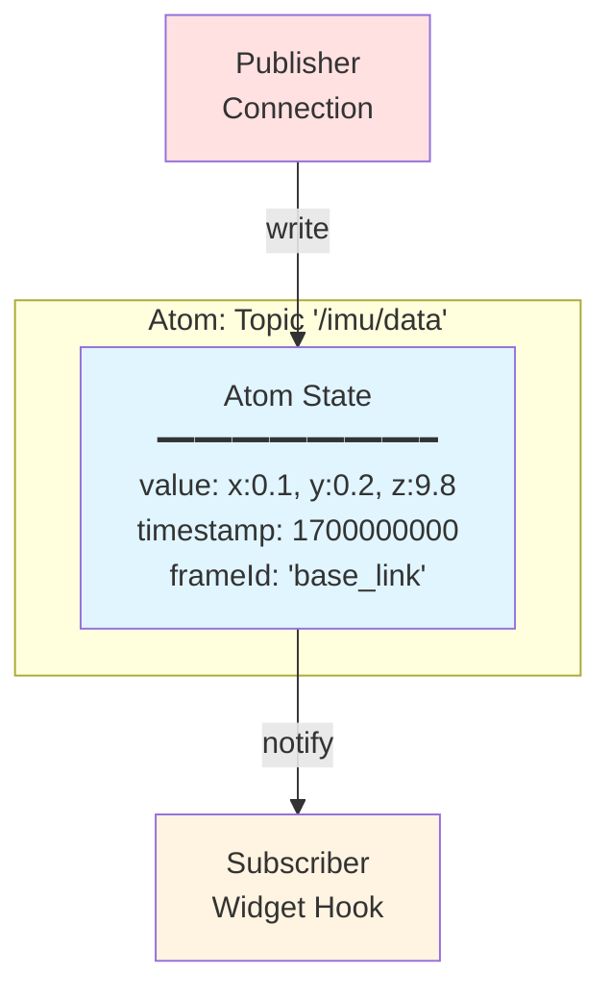
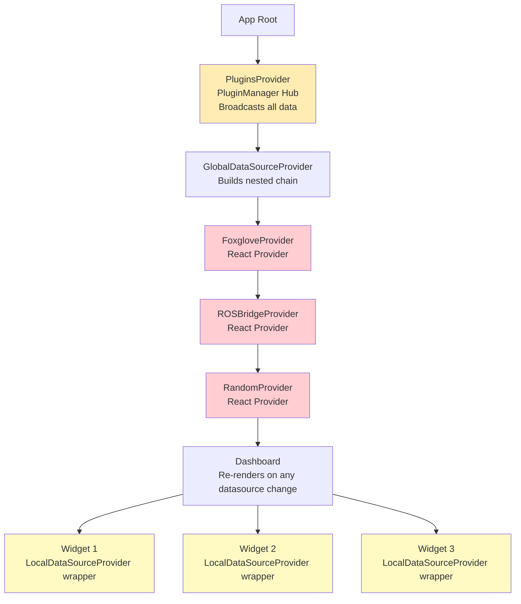
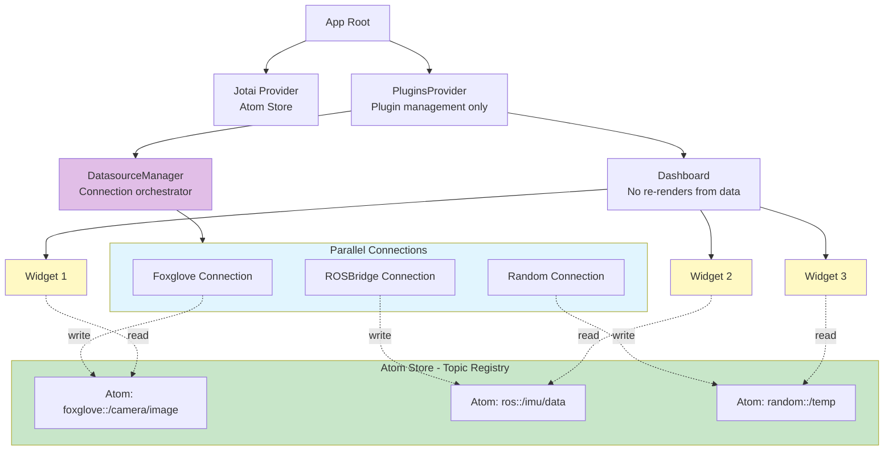
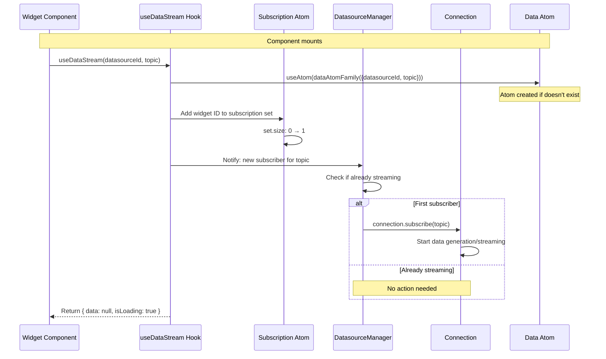
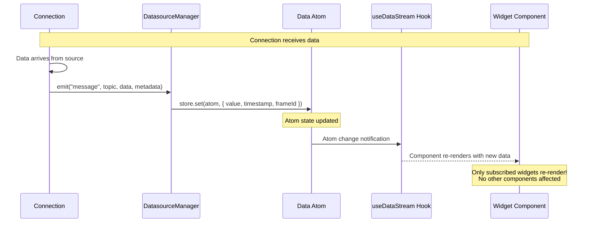
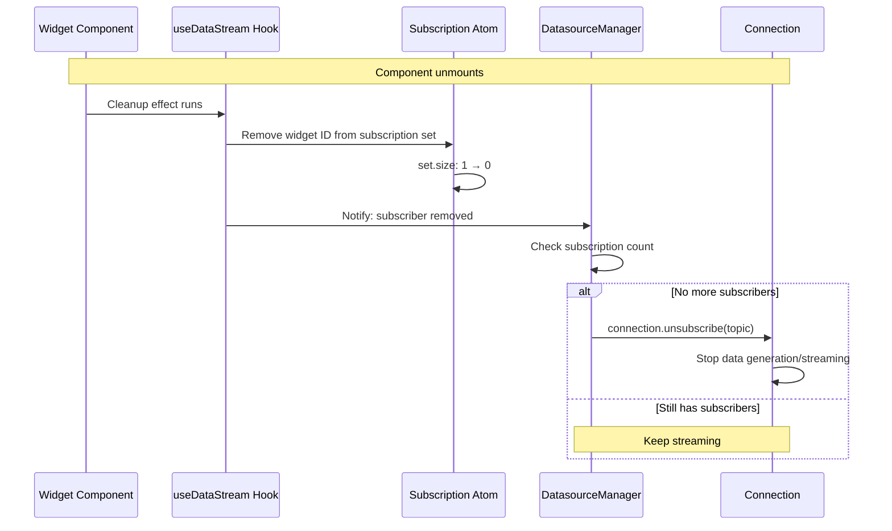

# V2 Architecture: Atoms as Topic Transport

## Overview

V2 fundamentally reimagines ORMI-CORE's data flow by using **Jotai atoms as an asynchronous topic transport layer**. Instead of nested React Providers and custom pub/sub, data flows through independent atom stores that act like message queues.

## Core Philosophy

### Data-Source Agnostic

The web application **never knows or cares** where data comes from:

- ✅ Data could be from ROS2, Foxglove, WebSocket, REST API, or random generators
- ✅ Widgets work identically regardless of data source
- ✅ No coupling between datasources and consumers
- ✅ Easy to swap datasources without changing widgets

### Async Topic Transport

Atoms function as **topic-based message queues**:



**Key properties:**

- **Automatic routing**: Write to atom, subscribers get notified automatically
- **Type-safe**: Each atom has a specific type
- **Decoupled**: Publishers and subscribers don't know about each other
- **Efficient**: Only components subscribed to specific atoms re-render
- **Buffer support**: Can store history of messages, not just latest

## Architecture Comparison

### V1: Nested Providers + Pub/Sub



**Problems:**

- **Deep nesting**: 5-7 levels deep
- **Cascading re-renders**: Parent provider updates trigger all children
- **Provider wrappers**: Every widget needs `LocalDataSourceProvider`
- **Pub/sub overhead**: PluginManager broadcasts to all callbacks
- **Sequential startup**: Datasources initialize in sequence
- **Tight coupling**: Order matters, datasources depend on nesting

### V2: Flat + Atom Store



**Benefits:**

- **Flat hierarchy**: 2-3 levels
- **No cascading**: Widget re-renders only on its own data changes
- **No wrappers**: Widgets use hooks directly
- **Direct atom access**: No pub/sub broadcasting
- **Parallel startup**: All connections initialize simultaneously
- **Zero coupling**: Connections completely independent

## Component Architecture

### 1. Jotai Provider (Atom Store)

The foundation of V2 - provides the atom store:

```typescript
// app/layout.tsx
import { Provider as JotaiProvider } from 'jotai'

export default function RootLayout({ children }) {
  return (
    <JotaiProvider>
      {children}
    </JotaiProvider>
  )
}
```

**Responsibilities:**

- Store all atoms (topic data, subscriptions, connection status)
- Handle atom subscriptions and notifications
- Provide DevTools integration
- Manage atom lifecycle

### 2. DatasourceManager

Orchestrates connections and manages the atom lifecycle:

```typescript
interface DatasourceManager {
    // Connection management
    addConnection(datasourceId: string, connection: Connection): void;
    removeConnection(datasourceId: string): void;

    // Subscription coordination
    subscribe(datasourceId: string, topic: string, subscriberId: string): void;
    unsubscribe(
        datasourceId: string,
        topic: string,
        subscriberId: string
    ): void;

    // Status monitoring
    getConnectionStatus(datasourceId: string): ConnectionStatus;
    listActiveSubscriptions(): Map<string, Set<string>>;
}
```

**Responsibilities:**

- Register Connection instances
- Listen to Connection events (`message`, `error`, `connected`, etc.)
- Write received data to appropriate atoms
- Track subscription counts via subscription atoms
- Start/stop connections based on demand

**Connection event flow:**

```typescript
// DatasourceManager implementation (conceptual)
class DatasourceManager {
    private connections = new Map<string, Connection>();

    addConnection(datasourceId: string, connection: Connection) {
        this.connections.set(datasourceId, connection);

        // Listen to connection events
        connection.on("message", (topic, data, metadata) => {
            // Write directly to atom
            const atom = dataAtomFamily({ datasourceId, topic });
            store.set(atom, {
                value: data,
                timestamp: metadata.timestamp,
                frameId: metadata.frameId,
            });
        });

        connection.on("error", (error) => {
            // Update status atom
            const statusAtom = connectionStatusFamily(datasourceId);
            store.set(statusAtom, {
                state: "error",
                error: error.message,
                connectedAt: null,
            });
        });
    }
}
```

### 3. Connection Interface

Data sources implement the Connection interface:

```typescript
interface Connection extends EventEmitter {
    // Lifecycle
    connect(config: ConnectionConfig): Promise<void>;
    disconnect(): Promise<void>;

    // Topic management
    subscribe(topic: string): void;
    unsubscribe(topic: string): void;

    // Topic discovery
    getAvailableTopics(): Promise<TopicInfo[]>;

    // Status
    getStatus(): ConnectionStatus;
}
```

**Events emitted:**

- `"connected"` - Connection established
- `"disconnected"` - Connection closed
- `"message"` - New data arrived for a topic
- `"error"` - Error occurred
- `"topic-discovered"` - New topic became available

### 4. Widget Hooks

Widgets access data through simple hooks:

```typescript
function MyWidget({ topic }: { topic: SelectedTopic }) {
  // Hook automatically:
  // 1. Subscribes to atom
  // 2. Notifies DatasourceManager
  // 3. Re-renders on atom updates
  const { data, isLoading, error } = useDataStream(topic);

  return <div>{data}</div>;
}
```

## Atom Families

V2 uses **atom families** to dynamically create atoms per topic:

### Data Atoms

```typescript
import { atomFamily } from "jotai/utils";

// Atom family - creates one atom per datasourceId+topic
const dataAtomFamily = atomFamily(({ datasourceId, topic }: DataKey) =>
    atom<DataMessage | null>(null)
);

// Usage - atoms are created on-demand
const imuAtom = dataAtomFamily({
    datasourceId: "ros-1",
    topic: "/imu/data",
});

const cameraAtom = dataAtomFamily({
    datasourceId: "foxglove-1",
    topic: "/camera/image",
});
```

**Key insight:** You don't pre-create atoms. They're created automatically when first accessed, just like topic registration.

### Buffered Data Atoms

For historical data (charts, playback):

```typescript
const bufferedDataFamily = atomFamily(
    ({ datasourceId, topic, bufferSize = 100 }: BufferedDataKey) =>
        atom<DataMessage[]>([])
);

// Different buffer sizes create different atoms
const shortBuffer = bufferedDataFamily({
    datasourceId: "ros-1",
    topic: "/imu/data",
    bufferSize: 10,
});

const longBuffer = bufferedDataFamily({
    datasourceId: "ros-1",
    topic: "/imu/data",
    bufferSize: 1000,
});
```

### Subscription Tracking Atoms

Track which widgets are subscribed:

```typescript
const subscriptionAtomFamily = atomFamily(({ datasourceId, topic }: DataKey) =>
    atom<Set<string>>(new Set())
);

// DatasourceManager monitors these atoms
// When set.size > 0: start streaming
// When set.size === 0: stop streaming
```

### Connection Status Atoms

Per-datasource status:

```typescript
const connectionStatusFamily = atomFamily((datasourceId: string) =>
    atom<ConnectionStatus>({
        state: "disconnected",
        error: null,
        connectedAt: null,
    })
);
```

## Data Flow Lifecycle

### Phase 1: Widget Mount & Subscription



### Phase 2: Data Arrives



### Phase 3: Widget Unmount & Cleanup



## Performance Characteristics

### Re-render Analysis

**V1 behavior:**

```
Data arrives → PluginManager.doAction() → All callbacks execute
→ All LocalDataSourceProviders update → All child widgets re-render
→ Even widgets not using that topic re-render due to context updates

10 widgets × 30 Hz = 300 re-renders/sec
```

**V2 behavior:**

```
Data arrives → Connection.emit() → DatasourceManager writes atom
→ Only subscribed widget's hook notified → Only that widget re-renders

10 widgets × 30 Hz, but only 1 widget per topic = 30 re-renders/sec
```

### Memory Efficiency

**V1 overhead:**

- Every widget wrapped in LocalDataSourceProvider (React context)
- Each provider maintains its own buffer
- Pub/sub maintains callback lists
- Nested provider memory overhead

**V2 efficiency:**

- Atoms are lightweight (just JavaScript objects)
- Single buffer per topic (shared across widgets)
- No provider overhead
- No callback list maintenance

### Startup Performance

**V1 sequential:**

```
GlobalDataSourceProvider renders
→ Foxglove mounts → connects
  → ROSBridge mounts → connects
    → Random mounts → connects
      → Dashboard renders
        → Widgets mount

Total: 3-5 seconds
```

**V2 parallel:**

```
DatasourceManager creates all connections in parallel
→ All connect simultaneously
→ Dashboard renders
  → Widgets mount

Total: 1-2 seconds
```

## Scalability

### Adding New Datasources

**V1:** Edit GlobalDataSourceProvider, update nesting order, potential conflicts

**V2:** Just register a new Connection instance:

```typescript
datasourceManager.addConnection("new-datasource", new MyConnection());
```

### Adding New Widgets

**V1:** Wrap in LocalDataSourceProvider, configure topics

**V2:** Just pass datasourceId and topic props:

```typescript
<MyWidget datasourceId="ros-1" topic="/sensor" />
```

### Multiple Topics

**V1:** Single LocalDataSourceProvider with topic array, single re-render for any topic

**V2:** Multiple hooks, independent re-renders:

```typescript
const { data: imu } = useDataStream("ros-1", "/imu");
const { data: gps } = useDataStream("ros-1", "/gps");
// Only re-renders when its specific topic updates
```

## DevTools Integration

V2 provides excellent debugging through Jotai DevTools:

```typescript
import { DevTools } from 'jotai-devtools'

<JotaiProvider>
  <DevTools />
  <App />
</JotaiProvider>
```

**Features:**

- Visualize all atoms and their current values
- See subscription counts per topic
- Track atom updates in real-time
- Time-travel debugging
- Atom dependency graphs

## Comparison Summary

| Aspect             | V1 (Nested + Pub/Sub)            | V2 (Atoms + Parallel)       |
| ------------------ | -------------------------------- | --------------------------- |
| **Hierarchy**      | 5-7 levels deep                  | 2-3 levels flat             |
| **Data routing**   | PluginManager broadcasts         | Atom subscriptions          |
| **Widget wrapper** | LocalDataSourceProvider required | No wrapper, direct hooks    |
| **Re-renders**     | Cascading, all widgets           | Surgical, only subscribed   |
| **Startup**        | Sequential                       | Parallel                    |
| **Coupling**       | Datasources coupled by nesting   | Zero coupling               |
| **Memory**         | High (providers + contexts)      | Low (atoms only)            |
| **Debugging**      | Limited                          | Jotai DevTools              |
| **Scalability**    | Difficult (nested structure)     | Easy (just add connections) |

---

**Next:** See [Data Flow](./data-flow) for detailed async pub/sub patterns and subscription lifecycle documentation.
