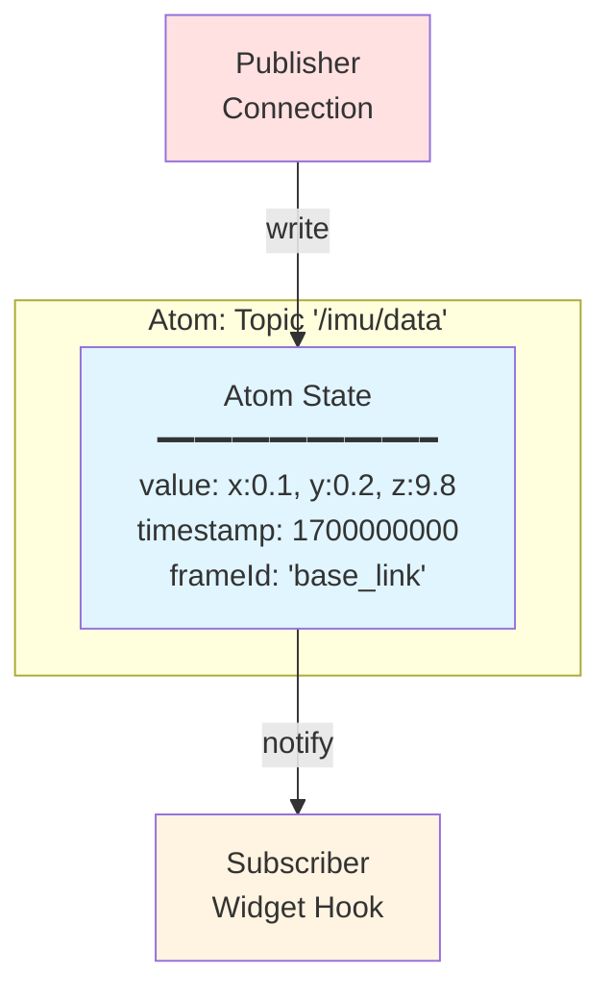
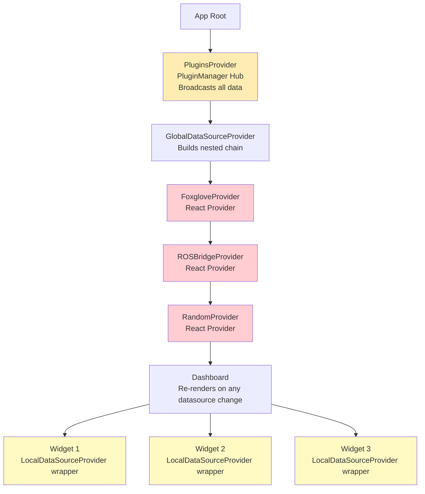
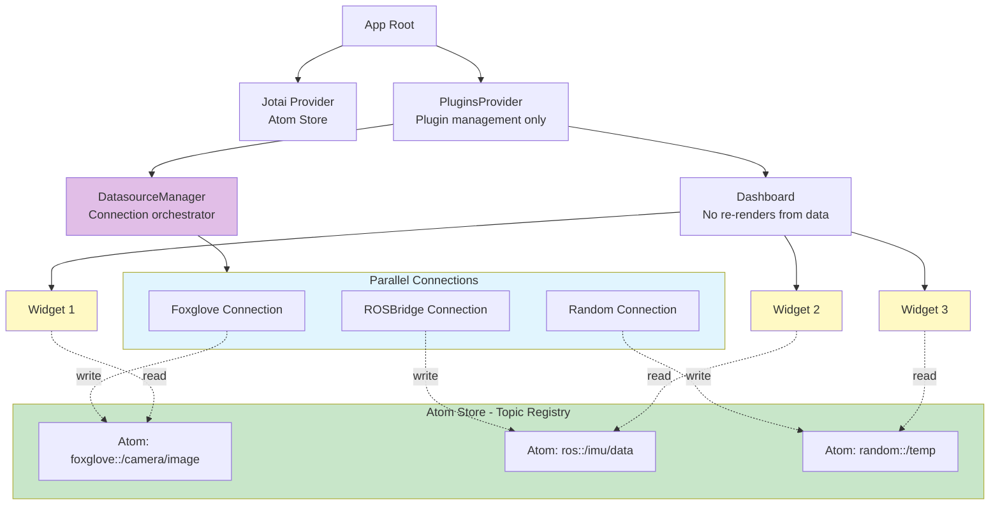
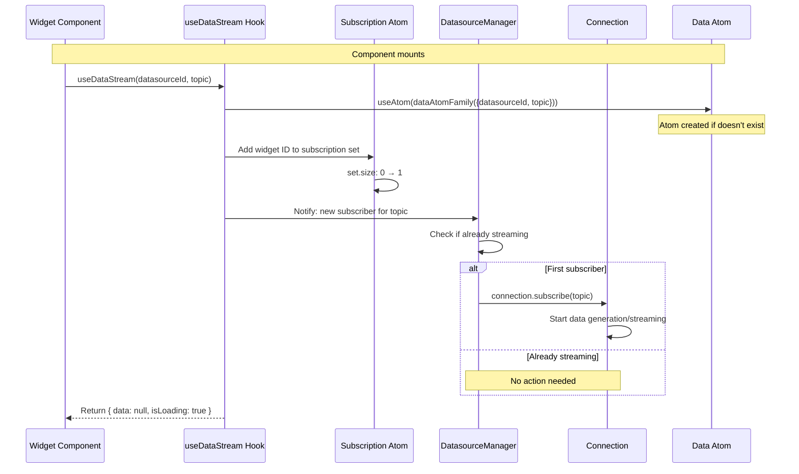
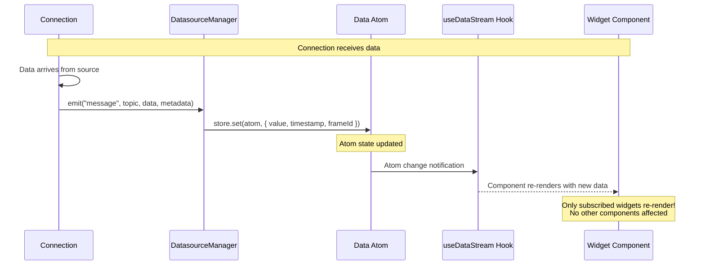
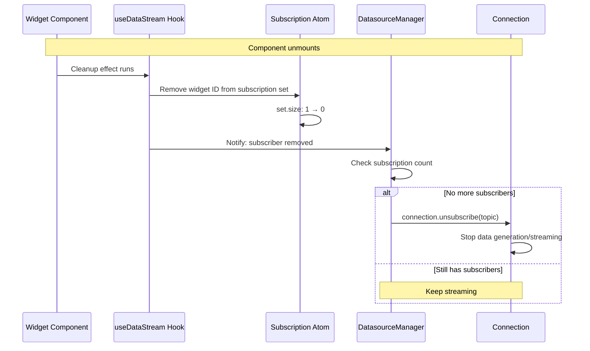

# V2 Architecture: Atoms as Topic Transport

## Overview

V2 fundamentally reimagines ORMI-CORE's data flow by using **Jotai atoms as an asynchronous topic transport layer**. Instead of nested React Providers and custom pub/sub, data flows through independent atom stores that act like message queues.

## Core Philosophy

### Data-Source Agnostic

The web application **never knows or cares** where data comes from:

- ✅ Data could be from ROS2, Foxglove, WebSocket, REST API, or random generators
- ✅ Widgets work identically regardless of data source
- ✅ No coupling between datasources and consumers
- ✅ Easy to swap datasources without changing widgets

### Async Topic Transport

Atoms function as **topic-based message queues**:



**Key properties:**

- **Automatic routing**: Write to atom, subscribers get notified automatically
- **Type-safe**: Each atom has a specific type
- **Decoupled**: Publishers and subscribers don't know about each other
- **Efficient**: Only components subscribed to specific atoms re-render
- **Buffer support**: Can store history of messages, not just latest

## Architecture Comparison

### V1: Nested Providers + Pub/Sub



**Problems:**

- **Deep nesting**: 5-7 levels deep creates complex component hierarchy
- **Circular dependencies**: GlobalDataSourceProvider depends on DashboardProvider, which can cause "Maximum update depth exceeded" errors
- **Provider wrappers**: Every widget needs `LocalDataSourceProvider`
- **Pub/sub overhead**: PluginManager broadcasts to all callbacks
- **Sequential startup**: Datasources initialize in sequence
- **Tight coupling**: Order matters, datasources depend on nesting

### V2: Flat + Atom Store



**Benefits:**

- **Flat hierarchy**: 2-3 levels eliminates nested dependencies
- **No circular dependencies**: DatasourceManager and Dashboard are independent, preventing update loops
- **No wrappers**: Widgets use hooks directly
- **Direct atom access**: Clean subscription model
- **Parallel startup**: All connections initialize simultaneously
- **Zero coupling**: Connections completely independent

## Component Architecture

### 1. Jotai Provider (Atom Store)

The foundation of V2 - provides the atom store:

```typescript
// app/layout.tsx
import { Provider as JotaiProvider } from 'jotai'

export default function RootLayout({ children }) {
  return (
    <JotaiProvider>
      {children}
    </JotaiProvider>
  )
}
```

**Responsibilities:**

- Store all atoms (topic data, subscriptions, connection status)
- Handle atom subscriptions and notifications
- Provide DevTools integration
- Manage atom lifecycle

### 2. DatasourceManager

Orchestrates connections and manages the atom lifecycle:

**Responsibilities:**

- Register and manage Connection instances
- Listen to Connection events (`message`, `error`, `connected`, etc.)
- Write received data to appropriate atoms
- Track subscription counts via subscription atoms
- Start/stop connections based on demand (lazy subscription)

**Key Feature - Lazy Subscription:**

- Monitors subscription count atoms
- When first subscriber arrives (count 0→1): starts connection streaming
- While subscribers exist: maintains connection
- When last subscriber leaves (count 1→0): stops connection streaming
- Saves bandwidth and CPU by only streaming data when needed

### 3. Connection Interface

Data sources implement the Connection interface to integrate with the system:

**Core Methods:**

- `connect(config)` - Establish connection to data source
- `disconnect()` - Close connection and cleanup
- `subscribe(topic)` - Start streaming data for a topic
- `unsubscribe(topic)` - Stop streaming data for a topic
- `getAvailableTopics()` - Discover available topics

**Events Emitted:**

- `"connected"` - Connection established
- `"disconnected"` - Connection closed
- `"message"` - New data arrived for a topic
- `"error"` - Error occurred
- `"topic-discovered"` - New topic became available

Connections emit events which the DatasourceManager listens to and routes to atoms.

### 4. Widget Hooks

Widgets access data through hooks that automatically handle atom subscriptions and lifecycle:

**Key responsibilities:**

- Subscribe to atom for requested topic
- Notify DatasourceManager to start streaming (if first subscriber)
- Re-render component when atom updates with new data
- Unsubscribe and stop streaming on unmount (if last subscriber)

**Example flow:**

```
Widget mounts → useDataStream(topic) → Subscribe to atom →
Request Connection.subscribe() → Data flows → Widget re-renders
```

For complete hook API, usage patterns, and examples, see **[Hooks API](../api/hooks-api)**.

## Atom Families

V2 uses **atom families** to dynamically create atoms per topic. Atom families act like factories - you provide a key (datasourceId + topic), and they return the corresponding atom.

### Data Atoms

Each datasource+topic combination gets its own atom to store the latest message:

```
Topic Key: "ros-1::/imu/data" → dataAtomFamily → Unique Atom
Topic Key: "ros-1::/gps/fix" → dataAtomFamily → Different Atom
```

### Buffered Data Atoms

For widgets needing historical data, buffer atoms store multiple messages:

```
Buffer Key: "ros-1::/imu/data::bufferSize=10" → bufferedDataFamily → Atom with 10-message buffer
Buffer Key: "ros-1::/imu/data::bufferSize=100" → bufferedDataFamily → Different atom with 100-message buffer
```

Different buffer sizes create different atoms to avoid conflicts.

### Subscription Tracking Atoms

Track active subscribers per topic:

```typescript
// DatasourceManager monitors these atoms to start/stop streaming
const subscriptionAtom = subscriptionAtomFamily({ datasourceId, topic });
// Contains Set<widgetId> of active subscribers
```

### Connection Status Atoms

Per-datasource status tracking:

```typescript
const statusAtom = connectionStatusFamily(datasourceId);
// Contains: { state, error, connectedAt, lastDataAt }
```

## Data Flow Lifecycle

### Phase 1: Widget Mount & Subscription



### Phase 2: Data Arrives



### Phase 3: Widget Unmount & Cleanup



## Performance Characteristics

### Architectural Improvements

**V1 architectural issues:**

```
Circular dependency chain:
DashboardProvider (state: datasources)
  ↓ useDashboardManager()
GlobalDataSourceProvider
  ↓ useEffect([datasources]) creates UI with callbacks
  ↓ callbacks reference dashboard functions
DashboardProvider re-renders
  ↓ new function references
GlobalDataSourceProvider useEffect triggers again
→ Infinite loop → "Maximum update depth exceeded"
```

**V2 architectural improvements:**

```
Flat, independent architecture:
DatasourceManager (standalone, manages connections)
  ↓ writes to atoms
Atom Store (independent state)
  ↓ notifies subscribers
Widget Hooks (read atoms directly)
  ↓ no circular references
Dashboard (manages layout only, no datasource coupling)

→ No circular dependencies possible
→ Clean separation of concerns
```

### Re-render Behavior

**V1 behavior:**

```
Data arrives → PluginManager.doAction() → All callbacks execute
→ All LocalDataSourceProviders update → All child widgets re-render
→ Potential circular update if GlobalDataSourceProvider triggers dashboard update
```

**V2 behavior:**

```
Data arrives → Connection.emit() → DatasourceManager writes atom
→ Only subscribed widget's hook notified → Only that widget re-renders
→ No provider chain, no circular dependencies
```

### Memory Efficiency

**V1 considerations:**

- Every widget wrapped in LocalDataSourceProvider (React context)
- Each provider maintains its own buffer
- Pub/sub maintains callback lists
- Nested provider memory overhead

**V2 improvements:**

- Atoms are lightweight (just JavaScript objects)
- Single buffer per topic (shared across widgets)
- No provider overhead
- No callback list maintenance
- Clean garbage collection (atoms are removed when unused)

### Startup Performance

**V1 sequential:**

```
GlobalDataSourceProvider renders
→ Foxglove mounts → connects
  → ROSBridge mounts → connects
    → Random mounts → connects
      → Dashboard renders
        → Widgets mount

Total: 3-5 seconds
```

**V2 parallel:**

```
DatasourceManager creates all connections in parallel
→ All connect simultaneously
→ Dashboard renders
  → Widgets mount

Total: 1-2 seconds
```

## Scalability

### Adding New Datasources

**V1:** Edit GlobalDataSourceProvider, update nesting order, potential conflicts

**V2:** Just register a new Connection instance:

```typescript
datasourceManager.addConnection("new-datasource", new MyConnection());
```

### Adding New Widgets

**V1:** Wrap in LocalDataSourceProvider, configure topics

**V2:** Just pass datasourceId and topic props:

```typescript
<MyWidget datasourceId="ros-1" topic="/sensor" />
```

### Multiple Topics

**V1:** Single LocalDataSourceProvider with topic array, single re-render for any topic

**V2:** Multiple hooks, independent re-renders:

```typescript
const { data: imu } = useDataStream("ros-1", "/imu");
const { data: gps } = useDataStream("ros-1", "/gps");
// Only re-renders when its specific topic updates
```

### Debugging

V2 provides excellent debugging through Jotai DevTools. Install and wrap your app:

```typescript
import { DevTools } from 'jotai-devtools'

<JotaiProvider>
  <DevTools />
  <App />
</JotaiProvider>
```

**DevTools Features:**

- Visualize all atoms and their values
- See subscription counts per topic
- Track atom updates in real-time
- Time-travel debugging
- Atom dependency graphs

## Reused Systems from V1

Several V1 systems work perfectly and are **reused as-is** in V2:

### JSON Forms Renderers

**Status**: ✅ **Reused as-is**

The V1 renderer system (`coreRenderer` with `TopicSelectRenderer` and shadcn renderers) works perfectly with V2. Widget configuration dialogs use the same JSON Forms integration.

**Why it works**: Renderers are UI components for JSON Forms - they don't depend on data flow architecture. They work identically whether data comes from providers or atoms.

See [V1 Renderers Documentation](/docs/v1/core/renderers.md) for complete details.

### ButtonHolder System

**Status**: ✅ **Reused as-is**

The V1 `ButtonHolderProvider` and floating action buttons work identically in V2.

**Why it works**: ButtonHolder manages UI state (button visibility, positions) independent of data flow. It can be converted to atoms if needed, but V1 provider works fine.

See [V1 ButtonHolder Documentation](/docs/v1/core/button-holder.md) for complete details.

### Widget API (Props)

**Status**: ✅ **Nearly identical**

V2 widget props are nearly identical to V1, just replacing `LocalDataSourceProvider` wrapper with `useDataStream` hook.

**V1 widget:**

```tsx
<LocalDataSourceProvider {...props}>
    <MyWidgetComponent />
</LocalDataSourceProvider>
```

**V2 widget:**

```tsx
function MyWidget({ datasourceId, topic }: WidgetProps) {
    const { data } = useDataStream(datasourceId, topic);
    // Same rendering logic as V1
}
```

See [Widget API](/docs/v2/api/widget-api.md) for complete V2 widget development guide.

## Comparison Summary

| Aspect                    | V1 (Nested + Pub/Sub)              | V2 (Atoms + Parallel)             |
| ------------------------- | ---------------------------------- | --------------------------------- |
| **Hierarchy**             | 5-7 levels deep                    | 2-3 levels flat                   |
| **Circular Dependencies** | Present (GDS ↔ Dashboard)         | None (flat architecture)          |
| **Data routing**          | PluginManager broadcasts           | Atom subscriptions                |
| **Widget wrapper**        | LocalDataSourceProvider required   | No wrapper, direct hooks          |
| **Re-render pattern**     | Context-based, can cascade         | Atom-based, isolated              |
| **Startup**               | Sequential                         | Parallel                          |
| **Coupling**              | Datasources coupled by nesting     | Zero coupling                     |
| **Memory**                | Higher (providers + contexts)      | Lower (atoms only)                |
| **Debugging**             | Limited                            | Jotai DevTools                    |
| **Scalability**           | Difficult (nested structure)       | Easy (just add connections)       |
| **Stability**             | Circular dependency bugs possible  | Clean architecture                |
| **Renderers**             | ✅ Reused as-is from V1            | ✅ Reused as-is from V1           |
| **ButtonHolder**          | ✅ Reused as-is from V1            | ✅ Reused as-is from V1           |
| **Dashboard**             | DashboardProvider (context)        | Atoms (dashboardConfigAtom, etc.) |
| **Templates**             | TemplatesProvider (context)        | Atoms (widgetTemplatesAtom, etc.) |
| **Transforms**            | TransformSourcesProvider (polling) | Atoms (event-driven updates)      |

---

**Next:**

- [Data Flow](./data-flow) - Async pub/sub patterns and subscription lifecycle
- [Dashboard Integration](./dashboard-integration) - How dashboard state uses atoms
- [DatasourceManager](./datasource-manager) - Connection orchestration and plugin API
