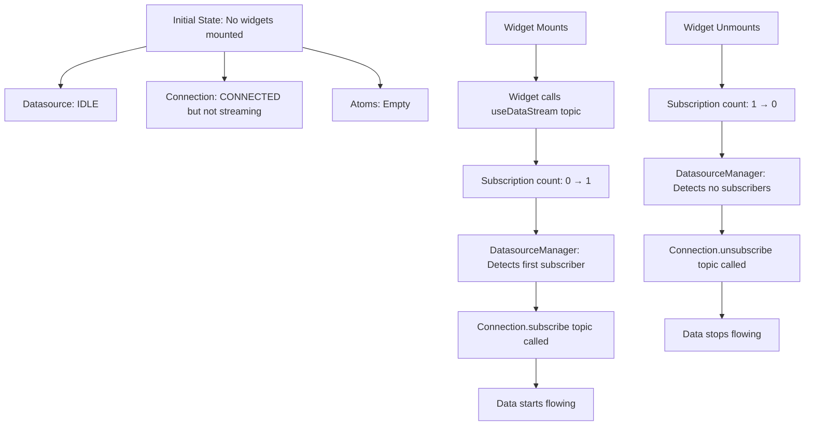
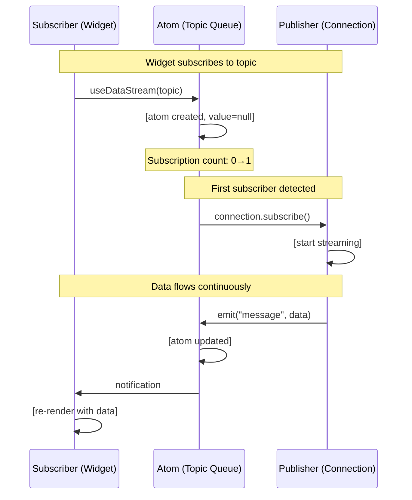
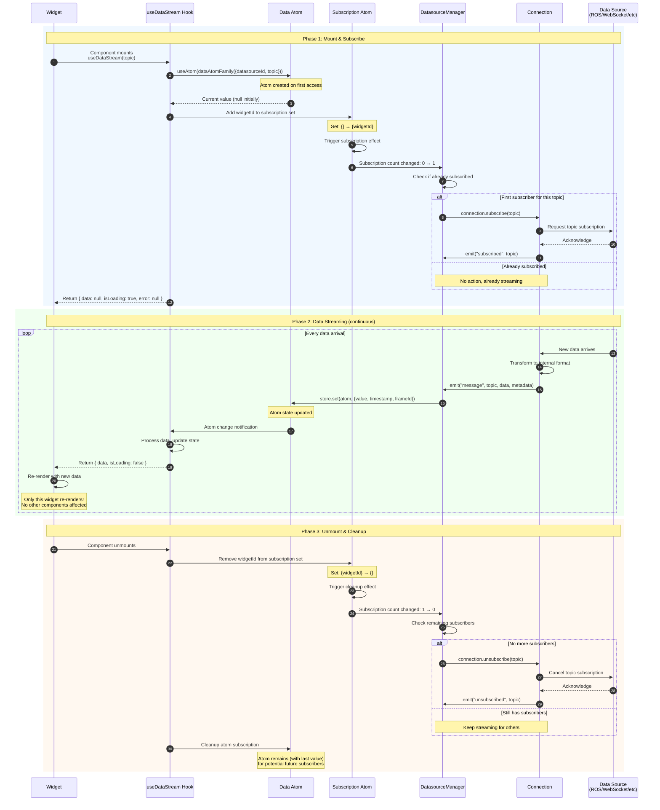
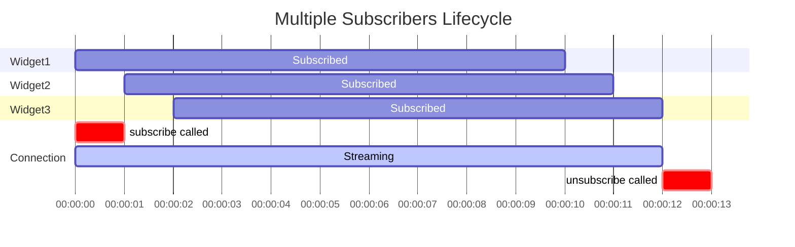
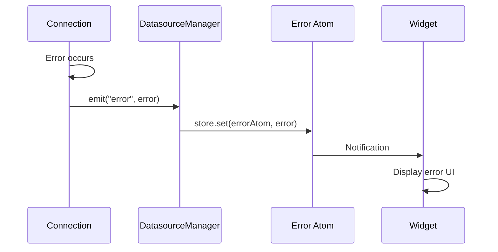
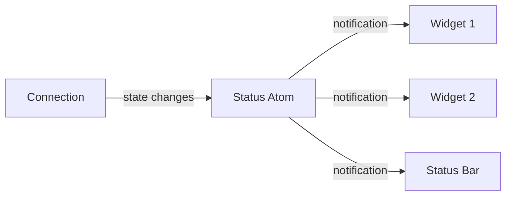
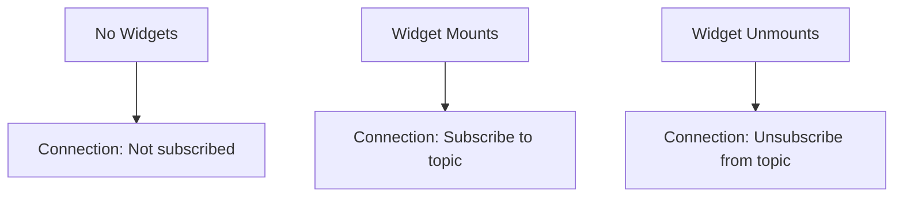
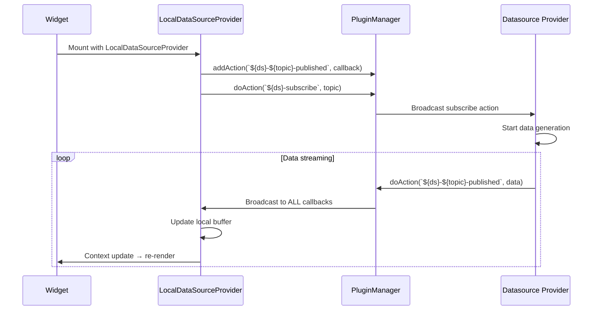
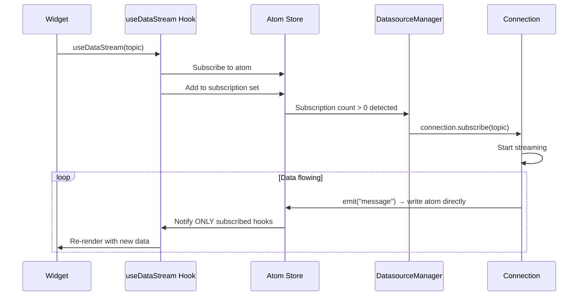

# Data Flow: Async Pub/Sub with Atoms

## Overview

V2 implements a **lazy asynchronous publish-subscribe pattern** using Jotai atoms as the transport layer. Data sources only subscribe to topics when widgets actually need them, and automatically unsubscribe when no longer needed.

## Core Concepts

### Lazy Subscription Model

**Critical principle: Datasources only start streaming when consumers exist.**



### Async Topic Transport

Atoms act as **topic-based message queues** with lazy activation:



**Key characteristics:**

- **Lazy activation**: Connections only subscribe when first widget needs data
- **Automatic cleanup**: Connections unsubscribe when last widget unmounts
- **Fire-and-forget**: Publishers emit and don't wait for acknowledgment
- **Automatic routing**: No manual callback registration
- **Type-safe**: Atoms enforce data types
- **Decoupled**: Publishers don't know who subscribes
- **Efficient**: Only subscribed components get notifications

### Topic Naming

Topics follow a hierarchical naming pattern:

```typescript
// Format: datasourceId::topic
const topicKey = {
    datasourceId: "ros-1", // Which data source
    topic: "/imu/data", // Which topic within that source
};

// Creates unique atom: "ros-1::/imu/data"
```

**Why datasourceId + topic?**

- Multiple datasources can have same topic names (`/camera/image`)
- Allows source-specific subscriptions
- Enables datasource switching without topic conflicts
- Clear data provenance

## Subscription Lifecycle

### Complete Flow Diagram



### Phase 1: Subscription (Detailed)

When a widget first mounts and calls `useDataStream()`:

#### Step 1: Atom Registration

Widget hook subscribes to the atom for this datasource+topic combination. If the atom doesn't exist, it's created automatically with null initial state.

#### Step 2: Subscription Tracking

Widget's unique ID is added to the subscription tracking atom. This increments the subscriber count from 0 to 1 (or higher if other widgets are already subscribed).

#### Step 3: Connection Subscription (Lazy Activation)

**LAZY SUBSCRIPTION - Key Feature:**

DatasourceManager monitors subscription count changes. When the count transitions:

- **0 → 1 (First subscriber)**: Calls `connection.subscribe(topic)` to START the data stream
- **1 → 2+ (Additional subscribers)**: No action - already streaming, new widgets use existing stream
- **2+ → 1 (Subscriber removed)**: No action - keep streaming for remaining widgets
- **1 → 0 (Last subscriber removed)**: Calls `connection.unsubscribe(topic)` to STOP the data stream

**Critical Insight:** The datasource connection does NOT subscribe to topics until a widget actually needs the data. This prevents wasted bandwidth and CPU for unused topics.

### Phase 2: Data Streaming (Detailed)

Once subscribed, data flows continuously:

#### Step 1: Data Arrives at Connection

Connection receives data from the external source (WebSocket, REST API, etc.), transforms it to internal format if needed, and emits a "message" event with:

- Topic name
- Data payload (in internal format)
- Metadata (timestamp, frameId, etc.)

The Connection has no knowledge of who will consume the data.

#### Step 2: DatasourceManager Writes to Atom

DatasourceManager listens to the Connection's "message" event and:

- Looks up the atom for this datasource+topic
- Writes data directly to the atom (synchronous operation)
- If widgets need buffered data, also updates buffer atom
- Atom system handles notifying subscribers automatically

#### Step 3: Widget Receives Update

Widget's `useDataStream` hook:

- Detects atom change
- Extracts new data value
- Triggers component re-render with new data
- Only this specific component re-renders (isolated updates)

### Phase 3: Unsubscription (Detailed)

When widget unmounts:

#### Step 1: Cleanup Hook

React cleanup runs on component unmount, removing the widget's ID from the subscription tracking atom. This decrements the subscriber count.

#### Step 2: Connection Unsubscribe

When DatasourceManager detects the count reached 0 (last subscriber):

- Calls `connection.unsubscribe(topic)`
- Connection stops requesting data from the source
- Active subscription tracking is updated

#### Step 3: Atom Persistence

The atom is NOT destroyed - it remains in the store with its last value. This means:

- If a widget re-mounts, it gets the last known value immediately (no "flash of null")
- Reduces redundant subscriptions for frequently mounted/unmounted widgets
- Efficient for dashboard tab switching

## Multiple Subscribers

Multiple widgets can subscribe to the same topic:

```typescript
// Dashboard with 3 widgets
<Dashboard>
  <Widget1 datasourceId="ros-1" topic="/imu/data" />
  <Widget2 datasourceId="ros-1" topic="/imu/data" />
  <Widget3 datasourceId="ros-1" topic="/imu/data" />
</Dashboard>
```

### Subscription Timeline



| Time | Event                     | Subscribers  | Connection State  |
| ---- | ------------------------- | ------------ | ----------------- |
| t0   | Widget1 mounts            | [w1]         | **subscribe()**   |
| t1   | Widget2 mounts            | [w1, w2]     | (no action)       |
| t2   | Widget3 mounts            | [w1, w2, w3] | (no action)       |
| ...  | Data flowing continuously |              | streaming         |
| t10  | Widget1 unmounts          | [w2, w3]     | (keep streaming)  |
| t11  | Widget2 unmounts          | [w3]         | (keep streaming)  |
| t12  | Widget3 unmounts          | []           | **unsubscribe()** |

**Key points:**

- Only first subscriber triggers `connection.subscribe()`
- Intermediate mounts/unmounts don't affect connection
- Only when last subscriber unmounts does connection stop
- All widgets receive same data simultaneously
- Each widget re-renders independently

## Buffered Data Streams

Some widgets need historical data (charts, playback):

### Buffer Atom

```typescript
const bufferedAtom = bufferedDataFamily({
    datasourceId: "ros-1",
    topic: "/imu/data",
    bufferSize: 1000, // Keep last 1000 messages
});
```

### Mixed Buffered and Non-Buffered Subscriptions

**What happens when two widgets subscribe to the same topic, but one needs a buffer and the other doesn't?**

```typescript
// Widget 1: Needs latest value only (gauge, indicator)
function GaugeWidget({ topic }) {
  const { data } = useDataStream(topic)  // No buffer
  return <Gauge value={data} />
}

// Widget 2: Needs historical data (chart)
function ChartWidget({ topic }) {
  const { buffer } = useDataStream(topic, {
    bufferSize: 1000  // With buffer
  })
  return <LineChart data={buffer} />
}
```

**How it works:**

1. **Separate Atoms**: The system maintains two atom types:
    - Latest value atom: stores only the most recent message
    - Buffer atom: stores historical array of messages

2. **Both Updated**: When data arrives, DatasourceManager updates:
    - Always: the latest value atom
    - Conditionally: the buffer atom (if any widget requests buffering)

3. **No Conflict**: Each widget subscribes to the atom type it needs:
    - Non-buffered widgets: subscribe to latest value atom
    - Buffered widgets: subscribe to buffer atom
    - Both receive updates from the SAME data stream

4. **Efficient**: Only ONE `connection.subscribe(topic)` regardless of buffer needs

**Key Insight**: Buffer requirement is a property of the subscription, not the data source. Multiple widgets can have different views (latest vs buffered) of the same data stream.

**Data Flow:**

1. Both GaugeWidget and ChartWidget subscribe to the same topic
2. DatasourceManager sees at least one subscriber, calls `connection.subscribe(topic)` once
3. When data arrives:
    - Latest value atom is updated → GaugeWidget re-renders
    - Buffer atom is updated → ChartWidget re-renders
4. Each widget re-renders independently based on its atom

### Buffer Updates

Buffer atoms maintain a circular buffer automatically:

- New data is appended to the buffer array
- When buffer exceeds configured size, oldest entries are removed
- Widgets always receive the most recent N messages

### Widget Usage

```typescript
function ChartWidget({ topic }) {
  const { buffer } = useDataStream(topic, {
    bufferSize: 100
  })

  return <LineChart data={buffer} />
}
```

## Error Handling

Errors flow through the same async pattern:



**Error flow principles:**

- Errors propagate through the atom layer (same as data)
- Connection-level errors affect all subscribed topics
- Topic-specific errors only affect that topic's subscribers
- Widgets receive errors via `useDataStream` hook's error property
- Error atoms maintain last error state until cleared

For error types, widget error handling patterns, and API details, see **[Hooks API - Error Handling](../api/hooks-api#error-handling)**.

## Connection Status Monitoring

Connection health is tracked independently from data flow:

## Connection Status Monitoring

Connection health is tracked independently from data flow:



**Status tracking principles:**

- Each connection has a status atom tracking its state
- Status changes independently of data messages
- Multiple components can monitor the same connection
- Status states: `disconnected`, `connecting`, `connected`, `reconnecting`, `error`

For `useConnectionStatus` API, status types, and usage patterns, see **[Hooks API - useConnectionStatus](../api/hooks-api#useconnectionstatus)**.

## Performance Optimization Principles

### Lazy Subscription

Connections only subscribe to topics when widgets actually need them:



**Benefits:**

- No unnecessary network traffic
- Reduced server load
- Lower memory usage
- Faster initial page load

### Selective Subscriptions

Only subscribe to the specific data you need - avoid over-subscribing:

- ✅ Widget needs `/imu/data` → Subscribe to `/imu/data` only
- ❌ Widget needs `/imu/data` → Don't subscribe to `/camera/image`, `/gps/fix`, etc.

### Conditional Subscriptions

Subscriptions can be enabled/disabled dynamically based on UI state:

- Widget hidden/collapsed → Pass `null` to `useDataStream` (unsubscribe)
- Widget visible → Pass topic to `useDataStream` (subscribe)
- Tab inactive → Unsubscribe
- Tab active → Re-subscribe

For API usage patterns (conditional subscriptions, throttling, selective updates), see **[Hooks API - Performance](../api/hooks-api#performance-optimization)**.

### Throttling Re-renders

For high-frequency data (100+ Hz):

```typescript
const { data } = useDataStream(lidarTopic, {
    throttle: 100, // Max 10 Hz updates to component
});
```

## Comparison with V1

### V1 Data Flow



**Problems:**

- Manual callback registration required
- PluginManager broadcasts to ALL registered callbacks (even unrelated widgets)
- Each LocalDataSourceProvider maintains duplicate buffers
- Context update causes cascading re-renders

### V2 Data Flow



**Benefits:**

- Automatic subscription management - no manual callback registration
- Direct, targeted updates - only subscribed widgets notified
- Single atom per topic - no buffer duplication
- No context overhead - atomic re-renders only affected widgets

---

**Next:** See [Connection API](../api/connection-api) for implementing data sources, or [Hooks API](../api/hooks-api) for consuming data in widgets.
