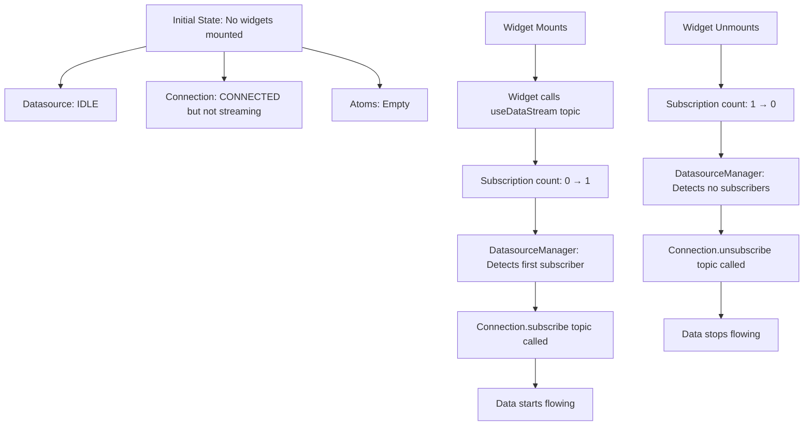
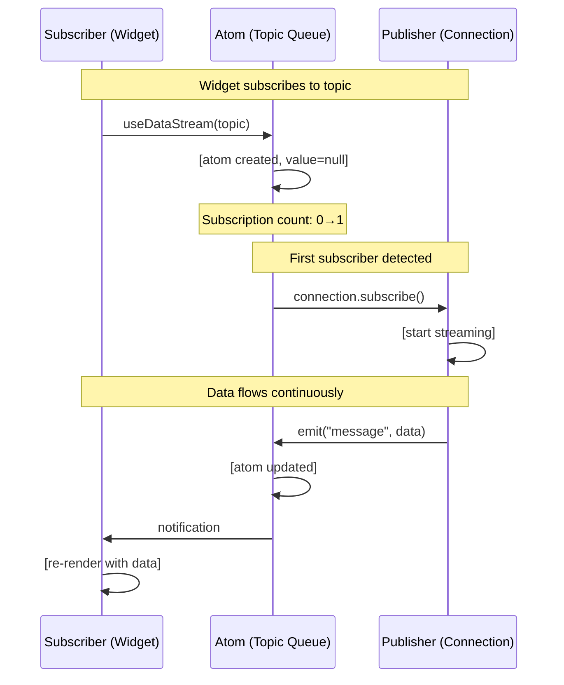
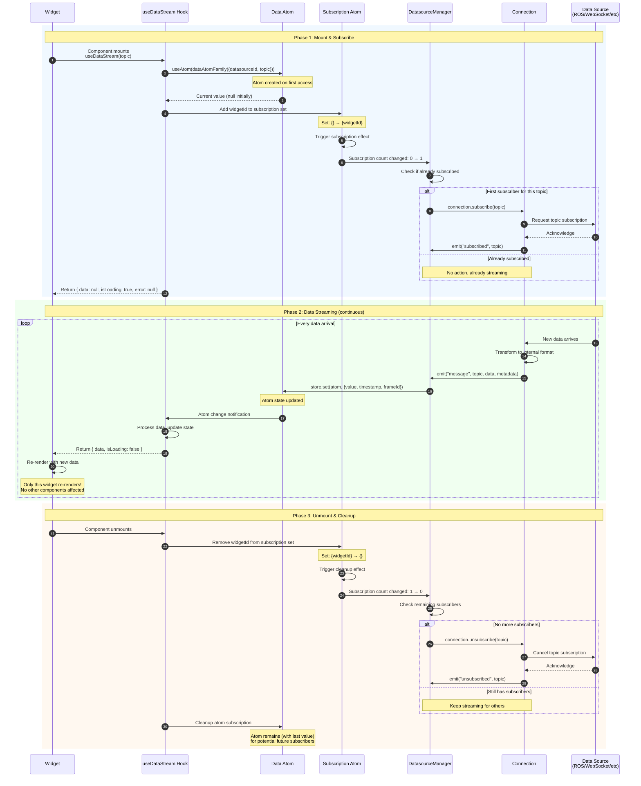
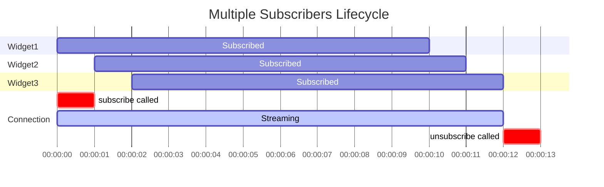
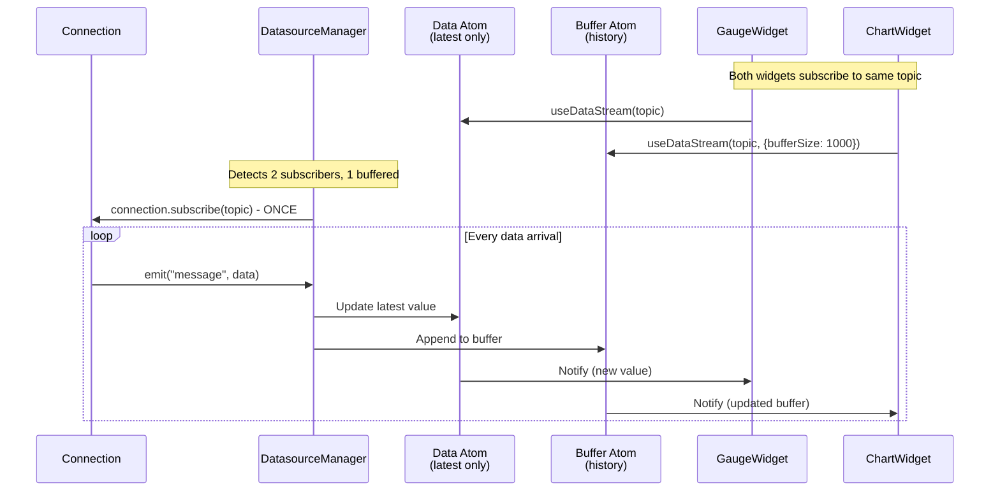
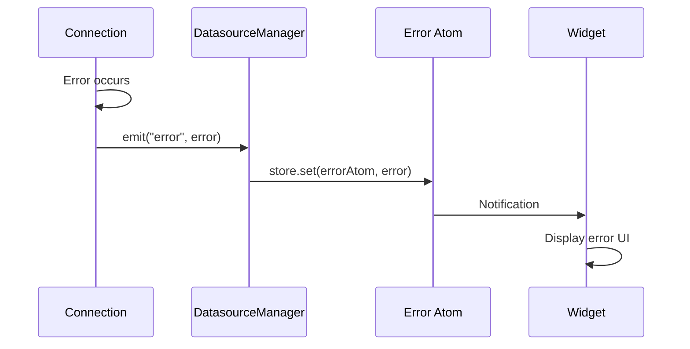
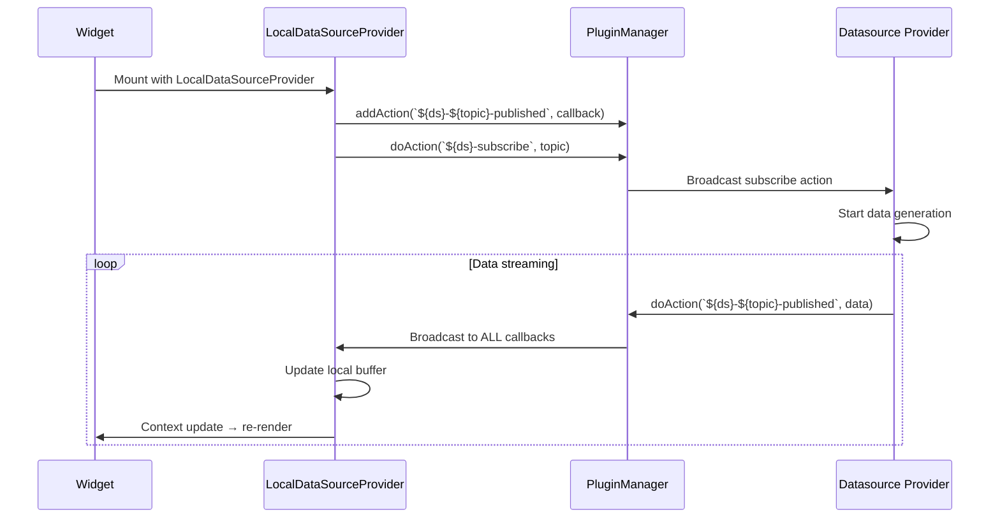
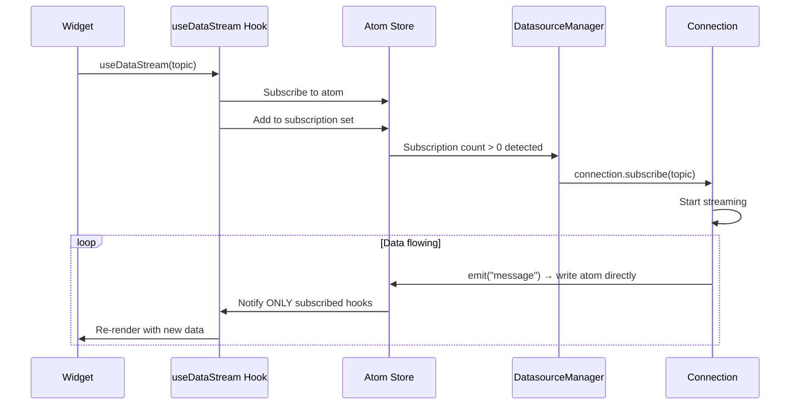

# Data Flow: Async Pub/Sub with Atoms

## Overview

V2 implements a **lazy asynchronous publish-subscribe pattern** using Jotai atoms as the transport layer. Data sources only subscribe to topics when widgets actually need them, and automatically unsubscribe when no longer needed.

## Core Concepts

### Lazy Subscription Model

**Critical principle: Datasources only start streaming when consumers exist.**



### Async Topic Transport

Atoms act as **topic-based message queues** with lazy activation:



**Key characteristics:**

- **Lazy activation**: Connections only subscribe when first widget needs data
- **Automatic cleanup**: Connections unsubscribe when last widget unmounts
- **Fire-and-forget**: Publishers emit and don't wait for acknowledgment
- **Automatic routing**: No manual callback registration
- **Type-safe**: Atoms enforce data types
- **Decoupled**: Publishers don't know who subscribes
- **Efficient**: Only subscribed components get notifications

### Topic Naming

Topics follow a hierarchical naming pattern:

```typescript
// Format: datasourceId::topic
const topicKey = {
    datasourceId: "ros-1", // Which data source
    topic: "/imu/data", // Which topic within that source
};

// Creates unique atom: "ros-1::/imu/data"
```

**Why datasourceId + topic?**

- Multiple datasources can have same topic names (`/camera/image`)
- Allows source-specific subscriptions
- Enables datasource switching without topic conflicts
- Clear data provenance

## Subscription Lifecycle

### Complete Flow Diagram



### Phase 1: Subscription (Detailed)

When a widget first mounts and calls `useDataStream()`:

#### Step 1: Atom Registration

```typescript
// Inside useDataStream
const dataAtom = useMemo(
    () => dataAtomFamily({ datasourceId, topic }),
    [datasourceId, topic]
);

// Subscribe to atom
const [atomValue] = useAtom(dataAtom);
```

**What happens:**

- Atom family checks if atom exists for this datasource+topic
- If not, creates new atom with `null` initial state
- Hook subscribes to atom changes
- Returns current value (null on first subscription)

#### Step 2: Subscription Tracking

```typescript
// Inside useDataStream
const subscriptionAtom = subscriptionAtomFamily({ datasourceId, topic });
const widgetId = useId(); // Unique ID per widget instance

useEffect(() => {
    // Add this widget to subscribers
    const currentSet = store.get(subscriptionAtom);
    store.set(subscriptionAtom, new Set([...currentSet, widgetId]));

    return () => {
        // Remove on cleanup
        const currentSet = store.get(subscriptionAtom);
        const newSet = new Set(currentSet);
        newSet.delete(widgetId);
        store.set(subscriptionAtom, newSet);
    };
}, [datasourceId, topic, widgetId]);
```

**What happens:**

- Widget ID added to subscription set atom
- Set size changes from 0 to 1 (or increments)
- Change triggers DatasourceManager monitoring effect

#### Step 3: Connection Subscription (Lazy Activation)

```typescript
// Inside DatasourceManager
useEffect(() => {
    const subscriptionAtom = subscriptionAtomFamily({ datasourceId, topic });

    const unsubscribe = store.sub(subscriptionAtom, () => {
        const subscribers = store.get(subscriptionAtom);

        if (subscribers.size > 0 && !isSubscribed(datasourceId, topic)) {
            // First subscriber - start streaming NOW
            console.log(
                `First subscriber for ${datasourceId}::${topic}, starting stream`
            );
            const connection = connections.get(datasourceId);
            connection.subscribe(topic);

            activeSubscriptions.add(`${datasourceId}::${topic}`);
        } else if (
            subscribers.size === 0 &&
            isSubscribed(datasourceId, topic)
        ) {
            // Last subscriber gone - stop streaming NOW
            console.log(
                `No subscribers for ${datasourceId}::${topic}, stopping stream`
            );
            const connection = connections.get(datasourceId);
            connection.unsubscribe(topic);

            activeSubscriptions.delete(`${datasourceId}::${topic}`);
        }
    });

    return unsubscribe;
}, [datasourceId, topic]);
```

**What happens (LAZY SUBSCRIPTION):**

- DatasourceManager monitors subscription count changes
- **When count goes 0 → 1**: This is the FIRST subscriber!
    - Calls `connection.subscribe(topic)` to start the data stream
    - Adds to active subscriptions tracking
    - Connection begins requesting/generating data
- **When count goes 1 → 2+**: Additional subscribers
    - NO action taken - already streaming
    - New widgets get existing data stream
- **When count goes 2 → 1**: Still has subscribers
    - NO action taken - keep streaming
- **When count goes 1 → 0**: LAST subscriber removed!
    - Calls `connection.unsubscribe(topic)` to stop the data stream
    - Removes from active subscriptions tracking
    - Connection stops requesting/generating data to save resources

**Critical: The datasource connection does NOT subscribe to topics until a widget actually needs the data. This prevents wasted bandwidth and CPU for unused topics.**

### Phase 2: Data Streaming (Detailed)

Once subscribed, data flows continuously:

#### Step 1: Data Arrives at Connection

```typescript
// Inside Connection implementation
class WebSocketConnection implements Connection {
    private ws: WebSocket;

    subscribe(topic: string) {
        // Request subscription from data source
        this.ws.send(
            JSON.stringify({
                op: "subscribe",
                topic: topic,
            })
        );

        // Listen for incoming messages
        this.ws.onmessage = (event) => {
            const message = JSON.parse(event.data);

            if (message.topic === topic) {
                // Emit to DatasourceManager
                this.emit("message", topic, message.data, {
                    timestamp: message.timestamp || Date.now(),
                    frameId: message.frameId || "world",
                    sequenceId: message.seq,
                });
            }
        };
    }
}
```

**What happens:**

- Connection receives data from external source
- Transforms to internal format if needed
- Emits "message" event with topic, data, and metadata
- No knowledge of who will consume the data

#### Step 2: DatasourceManager Writes to Atom

```typescript
// Inside DatasourceManager
connection.on(
    "message",
    (topic: string, data: any, metadata: MessageMetadata) => {
        const dataAtom = dataAtomFamily({ datasourceId, topic });

        // Direct atom write
        store.set(dataAtom, {
            value: data,
            timestamp: metadata.timestamp,
            frameId: metadata.frameId,
            sequenceId: metadata.sequenceId,
        });

        // Also update buffered atom if configured
        if (hasBufferedSubscribers(datasourceId, topic)) {
            const bufferedAtom = bufferedDataFamily({
                datasourceId,
                topic,
                bufferSize: 100,
            });

            const currentBuffer = store.get(bufferedAtom);
            const newBuffer = [
                ...currentBuffer,
                {
                    value: data,
                    timestamp: metadata.timestamp,
                    frameId: metadata.frameId,
                },
            ].slice(-100); // Keep last 100

            store.set(bufferedAtom, newBuffer);
        }
    }
);
```

**What happens:**

- DatasourceManager receives "message" event
- Looks up atom for this datasource+topic
- Writes data directly to atom (synchronous operation)
- If buffered subscriptions exist, updates buffer atom too
- Atom system handles notifications automatically

#### Step 3: Widget Receives Update

```typescript
// Inside useDataStream
const [atomValue] = useAtom(dataAtom);

useEffect(() => {
    // Atom changed - process update
    if (atomValue) {
        setData(atomValue.value);
        setTimestamp(atomValue.timestamp);
        setIsLoading(false);
        setError(null);
    }
}, [atomValue]);
```

**What happens:**

- Atom change triggers hook re-evaluation
- Component re-renders with new data
- Only this specific component re-renders
- No other widgets affected (even siblings)

### Phase 3: Unsubscription (Detailed)

When widget unmounts:

#### Step 1: Cleanup Hook

```typescript
// Inside useDataStream
useEffect(() => {
    // ... subscription code ...

    return () => {
        // Cleanup runs on unmount
        const currentSet = store.get(subscriptionAtom);
        const newSet = new Set(currentSet);
        newSet.delete(widgetId);
        store.set(subscriptionAtom, newSet);
    };
}, [datasourceId, topic, widgetId]);
```

**What happens:**

- React calls cleanup function
- Widget ID removed from subscription set
- Set size decrements (1 → 0 if last subscriber)
- Triggers DatasourceManager monitoring effect

#### Step 2: Connection Unsubscribe

```typescript
// Inside DatasourceManager monitoring effect
if (subscribers.size === 0 && isSubscribed(datasourceId, topic)) {
    const connection = connections.get(datasourceId);
    connection.unsubscribe(topic);
    activeSubscriptions.delete(`${datasourceId}::${topic}`);
}
```

**What happens:**

- DatasourceManager detects count reached 0
- Calls `connection.unsubscribe(topic)`
- Connection stops requesting data
- Active subscription tracking updated

#### Step 3: Atom Persistence

```typescript
// Atom remains in store with last value
const lastValue = store.get(dataAtom);
// lastValue: { value: {...}, timestamp: 12345, frameId: "base_link" }
```

**What happens:**

- Atom is NOT destroyed
- Last value remains accessible
- If widget re-mounts, it gets last known value immediately
- Avoids "flash of null" on re-mount
- Reduces redundant subscriptions for frequently mounted/unmounted widgets

## Multiple Subscribers

Multiple widgets can subscribe to the same topic:

```typescript
// Dashboard with 3 widgets
<Dashboard>
  <Widget1 datasourceId="ros-1" topic="/imu/data" />
  <Widget2 datasourceId="ros-1" topic="/imu/data" />
  <Widget3 datasourceId="ros-1" topic="/imu/data" />
</Dashboard>
```

### Subscription Timeline



| Time | Event                     | Subscribers  | Connection State  |
| ---- | ------------------------- | ------------ | ----------------- |
| t0   | Widget1 mounts            | [w1]         | **subscribe()**   |
| t1   | Widget2 mounts            | [w1, w2]     | (no action)       |
| t2   | Widget3 mounts            | [w1, w2, w3] | (no action)       |
| ...  | Data flowing continuously |              | streaming         |
| t10  | Widget1 unmounts          | [w2, w3]     | (keep streaming)  |
| t11  | Widget2 unmounts          | [w3]         | (keep streaming)  |
| t12  | Widget3 unmounts          | []           | **unsubscribe()** |

**Key points:**

- Only first subscriber triggers `connection.subscribe()`
- Intermediate mounts/unmounts don't affect connection
- Only when last subscriber unmounts does connection stop
- All widgets receive same data simultaneously
- Each widget re-renders independently

## Buffered Data Streams

Some widgets need historical data (charts, playback):

### Buffer Atom

```typescript
const bufferedAtom = bufferedDataFamily({
    datasourceId: "ros-1",
    topic: "/imu/data",
    bufferSize: 1000, // Keep last 1000 messages
});
```

### Mixed Buffered and Non-Buffered Subscriptions

**What happens when two widgets subscribe to the same topic, but one needs a buffer and the other doesn't?**

```typescript
// Widget 1: Needs latest value only (gauge, indicator)
function GaugeWidget({ topic }) {
  const { data } = useDataStream(topic)  // No buffer
  return <Gauge value={data} />
}

// Widget 2: Needs historical data (chart)
function ChartWidget({ topic }) {
  const { buffer } = useDataStream(topic, {
    bufferSize: 1000  // With buffer
  })
  return <LineChart data={buffer} />
}
```

**How it works:**

1. **Separate Atoms**: The system maintains TWO different atoms:
    - `dataAtomFamily({ datasourceId, topic })` - Latest value only
    - `bufferedDataFamily({ datasourceId, topic, bufferSize })` - Historical buffer

2. **Both Updated**: When new data arrives, DatasourceManager updates BOTH atoms:

    ```typescript
    connection.on("message", (topic, data, metadata) => {
        // Always update latest value atom
        const dataAtom = dataAtomFamily({ datasourceId, topic });
        store.set(dataAtom, { value: data, timestamp, frameId });

        // ALSO update buffer atom if ANY widget needs it
        if (hasBufferedSubscribers(datasourceId, topic)) {
            const bufferedAtom = bufferedDataFamily({
                datasourceId,
                topic,
                bufferSize,
            });
            const currentBuffer = store.get(bufferedAtom);
            const newBuffer = [
                ...currentBuffer,
                { value: data, timestamp, frameId },
            ];

            // Circular buffer
            if (newBuffer.length > bufferSize) {
                newBuffer.shift();
            }

            store.set(bufferedAtom, newBuffer);
        }
    });
    ```

3. **No Conflict**: Each widget subscribes to its own atom:
    - GaugeWidget subscribes to `dataAtomFamily` → gets only latest value
    - ChartWidget subscribes to `bufferedDataFamily` → gets full buffer array
    - Both receive updates from the SAME data stream
    - No duplicate subscriptions to the datasource

4. **Efficient**:
    - Only ONE `connection.subscribe(topic)` call regardless of buffer needs
    - Data arrives once, distributed to both atoms
    - Widgets only re-render when their specific atom changes



**Key Insight**: The buffer requirement is a **property of the subscription**, not the data source. Multiple widgets can have different views (latest vs buffered) of the same data stream without conflict.

### Buffer Updates

```typescript
// Inside DatasourceManager on message receive
connection.on("message", (topic, data, metadata) => {
    // Update latest value atom
    const dataAtom = dataAtomFamily({ datasourceId, topic });
    store.set(dataAtom, { value: data, timestamp, frameId });

    // Update buffer atom
    const bufferedAtom = bufferedDataFamily({
        datasourceId,
        topic,
        bufferSize: 100,
    });

    const currentBuffer = store.get(bufferedAtom);
    const newBuffer = [...currentBuffer, { value: data, timestamp, frameId }];

    // Circular buffer - remove oldest if exceeds size
    if (newBuffer.length > 100) {
        newBuffer.shift();
    }

    store.set(bufferedAtom, newBuffer);
});
```

### Widget Usage

```typescript
function ChartWidget({ topic }) {
  // Get buffered data
  const { buffer } = useDataStream(topic, {
    bufferSize: 100
  })

  return <LineChart data={buffer} />
}
```

## Error Handling

Errors flow through the same async pattern:



### Error Types

```typescript
interface ConnectionError {
    type: "connection" | "subscription" | "data";
    message: string;
    timestamp: number;
    topic?: string;
    recoverable: boolean;
}
```

### Widget Error Handling

```typescript
function MyWidget({ topic }: { topic: SelectedTopic }) {
  const { data, error, isLoading } = useDataStream(topic)

  if (error) {
    return <ErrorDisplay error={error} />
  }

  if (isLoading) {
    return <Spinner />
  }

  return <DataDisplay data={data} />
}
```

## Connection Status

Widgets can monitor connection health:

```typescript
function MyWidget({ topic }: { topic: SelectedTopic }) {
  const { data } = useDataStream(topic)
  const status = useConnectionStatus(topic.datasource_id)

  return (
    <div>
      <StatusIndicator status={status.state} />
      <DataDisplay data={data} />
    </div>
  )
}
```

### Status States

```typescript
type ConnectionState =
    | "disconnected" // Not connected
    | "connecting" // Connection in progress
    | "connected" // Active connection
    | "reconnecting" // Attempting to reconnect
    | "error"; // Connection failed

interface ConnectionStatus {
    state: ConnectionState;
    error: string | null;
    connectedAt: number | null;
    lastDataAt: number | null;
}
```

## Performance Optimization

### Selective Subscriptions

Only subscribe to needed data:

```typescript
// Bad: Subscribe to all, use one
const { data: imu } = useDataStream(imuTopic)
const { data: gps } = useDataStream(gpsTopic)
const { data: camera } = useDataStream(cameraTopic)

return <div>{imu.x}</div> // Only using IMU!
```

```typescript
// Good: Subscribe only to what you need
const { data: imu } = useDataStream(imuTopic)

return <div>{imu.x}</div>
```

### Conditional Subscriptions

```typescript
function MyWidget({ topic, enabled }: { topic: SelectedTopic; enabled: boolean }) {
  // Only subscribe when enabled
  const { data } = useDataStream(enabled ? topic : null)

  if (!enabled) return <div>Disabled</div>

  return <DataDisplay data={data} />
}
```

### Throttling Re-renders

For high-frequency data (100+ Hz):

```typescript
const { data } = useDataStream(lidarTopic, {
    throttle: 100, // Max 10 Hz updates to component
});
```

## Comparison with V1

### V1 Data Flow



**Problems:**

- Manual callback registration required
- PluginManager broadcasts to ALL registered callbacks (even unrelated widgets)
- Each LocalDataSourceProvider maintains duplicate buffers
- Context update causes cascading re-renders

### V2 Data Flow



**Benefits:**

- Automatic subscription management - no manual callback registration
- Direct, targeted updates - only subscribed widgets notified
- Single atom per topic - no buffer duplication
- No context overhead - atomic re-renders only affected widgets

---

**Next:** See [Connection API](../api/connection-api) for implementing data sources, or [Hooks API](../api/hooks-api) for consuming data in widgets.
