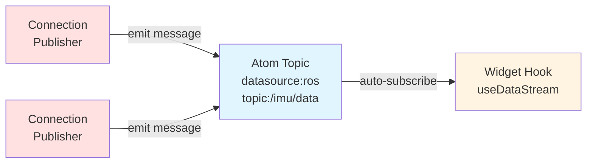
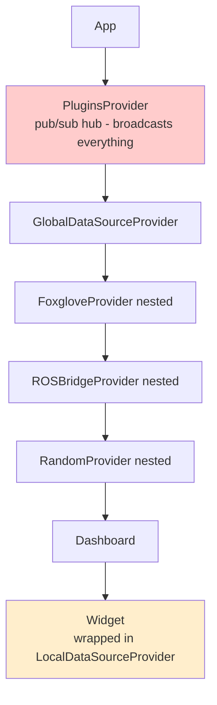
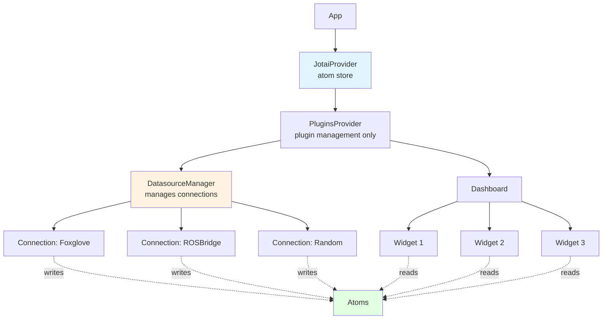
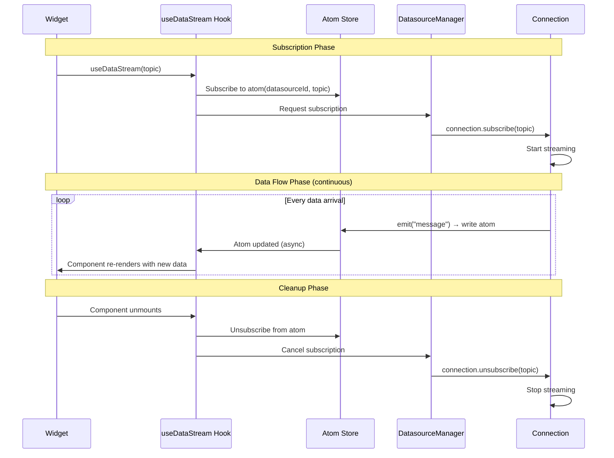

# ORMI-CORE V2 Developer Documentation

Welcome to the V2 documentation for ORMI-CORE. V2 introduces a **complete architectural redesign** using Jotai atoms as an asynchronous topic transport layer, replacing the nested provider pattern and custom pub/sub system.

## What is V2?

V2 transforms ORMI-CORE into a **high-performance, data-source agnostic framework** where:

- **Atoms act as topic buffers** - Each datasource+topic combination has its own atom
- **Async pub/sub pattern** - Publishers write to atoms, subscribers read automatically
- **Zero coupling** - Widgets don't know or care where data comes from
- **Widget signatures unchanged** - Widgets receive props as before, just without wrapper providers

## What's New in V2?

### Major Changes

🚀 **Performance**: 10-30x fewer re-renders compared to V1  
🎯 **Simplicity**: Widgets no longer need `LocalDataSourceProvider` wrapper  
⚡ **Parallel**: Datasources run independently with no nesting  
🔧 **Developer Experience**: Simple hooks, widgets keep same prop signatures  
🐛 **Debugging**: Better DevTools with Jotai integration  
📡 **Async Topics**: Atoms provide automatic pub/sub without manual routing

### Breaking Changes

V2 is **not backward compatible** with V1, but both systems can coexist during migration.

**What changes:**

- ❌ No more `LocalDataSourceProvider` wrapper around widgets
- ❌ No more `useLocalDataSource()` hook
- ❌ No more nested datasource providers
- ❌ No more `PluginManager` pub/sub for data routing
- ✅ Datasources are now Connection classes (not React Providers)
- ✅ Widgets use `useDataStream(topic)` hook with SelectedTopic object
- ✅ **Widget component props remain unchanged** (same interface, different data source)

## Quick Comparison: V1 vs V2

### Widget Development (Props Stay Same!)

**V1 (Old):**

```typescript
// Widget wrapper needed
<LocalDataSourcesProvider SelectedTopics={[topic]} buffersSize={1}>
  <MyWidget title="Temperature" units="°C" />
</LocalDataSourcesProvider>

// Inside widget - same props, different data access
function MyWidget({ title, units, topic }: Props) {
  const { sources, getSource } = useLocalDataSource()
  const data = getSource(topic.topic)?.data[0]
  return <div>{title}: {data}{units}</div>
}
```

**V2 (New):**

```typescript
// No wrapper needed - just use the widget
<MyWidget
  topic={topic}
  title="Temperature"
  units="°C"
/>

// Inside widget - same props interface, modern hook
function MyWidget({ topic, title, units }: Props) {
  const { data } = useDataStream(topic)
  return <div>{title}: {data}{units}</div>
}
```

**Key insight:** Widget receives same business logic props (`title`, `units`) and `topic` object for data binding.

### Datasource Development

**V1 (Old):**

```typescript
// React Provider using pub/sub
const MyDatasourceProvider = ({ children, props }) => {
  useEffect(() => {
    // Subscribe handler
    pluginManager.addAction(`${id}-subscribe`, { ... })

    // Publish data via plugin manager
    pluginManager.doAction(`${id}-${topic}-published`, data, timestamp)
  }, [])
  return <>{children}</>
}
```

**V2 (New):**

```typescript
// Connection class with async events
class MyConnection implements Connection {
    subscribe(topic: string) {
        // Start streaming - emit to atom automatically
        this.emit("message", topic, data, { timestamp: Date.now() });
    }
}
```

## Documentation Structure

### Core Concepts

- **[Architecture](./core/architecture)** - V2 architecture with Jotai atoms as topic transport
- **[Data Flow](./core/data-flow)** - Async pub/sub pattern, subscription lifecycle, atom updates

### API Reference

- **[Connection API](./api/connection-api)** - Complete Connection interface with types and lifecycle
- **[Hooks API](./api/hooks-api)** - Full documentation of `useDataStream` and other hooks
- **[Widget API](./api/widget-api)** - Widget interface (unchanged props, no more wrappers)

### Practical Guides

- **[Migration Guide](./migration-guide)** - Step-by-step migration from V1 to V2
- **[Examples](./examples)** - Real-world widget conversions and connection implementations
- **[Plugin Development](./plugin-development)** - Creating V2-compatible plugins

## Core Concept: Atoms as Topic Transport

The fundamental innovation in V2 is using **Jotai atoms as an async topic transport layer**:



**Key properties:**

- **Automatic routing**: No manual pub/sub configuration
- **Type-safe**: Each atom carries typed data
- **Async by design**: Publishers and subscribers completely decoupled
- **Efficient**: Only subscribed widgets receive updates
- **Data-source agnostic**: Widgets don't know if data comes from ROS, WebSocket, REST, or random generator

## Architecture Overview

### V1 Architecture (Nested + Pub/Sub)

### V1 Architecture (Nested Providers + Pub/Sub)



**Problems:**

- Deep nesting (5+ levels) causes re-render cascades
- Pub/sub broadcasts to all listeners
- LocalDataSourceProvider wraps every widget
- 300+ re-renders/sec for 10 widgets at 30 Hz

### V2 Architecture (Jotai Atoms + Parallel)



**Benefits:**

- Flat hierarchy (3 levels)
- Parallel datasource execution
- No widget wrappers
- Direct atom subscriptions
- 30 re-renders/sec for 10 widgets at 30 Hz (10x improvement)

### Data Flow: Async Topic Pattern



**Key differences from V1:**

- No `PluginManager.doAction()` for data routing
- No manual callback registration
- Atoms handle pub/sub automatically
- Subscription reference counting built-in
- Connection doesn't know about widgets

## Getting Started

### Installation

```bash
# Install Jotai
bun add jotai jotai-devtools

# Or npm/yarn
npm install jotai jotai-devtools
```

### Basic Setup

```typescript
// app/layout.tsx
import { Provider as JotaiProvider } from 'jotai'

export default function RootLayout({ children }) {
  return (
    <JotaiProvider>
      {children}
    </JotaiProvider>
  )
}
```

### Create Your First V2 Widget

**Widget keeps same business props, adds data binding props:**

```typescript
import { useDataStream } from '@workspace/ormi-core/v2'

interface TemperatureWidgetProps {
  // Data binding (new in V2)
  datasourceId: string;
  topic: string;

  // Business logic props (unchanged from V1)
  title: string;
  units: '°C' | '°F';
  showHistory?: boolean;
}

function TemperatureWidget({
  datasourceId,
  topic,
  title,
  units,
  showHistory = false
}: TemperatureWidgetProps) {
  // Replace useLocalDataSource() with useDataStream()
  const { data, isLoading, error } = useDataStream<number>(
    datasourceId,
    topic
  )

  if (isLoading) return <Spinner />
  if (error) return <Error message={error.message} />

  return (
    <div>
      <h3>{title}</h3>
      <p>Current: {data}{units}</p>
      {showHistory && <HistoryChart />}
    </div>
  )
}
```

**Key takeaway:** Your widget's business logic props stay exactly the same. You just add `datasourceId` and `topic` for data binding, and replace the hook.

### Create Your First V2 Connection

```typescript
import { Connection, ConnectionMetadata } from "@workspace/ormi-core/v2";
import { EventEmitter } from "events";

class WebSocketConnection extends EventEmitter implements Connection {
    private ws: WebSocket | null = null;
    private subscriptions = new Set<string>();

    async connect(config: { url: string }): Promise<void> {
        this.ws = new WebSocket(config.url);

        this.ws.onopen = () => {
            this.emit("connected");
        };

        this.ws.onmessage = (event) => {
            const { topic, data } = JSON.parse(event.data);

            // Emit directly to atom - no manual routing
            this.emit("message", topic, data, {
                timestamp: Date.now(),
                frameId: "world",
            });
        };

        this.ws.onerror = (error) => {
            this.emit("error", error);
        };
    }

    subscribe(topic: string): void {
        if (!this.subscriptions.has(topic)) {
            this.subscriptions.add(topic);
            // Send subscription request to server
            this.ws?.send(
                JSON.stringify({
                    op: "subscribe",
                    topic,
                })
            );
        }
    }

    unsubscribe(topic: string): void {
        this.subscriptions.delete(topic);
        this.ws?.send(
            JSON.stringify({
                op: "unsubscribe",
                topic,
            })
        );
    }

    async disconnect(): Promise<void> {
        this.ws?.close();
        this.emit("disconnected");
    }
}
```

## Next Steps

1. **Understand the architecture**: Read [Core Architecture](./core/architecture) to understand atoms as topic transport
2. **Learn data flow**: Study [Data Flow](./core/data-flow) for async pub/sub patterns
3. **Explore APIs**: Check [Connection API](./api/connection-api), [Hooks API](./api/hooks-api), and [Widget API](./api/widget-api)
4. **See examples**: Review [Complete Examples](./examples) for real-world conversions
5. **Plan migration**: Follow [Migration Guide](./migration-guide) for step-by-step instructions

## Migration Strategy

V2 can coexist with V1 during migration:

1. **Keep V1 running** - Don't break existing functionality
2. **Add V2 in parallel** - Use separate import paths (`@workspace/ormi-core/v2`)
3. **Migrate gradually** - One widget/datasource at a time
4. **Test thoroughly** - Ensure widget props work correctly
5. **Remove V1** - Once everything is migrated and tested

See the [Migration Guide](./migration-guide) for detailed instructions.

## Performance Comparison

| Metric                            | V1        | V2   | Improvement    |
| --------------------------------- | --------- | ---- | -------------- |
| Re-renders/sec (10 widgets, 30Hz) | 300+      | 30   | **10x**        |
| Widget wrapper code               | 50+ lines | 0    | **Eliminated** |
| Provider nesting depth            | 5+        | 0    | **Flat**       |
| Memory overhead                   | High      | Low  | **~30% less**  |
| Subscription management           | Manual    | Auto | **Built-in**   |
| DevTools support                  | Limited   | Full | **Better**     |

## When to Use V2

✅ **Use V2 for:**

- New projects starting fresh
- Performance-critical applications
- High-frequency data streams (30+ Hz)
- Multiple datasources (3+ connections)
- Complex dashboards with many widgets
- Need for better debugging tools

⚠️ **Consider V1 if:**

- Legacy project with extensive V1 code
- Simple, low-frequency data needs (< 1 Hz)
- Migration effort not justified by performance gains
- Team not familiar with Jotai

## Support and Contributing

- **Issues**: Report bugs on GitHub
- **Discussions**: Ask questions in GitHub Discussions
- **Contributing**: See CONTRIBUTING.md for development guidelines
- **Examples**: Check the `examples/` directory for more code samples

---

**Ready to dive deeper?** Continue to [Core Architecture](./core/architecture) to understand how atoms enable async topic transport, or jump to [Examples](./examples) to see real code!
