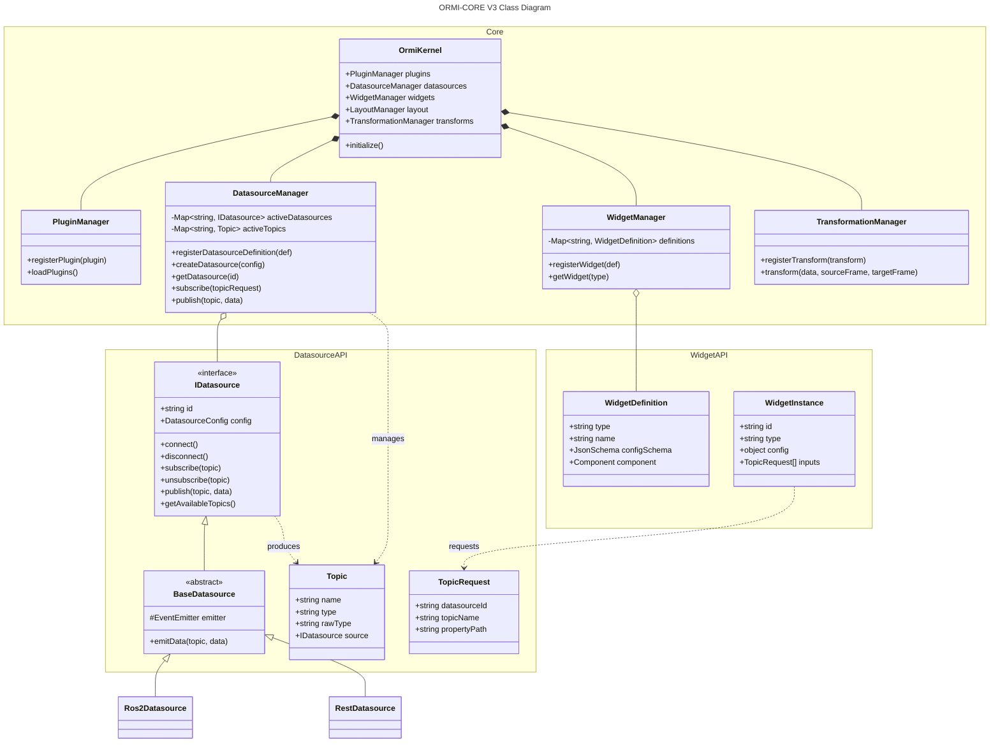
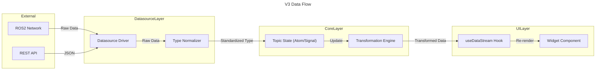
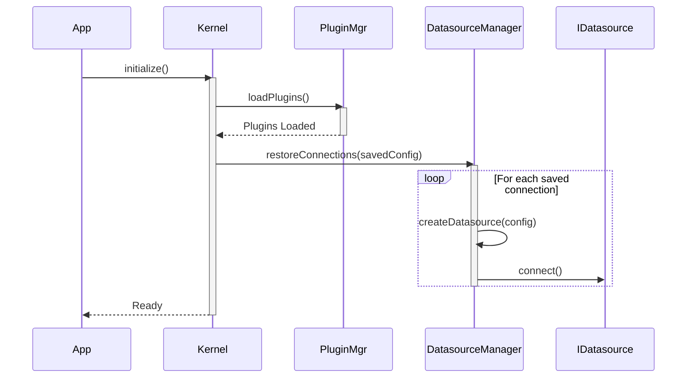
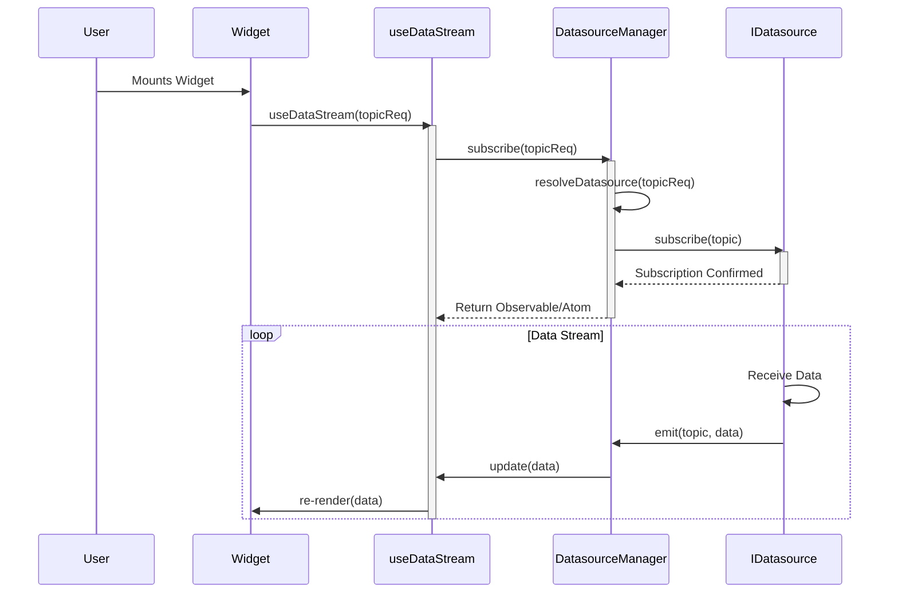

# ORMI : Open Robotic Management Interfaces (V3 Architecture)

## Architecture Overview

V3 introduces a **Service-Oriented Architecture** decoupled from the UI framework. The core logic resides in framework-agnostic managers, while the UI (React) interacts with them via hooks and signals. This separation ensures that the robotic connectivity logic is robust, testable, and independent of UI rendering cycles.

## User Stories & Requirements

The V3 architecture is driven by the following core user stories, ensuring the system meets the needs of developers, integrators, and operators.

| Actor                  | User Story                                                                                                       | Key Requirements                                                                                                          |
| ---------------------- | ---------------------------------------------------------------------------------------------------------------- | ------------------------------------------------------------------------------------------------------------------------- |
| **Robotics Engineer**  | I want to visualize high-bandwidth sensor data (Lidar, Cameras) in real-time to debug perception algorithms.     | • Zero-copy data handling where possible • Support for binary data (ArrayBuffers) • 60Hz+ rendering performance |
| **Operator**           | I want to manually control the robot using a joystick or keyboard with immediate feedback.                       | • Low-latency input transmission • Configurable input mapping • Safety watchdogs (auto-stop on disconnect)      |
| **Frontend Developer** | I want to build custom widgets using standard React hooks without knowing the underlying communication protocol. | • `useDataStream` hook abstraction • TypeScript type safety for topics • Decoupled from ROS/WebSocket logic     |
| **System Integrator**  | I want to connect to multiple heterogeneous systems (ROS2, REST API, MQTT) simultaneously in one dashboard.      | • Unified `IDatasource` interface • Protocol-agnostic data normalization • Dynamic connection management        |
| **Plugin Author**      | I want to extend the system with new datasources or transformers without forking the core codebase.              | • Stable Plugin API • Dynamic loading of modules • Access to core managers via Kernel                           |

## Class Diagram

The following diagram illustrates the core relationships between the Kernel, Managers, Datasources, and Widgets.

## Data Flow Diagram

This diagram shows how data flows from an external source to the UI widget.

## Sequence Diagrams

### 1. Application Initialization

### 2. Widget Subscription Flow

