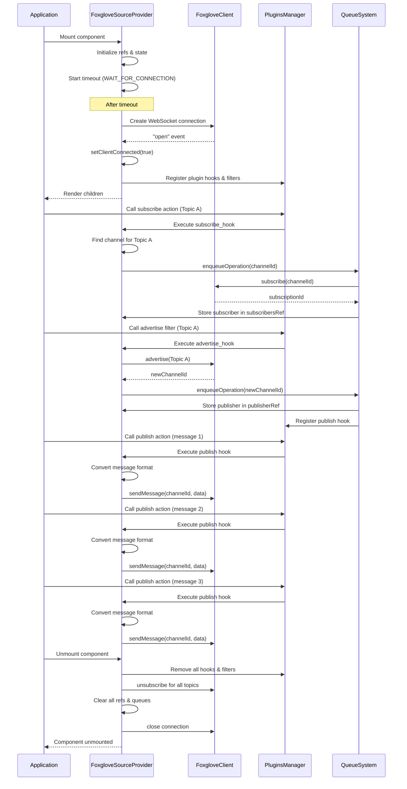

```mermaid
sequenceDiagram
    participant App as Application
    participant Provider as FoxgloveSourceProvider
    participant Client as FoxgloveClient
    participant PM as PluginsManager
    participant Queue as QueueSystem

    %% Component mounting phase
    App->>Provider: Mount component
    Provider->>Provider: Initialize refs & state
    Provider->>Provider: Start timeout (WAIT_FOR_CONNECTION)
    Note over Provider: After timeout
    Provider->>Client: Create WebSocket connection
    Client-->>Provider: "open" event
    Provider->>Provider: setClientConnected(true)
    Provider->>PM: Register plugin hooks & filters
    Provider-->>App: Render children

    %% Subscription phase
    App->>PM: Call subscribe action (Topic A)
    PM->>Provider: Execute subscribe_hook
    Provider->>Provider: Find channel for Topic A
    Provider->>Queue: enqueueOperation(channelId)
    Queue->>Client: subscribe(channelId)
    Client-->>Queue: subscriptionId
    Queue->>Provider: Store subscriber in subscribersRef

    %% Publisher creation phase
    App->>PM: Call advertise filter (Topic A)
    PM->>Provider: Execute advertise_hook
    Provider->>Client: advertise(Topic A)
    Client-->>Provider: newChannelId
    Provider->>Queue: enqueueOperation(newChannelId)
    Queue->>Provider: Store publisher in publisherRef
    Queue->>PM: Register publish hook

    %% Publishing messages
    App->>PM: Call publish action (message 1)
    PM->>Provider: Execute publish hook
    Provider->>Provider: Convert message format
    Provider->>Client: sendMessage(channelId, data)

    App->>PM: Call publish action (message 2)
    PM->>Provider: Execute publish hook
    Provider->>Provider: Convert message format
    Provider->>Client: sendMessage(channelId, data)

    App->>PM: Call publish action (message 3)
    PM->>Provider: Execute publish hook
    Provider->>Provider: Convert message format
    Provider->>Client: sendMessage(channelId, data)

    %% Component unmounting
    App->>Provider: Unmount component
    Provider->>PM: Remove all hooks & filters
    Provider->>Client: unsubscribe for all topics
    Provider->>Provider: Clear all refs & queues
    Provider->>Client: close connection
    Provider-->>App: Component unmounted
```
