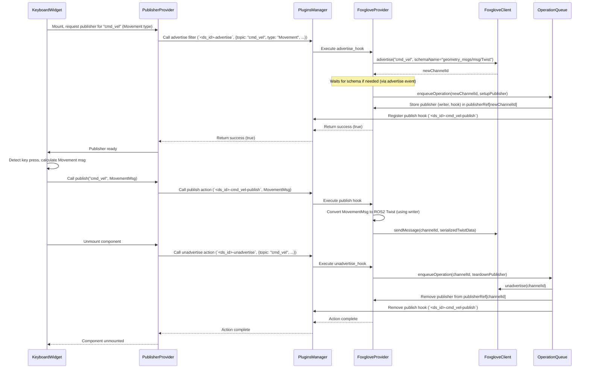

```mermaid
sequenceDiagram
    participant KW as KeyboardWidget
    participant PubProv as PublisherProvider
    participant PM as PluginsManager
    participant FoxProv as FoxgloveProvider
    participant Client as FoxgloveClient
    participant Queue as OperationQueue

    %% Publisher Setup Phase (KeyboardWidget mounts)
    KW->>PubProv: Mount, request publisher for "cmd_vel" (Movement type)
    PubProv->>PM: Call advertise filter (`<ds_id>-advertise`, {topic: "cmd_vel", type: "Movement", ...})
    PM->>FoxProv: Execute advertise_hook
    FoxProv->>Client: advertise("cmd_vel", schemaName="geometry_msgs/msg/Twist")
    Client-->>FoxProv: newChannelId
    Note over FoxProv: Waits for schema if needed (via advertise event)
    FoxProv->>Queue: enqueueOperation(newChannelId, setupPublisher)
    Queue->>FoxProv: Store publisher (writer, hook) in publisherRef[newChannelId]
    Queue->>PM: Register publish hook (`<ds_id>-cmd_vel-publish`)
    FoxProv-->>PM: Return success (true)
    PM-->>PubProv: Return success (true)
    PubProv->>KW: Publisher ready

    %% Publishing Phase (User presses key)
    KW->>KW: Detect key press, calculate Movement msg
    KW->>PubProv: Call publish("cmd_vel", MovementMsg)
    PubProv->>PM: Call publish action (`<ds_id>-cmd_vel-publish`, MovementMsg)
    PM->>FoxProv: Execute publish hook
    FoxProv->>FoxProv: Convert MovementMsg to ROS2 Twist (using writer)
    FoxProv->>Client: sendMessage(channelId, serializedTwistData)

    %% Unmounting Phase (KeyboardWidget unmounts)
    KW->>PubProv: Unmount component
    PubProv->>PM: Call unadvertise action (`<ds_id>-unadvertise`, {topic: "cmd_vel", ...})
    PM->>FoxProv: Execute unadvertise_hook
    FoxProv->>Queue: enqueueOperation(channelId, teardownPublisher)
    Queue->>Client: unadvertise(channelId)
    Queue->>FoxProv: Remove publisher from publisherRef[channelId]
    Queue->>PM: Remove publish hook (`<ds_id>-cmd_vel-publish`)
    FoxProv-->>PM: Action complete
    PM-->>PubProv: Action complete
    PubProv-->>KW: Component unmounted
```
