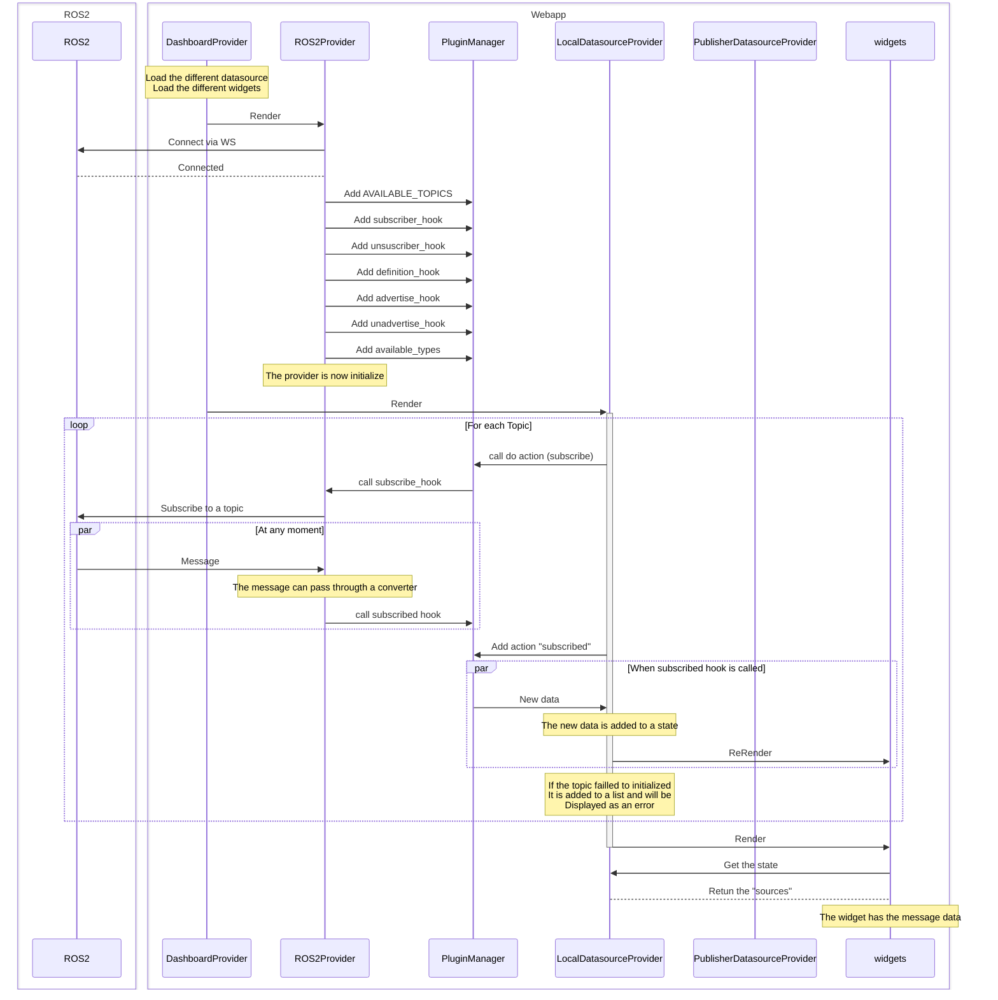
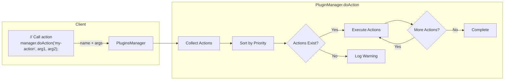
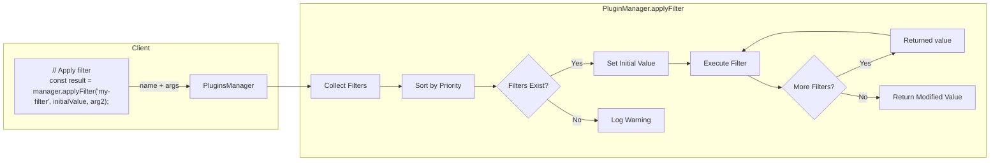
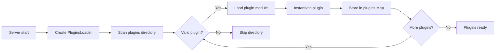

# ORMI-Core

Open Robot Management Interface; this is the core application

## The basis

App tree structure

The works by giving the workspace configuration to the `DashboardProvider`. It managed all the state about the different datasources and widgets.

```
Webapp
├─ DashboardProvider
│  ├─ GlobalDatasourceProvider
│  │  ├─ Provider1
│  │  │  ├─ Provider2
│  │  │  │  ├─ Dashboard
│  │  │  │  │  ├─ WidgetA
│  │  │  │  │  ├─ WidgetB
```

How the webapplication works using ROS2 as an exemple



## Hooks, action and filters

The core system use a Actions/Filters hooks concept similar as the one used by [Wordpress](https://learn.wordpress.org/tutorial/wordpress-action-hooks/). (It is basicaly a callback subscribers/publishers system)

```ts
enum PluginsHooks {
  /*
        List of predefined hooks used in the app.
    */

  PLUGIN_PROVIDER_BEFORE_CHILDREN = "plugins-before-children", // filter called before rendering children of the plugin provider
  PLUGIN_PROVIDER_AFTER_CHILDREN = "plugins-after-children", // filter called after  rendering children of the plugin provider

  WIDGETS_LIST = "plugins-widgets-list", // hooks that take an array of widgets and return an array of widgets
  DATASOURCES_LIST = "plugins-datasources-list", // hooks that take an array of datasources definition and return an array of datasources definition
  AVAILABLE_TOPICS = "plugins-topics-list", // hooks that take an array of topics and return an array of topics
  AVAILABLE_DATASOURCES = "plugins-datasources-availables", // hooks that take an array of datasources and return an array of datasources
}
```

### Actions

Allow code to be executed at specific points. An action can takes as many argument as necessary but won't return anything. Callback registered to a specific `actionName`



#### API:

```ts
/*
    Describe the PluginAction Interface
        - id : id of the action, used to remove it if necessary
        - priority: lower is executed first
        - action : client side callback function
*/
interface PluginAction{
    id : string;
    priority: number;
    action: (...args: any) => void;
}

/*
    Execute all callback registered on the "actionName" hook.
    If no action found, will log a warning.
*/
doAction(actionName: string | PluginsHooks, ...args: any): void

/*
    Same as do action, but will wait for action to exist.
*/
async WaitAndDoAction(actionName : string | PluginsHooks, timeoutSecond : number = 5, ...args: any): Promise<boolean>

/*
    Add an action to the system. The action can later be called using the "actionName"
*/
addAction(actionName: string | PluginsHooks, action: PluginAction): void

/*
    Remove an action from its id
*/
removeAction(pluginActionId: string): void
```

### Filters

Allow functions to modify data as it flows through the system. The value returned by a filter is always the **first** argument of the next filter.



#### API

```ts
/*
    Describe the PluginFilter Interface
        - id : id of the filter, used to remove it if necessary
        - priority: lower is executed first
        - filter : client side callback function, return result
*/
interface PluginFilter{
    id: string;
    priority: number;
    filter: (...args: any) => any;
}

/*
    Execute all callback registered on the "filterName" hook.
    --- require at least one parameters ---
    Will log a warning if not filter is found.
*/
applyFilter<T>(filterName: string | PluginsHooks, ...args: any): T

/*
    Will execute async filter and await for the result to be send to the next filter
*/
async applyFilterAsync<T>(filterName: string | PluginsHooks, ...args: any): Promise<T>: Promise<boolean>

/*
    Add a filter to the system. The filter can later be called using the "filterName"
*/
addFilter(filterName: string | PluginsHooks, filter: PluginFilter): void

/*
    Remove a filter from its id
*/
removeFilter(pluginFilterId: string): void
```

## Plugin Systems

The plugin are the entry point to expend the functionnality of the webapp.
A plugin is a wrapper that contains a collection of actions and filters.
The plugin system is built around two main components:

- PluginServerSide - Server side implmentation of a plugins.
- PluginsManager - Handles actions/filters

### PluginServerSide

Server side of a plugin, contains the description and the different static filters and actions.



The plugins are defined in server side, but all the functionnality provided are client side.

The `plugins Map` contains the different callback function and the associated hooks.

### PluginManager

The pluginManager is the provider that allow most of the transmition of data inside of datasources and the different widgets.

```ts
class PluginManager {
  constructor(pluginsMap: Map<string | PluginsHooks, PluginClientSide>); // the plugin maps is the translation from the server side plugin to the cliend side, created by the PluginsLoader
}
```

## Implementing a Datasource Plugin

Exemple that implement a simple datasource plugin.

```
plugins/
    MyDatasourcePlugin/
        index.ts
        my-datasource-provider.tsx
```

1. Create Plugin Class

Create a new class that extends PluginServerSide, in index.ts:

`index.ts`

```ts
import { PluginServerSide } from "@/core/plugins/plugin-core";
import { PluginsHooks } from "@/core/plugins/plugins-types";

class MyDatasourcePlugin extends PluginServerSide {
  constructor() {
    super();
    this.name = "My Datasource";
    this.description = "My custom datasource plugin";
    this.version = "1.0.0";

    // Register the datasource definition, the datasouce will be added to the datasources list
    this.addFilter(PluginsHooks.DATASOURCES_LIST, {
      id: "my-datasource",
      priority: 10,
      filter: exportDatasource, // this function MUST BE CLIEN SIDE
    });
  }
}
```

2. Define Datasource Interface
   Create settings interface extending DatasourceProviderSettings:

`my-datasource-provider.tsx`

```ts
interface MyDatasourceSettings extends DatasourceProviderSettings {
  // Add custom settings
  url: string;
  port: number;
  topics: TopicDefinition[];
}
```

3. Create Datasource Definition
   Implement the datasource definition object:

`my-datasource-provider.tsx`

```ts
import { DatasourceDefinition } from "@/core/datasources/datasource-interface";
const myDatasourceDefinition: DatasourceDefinition = {
  id: "my-datasource",
  name: "My Datasource",
  description: "Description of my datasource",

  // JSON Schema, use by the core to generate a html for and manage the different settings
  schema: {
    type: "object",
    properties: {
      url: { type: "string" },
      port: { type: "number" },
    },
  },

  // Default settings
  data: {
    id: "",
    title: "",
    enable: true,
    url: "localhost",
    port: 9090,
  },

  // React component that provides the datasource
  Provider: MyDatasourceProvider,
};

export function exportDatasource(datasources: DatasourceDefinition<any>[]) {
  datasources.push(myDatasourceDefinition); // add the new datasource
  return datasources;
}
```

4. Implement Provider Component
   Create a React component to handle datasource lifecycle:

`my-datasource-provider.tsx`

```tsx
import React, { createContext, ReactNode, useEffect, useState } from "react";
import { usePluginsManager } from "@/core/plugins/components/plugins-provider";
import { PluginsHooks } from "@/core/plugins/plugins-types";
import {
  DatasourceTopic,
  SelectedTopic,
} from "@/core/datasources/datasource-interface";

// Create context
const MyDatasourceContext = createContext(null);

// Provider component
const MyDatasourceProvider: React.FC<{
  children: ReactNode;
  props: MyDatasourceSettings;
}> = ({ children, props }) => {
  const pluginsManager = usePluginsManager();
  const [initialized, setInitialized] = useState(false);

  useEffect(() => {
    // Register available topics
    pluginsManager.addFilter(PluginsHooks.AVAILABLE_TOPICS, {
      id: `${props.id}-available-topics`,
      priority: 10,
      filter: (topics: DatasourceTopic[]) => {
        // Add a single demo topic
        topics.push({
          topic: "demo/topic",
          source: props,
          type: "number",
        });
        return topics;
      },
    });

    // Handle subscriptions
    pluginsManager.addAction(`${props.id}-subscribe`, {
      id: `${props.id}-subscribe`,
      action: (topic: SelectedTopic) => {
        // Publish random data every second
        const interval = setInterval(() => {
          const value = Math.random();
          pluginsManager.doAction(
            `${props.id}-${topic.topic}-published`,
            value,
            Date.now()
          );
        }, 1000);

        // Store interval for cleanup
        return () => clearInterval(interval);
      },
    });

    setInitialized(true);

    // Cleanup
    return () => {
      pluginsManager.removeFilter(`${props.id}-available-topics`);
      pluginsManager.removeAction(`${props.id}-subscribe`);
    };
  }, [props]);

  return (
    <MyDatasourceContext.Provider value={null}>
      {initialized && children}
    </MyDatasourceContext.Provider>
  );
};

export { MyDatasourceProvider };
```

## Implement a widget
