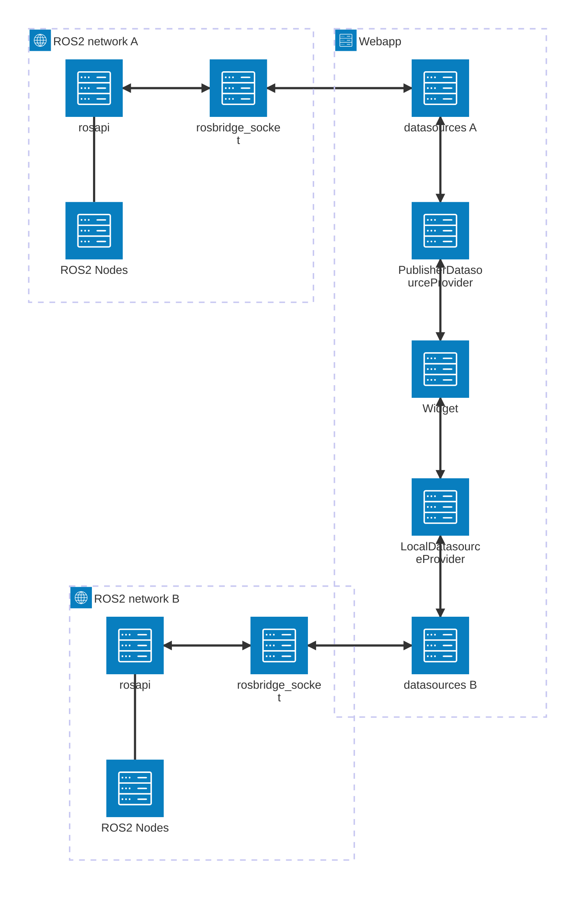
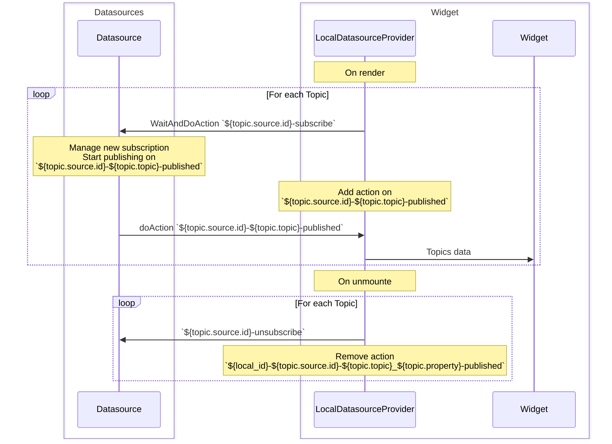
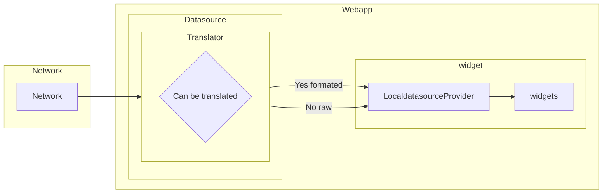
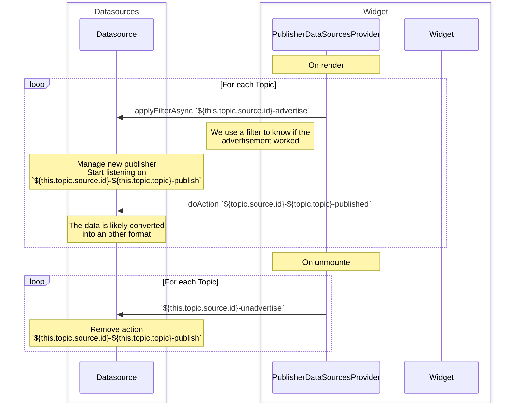
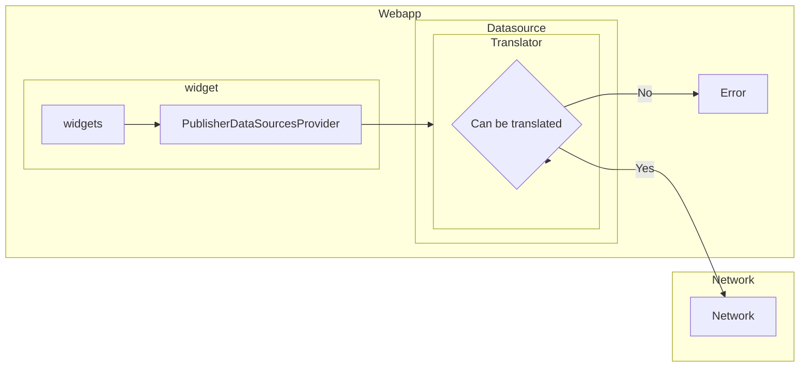
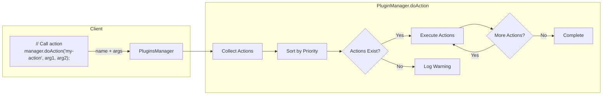
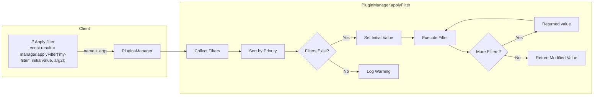
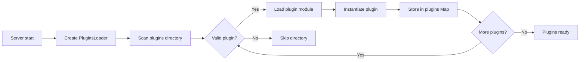

# ORMI-Core

Open Robot Management Interface; this is the core application

## The basis

exemple of a one way bridge between two different ros2 network



### Widgets

The widgets are components that users can add to their dashboard. Each widget must be defined within a plugin and implement the `WidgetDefinition` interface. This interface specifies:

- How the widget appears in the widget list
- What React component to use
- What settings are available
- Default configuration values

Here is the basic structure needed to create a widget:

```ts
interface WidgetDefinition {
  id: string; // Id of the widgets, allow the dashboard to find which widgets is what component
  name: string; // name of the widget in the widget list
  description: string; // description of the widget
  image?: string; // Icon of the widget

  titleProp?: string; // A widget has multiple properties that are defined in the "schema" props, this allow the dashboard to find the property with the title

  //https://jsonforms.io/
  schema: JsonSchema; // a schema that describe the properties of the widget
  uischema: UISchemaElement; // describe how to display the properties in the settings section of the widgets
  data: any; // default value of the widgets

  // component that will be put inside of the widget (the widget itself)
  Component: (data: any) => JSX.Element;
}
```

To register a widget in the application, add it to the widgets list by creating a filter on `PluginsHooks.WIDGETS_LIST`. This hook:

1. Takes an array of `WidgetDefinition` objects as input
2. Allows you to append your custom widget definition
3. Returns the updated array

```ts
const WidgetExport = (widgets: WidgetDefinition[]) => {
  widgets.push(HeadingDefinition());
  widgets.push(AirspeedDefinition());

  return widgets;
};
```

Each filter registered on the widgets list will sequentially process and modify the array of widgets. When all filters have executed, the final array determines which widgets are available in the application's widget list.

### Datasources

Datasources act as communication bridges between external robot networks and the web application. They are implemented as React context providers to handle data flow.

Each datasource requires a `DatasourceDefinition` interface that specifies:

- Basic properties (id, name, description)
- Configuration schema for settings
- A React provider component for handling communication

Here's the interface definition:

```ts
interface DatasourceDefinition<T = DatasourceProviderSettings> {
  id: string;
  name: string;
  description: string;

  titleProp?: string;

  schema: JsonSchema;
  uischema?: UISchemaElement;
  data: T;

  Provider: FC<{
    children: ReactNode;
    props: T;
  }>;
}

interface DatasourceProviderSettings {
  id: string; // auto filled; set a "random" id. You just need to ignore it.
  title: string;
  enable: boolean;
}
```

For the datasources to be added to the webapp, you need to add a filter on the `PluginsHooks.DATASOURCES_LIST` wicth takes an `DatasourceDefinition<any>[]` object and returns it.

### Interaction between widget and datasources

Widgets and datasources interact through the action and filter system. The `LocalDataSourcesProvider` and `PublisherDataSourcesProvider` components handle the subscription and publishing lifecycle between widgets and topics:

- `LocalDataSourcesProvider`: Manages subscriptions to topics and provides data to widgets
- `PublisherDataSourcesProvider`: Manages publishing data from widgets to topics

These providers use the plugin system's actions and filters to establish communication channels between widgets and datasources.

#### Subscribing

For the widget to be able to subscribe to topics or to publish data to a specific datasource. It need to receive `SelectedTopic` objects in its properties. This object contains all the information about a topic, where it is from, what type it is, how much we keep in memory and what type it is.

```ts
interface DatasourceTopic {
  topic: string;
  source: DatasourceProviderSettings;
  type: string;
  bufferSize?: number;
}

interface SelectedTopic extends DatasourceTopic {
  property: string;
}
```

When a `property` field is specified in the `SelectedTopic`, the `LocalDatasourceProvider` filters the incoming topic data and only sends that specific property to the widget. This allows widgets to receive just the data fields they need rather than the entire topic message.

##### Dataflow



##### How to use it

```ts
/*
        In the WidgetDefinition
*/
// the buffer size is the default buffer size if the SelectedTopic don't specify
Component: (data: AirSpeedProps) => (
  <LocalDataSourcesProvider SelectedTopics={[data.topic]} buffersSize={1}>
    <Widget {...data} />
  </LocalDataSourcesProvider>
);

/*
        In the Widget itself
*/

const { sources } = useLocalDataSource(); // state map that contains the data

/*
    sources : {
        'topicA' : [
            data: [a,b,c,d,e],
            time: [1,2,3,4,5]
        ],
        ...
    }
*/
```

Since `sources` is a state, when changed, it will trigger a rerender of the widgets

To support multiple network protocols, the application uses universal data types that can be translated between different systems. When subscribing data to a widget, you can specify the type of data required by the widget, the datasource can then use a translator to format the incoming data properly



If no translator is found, the raw data is sent.

#### Publishing

Like for subscribing, the widget requires one or more `SelectedTopic`, it use the `PublisherDataSourcesProvider` context. The provider manage the advertisement and the unadvertisement on mount and unmount.

```ts
class Publisher {
  topic: SelectedTopic;

  pm: PluginsManager;

  constructor(topic: SelectedTopic, pluginManager: PluginsManager) {
    this.topic = topic;
    this.pm = pluginManager;
  }

  async advertise() {
    return await this.pm.applyFilterAsync(
      `${this.topic.source.id}-advertise`,
      this.topic
    );
  }

  unadvertise() {
    this.pm.doAction(`${this.topic.source.id}-unadvertise`, this.topic);
  }

  publish<T>(data: T, webtype: string) {
    this.pm.doAction(
      `${this.topic.source.id}-${this.topic.topic}-publish`,
      this.topic,
      data,
      webtype
    );
  }
}
```

##### Dataflow



##### How to use it

```ts
/*
        In the WidgetDefinition
*/
Component: (data: KeyboardControlData) => (
  <PublisherDataSourcesProvider SelectedTopics={[data.topic]}>
    <PublisherWidget {...data} />
  </PublisherDataSourcesProvider>
);

/*
        In the Widget itself
*/
const { publishers } = usePublisherDataSource(); // maps of the Publisher objects.

publishers.get("YOUR_TOPIC").publish(data, "webapp_type");
```

To support multiple network protocols, the application uses universal data types that can be translated between different systems. When publishing data from a widget, you specify both the data and its universal type. The datasource provider can then translate this universal type into the appropriate network-specific format.

Each datasource provider implements its own type conversion logic to map between universal types and network-specific types.



### Datasources interaction

App tree structure

The works by giving the workspace configuration to the `DashboardProvider`. It managed all the state about the different datasources and widgets.

```
Webapp
├─ DashboardProvider
│  ├─ GlobalDatasourceProvider
│  │  ├─ Provider1
│  │  │  ├─ Provider2
│  │  │  │  ├─ Dashboard
│  │  │  │  │  ├─ WidgetA
│  │  │  │  │  ├─ WidgetB
```

How the webapplication works using ROS2 as an exemple


## Hooks, action and filters

The core system use a Actions/Filters hooks concept similar as the one used by [Wordpress](https://learn.wordpress.org/tutorial/wordpress-action-hooks/). (It is basicaly a callback subscribers/publishers system)

```ts
enum PluginsHooks {
  /*
        List of predefined hooks used in the app.
    */

  PLUGIN_PROVIDER_BEFORE_CHILDREN = "plugins-before-children", // filter called before rendering children of the plugin provider
  PLUGIN_PROVIDER_AFTER_CHILDREN = "plugins-after-children", // filter called after  rendering children of the plugin provider

  WIDGETS_LIST = "plugins-widgets-list", // hooks that take an array of widgets and return an array of widgets
  DATASOURCES_LIST = "plugins-datasources-list", // hooks that take an array of datasources definition and return an array of datasources definition
  AVAILABLE_TOPICS = "plugins-topics-list", // hooks that take an array of topics and return an array of topics
  AVAILABLE_DATASOURCES = "plugins-datasources-availables", // hooks that take an array of datasources and return an array of datasources
}
```

### Actions

Allow code to be executed at specific points. An action can takes as many argument as necessary but won't return anything. Callback registered to a specific `actionName`



#### API:

```ts
/*
    Describe the PluginAction Interface
        - id : id of the action, used to remove it if necessary
        - priority: lower is executed first
        - action : client side callback function
*/
interface PluginAction{
    id : string;
    priority: number;
    action: (...args: any) => void;
}

/*
    Execute all callback registered on the "actionName" hook.
    If no action found, will log a warning.
*/
doAction(actionName: string | PluginsHooks, ...args: any): void

/*
    Same as do action, but will wait for action to exist.
*/
async WaitAndDoAction(actionName : string | PluginsHooks, timeoutSecond : number = 5, ...args: any): Promise<boolean>

/*
    Add an action to the system. The action can later be called using the "actionName"
*/
addAction(actionName: string | PluginsHooks, action: PluginAction): void

/*
    Remove an action from its id
*/
removeAction(pluginActionId: string): void
```

### Filters

Allow functions to modify data as it flows through the system. The value returned by a filter is always the **first** argument of the next filter.



#### API

```ts
/*
    Describe the PluginFilter Interface
        - id : id of the filter, used to remove it if necessary
        - priority: lower is executed first
        - filter : client side callback function, return result
*/
interface PluginFilter{
    id: string;
    priority: number;
    filter: (...args: any) => any;
}

/*
    Execute all callback registered on the "filterName" hook.
    --- require at least one parameters ---
    Will log a warning if not filter is found.
*/
applyFilter<T>(filterName: string | PluginsHooks, ...args: any): T

/*
    Will execute async filter and await for the result to be send to the next filter
*/
async applyFilterAsync<T>(filterName: string | PluginsHooks, ...args: any): Promise<T>: Promise<boolean>

/*
    Add a filter to the system. The filter can later be called using the "filterName"
*/
addFilter(filterName: string | PluginsHooks, filter: PluginFilter): void

/*
    Remove a filter from its id
*/
removeFilter(pluginFilterId: string): void
```

## Plugin Systems

The plugin are the entry point to expend the functionnality of the webapp.
A plugin is a wrapper that contains a collection of actions and filters.
The plugin system is built around two main components:

- PluginServerSide - Server side implmentation of a plugins.
- PluginsManager - Handles actions/filters

### PluginServerSide

Server side of a plugin, contains the description and the different static filters and actions.



The plugins are defined in server side, but all the functionnality provided are client side.

The `plugins Map` contains the different callback function and the associated hooks.

### PluginManager

The pluginManager is the provider that allow most of the transmition of data inside of datasources and the different widgets.

```ts
class PluginManager {
  constructor(pluginsMap: Map<string | PluginsHooks, PluginClientSide>); // the plugin maps is the translation from the server side plugin to the cliend side, created by the PluginsLoader
}
```

## Implementing a Datasource Plugin

Exemple that implement a simple datasource plugin.

```
plugins/
    MyDatasourcePlugin/
        index.ts
        my-datasource-provider.tsx
```

1. Create Plugin Class

Create a new class that extends PluginServerSide, in index.ts:

`index.ts`

```ts
import { PluginServerSide } from "@/core/plugins/plugin-core";
import { PluginsHooks } from "@/core/plugins/plugins-types";

class MyDatasourcePlugin extends PluginServerSide {
  constructor() {
    super();
    this.name = "My Datasource";
    this.description = "My custom datasource plugin";
    this.version = "1.0.0";

    // Register the datasource definition, the datasouce will be added to the datasources list
    this.addFilter(PluginsHooks.DATASOURCES_LIST, {
      id: "my-datasource",
      priority: 10,
      filter: exportDatasource, // this function MUST BE CLIEN SIDE
    });
  }
}
```

2. Define Datasource Interface
   Create settings interface extending DatasourceProviderSettings:

`my-datasource-provider.tsx`

```ts
interface MyDatasourceSettings extends DatasourceProviderSettings {
  // Add custom settings
  url: string;
  port: number;
  topics: TopicDefinition[];
}
```

3. Create Datasource Definition
   Implement the datasource definition object:

`my-datasource-provider.tsx`

```ts
import { DatasourceDefinition } from "@/core/datasources/datasource-interface";
const myDatasourceDefinition: DatasourceDefinition = {
  id: "my-datasource",
  name: "My Datasource",
  description: "Description of my datasource",

  // JSON Schema, use by the core to generate a html for and manage the different settings
  schema: {
    type: "object",
    properties: {
      url: { type: "string" },
      port: { type: "number" },
    },
  },

  // Default settings
  data: {
    id: "",
    title: "",
    enable: true,
    url: "localhost",
    port: 9090,
  },

  // React component that provides the datasource
  Provider: MyDatasourceProvider,
};

export function exportDatasource(datasources: DatasourceDefinition<any>[]) {
  datasources.push(myDatasourceDefinition); // add the new datasource
  return datasources;
}
```

4. Implement Provider Component
   Create a React component to handle datasource lifecycle:

`my-datasource-provider.tsx`

```tsx
import React, { createContext, ReactNode, useEffect, useState } from "react";
import { usePluginsManager } from "@/core/plugins/components/plugins-provider";
import { PluginsHooks } from "@/core/plugins/plugins-types";
import {
  DatasourceTopic,
  SelectedTopic,
} from "@/core/datasources/datasource-interface";

// Create context
const MyDatasourceContext = createContext(null);

// Provider component
const MyDatasourceProvider: React.FC<{
  children: ReactNode;
  props: MyDatasourceSettings;
}> = ({ children, props }) => {
  const pluginsManager = usePluginsManager();
  const [initialized, setInitialized] = useState(false);

  useEffect(() => {
    // Register available topics
    pluginsManager.addFilter(PluginsHooks.AVAILABLE_TOPICS, {
      id: `${props.id}-available-topics`,
      priority: 10,
      filter: (topics: DatasourceTopic[]) => {
        // Add a single demo topic
        topics.push({
          topic: "demo/topic",
          source: props,
          type: "number",
        });
        return topics;
      },
    });

    // Handle subscriptions
    pluginsManager.addAction(`${props.id}-subscribe`, {
      id: `${props.id}-subscribe`,
      action: (topic: SelectedTopic) => {
        // Publish random data every second
        const interval = setInterval(() => {
          const value = Math.random();
          pluginsManager.doAction(
            `${props.id}-${topic.topic}-published`,
            value,
            Date.now()
          );
        }, 1000);

        // Store interval for cleanup
        return () => clearInterval(interval);
      },
    });

    setInitialized(true);

    // Cleanup
    return () => {
      pluginsManager.removeFilter(`${props.id}-available-topics`);
      pluginsManager.removeAction(`${props.id}-subscribe`);
    };
  }, [props]);

  return (
    <MyDatasourceContext.Provider value={null}>
      {initialized && children}
    </MyDatasourceContext.Provider>
  );
};

export { MyDatasourceProvider };
```

## Implement a widget
